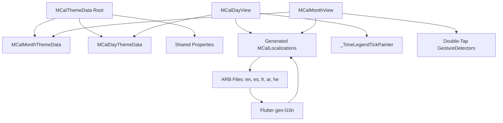

# Design Document

## Overview

This design addresses eight distinct requirements across localization, theming, UI enhancements, and interaction patterns. The implementation is structured into logical phases that build upon each other while maintaining backward compatibility where feasible (though not strictly required). The design leverages existing Flutter patterns, follows Material Design 3 guidelines, and maintains consistency with the package's established architecture.

## Steering Document Alignment

### Product Vision (product.md)

This design supports the product principles:
- **Separation of Concerns**: Localization infrastructure is isolated; theme architecture has clear boundaries between views
- **Modularity Over Monolith**: Nested theme classes provide better modular organization; each view's styling is independent
- **Customization First**: Theme refactoring exposes properties more clearly through nested structure; Features demo showcases full customization capabilities
- **Accessibility First**: All localized strings include proper semantic labels; RTL fixes ensure accessibility for RTL users
- **International Ready**: Full gen-l10n integration with 5 languages (en, es, fr, ar, he) and proper RTL support
- **Flexible Interaction**: Month View double-tap handlers complete gesture support alongside tap and long-press

### Technical Standards (tech.md)

- **Flutter SDK Compliance**: Uses Flutter's official gen-l10n system (flutter_localizations) as recommended for packages
- **Dart Version**: Compatible with Dart `^3.10.4` requirement
- **intl Package**: Continues using `intl ^0.20.2` for date/time formatting and localization infrastructure
- **Type Safety**: Generated localization classes provide compile-time safety (no nullable-getter as per l10n.yaml)
- **Testing Framework**: Uses flutter_test for all new widget and unit tests
- **Performance**: CustomPainter for tick marks ensures 60fps rendering; theme lerp maintains smooth transitions
- **Standards Compliance**: Maintains RFC 5545 RRULE compatibility; RTL follows platform standards

### Project Structure (structure.md)

- **File Organization**: Theme classes in `lib/src/styles/` as per existing structure
- **Widget Location**: All view implementations in `lib/src/widgets/` (mcal_day_view.dart, mcal_month_view.dart)
- **Utilities**: Localization utilities in `lib/src/utils/` (old mcal_localization.dart will be deleted)
- **Naming Conventions**: Follows "MCal" prefix for public widgets and theme classes
- **Test Structure**: Widget tests in `test/`, maintaining 80%+ coverage target
- **Example App**: Follows example app structure with views in `example/lib/views/`, styles in subdirectories
- **Localization Files**: ARB files in `lib/l10n/` for package, `example/lib/l10n/` for example app
- **Generated Code**: Flutter gen-l10n outputs to `.dart_tool/flutter_gen/gen_l10n/` (standard location)

## Code Reuse Analysis

### Existing Components to Leverage

- **MCalThemeData (lib/src/styles/mcal_theme.dart)**: Will be refactored into nested structure while maintaining existing properties
- **MCalLocalizations (lib/src/utils/mcal_localization.dart)**: Current manual Map-based system will be deleted and replaced with generated classes from Flutter gen-l10n
- **_TimeLegendColumn (mcal_day_view.dart lines 4239-4389)**: Already renders time labels; will be extended with CustomPainter for tick marks
- **GestureDetector patterns in Day View**: Existing double-tap implementation serves as template for Month View
- **intl package**: Already integrated for date/time formatting; will continue using for locale-aware formatting

### Integration Points

- **Flutter gen-l10n system**: Integrates with Flutter's build system via `l10n.yaml` configuration
- **Theme.of(context)**: Existing theme resolution through InheritedWidget chain remains unchanged
- **MCalEventController**: No changes needed; works with all views regardless of interaction patterns
- **ARB files**: Already exist for English and Spanish; will be extended to 5 languages with additional keys

## Architecture

The design follows a phased approach with clear separation of concerns:

### Modular Design Principles

- **Single File Responsibility**: Each theme data class (MCalThemeData, MCalMonthThemeData, MCalDayThemeData) handles only its view-specific properties
- **Component Isolation**: Localization infrastructure is completely isolated from UI components; views depend only on generated localization classes
- **Service Layer Separation**: Theme resolution, localization lookup, and gesture handling are distinct concerns
- **Utility Modularity**: CustomPainter for tick marks is a focused, single-purpose utility class



## Components and Interfaces

### Component 1: Nested Theme Data Architecture

**File:** `lib/src/styles/mcal_theme.dart` (refactored)

**Purpose:** Organize theme properties into view-specific nested classes for better discoverability and maintainability.

**Interfaces:**
```dart
class MCalThemeData extends ThemeExtension<MCalThemeData> {
  // Shared properties (used by multiple views)
  final Color? cellBackgroundColor;
  final Color? eventTileBackgroundColor;
  final TextStyle? navigatorTextStyle;
  // ... other shared properties
  
  // Nested view-specific themes
  final MCalMonthThemeData? monthTheme;
  final MCalDayThemeData? dayTheme;
  
  // Constructor, copyWith, lerp, fromTheme methods
}

class MCalMonthThemeData {
  // Month-specific properties
  final Color? weekdayHeaderBackgroundColor;
  final TextStyle? weekNumberTextStyle;
  final DateLabelPosition? dateLabelPosition;
  final double? eventTileHeight;
  final double? overflowIndicatorHeight;
  // ... other month-specific properties
  
  // Constructor, copyWith, lerp methods
}

class MCalDayThemeData {
  // Day-specific properties
  final double? timeLegendWidth;
  final TextStyle? timeLegendTextStyle;
  final Color? timeLegendBackgroundColor;
  final bool? showTimeLegendTicks;
  final Color? timeLegendTickColor;
  final double? timeLegendTickWidth;
  final double? timeLegendTickLength;
  final Color? hourGridlineColor;
  final double? hourGridlineWidth;
  final Color? currentTimeIndicatorColor;
  final int? allDaySectionMaxRows;
  // ... other day-specific properties
  
  // Constructor, copyWith, lerp methods
}
```

**Dependencies:** Flutter Material package

**Reuses:** Existing MCalThemeData structure, property names, and default values

**Migration Path:**
- Old: `theme.timeLegendWidth`
- New: `theme.dayTheme?.timeLegendWidth` (with null fallback to root theme if needed during transition)

### Component 2: Time Legend Tick Marks

**File:** `lib/src/widgets/mcal_day_view.dart` (lines 4239-4470, extended)

**Purpose:** Add visual tick marks to time legend for improved visual alignment.

**Interfaces:**
```dart
class _TimeLegendTickPainter extends CustomPainter {
  const _TimeLegendTickPainter({
    required this.startHour,
    required this.endHour,
    required this.hourHeight,
    required this.tickColor,
    required this.tickWidth,
    required this.tickLength,
    required this.isRTL,
    required this.displayDate,
  });
  
  @override
  void paint(Canvas canvas, Size size);
  
  @override
  bool shouldRepaint(covariant _TimeLegendTickPainter oldDelegate);
}
```

**Integration:** Added to `_TimeLegendColumn` widget's Stack as a background layer behind time labels.

**Dependencies:** 
- MCalThemeData.dayTheme for tick configuration
- MCalLocalizations for RTL detection

**Reuses:** Existing `timeToOffset` utility function for positioning

### Component 3: Flutter gen-l10n Localization System

**Files:** 
- `l10n.yaml` (configuration)
- `lib/l10n/app_*.arb` (6 files: en, es, es_MX, fr, ar, he)
- `.dart_tool/flutter_gen/gen_l10n/mcal_localizations*.dart` (generated)

**Purpose:** Replace manual Map-based localization with Flutter's official, type-safe localization system.

**Interfaces:**
```dart
// Generated class (example)
abstract class MCalLocalizations {
  static const List<Locale> supportedLocales = [
    Locale('en'),
    Locale('es'),
    Locale('es', 'MX'),
    Locale('fr'),
    Locale('ar'),
    Locale('he'),
  ];
  
  String get previousDay;
  String get nextDay;
  String get today;
  String currentTime(String time);  // With parameter
  String scheduleFor(String date);
  // ... all other localized strings
  
  static MCalLocalizations of(BuildContext context);
}
```

**Configuration (l10n.yaml):**
```yaml
arb-dir: lib/l10n
template-arb-file: app_en.arb
output-localization-file: mcal_localizations.dart
output-class: MCalLocalizations
nullable-getter: false
```

**Dependencies:** flutter_localizations, intl package

**Reuses:** Existing ARB files (app_en.arb, app_es_MX.arb) extended with new keys

**Migration:**
- Delete `lib/src/utils/mcal_localization.dart` entirely (no backward compatibility needed)
- Update all imports to use generated class: `import 'package:flutter_gen/gen_l10n/mcal_localizations.dart';`
- Use `MCalLocalizations.of(context)` instead of `MCalLocalizations()`

### Component 4: RTL Layout Corrections

**Files:** `lib/src/widgets/mcal_day_view.dart` (multiple sections)

**Purpose:** Fix RTL layout issues in Day View including time legend positioning, navigator arrows, and tooltips.

**Changes:**
1. **Time Legend Positioning** (lines 3757-3797):
   - Already correctly implemented with conditional rendering based on `_isRTL(context)`
   - Left side for LTR, right side for RTL

2. **Navigator Button Logic** (lines 3907-4036):
   - Verify arrow directions in RTL match expected behavior
   - Left arrow = next day (forward), Right arrow = previous day (backward) in RTL
   - All tooltips use `MCalLocalizations` generated strings

3. **Current Time Indicator** (lines 4485-4493):
   - Dot positioning already handles RTL correctly

**Dependencies:** Generated MCalLocalizations for localized labels

**Reuses:** Existing `_isRTL` detection method, Directionality.of(context)

### Component 5: Month View Double-Tap Handlers

**File:** `lib/src/widgets/mcal_month_view.dart` (multiple sections)

**Purpose:** Add double-tap gesture handling to Month View for feature parity with Day View.

**Interfaces:**
```dart
// Add to MCalMonthView parameters
class MCalMonthView extends StatefulWidget {
  // ... existing parameters
  
  /// Called when user double-taps an empty date cell.
  final void Function(BuildContext, MCalCellDoubleTapDetails)? onCellDoubleTap;
  
  /// Called when user double-taps an event tile.
  final void Function(BuildContext, MCalEventDoubleTapDetails)? onEventDoubleTap;
}

// New detail classes
class MCalCellDoubleTapDetails {
  final DateTime date;
  final Offset localPosition;
  final Offset globalPosition;
}

class MCalEventDoubleTapDetails {
  final MCalCalendarEvent event;
  final Offset localPosition;
  final Offset globalPosition;
  final DateTime date;  // Date on which event was double-tapped
}
```

**Implementation Strategy:**
- Add `onDoubleTapDown` and `onDoubleTap` to existing GestureDetector wrapping date cells
- Store tap position in State variable (similar to Day View's `_lastDoubleTapDownPosition`)
- Use appropriate timing to distinguish single-tap from double-tap
- Maintain all existing single-tap and long-press handlers

**Dependencies:** None

**Reuses:** Pattern from Day View's double-tap implementation (lines 3344-3362)

### Component 6: Example App Reorganization

**File:** `example/lib/views/day_view/day_view_showcase.dart`

**Purpose:** Improve example app UX by reorganizing tabs and removing redundant RTL demo.

**Changes:**
1. Reorder `_buildStyles` method to put Features first
2. Remove `RtlDemoDayStyle` class and related `_RtlDemoDayViewContent` (lines 193-358)
3. Update TabController length from 10 to 9
4. Update ARB files to rename `styleFeaturesDemo` → `styleFeatures`

**Dependencies:** Example app l10n

**Reuses:** Existing tab structure and navigation

### Component 7: Enhanced Features Demo

**File:** `example/lib/views/day_view/styles/features_demo_style.dart` (expanded)

**Purpose:** Create comprehensive interactive demo showcasing Day View customization capabilities.

**Architecture:**
```dart
class FeaturesDemoDayStyle extends StatefulWidget {
  // Interactive control panel with:
  // - Hour height slider (60-120)
  // - Gridline interval selector (5/10/15/30 min)
  // - Snap-to-time toggle
  // - Edge navigation delay slider
  // - Time legend tick toggles and controls
  // - Special time regions (lunch, after-hours) toggles
  // - Blocked time regions toggles
  // - Preset configurations dropdown
  
  @override
  State<FeaturesDemoDayStyle> createState() => _FeaturesDemoDayStyleState();
}

class _FeaturesDemoDayStyleState extends State<FeaturesDemoDayStyle> {
  // State variables for all customizable options
  double _hourHeight = 80.0;
  Duration _gridlineInterval = const Duration(minutes: 15);
  bool _snapToTimeSlots = true;
  bool _showTimeLegendTicks = true;
  Color _timeLegendTickColor = Colors.grey;
  double _timeLegendTickLength = 8.0;
  bool _showLunchRegion = true;
  bool _showAfterHoursRegion = true;
  // ... more state variables
  
  // Build methods for control panel and day view
}
```

**UI Structure:**
- Top: Control panel with collapsible sections (Theme, Gridlines, Interactions, Special Regions)
- Bottom: Live Day View demonstrating current configuration
- Side panel (optional): Code snippet showing theme configuration

**Reuses:** Month View's features demo as template (example/lib/views/month_view/styles/features_demo_style.dart)

### Component 8: Hebrew Language Support

**Files:** 
- `lib/l10n/app_he.arb`
- `example/lib/l10n/app_he.arb`
- `lib/src/utils/mcal_localization.dart` (add Hebrew strings to maps)
- `example/lib/screens/main_screen.dart` (add Hebrew to language menu)

**Purpose:** Add Hebrew as the 5th supported language.

**Implementation:**
- Create comprehensive Hebrew translations for all 50+ strings
- Add Hebrew to MCalLocalizations.supportedLocales
- Add Hebrew option to example app language menu
- Verify RTL layout works correctly (Hebrew is RTL like Arabic)

**Dependencies:** Native Hebrew speaker review for translation quality

**Reuses:** Arabic ARB files as RTL reference

## Data Models

### MCalThemeData (Refactored Structure)

```dart
class MCalThemeData extends ThemeExtension<MCalThemeData> {
  // === SHARED PROPERTIES (used by multiple views) ===
  final Color? cellBackgroundColor;
  final Color? cellBorderColor;
  final TextStyle? cellTextStyle;
  final Color? todayBackgroundColor;
  final TextStyle? todayTextStyle;
  final Color? focusedDateBackgroundColor;
  final TextStyle? focusedDateTextStyle;
  final Color? eventTileBackgroundColor;
  final TextStyle? eventTileTextStyle;
  final TextStyle? navigatorTextStyle;
  final Color? navigatorBackgroundColor;
  final Color? hoverCellBackgroundColor;
  final Color? hoverEventBackgroundColor;
  // ... other shared properties
  
  // === VIEW-SPECIFIC NESTED THEMES ===
  final MCalMonthThemeData? monthTheme;
  final MCalDayThemeData? dayTheme;
  
  // Standard ThemeExtension methods
  MCalThemeData copyWith({...});
  MCalThemeData lerp(MCalThemeData? other, double t);
}
```

### MCalMonthThemeData (New)

```dart
class MCalMonthThemeData {
  // Month View specific properties
  final TextStyle? weekdayHeaderTextStyle;
  final Color? weekdayHeaderBackgroundColor;
  final TextStyle? weekNumberTextStyle;
  final Color? weekNumberBackgroundColor;
  final double? eventTileHeight;
  final double? eventTileHorizontalSpacing;
  final double? eventTileVerticalSpacing;
  final double? dateLabelHeight;
  final DateLabelPosition? dateLabelPosition;
  final double? overflowIndicatorHeight;
  final double? eventTileCornerRadius;
  final Color? multiDayEventBackgroundColor;
  final TextStyle? multiDayEventTextStyle;
  
  const MCalMonthThemeData({...});
  MCalMonthThemeData copyWith({...});
  MCalMonthThemeData lerp(MCalMonthThemeData? other, double t);
  
  // Factory for defaults
  factory MCalMonthThemeData.defaults(ThemeData theme) {...}
}
```

### MCalDayThemeData (New)

```dart
class MCalDayThemeData {
  // Day View specific properties
  final TextStyle? dayHeaderDayOfWeekStyle;
  final TextStyle? dayHeaderDateStyle;
  final Color? weekNumberTextColor;
  final double? timeLegendWidth;
  final TextStyle? timeLegendTextStyle;
  final Color? timeLegendBackgroundColor;
  final bool? showTimeLegendTicks;
  final Color? timeLegendTickColor;
  final double? timeLegendTickWidth;
  final double? timeLegendTickLength;
  final Color? hourGridlineColor;
  final double? hourGridlineWidth;
  final Color? majorGridlineColor;
  final double? majorGridlineWidth;
  final Color? minorGridlineColor;
  final double? minorGridlineWidth;
  final Color? currentTimeIndicatorColor;
  final double? currentTimeIndicatorWidth;
  final double? currentTimeIndicatorDotRadius;
  final int? allDaySectionMaxRows;
  final double? timedEventMinHeight;
  final double? timedEventBorderRadius;
  final EdgeInsets? timedEventPadding;
  final Color? specialTimeRegionColor;
  final Color? blockedTimeRegionColor;
  final Color? timeRegionBorderColor;
  final Color? timeRegionTextColor;
  final TextStyle? timeRegionTextStyle;
  
  const MCalDayThemeData({...});
  MCalDayThemeData copyWith({...});
  MCalDayThemeData lerp(MCalDayThemeData? other, double t);
  
  // Factory for defaults
  factory MCalDayThemeData.defaults(ThemeData theme) {...}
}
```

### Localization Detail Classes (New)

```dart
// For double-tap handlers
class MCalCellDoubleTapDetails {
  final DateTime date;
  final Offset localPosition;
  final Offset globalPosition;
  
  const MCalCellDoubleTapDetails({
    required this.date,
    required this.localPosition,
    required this.globalPosition,
  });
}

class MCalEventDoubleTapDetails {
  final MCalCalendarEvent event;
  final Offset localPosition;
  final Offset globalPosition;
  final DateTime date;
  
  const MCalEventDoubleTapDetails({
    required this.event,
    required this.localPosition,
    required this.globalPosition,
    required this.date,
  });
}
```

## Error Handling

### Error Scenarios

1. **Scenario: Missing ARB files during build**
   - **Handling:** Flutter gen-l10n will fail at build time with clear error message indicating which ARB file is missing
   - **User Impact:** Developer sees build error and must create missing ARB file
   - **Prevention:** All 6 ARB files (en, es, es_MX, fr, ar, he) committed to repository

2. **Scenario: Unsupported locale requested**
   - **Handling:** Fall back through locale hierarchy (e.g., es_MX → es → en)
   - **User Impact:** User sees content in fallback language
   - **Prevention:** Document supported locales clearly

3. **Scenario: Theme property null at runtime**
   - **Handling:** Use default values from MCalThemeData.fromTheme(theme)
   - **User Impact:** Component uses Material 3 defaults, no crash
   - **Prevention:** All theme property access includes null coalescing

4. **Scenario: Double-tap and single-tap conflict**
   - **Handling:** Use gesture timing to distinguish (double-tap has priority)
   - **User Impact:** Single-tap may have slight delay (~300ms) to detect double-tap
   - **Prevention:** Document behavior; make configurable if needed

5. **Scenario: RTL layout in unsupported language**
   - **Handling:** RTL detected via MCalLocalizations.isRTL() based on language code
   - **User Impact:** Layout mirrors correctly for any RTL language, even if not translated
   - **Prevention:** RTL logic independent of translation availability

## Testing Strategy

### Unit Testing

**Theme Architecture:**
- Test `MCalMonthThemeData` construction, copyWith, lerp, equality
- Test `MCalDayThemeData` construction, copyWith, lerp, equality
- Test `MCalThemeData` with nested themes, null handling
- Test theme property access patterns (root vs nested)
- Verify migration path (old property access still works during transition)

**Localization:**
- Test ARB file parsing and code generation (build-time)
- Test locale fallback chain (es_MX → es → en)
- Test RTL detection for all RTL language codes
- Test parameter substitution in localized strings (e.g., "Current time: {time}")

**Time Legend Tick Marks:**
- Test `_TimeLegendTickPainter.paint` produces correct line coordinates
- Test tick positioning for LTR vs RTL
- Test shouldRepaint logic
- Test theme property null handling

### Widget Testing

**Double-Tap Handlers (Month View):**
- Test `onCellDoubleTap` fires when double-tapping empty date cell
- Test `onEventDoubleTap` fires when double-tapping event tile
- Test single-tap still works alongside double-tap
- Test long-press still works alongside double-tap
- Test tap position passed correctly in details object

**Time Legend Rendering:**
- Test tick marks render when `showTimeLegendTicks = true`
- Test tick marks hidden when `showTimeLegendTicks = false`
- Test tick mark customization (color, width, length)
- Golden test for LTR tick rendering
- Golden test for RTL tick rendering

**Localization Rendering:**
- Test all navigation labels render in each of 5 languages
- Test tooltips render in correct language
- Test semantic labels render in correct language
- Test RTL layouts for Arabic and Hebrew

### Integration Testing

**End-to-End Localization:**
- Test switching between all 5 languages in example app
- Test RTL languages (Arabic, Hebrew) flip layout correctly
- Test time formatting uses correct locale (12h vs 24h)
- Test all ARB keys present in all language files

**Theme System:**
- Test theme changes propagate to all views
- Test nested theme properties override root properties
- Test Material 3 defaults apply when no theme specified
- Test theme lerp during theme transitions

**Gesture Interactions:**
- Test Month View double-tap creates event (if handler wired up)
- Test Day View double-tap still works after changes
- Test no gesture conflicts between single-tap, double-tap, long-press

### End-to-End Testing

**User Scenarios:**

1. **Multilingual User:**
   - User opens app → selects French → all UI in French
   - User selects Arabic → layout flips to RTL, all UI in Arabic
   - User selects Hebrew → layout flips to RTL, all UI in Hebrew

2. **Theme Customization:**
   - Developer creates custom theme with nested structure
   - Month View uses monthTheme properties
   - Day View uses dayTheme properties
   - Shared properties work in both views

3. **Gesture Consistency:**
   - User single-taps event in Month View → detail dialog opens
   - User double-taps date in Month View → create event dialog opens
   - User long-presses event in Month View → context menu appears
   - Same patterns work identically in Day View

4. **Features Demo Exploration:**
   - User opens Day View Features tab
   - User adjusts hour height slider → view updates in real-time
   - User toggles time legend ticks → ticks appear/disappear
   - User toggles special regions → regions appear/disappear

### Performance Testing

- Measure render time for Day View with tick marks (should be < 16ms per frame)
- Measure theme lerp performance with nested structures
- Measure localization lookup performance (should be O(1) with generated code)
- Measure Month View with 100+ events handling double-tap gestures
