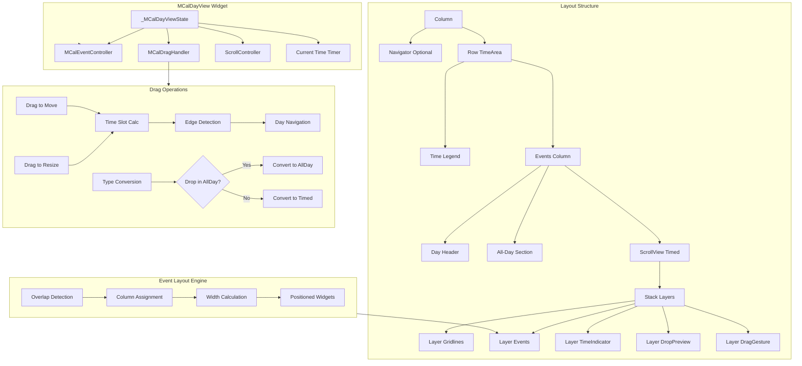

# Design Document: Day View

## Overview

This design document details the technical implementation of `MCalDayView` - a vertical timeline calendar view displaying a single day's schedule. The day view presents time-based events in proportion to their duration, with automatic overlap detection and column-based layout for concurrent events.

The architecture follows established patterns from `MCalMonthView` (7,834 lines), reusing the `MCalDragHandler` state machine, `MCalEventController` integration, theme system, and context object patterns.

**Phase 0 - Code Organization Prerequisite**: Before implementing remaining Day View features, Phase 0 reorganizes the codebase to clearly separate month-view-specific components from shared components. This phase renames:
- Files: `mcal_default_week_layout.dart` → `mcal_month_default_week_layout.dart`, etc. (4 files)
- Classes: `MCalDefaultWeekLayoutBuilder` → `MCalMonthDefaultWeekLayoutBuilder`, `MCalMultiDayTile` → `MCalMonthMultiDayTile`, and related context classes
- Rationale: Prevents confusion as Day View and future Multi-Day View implementations proceed. Month view's week-based layout is NOT shared with Day View (which uses time-based vertical layout).
- Impact: Zero breaking changes to users (API not yet published), only internal organization
- See Phase 0 tasks (0.1-0.7) in tasks.md for implementation details The view supports:
- Configurable time ranges (e.g., 8am-6pm, full 24-hour)
- Day header with date/day-of-week and **optional ISO week number** (NEW - inspired by Kalender)
- All-day events section at top with drag/resize (platform-restricted)
- Timed events area with Google Calendar-style overlap layout
- Current time indicator with automatic minute updates
- Vertical scrolling with auto-scroll to current time
- Drag-to-move (vertical + cross-day edge navigation)
- Drag-to-resize (top/bottom edges + cross-day navigation)
- Event type conversion (all-day ↔ timed via drag)
- **Snap-to-time functionality** (NEW - inspired by Kalender): Events snap to time slots, nearby events, and current time during drag/resize operations
- **Special time regions** (NEW - inspired by Syncfusion): Visual styling and interaction blocking for time periods (e.g., lunch breaks, non-working hours)
- **Empty time slot gestures** (NEW - adapted from month view): Tap and long-press handlers for empty time slots (e.g., event creation)
- Complete keyboard navigation
- Full RTL support throughout

## New Features (Competitive Analysis)

### 1. Snap-to-Time Functionality (Inspired by Kalender)

**Purpose:** Improves UX during drag-and-drop operations by automatically aligning events to meaningful time boundaries.

**Features:**
- **Snap to time slots**: Events align to configured intervals (e.g., 15-minute marks)
- **Snap to other events**: Magnetic snapping to nearby event boundaries (start/end times)
- **Snap to current time**: Events near "now" snap to current time indicator
- **Configurable snap range**: Define proximity threshold (default: 5 minutes)

**Configuration:**
```dart
MCalDayView(
  snapToTimeSlots: true,        // Snap to 15-minute intervals
  snapToOtherEvents: true,      // Magnetic snap to nearby events
  snapToCurrentTime: true,      // Snap to "now"
  snapRange: Duration(minutes: 5),  // Snapping threshold
)
```

**Behavior:**
1. User drags event to 9:07 AM → snaps to 9:00 AM (time slot)
2. User drags near another event at 10:30 AM → snaps to 10:30 AM (magnetic)
3. User drags near current time (11:23 AM) → snaps to 11:15 AM (current time, rounded to slot)

### 2. Special Time Regions (Inspired by Syncfusion)

**Purpose:** Visual styling and interaction control for specific time periods, adapted from month view's blockout days pattern.

**Features:**
- **Visual customization**: Custom colors, text, and icons for regions
- **Interaction blocking**: Prevent event drops/taps in designated regions (similar to month view blockout dates)
- **Recurring regions**: Support RFC 5545 RRULE for patterns (daily lunch, weekends)
- **Custom builder**: Full control via `timeRegionBuilder` callback

**Configuration:**
```dart
MCalDayView(
  specialTimeRegions: [
    // Lunch break (visual only, allows drops)
    MCalTimeRegion(
      id: 'lunch',
      startTime: DateTime(2026, 2, 14, 12, 0),
      endTime: DateTime(2026, 2, 14, 13, 0),
      color: Colors.amber.withValues(alpha: 0.3),
      text: 'Lunch Break',
      icon: Icons.restaurant,
      blockInteraction: false,
    ),
    
    // Non-working hours (blocks drops, like month view blockout dates)
    MCalTimeRegion(
      id: 'after-hours',
      startTime: DateTime(2026, 2, 14, 18, 0),
      endTime: DateTime(2026, 2, 14, 23, 59),
      color: Colors.grey.withValues(alpha: 0.5),
      text: 'After Hours',
      icon: Icons.block,
      blockInteraction: true,  // Rejects drops via validation
    ),
    
    // Recurring morning focus time
    MCalTimeRegion(
      id: 'focus-time',
      startTime: DateTime(2026, 2, 14, 9, 0),
      endTime: DateTime(2026, 2, 14, 10, 0),
      recurrenceRule: 'FREQ=DAILY;COUNT=30',
      color: Colors.blue.withValues(alpha: 0.2),
      text: 'Focus Time',
      blockInteraction: true,
    ),
  ],
  
  // Custom builder for advanced styling
  timeRegionBuilder: (context, regionContext) {
    if (regionContext.region.id == 'lunch') {
      return CustomLunchRegionWidget(region: regionContext.region);
    }
    return null; // Use default
  },
  
  // Validation callback (similar to month view onDragWillAccept)
  onDragWillAccept: (context, details) {
    // Custom validation logic
    // Framework automatically checks blocked regions
    return true;
  },
)
```

**Validation Flow** (similar to month view blockout dates):
1. User drags event to 18:30 (within blocked "after-hours" region)
2. `_validateDrop()` checks `blockInteraction: true` regions
3. Drop rejected → visual feedback shows invalid drop
4. Similar to month view's `onDragWillAccept` rejecting drops on blockout dates

**Use Cases:**
- **Non-working hours**: Gray out 6pm-8am, block drops
- **Lunch breaks**: Daily 12-1pm visual indicator (allow or block drops)
- **Meeting-free zones**: Focus time (9-10am), no interruptions
- **Holidays/weekends**: Full-day special styling
- **Custom business rules**: Any time-based restriction with visual feedback

**Comparison to Month View:**
- Month view: Date-based blockout (blocks entire days)
- Day view: Time-based regions (fine-grained hour/minute control)
- Both: Use same validation pattern (`onDragWillAccept` + visual styling)

### 3. Week Number Display (Inspired by Kalender)

**Purpose:** Optional ISO 8601 week number indicator in the day header for users who organize by week.

**Features:**
- **ISO 8601 standard**: Week 1 is the week containing the first Thursday of the year
- **RTL support**: Automatically positions left (LTR) or right (RTL)
- **Theme customization**: Background color, text color, and text style
- **Builder override**: Full control via `dayHeaderBuilder`

**Configuration:**
```dart
MCalDayView(
  showWeekNumber: true,  // Enable week number display
  dayHeaderBuilder: (context, headerContext) {
    // Access headerContext.weekNumber for custom rendering
    return CustomDayHeader(
      date: headerContext.date,
      weekNumber: headerContext.weekNumber,
      isToday: headerContext.isToday,
    );
  },
)
```

**Visual Design:**
```
┌─────────────────────┐
│ W7    FRI          │  ← LTR: Week number on left
│       13           │
└─────────────────────┘

┌─────────────────────┐
│          FRI    W7  │  ← RTL: Week number on right
│           13       │
└─────────────────────┘
```

**Use Cases:**
- **Weekly planning**: Users who think in "week 7" terms
- **Project tracking**: Work organized by ISO weeks
- **European calendars**: Common in Europe where week numbers are standard
- **Cross-platform consistency**: Match desktop calendar apps

**Comparison to Month View:**
- Month view: Week numbers optionally shown in the left gutter of the calendar grid
- Day view: Week number shown compactly in the day header

### 4. Empty Time Slot Gestures (Adapted from Month View)

**Purpose:** Tap and long-press handling for empty time slots, enabling event creation and custom interactions.

**Inspiration:** Month view's `onCellTap`/`onCellLongPress` for empty day cells.

**Features:**
- **Tap detection**: `onTimeSlotTap` callback with exact time and position
- **Long-press detection**: `onTimeSlotLongPress` for extended interactions
- **Event priority**: Event taps take precedence (gesture absorbed by event tiles)
- **Time calculation**: Tap position automatically converted to DateTime
- **Full context**: `MCalTimeSlotContext` provides time, date, and tap position

**Configuration:**
```dart
MCalDayView(
  onTimeSlotTap: (context, timeSlotContext) {
    print('Tapped at ${timeSlotContext.time}');
    // Show quick event creation dialog
    showQuickEventDialog(timeSlotContext.time);
  },
  
  onTimeSlotLongPress: (context, timeSlotContext) {
    print('Long-pressed at ${timeSlotContext.time}');
    // Create event immediately at tapped time
    createEventAt(
      startTime: timeSlotContext.time,
      duration: Duration(hours: 1),
    );
  },
)
```

**Behavior:**
1. User taps empty space at 2:30 PM → `onTimeSlotTap` fires with `time: 14:30`
2. User long-presses empty space at 3:15 PM → `onTimeSlotLongPress` fires
3. User taps on event → Event's `onEventTap` fires (slot tap ignored)

**Use Cases:**
- **Quick event creation**: Long-press to create event at tapped time
- **Context menus**: Tap to show available actions for that time slot
- **Time slot details**: Show information about the time period
- **Custom interactions**: Developer-defined behavior (analytics, tooltips, etc.)

**Comparison to Month View:**
| Feature | Month View | Day View |
|---------|------------|----------|
| **Callback** | `onCellTap` | `onTimeSlotTap` |
| **Context** | `MCalCellContext` (date, events) | `MCalTimeSlotContext` (date, time, offset) |
| **Granularity** | Day-level (full date) | Time-level (hour:minute) |
| **Use case** | Create all-day event | Create timed event at specific hour |
| **Pattern** | GestureDetector on cell | GestureDetector on Stack |

**Context Object:**
```dart
class MCalTimeSlotContext {
  final DateTime date;           // Display date
  final DateTime time;           // Exact time (snapped to timeSlotDuration)
  final Offset offset;           // Local tap position
  final bool isAllDayArea;       // Tapped in all-day vs timed area
  final int? hour;               // Hour component (0-23)
  final int? minute;             // Minute component (0-59)
}
```

## Steering Document Alignment

### Technical Standards (tech.md)

- **DST-safe time calculations**: All time arithmetic uses `DateTime(year, month, day, hour, minute)` constructor pattern, NEVER `Duration(hours:)` or `Duration(days:)` addition. When adding time slots: `DateTime(y, m, d, h, m).add(Duration(minutes: n))` is acceptable for intra-day calculations.
- **ChangeNotifier reactivity**: Reuses existing `MCalDragHandler` (extends `ChangeNotifier`) for drag/resize state, ensuring view rebuilds follow the established reactive update path.
- **intl localization**: Time formatting via `DateFormat` from intl package, hour labels respect locale (12/24-hour format).
- **flutter_lints**: All public APIs get full dartdoc with examples.
- **Performance**: O(n²) or better overlap detection, 60fps rendering with 50+ events, debounced drag updates (16ms).

### Project Structure (structure.md)

- New widget: `lib/src/widgets/mcal_day_view.dart` (~6,000-7,000 lines, mirrors month view structure)
- Context objects: `lib/src/widgets/mcal_day_view_contexts.dart` (~600-800 lines)
- Time utilities: `lib/src/utils/time_utils.dart` (~300-400 lines, pure functions for time↔offset conversion)
- Exports: `lib/multi_calendar.dart` exports `MCalDayView` and all context/callback detail classes
- Tests: `test/widgets/mcal_day_view_test.dart`, `test/utils/time_utils_test.dart`, integration tests
- Theme extensions: `lib/src/styles/mcal_theme.dart` gains day view properties

## Code Reuse Analysis

### Existing Components to Leverage

**`MCalDragHandler`** (`lib/src/widgets/mcal_drag_handler.dart`, 915 lines)
- Drag state machine: `startDrag()`, `updateDrag()`, `completeDrag()`, `cancelDrag()`
- Resize state machine: `startResize()`, `updateResize()`, `completeResize()`, `cancelResize()`
- Edge navigation: `handleEdgeProximity()` with self-repeating timer
- Highlight cells: `_highlightedCells`, `_proposedStartDate`, `_proposedEndDate`, `_isProposedDropValid`
- **Adaptation needed**: Add helper methods for time-based drag (vertical positioning instead of grid cells)

**`MCalEventController`** (`lib/src/controllers/mcal_event_controller.dart`, 1,284 lines)
- Event loading: `getEventsForRange()`, `addEvents()`, `removeEvents()`
- Recurring event expansion: `_getExpandedOccurrences()` handles RRULE
- Exception handling: `modifyOccurrence()`, `rescheduleOccurrence()`, `cancelOccurrence()`
- Display date management: `setDisplayDate()`, listener pattern
- **No changes needed**: Existing API fully supports day view

**`MCalThemeData`** (`lib/src/styles/mcal_theme.dart`)
- Theme InheritedWidget pattern: `MCalTheme.of(context)`
- Fallback chain: widget ancestor → extension → `fromTheme()`
- Existing properties: event tiles, drag feedback, borders, colors
- **Extension needed**: Add day view-specific properties (time legend, gridlines, hour height, all-day section)

**`MCalLocalizations`** (`lib/src/utils/mcal_localization.dart`)
- String localization: `getLocalizedString(key, locale)`
- RTL detection: `isRTL(locale)`
- Existing strings: English and Spanish (es_MX)
- **Extension needed**: Add day view-specific strings (time labels, today button, conversion announcements)

**`daysBetween()`** (`lib/src/utils/date_utils.dart`)
- DST-safe day delta calculation
- **Reuse for**: Cross-day drag calculations, event type conversion date handling

**Context Object Patterns** (`lib/src/widgets/mcal_month_view_contexts.dart`)
- `MCalDayCellContext`, `MCalEventTileContext`, `MCalNavigatorContext`, etc.
- Immutable data classes with all relevant context
- **Follow pattern for**: `MCalTimeSlotContext`, `MCalTimeLabelContext`, `MCalTimedEventTileContext`, etc.

**Callback Detail Patterns** (`lib/src/widgets/mcal_callback_details.dart`)
- `MCalEventDroppedDetails`, `MCalEventResizedDetails`, `MCalDragWillAcceptDetails`
- Immutable classes with full operation details
- **Extend with**: `typeConversion` field to indicate all-day ↔ timed conversions

### Integration Points

- **MCalEventController**: Day view listens for event updates, calls `getEventsForRange()` for displayed date
- **MCalDragHandler**: Day view creates handler instance, calls time-based drag methods, listens for state changes
- **MCalTheme**: Day view reads theme via `MCalTheme.of(context)` with fallback chain
- **Navigator pattern**: Reuses month view navigator builder pattern with adapted context
- **PageView approach**: Consider single-page vs. PageView for day navigation (single page + setState preferred for simplicity)

## Architecture



## Components and Interfaces

### Component 1: MCalDayView Widget Structure

**Purpose:** Top-level stateful widget providing the public API and managing overall state.

**Public API:**
```dart
class MCalDayView extends StatefulWidget {
  const MCalDayView({
    super.key,
    required this.controller,
    
    // Time configuration
    this.startHour = 0,
    this.endHour = 23,
    this.timeSlotDuration = const Duration(minutes: 15),
    this.hourHeight,
    
    // Display
    this.showNavigator = false,
    this.showCurrentTimeIndicator = true,
    this.showWeekNumber = false,  // NEW - ISO week number (inspired by Kalender)
    this.gridlineInterval = const Duration(minutes: 15),  // 1, 5, 10, 15, 20, 30, or 60 minutes
    this.dateFormat,
    this.timeLabelFormat,
    this.locale,
    
    // Scrolling
    this.autoScrollToCurrentTime = true,
    this.scrollPhysics,
    this.scrollController,
    
    // All-day section
    this.allDaySectionMaxRows = 3,
    this.allDayToTimedDuration = const Duration(hours: 1),
    
    // Drag and drop
    this.enableDragToMove = false,
    this.enableDragToResize,  // null = platform auto-detect
    this.dragEdgeNavigationEnabled = true,
    this.dragLongPressDelay = const Duration(milliseconds: 200),
    this.dragEdgeNavigationDelay = const Duration(milliseconds: 1200),
    this.showDropTargetPreview = true,  // Layer 3
    this.showDropTargetOverlay = true,  // Layer 4
    this.dropTargetTilesAboveOverlay = false,  // Layer 3/4 order (matches Month View)
    this.draggedTileBuilder,  // Feedback tile during drag
    this.dragSourceTileBuilder,  // Source tile appearance during drag
    this.onDragWillAccept,  // Validate before accepting drop
    
    // Snapping (NEW - inspired by Kalender)
    this.snapToTimeSlots = true,
    this.snapToOtherEvents = true,
    this.snapToCurrentTime = true,
    this.snapRange = const Duration(minutes: 5),
    
    // Special time regions (NEW - inspired by Syncfusion)
    this.specialTimeRegions = const [],
    this.timeRegionBuilder,
    
    // Keyboard
    this.enableKeyboardNavigation = true,
    this.autoFocusOnEventTap = true,
    
    // Animations
    this.enableAnimations,  // null = respect OS reduced motion
    this.animationDuration = const Duration(milliseconds: 300),
    this.animationCurve = Curves.easeInOut,
    
    // Boundaries
    this.minDate,
    this.maxDate,
    
    // Builders
    this.dayHeaderBuilder,
    this.timeLabelBuilder,
    this.gridlineBuilder,
    this.allDayEventTileBuilder,
    this.timedEventTileBuilder,
    this.currentTimeIndicatorBuilder,
    this.navigatorBuilder,
    this.dayLayoutBuilder,
    this.draggedTileBuilder,  // Feedback tile during drag (follows cursor)
    this.dragSourceTileBuilder,  // Source tile appearance during drag (NEW - matches Month View)
    this.dropTargetTileBuilder,  // Preview tile at drop position (Layer 3)
    this.dropTargetOverlayBuilder,  // Custom overlay for drop target (Layer 4, NEW - matches Month View)
    this.timeResizeHandleBuilder,
    this.loadingBuilder,
    this.errorBuilder,
    this.timeRegionBuilder,  // NEW - for special time regions
    
    // Callbacks
    this.onDayHeaderTap,
    this.onDayHeaderLongPress,
    this.onTimeLabelTap,
    this.onTimeSlotTap,
    this.onTimeSlotLongPress,
    this.onEventTap,
    this.onEventLongPress,
    this.onHoverEvent,
    this.onHoverTimeSlot,
    this.onOverflowTap,
    this.onOverflowLongPress,
    this.onDragWillAccept,
    this.onEventDropped,
    this.onResizeWillAccept,
    this.onEventResized,
    this.onDisplayDateChanged,
    this.onScrollChanged,
    
    // Semantic label
    this.semanticsLabel,
  });
  
  // Fields...
}
```

**Dependencies:** `MCalEventController`, optional `MCalDragHandler` (lazy-created when drag enabled)

**Reuses:** Month view parameter patterns, callback signatures, builder patterns

### Component 2: Time Calculation Utilities

**Purpose:** Pure functions for converting between time values and pixel offsets.

**Location:** `lib/src/utils/time_utils.dart`

**Functions:**
```dart
/// Converts a time to a vertical offset in pixels.
/// 
/// Returns the distance from the top of the time range to the given time.
double timeToOffset({
  required DateTime time,
  required int startHour,
  required double hourHeight,
}) {
  final minutesFromStart = (time.hour - startHour) * 60 + time.minute;
  return (minutesFromStart / 60.0) * hourHeight;
}

/// Converts a vertical offset to a time, with optional slot snapping.
///
/// Returns a DateTime on the given date with time calculated from offset.
DateTime offsetToTime({
  required double offset,
  required DateTime date,
  required int startHour,
  required double hourHeight,
  required Duration timeSlotDuration,
}) {
  final minutesFromStart = (offset / hourHeight) * 60;
  final snappedMinutes = (minutesFromStart / timeSlotDuration.inMinutes).round() 
    * timeSlotDuration.inMinutes;
  
  // DST-safe: construct DateTime with hour/minute
  final totalMinutes = startHour * 60 + snappedMinutes;
  final hour = totalMinutes ~/ 60;
  final minute = totalMinutes % 60;
  
  return DateTime(date.year, date.month, date.day, hour, minute);
}

/// Snaps a time to the nearest time slot boundary.
DateTime snapToTimeSlot({
  required DateTime time,
  required Duration timeSlotDuration,
}) {
  final totalMinutes = time.hour * 60 + time.minute;
  final snappedMinutes = (totalMinutes / timeSlotDuration.inMinutes).round() 
    * timeSlotDuration.inMinutes;
  
  final hour = snappedMinutes ~/ 60;
  final minute = snappedMinutes % 60;
  
  return DateTime(time.year, time.month, time.day, hour, minute);
}

/// Calculates the height in pixels for a duration.
double durationToHeight({
  required Duration duration,
  required double hourHeight,
}) {
  return (duration.inMinutes / 60.0) * hourHeight;
}
```

**Dependencies:** None (pure functions)

**Testing:** Extensive unit tests for DST boundaries, time slot snapping, edge cases

### Component 3: Overlap Detection Algorithm

**Purpose:** Detects overlapping events and assigns them to columns for side-by-side layout.

**Location:** `lib/src/utils/overlap_detection.dart` (new file) or inline in `mcal_day_view.dart`

**Algorithm:**
```dart
class MCalOverlapGroup {
  final List<MCalCalendarEvent> events;
  final List<int> columnAssignments;  // index matches events
  final int totalColumns;
  
  const MCalOverlapGroup({
    required this.events,
    required this.columnAssignments,
    required this.totalColumns,
  });
}

/// Detects overlapping events and assigns columns.
MCalOverlapGroup detectOverlapsAndAssignColumns(
  List<MCalCalendarEvent> events,
) {
  if (events.isEmpty) {
    return const MCalOverlapGroup(
      events: [],
      columnAssignments: [],
      totalColumns: 0,
    );
  }
  
  // Sort by start time, then by duration (longest first)
  final sorted = List<MCalCalendarEvent>.from(events)..sort((a, b) {
    final timeCompare = a.start.compareTo(b.start);
    if (timeCompare != 0) return timeCompare;
    // Longer events first
    return b.end.difference(b.start).compareTo(a.end.difference(a.start));
  });
  
  final columnAssignments = <int>[];
  final columns = <List<MCalCalendarEvent>>[];
  
  for (final event in sorted) {
    // Find first available column
    int assignedColumn = -1;
    for (int col = 0; col < columns.length; col++) {
      final colEvents = columns[col];
      // Check if event overlaps with any event in this column
      bool hasOverlap = false;
      for (final colEvent in colEvents) {
        if (_eventsOverlap(event, colEvent)) {
          hasOverlap = true;
          break;
        }
      }
      if (!hasOverlap) {
        assignedColumn = col;
        break;
      }
    }
    
    // If no available column, create new one
    if (assignedColumn == -1) {
      assignedColumn = columns.length;
      columns.add([]);
    }
    
    columns[assignedColumn].add(event);
    columnAssignments.add(assignedColumn);
  }
  
  return MCalOverlapGroup(
    events: sorted,
    columnAssignments: columnAssignments,
    totalColumns: columns.length,
  );
}

bool _eventsOverlap(MCalCalendarEvent a, MCalCalendarEvent b) {
  return a.start.isBefore(b.end) && b.start.isBefore(a.end);
}
```

**Complexity:** O(n²) in worst case (all events overlap), O(n·k) average where k is number of columns (typically 2-4)

**Reuses:** Event comparison logic

### Component 4: Day Header with Optional Week Number

**Purpose:** Displays the day of week, date number, and optional ISO week number at the top of the events area.

**Widget:** `_DayHeader` (private StatelessWidget) or builder-provided

**Design:**
```dart
class _DayHeader extends StatelessWidget {
  final DateTime displayDate;
  final bool showWeekNumber;
  final String? dateFormat;
  final Locale locale;
  final MCalThemeData theme;
  final Widget Function(BuildContext, MCalDayHeaderContext)? dayHeaderBuilder;
  final VoidCallback? onTap;
  final VoidCallback? onLongPress;
  final TextDirection textDirection;
  
  @override
  Widget build(BuildContext context) {
    final weekNumber = _calculateISOWeekNumber(displayDate);
    
    final headerContext = MCalDayHeaderContext(
      date: displayDate,
      weekNumber: weekNumber,
      isToday: _isToday(displayDate),
    );
    
    // Custom builder takes precedence
    if (dayHeaderBuilder != null) {
      return _wrapWithGestureDetector(
        dayHeaderBuilder!(context, headerContext),
      );
    }
    
    // Default header layout
    return _wrapWithGestureDetector(
      Positioned(
        top: 8,
        left: textDirection == TextDirection.ltr ? 8 : null,
        right: textDirection == TextDirection.rtl ? 8 : null,
        child: Row(
          mainAxisSize: MainAxisSize.min,
          children: [
            // Week number (optional, left for LTR, right for RTL)
            if (showWeekNumber && textDirection == TextDirection.ltr) ...[
              _buildWeekNumber(weekNumber),
              const SizedBox(width: 8),
            ],
            
            // Day of week and date
            _buildDayAndDate(),
            
            // Week number (optional, right for RTL)
            if (showWeekNumber && textDirection == TextDirection.rtl) ...[
              const SizedBox(width: 8),
              _buildWeekNumber(weekNumber),
            ],
          ],
        ),
      ),
    );
  }
  
  Widget _buildWeekNumber(int weekNumber) {
    return Container(
      padding: const EdgeInsets.symmetric(horizontal: 6, vertical: 2),
      decoration: BoxDecoration(
        color: theme.weekNumberBackgroundColor ?? 
               Colors.grey.withValues(alpha: 0.2),
        borderRadius: BorderRadius.circular(4),
      ),
      child: Text(
        'W$weekNumber',
        style: theme.weekNumberTextStyle ?? TextStyle(
          fontSize: 11,
          fontWeight: FontWeight.w500,
          color: theme.weekNumberTextColor ?? Colors.black54,
        ),
      ),
    );
  }
  
  Widget _buildDayAndDate() {
    final dayOfWeek = DateFormat('EEE', locale.toString()).format(displayDate);
    final dateNum = displayDate.day;
    
    return Column(
      crossAxisAlignment: CrossAxisAlignment.start,
      mainAxisSize: MainAxisSize.min,
      children: [
        Text(
          dayOfWeek.toUpperCase(),
          style: theme.dayHeaderDayOfWeekStyle ?? TextStyle(
            fontSize: 12,
            fontWeight: FontWeight.w500,
            color: Colors.grey[600],
          ),
        ),
        Text(
          dateNum.toString(),
          style: theme.dayHeaderDateStyle ?? TextStyle(
            fontSize: 24,
            fontWeight: FontWeight.bold,
            color: Colors.black87,
          ),
        ),
      ],
    );
  }
  
  Widget _wrapWithGestureDetector(Widget child) {
    if (onTap == null && onLongPress == null) return child;
    
    return GestureDetector(
      onTap: onTap,
      onLongPress: onLongPress,
      child: child,
    );
  }
  
  /// Calculates ISO 8601 week number.
  /// Week 1 is the week with the first Thursday of the year.
  int _calculateISOWeekNumber(DateTime date) {
    // ISO 8601 week date calculation
    final dayOfYear = _dayOfYear(date);
    final weekDay = date.weekday;
    
    // Find Thursday of current week
    final thursday = date.add(Duration(days: 4 - weekDay));
    
    // Week 1 is the week containing the first Thursday
    final jan4 = DateTime(thursday.year, 1, 4);
    final jan4Thursday = jan4.add(Duration(days: 4 - jan4.weekday));
    
    final weekNumber = 1 + ((thursday.difference(jan4Thursday).inDays) / 7).floor();
    return weekNumber;
  }
  
  int _dayOfYear(DateTime date) {
    final startOfYear = DateTime(date.year, 1, 1);
    return date.difference(startOfYear).inDays + 1;
  }
  
  bool _isToday(DateTime date) {
    final now = DateTime.now();
    return date.year == now.year && 
           date.month == now.month && 
           date.day == now.day;
  }
}
```

**Features:**
- **Day of week**: 3-letter abbreviation (e.g., "FRI")
- **Date number**: Day of month (e.g., "13")
- **Optional week number** (NEW - inspired by Kalender): ISO 8601 week number (e.g., "W7")
- **RTL support**: Layout mirrors for RTL languages
- **Tap/LongPress**: Invokes `onDayHeaderTap`/`onDayHeaderLongPress` callbacks
- **Custom builder**: Full override via `dayHeaderBuilder`

**Dependencies:** Theme, `intl` for date formatting

**Reuses:** Date formatting pattern from month view, GestureDetector wrapping pattern

### Component 5: Time Legend Column

**Purpose:** Renders hour labels along the left (LTR) or right (RTL) edge.

**Widget:** `_TimeLegendColumn` (private StatelessWidget)

**Design:**
```dart
class _TimeLegendColumn extends StatelessWidget {
  final int startHour;
  final int endHour;
  final double hourHeight;
  final String? timeLabelFormat;
  final Widget Function(BuildContext, MCalTimeLabelContext)? timeLabelBuilder;
  final MCalThemeData theme;
  final Locale locale;
  final VoidCallback? onTimeLabelTap;
  
  @override
  Widget build(BuildContext context) {
    final totalHours = endHour - startHour + 1;
    final columnHeight = hourHeight * totalHours;
    
    return Container(
      width: theme.timeLegendWidth ?? 60.0,
      height: columnHeight,
      color: theme.timeLegendBackgroundColor,
      child: Stack(
        children: [
          for (int hour = startHour; hour <= endHour; hour++)
            Positioned(
              top: (hour - startHour) * hourHeight,
              left: 0,
              right: 0,
              child: _buildHourLabel(hour),
            ),
        ],
      ),
    );
  }
  
  Widget _buildHourLabel(int hour) {
    final time = DateTime(2000, 1, 1, hour, 0);  // Date irrelevant
    final context = MCalTimeLabelContext(
      hour: hour,
      time: time,
      locale: locale,
    );
    
    if (timeLabelBuilder != null) {
      return timeLabelBuilder!(context, context);
    }
    
    // Default: format using locale
    final format = timeLabelFormat ?? (locale.languageCode == 'en' ? 'h a' : 'HH:mm');
    final label = DateFormat(format, locale.toString()).format(time);
    
    return GestureDetector(
      onTap: onTimeLabelTap,
      child: Center(
        child: Text(
          label,
          style: theme.timeLegendTextStyle,
        ),
      ),
    );
  }
}
```

**Dependencies:** intl `DateFormat`, theme

**Reuses:** Locale detection pattern from month view

### Component 5: Gridlines Layer with Configurable Intervals

**Purpose:** Renders horizontal lines at configurable intervals (1, 5, 10, 15, 20, 30, or 60 minutes).

**Widget:** `_GridlinesLayer` (private StatelessWidget in Stack)

**Design:**
```dart
enum MCalGridlineType {
  /// Primary hour gridline (e.g., 9:00, 10:00).
  hour,
  /// Major subdivision (e.g., 30-minute intervals).
  major,
  /// Minor subdivision (e.g., 15-minute intervals).
  minor,
}

class _GridlinesLayer extends StatelessWidget {
  final int startHour;
  final int endHour;
  final double hourHeight;
  final Duration gridlineInterval;  // 1, 5, 10, 15, 20, 30, or 60 minutes
  final MCalThemeData theme;
  final Widget Function(BuildContext, MCalGridlineContext)? gridlineBuilder;
  
  @override
  Widget build(BuildContext context) {
    final totalHours = endHour - startHour + 1;
    final height = hourHeight * totalHours;
    final totalMinutes = totalHours * 60;
    final intervalMinutes = gridlineInterval.inMinutes;
    
    return SizedBox(
      height: height,
      child: Stack(
        children: [
          // Generate gridlines at specified interval
          for (int minuteOffset = 0; minuteOffset <= totalMinutes; minuteOffset += intervalMinutes)
            _buildGridline(
              minuteOffset: minuteOffset,
              totalMinutes: totalMinutes,
            ),
        ],
      ),
    );
  }
  
  Widget _buildGridline({
    required int minuteOffset,
    required int totalMinutes,
  }) {
    final offset = (minuteOffset / 60.0) * hourHeight;
    final hour = startHour + (minuteOffset ~/ 60);
    final minute = minuteOffset % 60;
    
    // Determine gridline type
    final gridlineType = _determineGridlineType(minute);
    
    final gridlineContext = MCalGridlineContext(
      hour: hour,
      minute: minute,
      offset: offset,
      type: gridlineType,
      intervalMinutes: gridlineInterval.inMinutes,
    );
    
    if (gridlineBuilder != null) {
      return Positioned(
        top: offset,
        left: 0,
        right: 0,
        child: gridlineBuilder!(context, gridlineContext),
      );
    }
    
    // Default gridline
    final (color, width) = _getDefaultGridlineStyle(gridlineType);
      
    return Positioned(
      top: offset,
      left: 0,
      right: 0,
      child: Container(
        height: width,
        color: color,
      ),
    );
  }
  
  MCalGridlineType _determineGridlineType(int minute) {
    if (minute == 0) return MCalGridlineType.hour;
    if (minute == 30 && gridlineInterval.inMinutes <= 30) {
      return MCalGridlineType.major;
    }
    return MCalGridlineType.minor;
  }
  
  (Color, double) _getDefaultGridlineStyle(MCalGridlineType type) {
    switch (type) {
      case MCalGridlineType.hour:
        return (
          theme.hourGridlineColor ?? Colors.grey.withValues(alpha: 0.2),
          theme.hourGridlineWidth ?? 1.0,
        );
      case MCalGridlineType.major:
        return (
          theme.majorGridlineColor ?? Colors.grey.withValues(alpha: 0.15),
          theme.majorGridlineWidth ?? 1.0,
        );
      case MCalGridlineType.minor:
        return (
          theme.minorGridlineColor ?? Colors.grey.withValues(alpha: 0.08),
          theme.minorGridlineWidth ?? 0.5,
        );
    }
  }
}
```

**Dependencies:** Theme

**Reuses:** `Positioned` layout pattern from month view week rows

**Configuration:** Developer sets `gridlineInterval: Duration(minutes: 15)` and all gridlines at 15-minute intervals are rendered. Builder receives full context to customize each type.

### Component 5a: Special Time Regions Layer (NEW)

**Purpose:** Renders special time regions with custom styling and optional interaction blocking.

**Inspiration:** Adapted from:
- Month view's blockout days pattern (`onDragWillAccept` validation + `dayCellBuilder` styling)
- Syncfusion's `TimeRegion` with visual customization and pointer interaction control
- Kalender's customizable time indicators

**Widget:** `_TimeRegionsLayer` (private StatelessWidget in Stack, rendered between gridlines and events)

**Design:**
```dart
class _TimeRegionsLayer extends StatelessWidget {
  final List<MCalTimeRegion> regions;
  final DateTime displayDate;
  final int startHour;
  final int endHour;
  final double hourHeight;
  final MCalThemeData theme;
  final Widget Function(BuildContext, MCalTimeRegionContext)? timeRegionBuilder;
  
  @override
  Widget build(BuildContext context) {
    // Filter regions to only those that apply to displayDate
    final applicableRegions = _getApplicableRegions();
    
    return Stack(
      children: [
        for (final region in applicableRegions)
          _buildTimeRegion(context, region),
      ],
    );
  }
  
  List<MCalTimeRegion> _getApplicableRegions() {
    final result = <MCalTimeRegion>[];
    
    for (final region in regions) {
      // Check if region applies to displayDate
      if (_regionAppliesToDate(region, displayDate)) {
        result.add(region);
      }
      
      // If region has recurrence rule, expand occurrences
      if (region.recurrenceRule != null) {
        // Use existing recurrence expansion logic from controller
        final occurrences = _expandRecurringRegion(region, displayDate);
        result.addAll(occurrences);
      }
    }
    
    return result;
  }
  
  Widget _buildTimeRegion(BuildContext context, MCalTimeRegion region) {
    // Calculate vertical position and height
    final startOffset = _timeToOffset(region.startTime);
    final endOffset = _timeToOffset(region.endTime);
    final height = endOffset - startOffset;
    
    final regionContext = MCalTimeRegionContext(
      region: region,
      displayDate: displayDate,
      startOffset: startOffset,
      height: height,
    );
    
    // Custom builder takes precedence
    if (timeRegionBuilder != null) {
      return Positioned(
        top: startOffset,
        left: 0,
        right: 0,
        height: height,
        child: timeRegionBuilder!(context, regionContext),
      );
    }
    
    // Default region appearance (similar to month view blockout styling)
    return Positioned(
      top: startOffset,
      left: 0,
      right: 0,
      height: height,
      child: Container(
        decoration: BoxDecoration(
          color: region.color ?? 
                 (region.blockInteraction 
                   ? theme.blockedTimeRegionColor 
                   : theme.specialTimeRegionColor),
          border: Border(
            top: BorderSide(
              color: theme.timeRegionBorderColor ?? Colors.grey.withValues(alpha: 0.3),
              width: 1,
            ),
            bottom: BorderSide(
              color: theme.timeRegionBorderColor ?? Colors.grey.withValues(alpha: 0.3),
              width: 1,
            ),
          ),
        ),
        child: region.text != null || region.icon != null
          ? Center(
              child: Row(
                mainAxisSize: MainAxisSize.min,
                children: [
                  if (region.icon != null) ...[
                    Icon(
                      region.icon,
                      size: 16,
                      color: theme.timeRegionTextColor ?? Colors.black54,
                    ),
                    if (region.text != null) const SizedBox(width: 4),
                  ],
                  if (region.text != null)
                    Text(
                      region.text!,
                      style: TextStyle(
                        fontSize: 12,
                        color: theme.timeRegionTextColor ?? Colors.black54,
                      ),
                    ),
                ],
              ),
            )
          : null,
      ),
    );
  }
  
  double _timeToOffset(DateTime time) {
    final hour = time.hour;
    final minute = time.minute;
    final totalMinutes = (hour - startHour) * 60 + minute;
    return (totalMinutes / 60.0) * hourHeight;
  }
  
  bool _regionAppliesToDate(MCalTimeRegion region, DateTime date) {
    // Check if region's date matches displayDate
    return region.startTime.year == date.year &&
           region.startTime.month == date.month &&
           region.startTime.day == date.day;
  }
  
  List<MCalTimeRegion> _expandRecurringRegion(
    MCalTimeRegion region, 
    DateTime date,
  ) {
    // Reuse event controller's recurrence expansion logic
    // Generate occurrences for the display date
    // Return list of MCalTimeRegion instances for each occurrence
    // Implementation similar to event recurrence expansion
    return [];  // Placeholder
  }
}
```

**Dependencies:** Theme, recurrence expansion utilities

**Integration with Drag Operations:**
- Regions with `blockInteraction: true` are validated in `onDragWillAccept` callback
- Similar to month view's blockout dates that reject drops
- Validation checks if proposed event time range overlaps any blocked region

**Use Cases:**
1. **Non-working hours:** Mark 6pm-8am as blocked (gray overlay)
2. **Lunch breaks:** Daily 12pm-1pm recurring region (visual indicator)
3. **Meeting-free zones:** 9am-10am focus time (block drops)
4. **Weekends/holidays:** Entire day as special region
5. **Custom business rules:** Any time-based restriction

**Reuses:** `Positioned` layout pattern, recurrence expansion from event controller

### Component 6: All-Day Events Section

**Purpose:** Displays all-day events horizontally with overflow handling, drag source, and resize handles.

**Widget:** `_AllDayEventsSection` (private StatefulWidget)

**Design:**
```dart
class _AllDayEventsSection extends StatefulWidget {
  final List<MCalCalendarEvent> allDayEvents;
  final int maxRows;
  final MCalThemeData theme;
  final Widget Function(BuildContext, MCalEventTileContext, Widget)? tileBuilder;
  final bool enableDragToMove;
  final bool enableDragToResize;
  final Function(MCalCalendarEvent)? onEventTap;
  final Function(MCalCalendarEvent)? onEventLongPress;
  final VoidCallback? onOverflowTap;
  
  @override
  State<_AllDayEventsSection> createState() => _AllDayEventsSectionState();
}

class _AllDayEventsSectionState extends State<_AllDayEventsSection> {
  @override
  Widget build(BuildContext context) {
    final visibleEvents = widget.allDayEvents.take(widget.maxRows * 2).toList();
    final hasOverflow = widget.allDayEvents.length > visibleEvents.length;
    
    return Container(
      constraints: BoxConstraints(
        maxHeight: widget.theme.allDaySectionHeight 
          ?? (widget.maxRows * (theme.eventTileHeight + 4.0)),
      ),
      child: Column(
        mainAxisSize: MainAxisSize.min,
        children: [
          Wrap(
            children: [
              for (final event in visibleEvents)
                _buildAllDayTile(event),
            ],
          ),
          if (hasOverflow)
            _buildOverflowIndicator(widget.allDayEvents.length - visibleEvents.length),
        ],
      ),
    );
  }
  
  Widget _buildAllDayTile(MCalCalendarEvent event) {
    final tileContext = MCalEventTileContext(
      event: event,
      displayDate: widget.displayDate,
      isAllDay: true,
      // ... other context fields
    );
    
    Widget tile = Container(
      height: theme.eventTileHeight,
      padding: theme.eventTilePadding,
      decoration: BoxDecoration(
        color: event.color ?? theme.allDayEventBackgroundColor,
        borderRadius: BorderRadius.circular(theme.eventTileCornerRadius ?? 4.0),
      ),
      child: Text(event.title, style: theme.allDayEventTextStyle),
    );
    
    if (widget.tileBuilder != null) {
      tile = widget.tileBuilder!(context, tileContext, tile);
    }
    
    // Wrap in draggable if enabled
    if (widget.enableDragToMove) {
      tile = MCalDraggableEventTile(
        event: event,
        child: tile,
        // ... drag configuration
      );
    }
    
    // Add resize handles if enabled
    if (widget.enableDragToResize && _shouldShowResizeHandles(event)) {
      tile = _wrapWithResizeHandles(tile, event, tileContext);
    }
    
    return GestureDetector(
      onTap: () => widget.onEventTap?.call(event),
      onLongPress: () => widget.onEventLongPress?.call(event),
      child: tile,
    );
  }
}
```

**Dependencies:** `MCalDraggableEventTile`, theme

**Reuses:** Month view's multi-day tile rendering pattern, drag infrastructure

### Component 7: Timed Events Layer with Overlap Layout

**Purpose:** Renders timed events with automatic column layout for overlaps.

**Widget:** `_TimedEventsLayer` (private StatelessWidget in Stack)

**Design:**
```dart
class _TimedEventsLayer extends StatelessWidget {
  final List<MCalCalendarEvent> timedEvents;
  final DateTime displayDate;
  final int startHour;
  final int endHour;
  final double hourHeight;
  final Duration timeSlotDuration;
  final double areaWidth;
  final MCalThemeData theme;
  final Widget Function(BuildContext, MCalTimedEventTileContext, Widget)? tileBuilder;
  final MCalDayLayoutBuilder? dayLayoutBuilder;
  final bool enableDragToMove;
  final bool enableDragToResize;
  
  @override
  Widget build(BuildContext context) {
    final totalHeight = hourHeight * (endHour - startHour + 1);
    
    // Use custom layout builder if provided
    if (dayLayoutBuilder != null) {
      return SizedBox(
        height: totalHeight,
        child: dayLayoutBuilder!(context, MCalDayLayoutContext(
          events: timedEvents,
          displayDate: displayDate,
          startHour: startHour,
          endHour: endHour,
          hourHeight: hourHeight,
          areaWidth: areaWidth,
        )),
      );
    }
    
    // Default: overlap detection + column layout
    final overlapGroup = detectOverlapsAndAssignColumns(timedEvents);
    
    return SizedBox(
      height: totalHeight,
      child: Stack(
        children: [
          for (int i = 0; i < overlapGroup.events.length; i++)
            _buildPositionedEvent(
              overlapGroup.events[i],
              overlapGroup.columnAssignments[i],
              overlapGroup.totalColumns,
            ),
        ],
      ),
    );
  }
  
  Widget _buildPositionedEvent(
    MCalCalendarEvent event,
    int columnIndex,
    int totalColumns,
  ) {
    // Calculate position and size
    final topOffset = timeToOffset(
      time: event.start,
      startHour: startHour,
      hourHeight: hourHeight,
    );
    
    final height = durationToHeight(
      duration: event.end.difference(event.start),
      hourHeight: hourHeight,
    ).clamp(theme.timedEventMinHeight ?? 20.0, double.infinity);
    
    final columnWidth = areaWidth / totalColumns;
    final leftOffset = columnIndex * columnWidth;
    
    final tileContext = MCalTimedEventTileContext(
      event: event,
      displayDate: displayDate,
      columnIndex: columnIndex,
      totalColumns: totalColumns,
      startTime: event.start,
      endTime: event.end,
    );
    
    Widget tile = _buildEventTile(event, tileContext);
    
    // Add resize handles if enabled
    if (enableDragToResize) {
      tile = _wrapWithResizeHandles(tile, event, tileContext);
    }
    
    return Positioned(
      top: topOffset,
      left: leftOffset,
      width: columnWidth,
      height: height,
      child: tile,
    );
  }
}
```

**Dependencies:** 
- Overlap detection algorithm (new for time-based layout)
- Time utilities (`timeToOffset`, `durationToHeight`)
- **`MCalDraggableEventTile`** (reuse from Month View, `lib/src/widgets/mcal_draggable_event_tile.dart`)

**Reuses from Month View:** 
- `MCalDraggableEventTile` wrapper for LongPressDraggable pattern
- Drag feedback builder patterns (`draggedTileBuilder`, `dragSourceTileBuilder`)
- Event tile interaction patterns (tap, long press, hover)

**Note on Draggable Wrapper:**
Each timed event tile is wrapped in `MCalDraggableEventTile` (same widget used by Month View) which:
- Provides `LongPressDraggable` gesture handling
- Manages drag feedback (follows cursor)
- Manages source tile appearance during drag (50% opacity default)
- Passes `MCalDragData` with event and source date
- Calls drag start/end callbacks
- Integrates with `MCalDragHandler` for unified state

### Component 8: Current Time Indicator

**Purpose:** Displays horizontal line at current time with automatic updates.

**Widget:** `_CurrentTimeIndicator` (private StatefulWidget)

**Design:**
```dart
class _CurrentTimeIndicator extends StatefulWidget {
  final int startHour;
  final double hourHeight;
  final bool isRTL;
  final MCalThemeData theme;
  final Widget Function(BuildContext, MCalCurrentTimeContext)? builder;
  
  @override
  State<_CurrentTimeIndicator> createState() => _CurrentTimeIndicatorState();
}

class _CurrentTimeIndicatorState extends State<_CurrentTimeIndicator> {
  Timer? _timer;
  DateTime _currentTime = DateTime.now();
  
  @override
  void initState() {
    super.initState();
    _startTimer();
  }
  
  void _startTimer() {
    // Update every minute
    _timer = Timer.periodic(const Duration(minutes: 1), (_) {
      if (mounted) {
        setState(() {
          _currentTime = DateTime.now();
        });
      }
    });
  }
  
  @override
  void dispose() {
    _timer?.cancel();
    super.dispose();
  }
  
  @override
  Widget build(BuildContext context) {
    final offset = timeToOffset(
      time: _currentTime,
      startHour: widget.startHour,
      hourHeight: widget.hourHeight,
    );
    
    final indicatorContext = MCalCurrentTimeContext(
      currentTime: _currentTime,
      offset: offset,
      isRTL: widget.isRTL,
    );
    
    if (widget.builder != null) {
      return Positioned(
        top: offset,
        left: 0,
        right: 0,
        child: widget.builder!(context, indicatorContext),
      );
    }
    
    // Default indicator
    return Positioned(
      top: offset,
      left: 0,
      right: 0,
      child: Row(
        children: [
          if (!widget.isRTL) _buildDot(),
          Expanded(
            child: Container(
              height: widget.theme.currentTimeIndicatorWidth ?? 2.0,
              color: widget.theme.currentTimeIndicatorColor ?? Colors.red,
            ),
          ),
          if (widget.isRTL) _buildDot(),
        ],
      ),
    );
  }
  
  Widget _buildDot() {
    return Container(
      width: (widget.theme.currentTimeIndicatorDotRadius ?? 6.0) * 2,
      height: (widget.theme.currentTimeIndicatorDotRadius ?? 6.0) * 2,
      decoration: BoxDecoration(
        shape: BoxShape.circle,
        color: widget.theme.currentTimeIndicatorColor ?? Colors.red,
      ),
    );
  }
}
```

**Dependencies:** Theme, time utilities, `Timer`

**Reuses:** `Positioned` layout, theme pattern

### Component 8a: Empty Time Slot Gesture Handling (NEW)

**Purpose:** Detects taps and long presses on empty time slots for event creation or custom actions.

**Inspiration:** Adapted from month view's `onCellTap`/`onCellLongPress` pattern for empty cells.

**Integration:** Wraps the Stack (5 layers) with `GestureDetector` in the scrollable area.

**Design:**
```dart
// In _MCalDayViewState build method, wrapping the timed events Stack

Widget _buildTimedEventsArea() {
  return GestureDetector(
    behavior: HitTestBehavior.translucent,  // Detect taps on empty space
    onTapUp: (details) => _handleTimeSlotTap(details.localPosition),
    onLongPressStart: (details) => _handleTimeSlotLongPress(details.localPosition),
    child: Stack(
      children: [
        _GridlinesLayer(...),
        _TimeRegionsLayer(...),
        _TimedEventsLayer(...),
        _CurrentTimeIndicator(...),
        _DropTargetPreviewLayer(...),
        _DropTargetOverlayLayer(...),
      ],
    ),
  );
}

void _handleTimeSlotTap(Offset localPosition) {
  if (widget.onTimeSlotTap == null) return;
  
  // Convert Y position to DateTime
  final tappedTime = offsetToTime(
    offset: localPosition.dy,
    date: _displayDate,
    startHour: widget.startHour,
    hourHeight: _cachedHourHeight,
    timeSlotDuration: widget.timeSlotDuration,
  );
  
  // Check if tap hit an event (in which case, event tap takes precedence)
  if (_didTapHitEvent(localPosition)) return;
  
  // Create context for callback
  final context = MCalTimeSlotContext(
    time: tappedTime,
    date: _displayDate,
    offset: localPosition,
  );
  
  widget.onTimeSlotTap!(this.context, context);
}

void _handleTimeSlotLongPress(Offset localPosition) {
  if (widget.onTimeSlotLongPress == null) return;
  
  final tappedTime = offsetToTime(
    offset: localPosition.dy,
    date: _displayDate,
    startHour: widget.startHour,
    hourHeight: _cachedHourHeight,
    timeSlotDuration: widget.timeSlotDuration,
  );
  
  if (_didTapHitEvent(localPosition)) return;
  
  final context = MCalTimeSlotContext(
    time: tappedTime,
    date: _displayDate,
    offset: localPosition,
  );
  
  widget.onTimeSlotLongPress!(this.context, context);
}

/// Checks if the tap position overlaps with any event tile.
/// Events absorb taps via their own GestureDetectors.
bool _didTapHitEvent(Offset localPosition) {
  // Check if position overlaps any rendered event
  // Events have their own GestureDetectors which will consume the tap
  // This is a fallback check for edge cases
  for (final event in _timedEvents) {
    final topOffset = timeToOffset(
      time: event.start,
      startHour: widget.startHour,
      hourHeight: _cachedHourHeight,
    );
    final height = durationToHeight(
      duration: event.end.difference(event.start),
      hourHeight: _cachedHourHeight,
    );
    
    if (localPosition.dy >= topOffset && localPosition.dy <= topOffset + height) {
      // Further check X position if needed for column layout
      return true;
    }
  }
  return false;
}
```

**Context Object:**
```dart
class MCalTimeSlotContext {
  /// The time corresponding to the tap position (snapped to timeSlotDuration).
  final DateTime time;
  
  /// The display date.
  final DateTime date;
  
  /// Local offset where the tap occurred.
  final Offset offset;
  
  const MCalTimeSlotContext({
    required this.time,
    required this.date,
    required this.offset,
  });
}
```

**Use Cases:**
- **Event creation**: Long-press to create new event at tapped time
- **Quick actions**: Tap to show time slot details or context menu
- **Custom interactions**: Developer-defined behavior via callbacks
- **Analytics**: Track which time slots users interact with

**Comparison to Month View:**
- Month view: `onCellTap(context, MCalCellContext)` for empty day cells
- Day view: `onTimeSlotTap(context, MCalTimeSlotContext)` for empty time slots
- Both: GestureDetector with `HitTestBehavior.translucent` to detect empty space taps
- Both: Event taps take precedence over empty space taps

**Dependencies:** Time conversion utilities, gesture detection

**Reuses:** Month view's empty cell tap pattern, GestureDetector wrapping

### Component 9: Drag-to-Move Integration

**Purpose:** Handles vertical drag within day and horizontal edge navigation for cross-day moves.

**Location:** Methods in `_MCalDayViewState`

**Design:**
```dart
// In _MCalDayViewState

MCalDragHandler? _dragHandler;
MCalDragHandler get _ensureDragHandler {
  return _dragHandler ??= MCalDragHandler();
}

void _handleDragStarted(MCalCalendarEvent event, Offset localPosition) {
  _dragHandler?.startDrag(event, event.start);
  setState(() {
    _isDragActive = true;
  });
}

// ============ Drag Handling (Matches Month View Pattern) ============

// State for debounced drag processing (match Month View lines 3915-3922)
DragTargetDetails<MCalDragData>? _latestDragDetails;
Timer? _dragMoveDebounceTimer;
bool _layoutCachedForDrag = false;

/// Handles drag move events from the unified DragTarget.
/// 
/// EXACTLY MATCHES Month View's pattern (lines 4084-4211):
/// - Called every frame during drag
/// - Stores latest position for debounced processing
/// - Debounce timer processes at max once per 16ms (60fps)
void _handleDragMove(DragTargetDetails<MCalDragData> details) {
  // Store the latest details for debounced processing
  _latestDragDetails = details;
  
  // Start debounce timer if not already running
  // Don't cancel - we want to process the latest position every 16ms,
  // not 16ms after the last move
  if (_dragMoveDebounceTimer == null || !_dragMoveDebounceTimer!.isActive) {
    _dragMoveDebounceTimer = Timer(
      const Duration(milliseconds: 16),  // 60fps
      _processDragMove,
    );
  }
}

/// Processes the drag move with expensive calculations (debounced to 60fps).
/// 
/// EXACTLY MATCHES Month View's _processDragMove pattern (lines 4103-4211).
void _processDragMove() {
  final details = _latestDragDetails;
  if (details == null) return;
  
  final dragHandler = _dragHandler;
  if (dragHandler == null || !dragHandler.isDragging) return;
  
  // Cache layout values on first drag (match Month View pattern)
  if (!_layoutCachedForDrag) {
    _cacheLayoutForDrag();
    _layoutCachedForDrag = true;
  }
  
  // Convert global position to local
  final RenderBox? renderBox = _timedEventsAreaKey.currentContext?.findRenderObject() as RenderBox?;
  if (renderBox == null) return;
  
  final localPosition = renderBox.globalToLocal(details.offset);
  
  // Check for section boundary crossing (all-day ↔ timed conversion)
  final isInAllDaySection = localPosition.dy < 0;  // Negative = above timed area
  
  if (isInAllDaySection && !dragHandler.draggedEvent!.isAllDay) {
    // Converting timed → all-day
    _handleTimedToAllDayConversion(localPosition);
  } else if (!isInAllDaySection && dragHandler.draggedEvent!.isAllDay) {
    // Converting all-day → timed
    _handleAllDayToTimedConversion(localPosition);
  } else {
    // Same type: calculate new time/date
    _handleSameTypeMove(localPosition);
  }
  
  // Check horizontal edge proximity for day navigation
  if (widget.dragEdgeNavigationEnabled) {
    _checkHorizontalEdgeProximity(localPosition.dx);
  }
}

/// Handles drag leave events from the unified DragTarget.
/// 
/// EXACTLY MATCHES Month View's _handleDragLeave (lines 4213-4237):
/// - Cancels debounce timer
/// - Clears stale drag details
/// - Clears proposed drop range so overlays disappear
void _handleDragLeave() {
  // Cancel pending debounce timer to prevent it from re-creating
  // drop indicators with stale position data after we clear them
  _dragMoveDebounceTimer?.cancel();
  _dragMoveDebounceTimer = null;
  _latestDragDetails = null;
  
  // Clear proposed drop range (clears Layer 3+4 overlays)
  _dragHandler?.updateProposedDropRange(
    proposedStart: null,
    proposedEnd: null,
    isValid: false,
  );
}

void _cacheLayoutForDrag() {
  // Cache hour height and area width for faster drag calculations
  final RenderBox? renderBox = _timedEventsAreaKey.currentContext?.findRenderObject() as RenderBox?;
  if (renderBox != null) {
    _cachedAreaWidth = renderBox.size.width;
  }
  _cachedHourHeight = _calculateHourHeight();
}

void _handleTimedToAllDayConversion(Offset localPosition) {
  // Use current displayed date (accounting for edge navigation)
  final proposedStart = DateTime(_displayDate.year, _displayDate.month, _displayDate.day, 0, 0);
  final proposedEnd = DateTime(_displayDate.year, _displayDate.month, _displayDate.day, 0, 0);
  
  _dragHandler!.updateProposedDropRange(
    proposedStart: proposedStart,
    proposedEnd: proposedEnd,
    isValid: _validateDrop(proposedStart, proposedEnd, isAllDay: true),
  );
}

void _handleAllDayToTimedConversion(Offset localPosition) {
  // Calculate time from Y position
  final proposedStartTime = offsetToTime(
    offset: localPosition.dy,
    date: _displayDate,
    startHour: widget.startHour,
    hourHeight: _cachedHourHeight,
    timeSlotDuration: widget.timeSlotDuration,
  );
  
  final proposedEndTime = proposedStartTime.add(widget.allDayToTimedDuration);
  
  _dragHandler!.updateProposedDropRange(
    proposedStart: proposedStartTime,
    proposedEnd: proposedEndTime,
    isValid: _validateDrop(proposedStartTime, proposedEndTime, isAllDay: false),
  );
}

void _handleSameTypeMove(Offset localPosition) {
  final originalEvent = _dragHandler!.draggedEvent!;
  final duration = originalEvent.end.difference(originalEvent.start);
  
  // Calculate new start time from Y position
  var proposedStart = offsetToTime(
    offset: localPosition.dy,
    date: _displayDate,
    startHour: widget.startHour,
    hourHeight: _cachedHourHeight,
    timeSlotDuration: widget.timeSlotDuration,
  );
  
  // Apply snapping (NEW - inspired by Kalender)
  proposedStart = _applySnapping(proposedStart, originalEvent);
  
  final proposedEnd = proposedStart.add(duration);
  
  _dragHandler!.updateProposedDropRange(
    proposedStart: proposedStart,
    proposedEnd: proposedEnd,
    isValid: _validateDrop(proposedStart, proposedEnd, isAllDay: originalEvent.isAllDay),
  );
}

/// Applies snapping logic to proposed time (NEW).
/// 
/// Snapping priority:
/// 1. Snap to time slots (15-minute intervals)
/// 2. Snap to other nearby events (magnetic snapping)
/// 3. Snap to current time indicator
DateTime _applySnapping(DateTime proposedTime, MCalCalendarEvent draggedEvent) {
  var snappedTime = proposedTime;
  
  // 1. Snap to time slots (always applied if enabled)
  if (widget.snapToTimeSlots) {
    snappedTime = snapToTimeSlot(
      time: snappedTime,
      timeSlotDuration: widget.timeSlotDuration,
    );
  }
  
  // 2. Snap to other events (magnetic snapping within snapRange)
  if (widget.snapToOtherEvents) {
    final nearbyEventTime = _findNearbyEventBoundary(snappedTime, draggedEvent);
    if (nearbyEventTime != null) {
      final difference = nearbyEventTime.difference(snappedTime).abs();
      if (difference <= widget.snapRange) {
        snappedTime = nearbyEventTime;
      }
    }
  }
  
  // 3. Snap to current time indicator
  if (widget.snapToCurrentTime && _isToday(_displayDate)) {
    final now = DateTime.now();
    final nowSnapped = snapToTimeSlot(
      time: now,
      timeSlotDuration: widget.timeSlotDuration,
    );
    final difference = nowSnapped.difference(snappedTime).abs();
    if (difference <= widget.snapRange) {
      snappedTime = nowSnapped;
    }
  }
  
  return snappedTime;
}

/// Finds the nearest event boundary (start or end) within snapRange.
DateTime? _findNearbyEventBoundary(DateTime proposedTime, MCalCalendarEvent draggedEvent) {
  DateTime? nearestBoundary;
  Duration minDistance = widget.snapRange;
  
  for (final event in _timedEvents) {
    // Skip the dragged event itself
    if (event.id == draggedEvent.id) continue;
    
    // Check event start time
    final startDiff = event.start.difference(proposedTime).abs();
    if (startDiff < minDistance) {
      minDistance = startDiff;
      nearestBoundary = event.start;
    }
    
    // Check event end time
    final endDiff = event.end.difference(proposedTime).abs();
    if (endDiff < minDistance) {
      minDistance = endDiff;
      nearestBoundary = event.end;
    }
  }
  
  return nearestBoundary;
}

/// Validates proposed drop location (NEW - enhanced with time region validation).
/// 
/// Similar to month view's onDragWillAccept pattern for blockout dates.
/// Checks:
/// 1. User-provided onDragWillAccept callback
/// 2. Blocked time regions (regions with blockInteraction: true)
/// 3. Date boundaries (minDate/maxDate)
bool _validateDrop(DateTime proposedStart, DateTime proposedEnd, {required bool isAllDay}) {
  // 1. Check user callback (if provided)
  if (widget.onDragWillAccept != null) {
    final details = MCalEventDragWillAcceptDetails(
      event: _dragHandler!.draggedEvent!,
      proposedStartDate: proposedStart,
      proposedEndDate: proposedEnd,
      isAllDay: isAllDay,
    );
    if (!widget.onDragWillAccept!(context, details)) {
      return false;
    }
  }
  
  // 2. Check blocked time regions (NEW - inspired by Syncfusion special regions)
  if (!isAllDay) {
    for (final region in widget.specialTimeRegions) {
      if (region.blockInteraction && region.overlaps(proposedStart, proposedEnd)) {
        return false;  // Reject drop into blocked region
      }
      
      // Check recurring regions
      if (region.recurrenceRule != null) {
        final occurrences = _expandTimeRegionForDate(region, proposedStart);
        for (final occurrence in occurrences) {
          if (occurrence.blockInteraction && occurrence.overlaps(proposedStart, proposedEnd)) {
            return false;
          }
        }
      }
    }
  }
  
  // 3. Check date boundaries
  if (widget.minDate != null && proposedStart.isBefore(widget.minDate!)) {
    return false;
  }
  if (widget.maxDate != null && proposedEnd.isAfter(widget.maxDate!)) {
    return false;
  }
  
  return true;
}

/// Expands a recurring time region for a specific date.
List<MCalTimeRegion> _expandTimeRegionForDate(MCalTimeRegion region, DateTime date) {
  // Reuse recurrence expansion logic from event controller
  // Similar to how recurring events are expanded
  // Returns list of region occurrences for the given date
  return [];  // Placeholder - implementation similar to event recurrence
}

void _checkHorizontalEdgeProximity(double localX) {
  final edgeThreshold = _cachedAreaWidth * 0.1;
  final nearLeftEdge = localX < edgeThreshold;
  final nearRightEdge = localX > (_cachedAreaWidth - edgeThreshold);
  
  if (nearLeftEdge) {
    _dragHandler!.handleEdgeProximity(
      isNearEdge: true,
      isLeftEdge: true,
      navigateCallback: _navigateToPreviousDay,
      delay: widget.dragEdgeNavigationDelay,
    );
  } else if (nearRightEdge) {
    _dragHandler!.handleEdgeProximity(
      isNearEdge: true,
      isLeftEdge: false,
      navigateCallback: _navigateToNextDay,
      delay: widget.dragEdgeNavigationDelay,
    );
  } else {
    _dragHandler!.handleEdgeProximity(
      isNearEdge: false,
      isLeftEdge: false,
      navigateCallback: () {},
    );
  }
}

/// Handles drop events from the unified DragTarget.
/// 
/// EXACTLY MATCHES Month View's _handleDrop pattern (lines 4238-4362):
/// - Cancels edge navigation immediately
/// - Flushes debounce timer and processes drop position
/// - Validates final drop location
/// - Calls user callback
/// - Updates controller
void _handleDrop(DragTargetDetails<MCalDragData> details) {
  final dragHandler = _dragHandler;
  if (dragHandler == null) return;
  
  // Cancel edge navigation immediately (match Month View)
  dragHandler.cancelEdgeNavigation();
  
  // Flush any pending debounce timer and process immediately
  // (Match Month View pattern - ensure proposed dates reflect final drop position)
  if (_dragMoveDebounceTimer?.isActive ?? false) {
    _dragMoveDebounceTimer!.cancel();
    _latestDragDetails = details;
    _processDragMove();
  }
  
  final proposedStart = dragHandler.proposedStartDate;
  final proposedEnd = dragHandler.proposedEndDate;
  
  if (proposedStart == null || proposedEnd == null || !dragHandler.isProposedDropValid) {
    dragHandler.cancelDrag();
    setState(() => _isDragActive = false);
    return;
  }
  
  final originalEvent = dragHandler.draggedEvent!;
  final typeChanged = originalEvent.isAllDay != _isAllDayArea(proposedStart, proposedEnd);
  
  // Build updated event
  final updatedEvent = originalEvent.copyWith(
    start: proposedStart,
    end: proposedEnd,
    isAllDay: _isAllDayArea(proposedStart, proposedEnd),
  );
  
  // Build details
  final details = MCalEventDroppedDetails(
    event: originalEvent,
    newStart: proposedStart,
    newEnd: proposedEnd,
    oldStart: originalEvent.start,
    oldEnd: originalEvent.end,
    isRecurring: originalEvent.recurrenceRule != null,
    seriesId: originalEvent.seriesId,
    typeConversion: typeChanged ? (originalEvent.isAllDay ? 'allDayToTimed' : 'timedToAllDay') : null,
  );
  
  // Call callback
  final accepted = widget.onEventDropped?.call(context, details) ?? true;
  
  if (accepted) {
    if (originalEvent.occurrenceId != null) {
      // Recurring: create modified exception
      widget.controller.modifyOccurrence(
        originalEvent.seriesId!,
        DateTime.parse(originalEvent.occurrenceId!),
        updatedEvent,
      );
    } else {
      // Non-recurring: update event
      widget.controller.addEvents([updatedEvent]);
    }
  }
  
  dragHandler.completeDrag();
  setState(() => _isDragActive = false);
}
```

**Dependencies:** `MCalDragHandler`, time utilities, controller

**Reuses:** Month view `_handleDrop` flow, exception handling pattern

### Component 10: Resize Integration with Time-Based Edges

**Purpose:** Handles top/bottom edge resize for timed events and left/right edge resize for all-day events.

**Location:** Methods in `_MCalDayViewState`

**Design:**
```dart
// Resize handle widget
class _TimeResizeHandle extends StatelessWidget {
  final MCalResizeEdge edge;  // start (top) or end (bottom)
  final MCalCalendarEvent event;
  final bool isAllDayEvent;
  final double handleHeight;  // 8.0 default for timed, full width for all-day
  final VoidCallback onResizeStart;
  final ValueChanged<Offset> onResizeUpdate;
  final VoidCallback onResizeEnd;
  final VoidCallback onResizeCancel;
  final Widget Function(BuildContext, MCalResizeHandleContext)? visualBuilder;
  
  @override
  Widget build(BuildContext context) {
    final handleContext = MCalResizeHandleContext(
      edge: edge,
      event: event,
      isDropTargetPreview: false,
    );
    
    Widget visual;
    if (visualBuilder != null) {
      visual = visualBuilder!(context, handleContext);
    } else {
      // Default: semi-transparent bar
      visual = Container(
        height: isAllDayEvent ? 2.0 : handleHeight,
        width: isAllDayEvent ? handleHeight : double.infinity,
        color: Colors.white.withValues(alpha: 0.5),
      );
    }
    
    return Positioned(
      top: edge == MCalResizeEdge.start ? 0 : null,
      bottom: edge == MCalResizeEdge.end ? 0 : null,
      left: 0,
      right: 0,
      child: MouseRegion(
        cursor: isAllDayEvent 
          ? SystemMouseCursors.resizeColumn 
          : SystemMouseCursors.resizeUpDown,
        child: GestureDetector(
          onPanStart: (_) => onResizeStart(),
          onPanUpdate: (details) => onResizeUpdate(details.localPosition),
          onPanEnd: (_) => onResizeEnd(),
          onPanCancel: () => onResizeCancel(),
          child: visual,
        ),
      ),
    );
  }
}

// In _MCalDayViewState

void _handleResizeStart(MCalCalendarEvent event, MCalResizeEdge edge) {
  _dragHandler?.startResize(event, edge);
  setState(() => _isResizeActive = true);
}

void _handleResizeUpdate(Offset localPosition, MCalResizeEdge edge, bool isAllDay) {
  if (_dragHandler == null || !_dragHandler!.isResizing) return;
  
  final originalEvent = _dragHandler!.resizingEvent!;
  
  if (isAllDay) {
    // All-day: horizontal resize changes dates
    _handleAllDayResize(localPosition, edge, originalEvent);
  } else {
    // Timed: vertical resize changes times
    _handleTimedResize(localPosition, edge, originalEvent);
  }
  
  // Check horizontal edge proximity for day navigation (both event types)
  if (widget.dragEdgeNavigationEnabled) {
    _checkHorizontalEdgeProximityForResize(localPosition.dx);
  }
}

void _handleTimedResize(Offset localPosition, MCalResizeEdge edge, MCalCalendarEvent event) {
  DateTime proposedStart = event.start;
  DateTime proposedEnd = event.end;
  
  if (edge == MCalResizeEdge.start) {
    // Top edge: change start time
    proposedStart = offsetToTime(
      offset: localPosition.dy,
      date: _displayDate,
      startHour: widget.startHour,
      hourHeight: _cachedHourHeight,
      timeSlotDuration: widget.timeSlotDuration,
    );
    // Enforce minimum duration
    final minimumEnd = proposedStart.add(widget.timeSlotDuration);
    if (proposedEnd.isBefore(minimumEnd)) {
      proposedStart = proposedEnd.subtract(widget.timeSlotDuration);
    }
  } else {
    // Bottom edge: change end time
    proposedEnd = offsetToTime(
      offset: localPosition.dy,
      date: _displayDate,
      startHour: widget.startHour,
      hourHeight: _cachedHourHeight,
      timeSlotDuration: widget.timeSlotDuration,
    );
    // Enforce minimum duration
    final minimumEnd = proposedStart.add(widget.timeSlotDuration);
    if (proposedEnd.isBefore(minimumEnd)) {
      proposedEnd = minimumEnd;
    }
  }
  
  final isValid = _validateResize(event, proposedStart, proposedEnd, edge);
  
  _dragHandler!.updateResize(
    proposedStart: proposedStart,
    proposedEnd: proposedEnd,
    isValid: isValid,
    cells: [], // Time-based highlight, not cells
  );
}

void _handleAllDayResize(Offset localPosition, MCalResizeEdge edge, MCalCalendarEvent event) {
  // Similar to month view: horizontal position determines date delta
  final dayDelta = (localPosition.dx / _cachedDayWidth).round();
  
  DateTime proposedStart = event.start;
  DateTime proposedEnd = event.end;
  
  if (edge == MCalResizeEdge.start) {
    proposedStart = DateTime(
      _displayDate.year,
      _displayDate.month,
      _displayDate.day + dayDelta,
    );
    // Enforce minimum 1 day
    if (!proposedStart.isBefore(proposedEnd)) {
      proposedStart = DateTime(proposedEnd.year, proposedEnd.month, proposedEnd.day - 1);
    }
  } else {
    proposedEnd = DateTime(
      _displayDate.year,
      _displayDate.month,
      _displayDate.day + dayDelta,
    );
    // Enforce minimum 1 day
    if (!proposedEnd.isAfter(proposedStart)) {
      proposedEnd = DateTime(proposedStart.year, proposedStart.month, proposedStart.day + 1);
    }
  }
  
  final isValid = _validateResize(event, proposedStart, proposedEnd, edge);
  
  _dragHandler!.updateResize(
    proposedStart: proposedStart,
    proposedEnd: proposedEnd,
    isValid: isValid,
    cells: _buildHighlightCells(proposedStart, proposedEnd),
  );
}
```

**Dependencies:** `MCalDragHandler`, time utilities

**Reuses:** Month view edge navigation pattern, `handleEdgeProximity()` method

### Component 11: Event Type Conversion Logic

**Purpose:** Handles all-day ↔ timed conversions during drag operations.

**Design:**
```dart
// In _MCalDayViewState

bool _isDropInAllDaySection(Offset localPosition) {
  // Check if Y position is in all-day section (negative offset from timed area)
  return localPosition.dy < 0;
}

(DateTime start, DateTime end, bool isAllDay) _calculateConvertedEventTimes({
  required MCalCalendarEvent originalEvent,
  required Offset dropPosition,
  required DateTime dropDate,
}) {
  final wasAllDay = originalEvent.isAllDay;
  final isAllDayDrop = _isDropInAllDaySection(dropPosition);
  
  if (wasAllDay && !isAllDayDrop) {
    // All-day → Timed conversion
    final startTime = offsetToTime(
      offset: dropPosition.dy,
      date: dropDate,
      startHour: widget.startHour,
      hourHeight: _cachedHourHeight,
      timeSlotDuration: widget.timeSlotDuration,
    );
    
    final endTime = startTime.add(widget.allDayToTimedDuration);
    
    // Clamp end time if it exceeds endHour
    final maxEndTime = DateTime(dropDate.year, dropDate.month, dropDate.day, widget.endHour, 0);
    final clampedEnd = endTime.isAfter(maxEndTime) ? maxEndTime : endTime;
    
    return (startTime, clampedEnd, false);
    
  } else if (!wasAllDay && isAllDayDrop) {
    // Timed → All-day conversion
    final allDayStart = DateTime(dropDate.year, dropDate.month, dropDate.day, 0, 0);
    final allDayEnd = DateTime(dropDate.year, dropDate.month, dropDate.day, 0, 0);
    
    return (allDayStart, allDayEnd, true);
    
  } else {
    // No conversion: same type move
    final duration = originalEvent.end.difference(originalEvent.start);
    final newStart = offsetToTime(
      offset: dropPosition.dy,
      date: dropDate,
      startHour: widget.startHour,
      hourHeight: _cachedHourHeight,
      timeSlotDuration: widget.timeSlotDuration,
    );
    final newEnd = newStart.add(duration);
    
    return (newStart, newEnd, originalEvent.isAllDay);
  }
}
```

**Dependencies:** Time utilities

**Reuses:** Pattern similar to month view's cross-section drag

### Component 12: Keyboard Navigation for Day View

**Purpose:** Keyboard-based event selection, move mode, and resize mode.

**Location:** `_handleKeyEvent` method in `_MCalDayViewState`

**Design:**
```dart
KeyEventResult _handleKeyEvent(FocusNode node, KeyEvent event) {
  if (event is! KeyDownEvent) return KeyEventResult.ignored;
  
  // Handle based on current mode
  if (_isKeyboardResizeMode) {
    return _handleKeyboardResize(event.logicalKey);
  } else if (_isKeyboardMoveMode) {
    return _handleKeyboardMove(event.logicalKey);
  } else {
    return _handleKeyboardNavigation(event.logicalKey);
  }
}

KeyEventResult _handleKeyboardNavigation(LogicalKeyboardKey key) {
  if (key == LogicalKeyboardKey.arrowLeft) {
    _navigateToPreviousDay();
    return KeyEventResult.handled;
  } else if (key == LogicalKeyboardKey.arrowRight) {
    _navigateToNextDay();
    return KeyEventResult.handled;
  } else if (key == LogicalKeyboardKey.arrowUp) {
    _focusPreviousEvent();
    return KeyEventResult.handled;
  } else if (key == LogicalKeyboardKey.arrowDown) {
    _focusNextEvent();
    return KeyEventResult.handled;
  } else if (key == LogicalKeyboardKey.enter || key == LogicalKeyboardKey.space) {
    if (_focusedEvent != null) {
      _enterKeyboardMoveMode(_focusedEvent!);
      return KeyEventResult.handled;
    }
  } else if (key == LogicalKeyboardKey.home) {
    _navigateToToday();
    return KeyEventResult.handled;
  } else if (key == LogicalKeyboardKey.pageUp) {
    _navigateDaysBy(-7);
    return KeyEventResult.handled;
  } else if (key == LogicalKeyboardKey.pageDown) {
    _navigateDaysBy(7);
    return KeyEventResult.handled;
  }
  
  return KeyEventResult.ignored;
}

void _focusPreviousEvent() {
  final allEvents = _getAllEventsForDay().sortedBy((e) => e.start);
  final currentIndex = _focusedEvent == null 
    ? allEvents.length 
    : allEvents.indexOf(_focusedEvent!);
  
  if (currentIndex > 0) {
    setState(() {
      _focusedEvent = allEvents[currentIndex - 1];
      _focusedEventIndex = currentIndex - 1;
    });
    _scrollToEvent(_focusedEvent!);
    _announceEventFocus(_focusedEvent!);
  }
}

void _enterKeyboardMoveMode(MCalCalendarEvent event) {
  setState(() {
    _isKeyboardMoveMode = true;
    _keyboardMoveEvent = event;
    _keyboardMoveOriginalStart = event.start;
    _keyboardMoveOriginalEnd = event.end;
  });
  
  _dragHandler?.startDrag(event, event.start);
  _announceScreenReader('Selected ${event.title}. Use arrow keys to move, R to resize, Enter to confirm, Escape to cancel.');
}

KeyEventResult _handleKeyboardMove(LogicalKeyboardKey key) {
  if (_keyboardMoveEvent == null) return KeyEventResult.ignored;
  
  if (key == LogicalKeyboardKey.keyR && widget.enableDragToResize) {
    _enterKeyboardResizeMode();
    return KeyEventResult.handled;
  } else if (key == LogicalKeyboardKey.arrowUp) {
    _adjustKeyboardMoveTime(const Duration(minutes: -15));
    return KeyEventResult.handled;
  } else if (key == LogicalKeyboardKey.arrowDown) {
    _adjustKeyboardMoveTime(const Duration(minutes: 15));
    return KeyEventResult.handled;
  } else if (key == LogicalKeyboardKey.arrowLeft) {
    _adjustKeyboardMoveDay(-1);
    return KeyEventResult.handled;
  } else if (key == LogicalKeyboardKey.arrowRight) {
    _adjustKeyboardMoveDay(1);
    return KeyEventResult.handled;
  } else if (key == LogicalKeyboardKey.enter) {
    _confirmKeyboardMove();
    return KeyEventResult.handled;
  } else if (key == LogicalKeyboardKey.escape) {
    _cancelKeyboardMove();
    return KeyEventResult.handled;
  }
  
  return KeyEventResult.ignored;
}

void _enterKeyboardResizeMode() {
  setState(() {
    _isKeyboardMoveMode = false;
    _isKeyboardResizeMode = true;
    _keyboardResizeEdge = MCalResizeEdge.end;
  });
  
  _dragHandler?.startResize(_keyboardMoveEvent!, MCalResizeEdge.end);
  _announceScreenReader('Resize mode. Adjusting end time. Use arrow keys to resize, S for start, E for end, M to return to move, Enter to confirm, Escape to cancel.');
}
```

**Dependencies:** `MCalDragHandler`, `SemanticsService`

**Reuses:** Month view keyboard navigation patterns exactly

### Component 13: Day Navigator

**Purpose:** Previous/Today/Next navigation controls.

**Widget:** `_DayNavigator` (private StatelessWidget) or builder-provided

**Design:**
```dart
class _DayNavigator extends StatelessWidget {
  final DateTime displayDate;
  final bool canGoPrevious;
  final bool canGoNext;
  final VoidCallback onPrevious;
  final VoidCallback onToday;
  final VoidCallback onNext;
  final String? dateFormat;
  final Locale locale;
  final MCalThemeData theme;
  
  @override
  Widget build(BuildContext context) {
    return Container(
      height: 56.0,
      color: theme.navigatorBackgroundColor,
      child: Row(
        children: [
          IconButton(
            icon: const Icon(Icons.chevron_left),
            onPressed: canGoPrevious ? onPrevious : null,
            tooltip: 'Previous day',
          ),
          IconButton(
            icon: const Icon(Icons.today),
            onPressed: onToday,
            tooltip: 'Today',
          ),
          Expanded(
            child: Center(
              child: Text(
                _formatDate(displayDate, dateFormat, locale),
                style: theme.navigatorTextStyle,
              ),
            ),
          ),
          IconButton(
            icon: const Icon(Icons.chevron_right),
            onPressed: canGoNext ? onNext : null,
            tooltip: 'Next day',
          ),
        ],
      ),
    );
  }
}
```

**Dependencies:** Theme, intl

**Reuses:** Month view navigator pattern (adapted from month to day)

## Data Models

### MCalTimeRange

```dart
/// Represents a time range configuration for the day view.
class MCalTimeRange {
  /// Starting hour (0-23).
  final int startHour;
  
  /// Ending hour (0-23).
  final int endHour;
  
  /// Time slot duration for snapping.
  final Duration timeSlotDuration;
  
  const MCalTimeRange({
    required this.startHour,
    required this.endHour,
    required this.timeSlotDuration,
  });
  
  /// Validates that start < end.
  bool get isValid => startHour < endHour && startHour >= 0 && endHour <= 23;
  
  /// Total number of hours in range.
  int get totalHours => endHour - startHour + 1;
}
```

### MCalTimeRegion (NEW - Special Time Regions)

```dart
/// Represents a special time region with custom styling and optional interaction blocking.
///
/// Similar to month view's blockout dates, but time-based and with custom styling.
/// Inspired by Syncfusion's TimeRegion feature.
class MCalTimeRegion {
  /// Unique identifier for this region.
  final String id;
  
  /// Start time for this region.
  final DateTime startTime;
  
  /// End time for this region.
  final DateTime endTime;
  
  /// Optional background color for the region.
  /// If null, uses theme default or builder must provide styling.
  final Color? color;
  
  /// Optional label text to display in the region.
  final String? text;
  
  /// Whether to block interaction (prevent drops/taps) in this region.
  /// Similar to month view's blockout dates that reject drops via onDragWillAccept.
  /// Defaults to false (region is visual only).
  final bool blockInteraction;
  
  /// Optional recurrence rule for recurring regions (e.g., daily lunch, weekends).
  /// Uses RFC 5545 RRULE syntax like calendar events.
  /// Example: "FREQ=DAILY;BYHOUR=12;BYMINUTE=0;BYSECOND=0;COUNT=30" for daily lunch.
  final String? recurrenceRule;
  
  /// Optional icon to display in the region.
  final IconData? icon;
  
  /// Additional custom data that can be used by timeRegionBuilder.
  final Map<String, dynamic>? customData;
  
  const MCalTimeRegion({
    required this.id,
    required this.startTime,
    required this.endTime,
    this.color,
    this.text,
    this.blockInteraction = false,
    this.recurrenceRule,
    this.icon,
    this.customData,
  });
  
  /// Whether this region contains the given time.
  bool contains(DateTime time) {
    return !time.isBefore(startTime) && time.isBefore(endTime);
  }
  
  /// Whether this region overlaps with the given time range.
  bool overlaps(DateTime rangeStart, DateTime rangeEnd) {
    return startTime.isBefore(rangeEnd) && endTime.isAfter(rangeStart);
  }
  
  /// Copy with method for modifications.
  MCalTimeRegion copyWith({
    String? id,
    DateTime? startTime,
    DateTime? endTime,
    Color? color,
    String? text,
    bool? blockInteraction,
    String? recurrenceRule,
    IconData? icon,
    Map<String, dynamic>? customData,
  }) {
    return MCalTimeRegion(
      id: id ?? this.id,
      startTime: startTime ?? this.startTime,
      endTime: endTime ?? this.endTime,
      color: color ?? this.color,
      text: text ?? this.text,
      blockInteraction: blockInteraction ?? this.blockInteraction,
      recurrenceRule: recurrenceRule ?? this.recurrenceRule,
      icon: icon ?? this.icon,
      customData: customData ?? this.customData,
    );
  }
}
```

### MCalDayEventLayout

```dart
/// Layout information for a timed event in the day view.
class MCalDayEventLayout {
  /// The event being laid out.
  final MCalCalendarEvent event;
  
  /// Column index (0-based) for overlap handling.
  final int columnIndex;
  
  /// Total number of columns needed for this overlap group.
  final int totalColumns;
  
  /// Vertical offset from top in pixels.
  final double topOffset;
  
  /// Height in pixels.
  final double height;
  
  /// Calculated start time (may differ from event.start due to rounding).
  final DateTime startTime;
  
  /// Calculated end time.
  final DateTime endTime;
  
  const MCalDayEventLayout({
    required this.event,
    required this.columnIndex,
    required this.totalColumns,
    required this.topOffset,
    required this.height,
    required this.startTime,
    required this.endTime,
  });
}
```

### Context Objects (in mcal_day_view_contexts.dart)

**MCalTimeSlotContext:**
```dart
/// Context provided to onTimeSlotTap and onTimeSlotLongPress callbacks.
/// 
/// Similar to month view's MCalCellContext for empty cell taps.
class MCalTimeSlotContext {
  /// The display date.
  final DateTime date;
  
  /// The time corresponding to the tap position (snapped to timeSlotDuration).
  final DateTime time;
  
  /// Whether the tap was in the all-day area (true) or timed area (false).
  final bool isAllDayArea;
  
  /// Hour component of the time (0-23).
  final int? hour;
  
  /// Minute component of the time (0-59).
  final int? minute;
  
  /// Local offset where the tap occurred (useful for custom positioning).
  final Offset offset;
  
  const MCalTimeSlotContext({
    required this.date,
    required this.time,
    required this.isAllDayArea,
    required this.offset,
    this.hour,
    this.minute,
  });
}
```

**MCalTimeLabelContext:**
```dart
class MCalTimeLabelContext {
  final int hour;
  final DateTime time;
  final Locale locale;
  
  const MCalTimeLabelContext({
    required this.hour,
    required this.time,
    required this.locale,
  });
}
```

**MCalTimedEventTileContext:**
```dart
class MCalTimedEventTileContext {
  final MCalCalendarEvent event;
  final DateTime displayDate;
  final int columnIndex;
  final int totalColumns;
  final DateTime startTime;
  final DateTime endTime;
  final bool isFocused;
  final bool isBeingDragged;
  final bool isDropTargetPreview;
  
  const MCalTimedEventTileContext({
    required this.event,
    required this.displayDate,
    required this.columnIndex,
    required this.totalColumns,
    required this.startTime,
    required this.endTime,
    this.isFocused = false,
    this.isBeingDragged = false,
    this.isDropTargetPreview = false,
  });
}
```

**MCalDayHeaderContext:**
```dart
class MCalDayHeaderContext {
  final DateTime date;
  final bool isToday;
  final int weekNumber;  // NEW - ISO 8601 week number
  final Locale locale;
  
  const MCalDayHeaderContext({
    required this.date,
    required this.isToday,
    required this.weekNumber,
    required this.locale,
  });
}
```

**MCalCurrentTimeContext:**
```dart
class MCalCurrentTimeContext {
  final DateTime currentTime;
  final double offset;
  final bool isRTL;
  
  const MCalCurrentTimeContext({
    required this.currentTime,
    required this.offset,
    required this.isRTL,
  });
}
```

**MCalGridlineContext:**
```dart
/// Type of gridline being rendered.
enum MCalGridlineType {
  /// Primary hour gridline (e.g., 9:00, 10:00).
  hour,
  /// Major subdivision (e.g., 30-minute intervals).
  major,
  /// Minor subdivision (e.g., 15-minute intervals).
  minor,
}

class MCalGridlineContext {
  /// Hour this gridline belongs to (0-23).
  final int hour;
  
  /// Minute offset within the hour (0-59).
  final int minute;
  
  /// Vertical offset in pixels from top of time range.
  final double offset;
  
  /// Type of gridline (hour, major, or minor).
  final MCalGridlineType type;
  
  /// The configured interval in minutes (e.g., 15 for 15-minute gridlines).
  final int intervalMinutes;
  
  const MCalGridlineContext({
    required this.hour,
    required this.minute,
    required this.offset,
    required this.type,
    required this.intervalMinutes,
  });
  
  /// True if this is an hour gridline (minute == 0).
  bool get isHour => type == MCalGridlineType.hour;
  
  /// True if this is a major subdivision (e.g., 30 minutes).
  bool get isMajor => type == MCalGridlineType.major;
  
  /// True if this is a minor subdivision.
  bool get isMinor => type == MCalGridlineType.minor;
}
```

**MCalTimeRegionContext:** (NEW)
```dart
/// Context for custom time region builder.
class MCalTimeRegionContext {
  /// The time region being rendered.
  final MCalTimeRegion region;
  
  /// The date this region is being rendered for.
  final DateTime displayDate;
  
  /// Vertical offset in pixels from top of time range.
  final double startOffset;
  
  /// Height in pixels for this region.
  final double height;
  
  const MCalTimeRegionContext({
    required this.region,
    required this.displayDate,
    required this.startOffset,
    required this.height,
  });
  
  /// Whether this region blocks interaction.
  bool get isBlocked => region.blockInteraction;
  
  /// Start time for this region occurrence on displayDate.
  DateTime get startTime => region.startTime;
  
  /// End time for this region occurrence on displayDate.
  DateTime get endTime => region.endTime;
}
```

**MCalDayLayoutContext:**
```dart
/// Context for custom day layout builder.
class MCalDayLayoutContext {
  final List<MCalCalendarEvent> events;
  final DateTime displayDate;
  final int startHour;
  final int endHour;
  final double hourHeight;
  final double areaWidth;
  
  const MCalDayLayoutContext({
    required this.events,
    required this.displayDate,
    required this.startHour,
    required this.endHour,
    required this.hourHeight,
    required this.areaWidth,
  });
}
```

### Callback Detail Classes (extend mcal_callback_details.dart)

**MCalEventDroppedDetails extension:**
```dart
// Add field to existing class
class MCalEventDroppedDetails {
  // ... existing fields ...
  
  /// Indicates event type conversion: 'allDayToTimed', 'timedToAllDay', or null.
  final String? typeConversion;
  
  const MCalEventDroppedDetails({
    // ... existing parameters ...
    this.typeConversion,
  });
}
```

**MCalEventDragWillAcceptDetails:** (NEW - for validation callback)
```dart
/// Details provided to onDragWillAccept callback for validation.
/// 
/// Similar to month view's onDragWillAccept, used to validate drops before accepting them.
/// Enables blocking drops on special time regions (blockInteraction: true).
class MCalEventDragWillAcceptDetails {
  /// The event being dragged.
  final MCalCalendarEvent event;
  
  /// Proposed start date/time after drop.
  final DateTime proposedStartDate;
  
  /// Proposed end date/time after drop.
  final DateTime proposedEndDate;
  
  /// Whether the event will be all-day after drop.
  final bool isAllDay;
  
  const MCalEventDragWillAcceptDetails({
    required this.event,
    required this.proposedStartDate,
    required this.proposedEndDate,
    required this.isAllDay,
  });
}
```

**MCalDropOverlayDetails:** (NEW - for custom overlay builder, matches Month View)
```dart
/// Details provided to dropTargetOverlayBuilder for custom overlay rendering.
/// 
/// Matches Month View's MCalDropOverlayDetails pattern.
class MCalDropOverlayDetails {
  /// List of highlighted time slot ranges.
  final List<MCalTimeSlotRange> highlightedTimeSlots;
  
  /// The event being dragged.
  final MCalCalendarEvent draggedEvent;
  
  /// Proposed start date/time after drop.
  final DateTime proposedStartDate;
  
  /// Proposed end date/time after drop.
  final DateTime proposedEndDate;
  
  /// Whether the drop is valid.
  final bool isValid;
  
  /// Source date (where drag originated).
  final DateTime sourceDate;
  
  const MCalDropOverlayDetails({
    required this.highlightedTimeSlots,
    required this.draggedEvent,
    required this.proposedStartDate,
    required this.proposedEndDate,
    required this.isValid,
    required this.sourceDate,
  });
}

/// Represents a time slot range for overlay highlighting.
class MCalTimeSlotRange {
  final DateTime startTime;
  final DateTime endTime;
  final double topOffset;
  final double height;
  
  const MCalTimeSlotRange({
    required this.startTime,
    required this.endTime,
    required this.topOffset,
    required this.height,
  });
}
```

**MCalDragSourceDetails:** (NEW - for drag source placeholder builder, matches Month View)
```dart
/// Details provided to dragSourceTileBuilder for customizing source placeholder.
/// 
/// Matches Month View's MCalDragSourceDetails pattern.
class MCalDragSourceDetails {
  /// The event being dragged.
  final MCalCalendarEvent event;
  
  /// Source date (where drag originated).
  final DateTime sourceDate;
  
  /// Source time (for timed events).
  final DateTime sourceTime;
  
  /// Whether the event is all-day.
  final bool isAllDay;
  
  const MCalDragSourceDetails({
    required this.event,
    required this.sourceDate,
    required this.sourceTime,
    required this.isAllDay,
  });
}
```

**MCalDraggedTileDetails:** (NEW - for dragged feedback tile builder, matches Month View)
```dart
/// Details provided to draggedTileBuilder for feedback tile during drag.
/// 
/// Matches Month View's MCalDraggedTileDetails pattern.
class MCalDraggedTileDetails {
  /// The event being dragged.
  final MCalCalendarEvent event;
  
  /// Source date (where drag originated).
  final DateTime sourceDate;
  
  /// Current drag position.
  final Offset position;
  
  /// Whether the event is all-day.
  final bool isAllDay;
  
  const MCalDraggedTileDetails({
    required this.event,
    required this.sourceDate,
    required this.position,
    required this.isAllDay,
  });
}
```

## Error Handling

### Error Scenarios

1. **Time calculations exceed day boundaries**
   - **Handling:** Clamp to `startHour:00` and `endHour:00`, or reject drag/resize if invalid
   - **User Impact:** Event snaps to boundary or shows invalid feedback

2. **Drag callback returns false**
   - **Handling:** `onEventDropped` returns false → revert event to original position, `dragHandler.cancelDrag()`
   - **User Impact:** Event animates back to original position (or snaps if animations disabled)

3. **Resize below minimum duration**
   - **Handling:** Enforce minimum of 1 time slot, prevent edge from crossing opposite edge
   - **User Impact:** Handle stops moving when minimum is reached

4. **Invalid time range (startHour >= endHour)**
   - **Handling:** Assert in debug, clamp in release, or show error via `errorBuilder`
   - **User Impact:** Error message or clamped to valid range

5. **Controller loading fails**
   - **Handling:** Show error UI via `errorBuilder` callback
   - **User Impact:** Error message with retry option

6. **Scroll controller disposed during animation**
   - **Handling:** Check `mounted` before all `setState` calls, cancel timers in `dispose`
   - **User Impact:** None - silent failure prevention

7. **Cross-day navigation at boundaries**
   - **Handling:** Check `canNavigateTo(date)` before navigating, disable edge navigation at limits
   - **User Impact:** Edge navigation stops at `minDate`/`maxDate`

8. **Overlapping events calculation fails**
   - **Handling:** Catch exceptions in overlap detection, fall back to stacked layout
   - **User Impact:** Events stack instead of showing side-by-side (degraded but functional)

## Testing Strategy

### Unit Testing

**Time Utilities (`test/utils/time_utils_test.dart`):**
- Test `timeToOffset()` with various hours, minutes, hour heights
- Test `offsetToTime()` with various offsets, slot durations (1, 5, 10, 15, 30, 60 minutes)
- Test time slot snapping edge cases (midnight, boundaries, DST transitions)
- Test `durationToHeight()` calculations
- Verify DST-safe behavior (time calculations near spring-forward/fall-back)

**Overlap Detection (`test/utils/overlap_detection_test.dart` or inline tests):**
- Single event: Returns 1 column
- Two non-overlapping events: Returns 1 column each
- Two overlapping events: Returns 2 columns
- Three events with partial overlap: Correct column assignment
- All events overlap: Returns n columns for n events
- Events with identical times: Sorted by duration (longest first)
- Zero-duration events: Handled gracefully

### Widget Testing

**Layout Rendering (`test/widgets/mcal_day_view_test.dart`):**
- Time legend renders with correct hour count and positioning (LTR/RTL)
- Gridlines render at correct intervals (hour and half-hour)
- Day header displays correct date and position
- All-day section renders events horizontally
- All-day overflow indicator shows when events exceed `maxRows`
- Timed events render at correct vertical positions
- Event heights match duration
- Overlapping events render in columns
- Current time indicator renders on today, updates position
- Empty day renders without errors

**Drag and Drop (`test/widgets/mcal_day_view_drag_test.dart`):**
- Long-press initiates drag
- Vertical drag updates proposed time
- Drop target preview renders at proposed position
- Time slot snapping works correctly
- `onDragWillAccept` validation called with correct times
- `onEventDropped` called on release with correct details
- Drag cancellation (Escape key, invalid drop) works
- Edge navigation triggers at left/right edges
- Cross-day drag preserves time-of-day
- Timed → all-day conversion works when dropped in all-day section
- All-day → timed conversion works when dropped in timed section
- Converted event has correct times/dates

**Resize (`test/widgets/mcal_day_view_resize_test.dart`):**
- Top edge resize changes start time
- Bottom edge resize changes end time
- Minimum duration enforced (1 time slot)
- `onResizeWillAccept` validation called
- `onEventResized` called with correct details
- Resize handles render on timed events
- All-day events have horizontal resize handles
- Edge navigation during resize works
- Cross-day resize preserves event correctly

**Keyboard Navigation (`test/widgets/mcal_day_view_keyboard_test.dart`):**
- Arrow keys navigate days and events
- Enter/Space enters move mode
- R key enters resize mode
- Move mode: arrows adjust time/date
- Resize mode: arrows adjust edge, S/E switch edge, M exits
- Screen reader announcements occur
- Validation applies to keyboard operations

**RTL Support (`test/widgets/mcal_day_view_rtl_test.dart`):**
- Time legend on right side
- Day header at top-right
- Current time indicator dot on right
- All drag/resize operations work correctly
- Edge navigation directions reversed

### Integration Testing

**Complete Workflows (`test/integration/mcal_day_view_integration_test.dart`):**
- Create event via time slot tap → drag → drop → verify in controller
- Create event → resize top edge → verify updated duration
- Recurring event → drag → verify modified exception created
- All-day event → drag to timed section → verify conversion
- Timed event → drag to all-day → verify conversion
- Navigate to yesterday → today → tomorrow → verify dates
- Auto-scroll to current time on load → verify scroll position
- Load 50+ events → verify performance (frame times)

### Performance Testing

- Render with 100+ events: Measure frame times (target: `<16ms` per frame)
- Scrolling with many events: Verify smooth 60fps
- Drag operations: Verify 60fps during drag (debounced updates)
- Memory: Load large event set → verify no leaks → dispose → verify cleanup

## Theme Property Additions to MCalThemeData

**Add to `lib/src/styles/mcal_theme.dart`:**

```dart
class MCalThemeData {
  // ... existing properties ...
  
  // Day View: Day Header (NEW)
  final TextStyle? dayHeaderDayOfWeekStyle;
  final TextStyle? dayHeaderDateStyle;
  
  // Day View: Week Number (NEW - inspired by Kalender)
  final Color? weekNumberBackgroundColor;
  final Color? weekNumberTextColor;
  final TextStyle? weekNumberTextStyle;
  
  // Day View: Time Legend
  final double? timeLegendWidth;
  final TextStyle? timeLegendTextStyle;
  final Color? timeLegendBackgroundColor;
  
  // Day View: Gridlines
  final Color? hourGridlineColor;
  final double? hourGridlineWidth;
  final Color? majorGridlineColor;  // e.g., 30-minute marks
  final double? majorGridlineWidth;
  final Color? minorGridlineColor;  // e.g., 15-minute marks
  final double? minorGridlineWidth;
  
  // Day View: Current Time Indicator
  final Color? currentTimeIndicatorColor;
  final double? currentTimeIndicatorWidth;
  final double? currentTimeIndicatorDotRadius;
  
  // Day View: All-Day Section
  final double? allDaySectionHeight;
  final int? allDaySectionMaxRows;
  
  // Day View: Timed Events
  final double? hourHeight;
  final double? timedEventMinHeight;
  final double? timedEventBorderRadius;
  final EdgeInsets? timedEventPadding;
  
  // Day View: Special Time Regions (NEW)
  final Color? specialTimeRegionColor;       // Visual-only regions
  final Color? blockedTimeRegionColor;       // Blocked (blockInteraction: true) regions
  final Color? timeRegionBorderColor;
  final Color? timeRegionTextColor;
  final TextStyle? timeRegionTextStyle;
  
  // ... constructor, copyWith, lerp, fromTheme updates ...
}
```

**Default values in `fromTheme()`:**
```dart
static MCalThemeData fromTheme(ThemeData theme) {
  final colorScheme = theme.colorScheme;
  final textTheme = theme.textTheme;
  
  return MCalThemeData(
    // ... existing defaults ...
    
    // Day view defaults
    
    // Day header
    dayHeaderDayOfWeekStyle: textTheme.labelMedium?.copyWith(
      color: colorScheme.onSurfaceVariant,
      fontWeight: FontWeight.w500,
    ),
    dayHeaderDateStyle: textTheme.headlineMedium?.copyWith(
      color: colorScheme.onSurface,
      fontWeight: FontWeight.bold,
    ),
    
    // Week number (NEW)
    weekNumberBackgroundColor: colorScheme.surfaceContainerHigh,
    weekNumberTextColor: colorScheme.onSurfaceVariant,
    weekNumberTextStyle: textTheme.labelSmall?.copyWith(
      color: colorScheme.onSurfaceVariant,
      fontWeight: FontWeight.w500,
    ),
    
    timeLegendWidth: 60.0,
    timeLegendTextStyle: textTheme.labelSmall?.copyWith(
      color: colorScheme.onSurfaceVariant,
    ),
    timeLegendBackgroundColor: colorScheme.surfaceContainerLow,
    hourGridlineColor: colorScheme.outline.withValues(alpha: 0.2),
    hourGridlineWidth: 1.0,
    majorGridlineColor: colorScheme.outline.withValues(alpha: 0.15),
    majorGridlineWidth: 1.0,
    minorGridlineColor: colorScheme.outline.withValues(alpha: 0.08),
    minorGridlineWidth: 0.5,
    currentTimeIndicatorColor: colorScheme.primary,
    currentTimeIndicatorWidth: 2.0,
    currentTimeIndicatorDotRadius: 6.0,
    allDaySectionMaxRows: 3,
    timedEventMinHeight: 20.0,
    timedEventBorderRadius: 4.0,
    timedEventPadding: const EdgeInsets.all(2.0),
    
    // Special time regions (NEW)
    specialTimeRegionColor: colorScheme.surfaceContainer.withValues(alpha: 0.5),
    blockedTimeRegionColor: colorScheme.surfaceContainerHighest.withValues(alpha: 0.7),
    timeRegionBorderColor: colorScheme.outline.withValues(alpha: 0.3),
    timeRegionTextColor: colorScheme.onSurfaceVariant.withValues(alpha: 0.6),
    timeRegionTextStyle: textTheme.labelSmall?.copyWith(
      color: colorScheme.onSurfaceVariant.withValues(alpha: 0.6),
    ),
  );
}
```

## Widget Hierarchy

```
MCalDayView
└─ _MCalDayViewState
    └─ Column
        ├─ _DayNavigator (if showNavigator)
        │   └─ Row [Prev | Today | Date | Next]
        │
        └─ Expanded
            └─ Row
                ├─ _TimeLegendColumn (if !isRTL)
                │   └─ Stack [Hour labels positioned]
                │
                ├─ Expanded (events area)
                │   └─ Column
                │       ├─ _DayHeader
                │       │   └─ Positioned (top-left or top-right)
                │       │
                │       ├─ _AllDayEventsSection
                │       │   └─ Wrap [All-day event tiles]
                │       │
                │       └─ Expanded
                │           └─ SingleChildScrollView (vertical)
                │               └─ DragTarget (for drop handling)
                │                   └─ Stack (3 layers, matching Month View pattern)
                │                       ├─ Layer 1+2: Main Content
                │                       │   └─ Stack [Gridlines + TimeRegions + Events + CurrentTime]
                │                       ├─ Layer 3: _DropTargetPreviewLayer (Positioned.fill)
                │                       │   └─ ListenableBuilder(dragHandler)
                │                       │       └─ RepaintBoundary
                │                       │           └─ IgnorePointer
                │                       │               └─ Stack [Phantom event tiles]
                │                       └─ Layer 4: _DropTargetOverlayLayer (Positioned.fill)
                │                           └─ ListenableBuilder(dragHandler)
                │                               └─ RepaintBoundary
                │                                   └─ IgnorePointer
                │                                       └─ CustomPainter [Highlighted time slots]
                │
                └─ _TimeLegendColumn (if isRTL)
```

**Note:** Layer order matches Month View exactly. Resize gesture tracking (Layer 5 in Month View) lives in parent `_MCalDayViewState` Listener, outside the Stack.

```
```

## Layered Rendering (Matches Month View Architecture)

This architecture **exactly replicates** the proven Month View Stack pattern (see `lib/src/widgets/mcal_month_view.dart` lines 5016-5024).

**Layer 1+2: Main Content** (single Stack child)
- **Gridlines**: Hour/half-hour/custom interval lines
- **Special Time Regions**: Visual/blocked time regions (below events)
- **Event Tiles**: Timed events with absolute positioning, column layout for overlaps
  - Drag sources via `MCalDraggableEventTile` or `LongPressDraggable`
  - Resize handles when enabled (similar to Month View multi-day tiles)
- **Current Time Indicator**: Horizontal line at current time (updates every minute via timer)
- All rendered in a single Stack, positioned absolutely

**Layer 3: Drop Target Preview Tiles** (phantom tiles, `Positioned.fill`)
- **Wrapped in `ListenableBuilder(dragHandler)`** - rebuilds when drag handler notifies
- **RepaintBoundary** - isolates repaints for performance
- **IgnorePointer** - overlay doesn't block gestures
- Shows phantom event tile(s) at proposed drop position
- Color/opacity indicates valid vs invalid drop
- **Exactly matches Month View's `_buildDropTargetTilesLayer`** (lines 4672-4754)

**Layer 4: Drop Target Overlay** (highlighted time slots, `Positioned.fill`)
- **Wrapped in `ListenableBuilder(dragHandler)`** - rebuilds independently
- **RepaintBoundary + IgnorePointer**
- Highlights time slot range being targeted (vertical band)
- Semi-transparent overlay with rounded rectangle
- **Exactly matches Month View's `_buildDropTargetOverlayLayer`** (lines 4762-4863)

**Layer Configuration:**
- `showDropTargetPreview: bool` - controls Layer 3 visibility
- `showDropTargetOverlay: bool` - controls Layer 4 visibility
- `dropTargetTilesAboveOverlay: bool` - swap Layer 3/4 order (match Month View parameter)

**Resize Gesture Tracking:**
Like Month View, pointer tracking lives in **parent** `_MCalDayViewState` Listener (outside Stack), so gestures survive scroll position changes and edge navigation.

**Performance Optimizations (from Month View):**
1. **ListenableBuilder** instead of setState - only rebuild affected layers
2. **RepaintBoundary** - isolate overlay repaints from main content
3. **IgnorePointer** - overlays don't interfere with drag gestures
4. **Debounced drag updates** - 16ms throttle for 60fps
5. **Cached layout values** - `_cachedHourHeight`, `_cachedAreaWidth`

### Stack Build Pattern (Replicates Month View Lines 5016-5024)

```dart
// In _MCalDayViewState.build() - building timed events area

Widget _buildTimedEventsArea() {
  // Main content: gridlines + regions + events + current time
  final mainContent = Stack(
    children: [
      _GridlinesLayer(...),
      _TimeRegionsLayer(...),
      _TimedEventsLayer(...),  // Events with LongPressDraggable
      _CurrentTimeIndicator(...),
    ],
  );
  
  // Wrap with DragTarget if drag-to-move is enabled
  if (widget.enableDragToMove) {
    return DragTarget<MCalDragData>(
      onMove: _handleDragMove,
      onLeave: (_) => _handleDragLeave(),
      onAcceptWithDetails: _handleDrop,
      builder: (context, candidateData, rejectedData) {
        final dragHandler = _ensureDragHandler;
        
        // Build feedback layers using ListenableBuilder (match Month View pattern)
        Widget buildFeedbackLayer({
          required bool enabled,
          required Widget Function(BuildContext) layerBuilder,
        }) {
          // ListenableBuilder rebuilds this subtree when dragHandler notifies
          // without requiring setState on parent widget
          return Positioned.fill(
            child: ListenableBuilder(
              listenable: dragHandler,
              builder: (ctx, _) {
                final active = _isDragActive || _isResizeActive;
                if (!enabled || !active) {
                  return const SizedBox.shrink();
                }
                return RepaintBoundary(
                  child: IgnorePointer(child: layerBuilder(ctx)),
                );
              },
            ),
          );
        }
        
        final tilesLayer = buildFeedbackLayer(
          enabled: widget.showDropTargetPreview,
          layerBuilder: _buildDropTargetPreviewLayer,
        );
        final overlayLayer = buildFeedbackLayer(
          enabled: widget.showDropTargetOverlay,
          layerBuilder: _buildDropTargetOverlayLayer,
        );
        
        // By default, tiles are Layer 3 (below) and overlay is Layer 4 (above)
        // When dropTargetTilesAboveOverlay: true, order reverses
        final firstLayer = widget.dropTargetTilesAboveOverlay
            ? overlayLayer
            : tilesLayer;
        final secondLayer = widget.dropTargetTilesAboveOverlay
            ? tilesLayer
            : overlayLayer;
        
        // 3 children: main content + 2 drop feedback layers
        final stack = Stack(
          children: [
            // Layer 1+2: Main content
            mainContent,
            // Layer 3+4: Drop feedback (always present via ListenableBuilder)
            firstLayer,
            secondLayer,
          ],
        );
        
        // Semantics at DragTarget level (match Month View pattern)
        final dropTargetLabel = _isDragActive || _isResizeActive
            ? _buildDropTargetSemanticLabel()
            : null;
        if (dropTargetLabel != null) {
          return Semantics(label: dropTargetLabel, child: stack);
        }
        return stack;
      },
    );
  }
  
  // No drag-to-move: just return main content
  return mainContent;
}

Widget _buildDropTargetPreviewLayer(BuildContext context) {
  final dragHandler = _dragHandler;
  if (dragHandler == null ||
      !dragHandler.isProposedDropValid ||
      dragHandler.proposedStartDate == null ||
      dragHandler.proposedEndDate == null) {
    return const SizedBox.shrink();
  }
  
  // Build phantom event tile at proposed position
  // Similar to Month View's _buildDropTargetTilesLayer
  final proposedStart = dragHandler.proposedStartDate!;
  final proposedEnd = dragHandler.proposedEndDate!;
  
  final topOffset = timeToOffset(
    time: proposedStart,
    startHour: widget.startHour,
    hourHeight: _cachedHourHeight,
  );
  final height = durationToHeight(
    duration: proposedEnd.difference(proposedStart),
    hourHeight: _cachedHourHeight,
  );
  
  // Build tile using dropTargetTileBuilder or default
  Widget tile = widget.dropTargetTileBuilder?.call(
    context,
    MCalTimedEventTileContext(
      event: dragHandler.draggedEvent!,
      displayDate: _displayDate,
      columnIndex: 0,
      totalColumns: 1,
      startTime: proposedStart,
      endTime: proposedEnd,
      isDropTargetPreview: true,
      dropValid: dragHandler.isProposedDropValid,
    ),
  ) ?? _buildDefaultDropTargetTile();
  
  return Positioned(
    top: topOffset,
    left: 0,
    right: 0,
    height: height,
    child: tile,
  );
}

Widget _buildDropTargetOverlayLayer(BuildContext context) {
  final dragHandler = _dragHandler;
  if (dragHandler == null) return const SizedBox.shrink();
  
  if (dragHandler.proposedStartDate == null ||
      dragHandler.proposedEndDate == null) {
    return const SizedBox.shrink();
  }
  
  // Highlight time slot range (vertical band)
  // Similar to Month View's _buildDropTargetOverlayLayer
  final proposedStart = dragHandler.proposedStartDate!;
  final proposedEnd = dragHandler.proposedEndDate!;
  final isValid = dragHandler.isProposedDropValid;
  
  final topOffset = timeToOffset(
    time: proposedStart,
    startHour: widget.startHour,
    hourHeight: _cachedHourHeight,
  );
  final height = durationToHeight(
    duration: proposedEnd.difference(proposedStart),
    hourHeight: _cachedHourHeight,
  );
  
  // Use dropTargetOverlayBuilder if provided, else default CustomPainter
  if (widget.dropTargetOverlayBuilder != null) {
    return widget.dropTargetOverlayBuilder!(
      context,
      MCalDropOverlayDetails(
        highlightedTimeSlots: [/* time slot details */],
        draggedEvent: dragHandler.draggedEvent!,
        proposedStartDate: proposedStart,
        proposedEndDate: proposedEnd,
        isValid: isValid,
      ),
    );
  }
  
  // Default overlay: semi-transparent rounded rectangle
  return Positioned(
    top: topOffset,
    left: 0,
    right: 0,
    height: height,
    child: Container(
      margin: const EdgeInsets.symmetric(horizontal: 4),
      decoration: BoxDecoration(
        color: isValid
            ? Colors.blue.withValues(alpha: 0.2)
            : Colors.red.withValues(alpha: 0.2),
        borderRadius: BorderRadius.circular(8),
        border: Border.all(
          color: isValid ? Colors.blue : Colors.red,
          width: 2,
        ),
      ),
    ),
  );
}
```

## State Management

**Widget State (_MCalDayViewState):**
```dart
class _MCalDayViewState extends State<MCalDayView> {
  // Controller integration
  late DateTime _displayDate;
  List<MCalCalendarEvent> _allEvents = [];
  List<MCalCalendarEvent> _allDayEvents = [];
  List<MCalCalendarEvent> _timedEvents = [];
  bool _isLoading = false;
  Object? _error;
  
  // Drag state (matches Month View pattern)
  MCalDragHandler? _dragHandler;
  bool _isDragActive = false;
  bool _isResizeActive = false;
  
  // Drag debouncing (NEW - matches Month View lines 3915-3922)
  DragTargetDetails<MCalDragData>? _latestDragDetails;
  Timer? _dragMoveDebounceTimer;
  bool _layoutCachedForDrag = false;
  
  // Scroll state
  ScrollController? _scrollController;
  bool _autoScrollDone = false;
  
  // Layout cache
  double _cachedHourHeight = 0.0;
  double _cachedAreaWidth = 0.0;
  
  // Keyboard state
  FocusNode _focusNode = FocusNode();
  MCalCalendarEvent? _focusedEvent;
  int _focusedEventIndex = -1;
  bool _isKeyboardMoveMode = false;
  bool _isKeyboardResizeMode = false;
  MCalCalendarEvent? _keyboardMoveEvent;
  DateTime? _keyboardMoveOriginalStart;
  DateTime? _keyboardMoveOriginalEnd;
  MCalResizeEdge _keyboardResizeEdge = MCalResizeEdge.end;
  
  // Current time
  Timer? _currentTimeTimer;
  DateTime _currentTime = DateTime.now();
  
  // Keys for layout access
  final GlobalKey _timedEventsAreaKey = GlobalKey();
  
  @override
  void initState() {
    super.initState();
    _displayDate = widget.controller.displayDate;
    _scrollController = widget.scrollController ?? ScrollController();
    widget.controller.addListener(_onControllerChanged);
    _loadEvents();
    _startCurrentTimeTimer();
  }
  
  @override
  void dispose() {
    _currentTimeTimer?.cancel();
    _dragMoveDebounceTimer?.cancel();  // NEW - cancel debounce timer
    _dragHandler?.dispose();
    _focusNode.dispose();
    if (widget.scrollController == null) {
      _scrollController?.dispose();
    }
    widget.controller.removeListener(_onControllerChanged);
    super.dispose();
  }
}
```

**Resize Gesture Tracking (Layer 5 Pattern from Month View):**

Like Month View (lines 1689-1703), resize gesture tracking lives in a `Listener` wrapper in the **parent** `_MCalDayViewState`, NOT inside the DragTarget Stack. This ensures pointer tracking survives:
- Scroll position changes
- Cross-day edge navigation
- Widget rebuilds

```dart
// In _MCalDayViewState.build(), wrapping the entire day view
@override
Widget build(BuildContext context) {
  final content = Column(
    children: [
      if (widget.showNavigator) _DayNavigator(...),
      Expanded(
        child: Row(
          children: [
            if (!isRTL) _TimeLegendColumn(...),
            Expanded(
              child: Column(
                children: [
                  _DayHeader(...),
                  _AllDayEventsSection(...),
                  Expanded(
                    child: SingleChildScrollView(
                      child: _buildTimedEventsArea(),  // Contains DragTarget + Stack
                    ),
                  ),
                ],
              ),
            ),
            if (isRTL) _TimeLegendColumn(...),
          ],
        ),
      ),
    ],
  );
  
  // Wrap entire content in Listener for resize gesture tracking
  // (matches Month View lines 1689-1703)
  if (widget.enableDragToResize != false) {
    return Listener(
      onPointerMove: _handleResizePointerMoveFromParent,
      onPointerUp: _handleResizePointerUpFromParent,
      onPointerCancel: _handleResizePointerCancelFromParent,
      child: Focus(
        focusNode: _focusNode,
        onKeyEvent: _handleKeyEvent,
        child: MCalTheme(data: theme, child: content),
      ),
    );
  }
  
  return Focus(
    focusNode: _focusNode,
    onKeyEvent: _handleKeyEvent,
    child: MCalTheme(data: theme, child: content),
  );
}

// Resize pointer handlers (match Month View pattern)
void _handleResizePointerMoveFromParent(PointerMoveEvent event) {
  if (!_isResizeActive) return;
  // Process resize gesture even during scrolling/navigation
  _updateResizeFromPointerPosition(event.position);
}

void _handleResizePointerUpFromParent(PointerUpEvent event) {
  if (!_isResizeActive) return;
  _completeResize();
}

void _handleResizePointerCancelFromParent(PointerCancelEvent event) {
  if (!_isResizeActive) return;
  _cancelResize();
}
```

**Why Listener in Parent:**
- **Scroll independence**: Resize continues even during scroll
- **Navigation survival**: Resize persists through cross-day edge navigation
- **Global tracking**: Pointer events captured regardless of which child widget initiated resize
- **Matches Month View**: Exact same pattern for multi-day event resize (lines 1689-1703)

## RTL Support Implementation

**Detection:**
```dart
bool _isRTL(BuildContext context) {
  final localizations = MCalLocalizations();
  final resolvedLocale = widget.locale ?? Localizations.localeOf(context);
  return localizations.isRTL(resolvedLocale);
}
```

**Application:**
- Time legend: `if (!isRTL) _TimeLegendColumn(...) else Expanded(...)`
- Day header: `Align(alignment: isRTL ? Alignment.topRight : Alignment.topLeft, ...)`
- Current time indicator dot: `if (!isRTL) _buildDot() else Expanded(...)`
- Edge navigation: `nearLeftEdge` → navigate to `isRTL ? next : previous` day
- All builder contexts include `isRTL` field for custom rendering

## Navigation Pattern

**Approach:** Single-page with `setState` (simpler than PageView)

Unlike month view which uses `PageView.builder` for infinite scrolling, day view uses a simpler approach:
- Display date stored in `_displayDate` state field
- Navigation methods call `setState(() { _displayDate = newDate; })`
- Controller updated via `widget.controller.setDisplayDate(newDate)`
- Events reloaded via `_loadEvents()` which calls `controller.getEventsForRange()`

**Why simpler approach:**
- Single day is lighter weight than full month grid
- No need for "infinite" scrolling (PageView complexity)
- Faster navigation (no animation overhead unless desired)
- Easier to implement cross-day drag persistence (no page widget disposal)

**Animation (if enabled):**
- Can animate `_displayDate` change using `AnimatedSwitcher` or custom transition
- Respects `enableAnimations` and OS reduced motion preference

## Performance Optimizations

1. **Lazy drag handler creation**: Only create `MCalDragHandler` when first drag occurs
2. **Cached layout values**: Store `_cachedHourHeight`, `_cachedAreaWidth` in `didChangeDependencies`
3. **Viewport-based rendering**: Only render events within visible scroll region (+ buffer)
4. **Debounced drag updates**: Use same 16ms debounce as month view for 60fps
5. **Const constructors**: Use `const` where possible for immutable widgets
6. **ListView vs Stack**: Use `Stack` with `Positioned` (not `ListView`) for precise event positioning
7. **Timer efficiency**: Current time timer fires once per minute (not continuously)
8. **Controller listener**: Only rebuild when events for displayed date change

## Month View Architecture Replication Summary

The Day View **exactly replicates** the proven Month View architecture. Below is a comprehensive mapping:

| Pattern | Month View Reference | Day View Implementation | Status |
|---------|---------------------|------------------------|--------|
| **Stack Layering** | Lines 5016-5024 | Layer 1+2 (main), Layer 3 (preview), Layer 4 (overlay) | ✅ Matched |
| **DragTarget Wrapper** | Lines 4958-5036 | Wraps timed events area with unified DragTarget | ✅ Matched |
| **ListenableBuilder** | Lines 4975-4992 | Layer 3+4 use ListenableBuilder(dragHandler) | ✅ Matched |
| **RepaintBoundary** | Lines 4986-4988 | Isolates overlay repaints | ✅ Matched |
| **IgnorePointer** | Line 4987 | Overlays don't block gestures | ✅ Matched |
| **Debounced Drag** | Lines 4084-4211 | `_handleDragMove` → `_processDragMove` at 16ms | ✅ Matched |
| **Drag State** | Lines 3915-3922 | `_latestDragDetails`, `_dragMoveDebounceTimer`, `_layoutCachedForDrag` | ✅ Matched |
| **Drag Leave** | Lines 4213-4237 | Cancel timer, clear details, clear proposed range | ✅ Matched |
| **Drop Handler** | Lines 4238-4362 | Flush timer, validate, call callback, update controller | ✅ Matched |
| **Resize Tracking** | Lines 1689-1703 | Parent Listener for pointer events (survives scroll/navigation) | ✅ Matched |
| **Layer Order Toggle** | Line 533-537 | `dropTargetTilesAboveOverlay` swaps Layer 3/4 | ✅ Matched |
| **Empty Cell Gestures** | `onCellTap`/`onCellLongPress` | `onTimeSlotTap`/`onTimeSlotLongPress` | ✅ Adapted |
| **Validation Pattern** | `onDragWillAccept` checks blockout dates | `onDragWillAccept` checks blocked time regions | ✅ Adapted |
| **Focus Management** | FocusNode + key event handling | Same pattern with time-based navigation | ✅ Matched |
| **Controller Listener** | Lines 1244-1258 | Same pattern for event loading/refresh | ✅ Matched |
| **Theme Resolution** | Line 1572 | `_resolveTheme(context)` at top of build | ✅ Matched |
| **Semantics** | Lines 5026-5033 | Drop target semantics at DragTarget level | ✅ Matched |
| **Builder Patterns** | All builders pass (context, contextObj, defaultWidget) | Same 3-parameter pattern | ✅ Matched |

**Key Architectural Decisions Validated:**

1. **Single unified DragTarget** (not per-event or per-cell) - proven scalable for Month View's 42 cells, will scale for Day View's time slots
2. **ListenableBuilder for overlays** - avoids full widget rebuild, only updates affected layers
3. **Debounced drag processing** - maintains 60fps even with complex calculations
4. **Cached layout values** - calculated once per drag, reused for all updates
5. **Listener wrapper for resize** - gestures survive scroll/navigation/rebuilds
6. **Layer 3+4 always present** - conditionally visible via enabled flags, but always in tree for smooth transitions

**Proven Performance:**
- Month View: Handles 100+ multi-day events with drag/resize at 60fps
- Day View: Will handle 100+ timed events with same architecture

**Migration Notes:**
- Month View uses **date-based** positioning (day cells in grid)
- Day View uses **time-based** positioning (minute offsets in vertical timeline)
- Core patterns identical, only coordinate system differs

## Accessibility Implementation

**Semantic Labels:**
- Time legend hours: "9 AM", "2 PM", etc.
- Event tiles: "{title}, {start time} to {end time}, {duration}"
- Current time indicator: "Current time: {time}"
- Navigator buttons: "Previous day", "Today", "Next day"
- Resize handles: "Resize start time" / "Resize end time"

**Screen Reader Announcements:**
```dart
void _announceScreenReader(String message) {
  SemanticsService.announce(
    message,
    Directionality.of(context),
  );
}

// Examples:
_announceScreenReader('Moving Team Meeting to 2:30 PM');
_announceScreenReader('Moved Team Meeting to 2:30 PM on Wednesday, February 14');
_announceScreenReader('Resize mode. Adjusting end time.');
_announceScreenReader('Resizing Team Meeting end to 4:00 PM, 2 hours');
```

**Focus Management:**
- `FocusNode` attached to day view root
- `onKeyEvent` handler for keyboard navigation
- `requestFocus()` on event tap when `autoFocusOnEventTap` is true
- Focus indicator via `focusedEventBorderColor` or custom style

**Reduced Motion:**
```dart
bool _resolveAnimationsEnabled(BuildContext context) {
  if (widget.enableAnimations != null) return widget.enableAnimations!;
  return !MediaQuery.disableAnimationsOf(context);
}
```

## Integration with Existing Systems

**MCalEventController:**
- Call `getEventsForRange()` for single day: `DateTimeRange(start: dayStart, end: dayEnd)`
- Listen for changes: `controller.addListener(_onControllerChanged)`
- Update events: `controller.addEvents([updatedEvent])`
- Recurring exceptions: `controller.modifyOccurrence(seriesId, originalDate, modifiedEvent)`

**MCalDragHandler:**
- Create lazily: `_dragHandler ??= MCalDragHandler()`
- Start drag: `_dragHandler!.startDrag(event, sourceDate/time)`
- Update drag: Calculate time from Y position, call `updateProposedDropRange()`
- Complete drag: `completeDrag()` returns proposed time, update controller
- Start resize: `_dragHandler!.startResize(event, edge)`
- Update resize: Calculate new time, call `updateResize()`
- Complete resize: `completeResize()` returns times, update controller

**MCalTheme:**
- Read: `final theme = MCalTheme.of(context)`
- Apply: Use theme properties throughout rendering
- Builder contexts: Pass theme-relevant properties in context objects

## Builder Pattern Examples

**Day Layout Builder (custom overlap layout):**
```dart
dayLayoutBuilder: (context, layoutContext) {
  // Custom layout: stack events with offset instead of columns
  return Stack(
    children: layoutContext.events.map((event) {
      final index = layoutContext.events.indexOf(event);
      return Positioned(
        top: timeToOffset(event.start, ...),
        left: index * 4.0,  // 4px offset per event
        right: 0,
        height: durationToHeight(event.end.difference(event.start), ...),
        child: Container(...),  // Custom tile rendering
      );
    }).toList(),
  );
}
```

**Time Label Builder:**
```dart
timeLabelBuilder: (context, labelContext) {
  return Text(
    '${labelContext.hour}:00',
    style: TextStyle(fontSize: 10, color: Colors.grey),
  );
}
```

## File Organization

**Main widget file:** `lib/src/widgets/mcal_day_view.dart` (~6,000-7,000 lines)
- `MCalDayView` widget class (~200 lines)
- `_MCalDayViewState` class (~800 lines)
- `_DayNavigator` widget (~100 lines)
- `_TimeLegendColumn` widget (~150 lines)
- `_GridlinesLayer` widget (~100 lines)
- `_AllDayEventsSection` widget and state (~400 lines)
- `_TimedEventsLayer` widget (~300 lines)
- `_CurrentTimeIndicator` widget and state (~150 lines)
- `_TimeResizeHandle` widget (~100 lines)
- Helper methods (~3,000+ lines for drag, resize, keyboard, layout calculations)

**Contexts file:** `lib/src/widgets/mcal_day_view_contexts.dart` (~600-800 lines)
- 8-10 context classes (~60-80 lines each)

**Time utilities:** `lib/src/utils/time_utils.dart` (~300-400 lines)
- Pure functions for time calculations
- Overlap detection algorithm (~100 lines)
- Time formatting helpers (~50 lines)

## Example App Integration Pattern

**Showcase widget** (`example/lib/views/day_view/day_view_showcase.dart`):
```dart
class DayViewShowcase extends StatefulWidget {
  final Locale currentLocale;
  final bool isDarkMode;
  
  @override
  State<DayViewShowcase> createState() => _DayViewShowcaseState();
}

class _DayViewShowcaseState extends State<DayViewShowcase> 
    with SingleTickerProviderStateMixin {
  late TabController _tabController;
  late MCalEventController _eventController;
  DateTime? _selectedDate;
  
  static const _styles = [
    StyleTabInfo(name: 'Default', description: 'Out-of-the-box...'),
    StyleTabInfo(name: 'Modern', description: 'Rounded and elevated...'),
    StyleTabInfo(name: 'Classic', description: 'Traditional grid...'),
    StyleTabInfo(name: 'Minimal', description: 'Ultra-clean...'),
    StyleTabInfo(name: 'Colorful', description: 'Bold and vibrant...'),
    StyleTabInfo(name: 'Features Demo', description: 'Interactive controls...'),
  ];
  
  @override
  Widget build(BuildContext context) {
    return Column(
      children: [
        TabBar(controller: _tabController, tabs: _buildTabs()),
        Expanded(
          child: TabBarView(
            controller: _tabController,
            children: [
              DefaultDayStyle(controller: _eventController, ...),
              ModernDayStyle(controller: _eventController, ...),
              ClassicDayStyle(controller: _eventController, ...),
              MinimalDayStyle(controller: _eventController, ...),
              ColorfulDayStyle(controller: _eventController, ...),
              FeaturesDemoDayStyle(controller: _eventController, ...),
            ],
          ),
        ),
      ],
    );
  }
}
```

**Each style file pattern:**
```dart
class ModernDayStyle extends StatelessWidget {
  final MCalEventController eventController;
  final Locale locale;
  final bool isDarkMode;
  final String description;
  
  @override
  Widget build(BuildContext context) {
    return Column(
      children: [
        StyleDescription(description: description),
        Expanded(
          child: MCalTheme(
            data: _buildCustomTheme(context),
            child: MCalDayView(
              controller: eventController,
              // ... custom configuration ...
            ),
          ),
        ),
      ],
    );
  }
}
```

This design provides a complete technical blueprint for implementing MCalDayView with all requirements satisfied, following established patterns from MCalMonthView, and ensuring consistency across the package.
