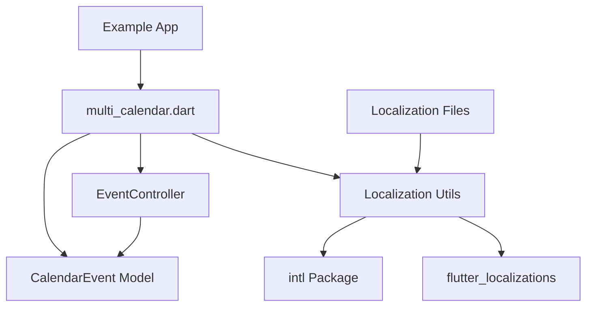

# Design Document

## Overview

This design document specifies the technical implementation for the foundation and scaffolding of the Multi Calendar Flutter package. The foundation establishes the core structure, basic models, controller skeleton, localization infrastructure, and example application that will serve as the base for all future calendar features.

The foundation includes:
- Package configuration with proper dependencies
- Complete directory structure following Flutter package conventions
- CalendarEvent data model with all required fields
- EventController skeleton with placeholder methods
- Main export file establishing the public API boundary
- Localization scaffolding supporting English and Mexican Spanish
- Working example application demonstrating package usage

This foundation is intentionally minimal - it provides structure and basic functionality without implementing complex calendar rendering, RRULE parsing, or advanced features that will be added in subsequent specifications.

## Steering Document Alignment

### Technical Standards (tech.md)

The design follows documented technical patterns:

- **Widget-based Architecture**: Uses Flutter's widget tree with controller pattern for state management
- **Dart 3.10.4+**: All code follows Dart 3.10.4+ language features and conventions
- **Package Dependencies**: Uses `intl` package (`^0.19.0`) and `flutter_localizations` SDK for localization
- **Code Quality**: Follows `flutter_lints` (`^6.0.0`) standards and `analysis_options.yaml` configuration
- **Event Time Model**: Uses start DateTime and end DateTime (no Duration field) as per technical decision
- **Mobile-First**: Code structure optimized for mobile while maintaining desktop compatibility

### Project Structure (structure.md)

The implementation follows project organization conventions:

- **Directory Structure**: Matches the structure steering document exactly:
  - `lib/src/models/` for data models
  - `lib/src/controllers/` for event controller
  - `lib/src/utils/` for utility functions
  - `lib/src/widgets/` for shared widgets (placeholder widget location)
  - `lib/l10n/` for localization files
  - `test/` mirrors `lib/src/` structure
- **Naming Conventions**: 
  - Files: `snake_case.dart` (e.g., `calendar_event.dart`, `event_controller.dart`)
  - Classes: `PascalCase` (e.g., `CalendarEvent`, `EventController`)
  - Methods: `camelCase` (e.g., `loadEvents`, `getLocalizedString`)
- **Import Patterns**: Uses `package:multi_calendar/...` for internal imports
- **Code Organization**: Single responsibility principle - each file has one clear purpose

## Code Reuse Analysis

### Existing Components to Leverage

- **Flutter SDK**: Leverages Flutter's built-in widgets, `ChangeNotifier`, `DateTime`, and localization support
- **intl Package**: Uses `intl` for date/time formatting and localization utilities
- **flutter_localizations**: Uses Flutter's built-in localization framework for ARB file support
- **Existing pubspec.yaml**: Extends the existing `pubspec.yaml` with required dependencies
- **Existing lib/multi_calendar.dart**: Extends the existing export file with new exports

### Integration Points

- **Flutter Package System**: Integrates with Flutter's pub package manager for dependency resolution
- **Flutter Localization**: Integrates with Flutter's `flutter_localizations` for ARB file processing
- **Example App**: Example app integrates with the package via path dependency

## Architecture

The foundation uses a simple, modular architecture:

### Modular Design Principles

- **Single File Responsibility**: Each file handles one specific concern:
  - `calendar_event.dart` - only event data model
  - `event_controller.dart` - only controller logic (skeleton)
  - `localization.dart` - only localization utilities
  - `multi_calendar.dart` - only public API exports
- **Component Isolation**: Models, controllers, and utilities are isolated and can be tested independently
- **Service Layer Separation**: Clear separation between data models (CalendarEvent), state management (EventController), and utilities (localization)
- **Utility Modularity**: Localization utilities are in a focused, single-purpose module



## Components and Interfaces

### Component 1: CalendarEvent Model

- **Purpose:** Represents a calendar event with all required fields for basic event data
- **Location:** `lib/src/models/calendar_event.dart`
- **Interfaces:** 
  - Public class `CalendarEvent` with properties:
    - `id` (String) - unique identifier
    - `title` (String) - event title
    - `start` (DateTime) - start date and time
    - `end` (DateTime) - end date and time
    - `comment` (String?) - optional comments
    - `externalId` (String?) - optional external data store link
    - `occurrenceId` (String?) - optional recurring event occurrence identifier
  - Constructor(s) for creating instances
  - `toString()` override for debugging
  - `==` and `hashCode` overrides for equality
- **Dependencies:** Dart SDK (`DateTime`)
- **Reuses:** Dart's built-in `DateTime` class

### Component 2: EventController

- **Purpose:** Skeleton controller class that will manage calendar events and view state
- **Location:** `lib/src/controllers/event_controller.dart`
- **Interfaces:**
  - Public class `EventController` extending `ChangeNotifier`
  - Placeholder methods:
    - `loadEvents(DateTime start, DateTime end)` - signature only, returns `Future<List<CalendarEvent>>`
    - `getVisibleDateRange()` - signature only, returns `DateTimeRange?`
    - `setVisibleDateRange(DateTimeRange range)` - signature only
  - Basic constructor
- **Dependencies:** Flutter SDK (`ChangeNotifier`), CalendarEvent model
- **Reuses:** Flutter's `ChangeNotifier` pattern for reactive state management

### Component 3: Localization Utility

- **Purpose:** Provides localization utilities for calendar strings and date formatting
- **Location:** `lib/src/utils/localization.dart`
- **Interfaces:**
  - Public class `CalendarLocalizations` (or similar name)
  - Methods:
    - `getLocalizedString(String key, Locale locale)` - gets localized string
    - `formatDate(DateTime date, Locale locale)` - formats date according to locale
    - `formatTime(DateTime time, Locale locale)` - formats time according to locale
    - `isRTL(Locale locale)` - detects RTL languages (for future use)
    - `getSupportedLocales()` - returns list of supported locales
  - Default locale fallback (English)
- **Dependencies:** `intl` package, `flutter_localizations` SDK
- **Reuses:** `intl` package's `DateFormat` and localization utilities

### Component 4: Main Export File

- **Purpose:** Establishes the public API boundary for the package
- **Location:** `lib/multi_calendar.dart`
- **Interfaces:**
  - Exports public APIs:
    - `export 'src/models/calendar_event.dart';`
    - `export 'src/controllers/event_controller.dart';`
    - Future exports (commented or documented):
      - View widgets (when implemented)
      - Style/theme classes (when implemented)
  - Package-level dartdoc comments
- **Dependencies:** All internal components
- **Reuses:** Existing export file structure

### Component 5: Localization Files

- **Purpose:** Store translated strings for English and Mexican Spanish
- **Location:** `lib/l10n/` directory
- **Interfaces:**
  - ARB files (Flutter standard):
    - `app_en.arb` - English translations
    - `app_es_MX.arb` - Mexican Spanish translations
  - Strings included:
    - Day names (Sunday-Saturday / Domingo-Sábado)
    - Month names (January-December / Enero-Diciembre)
    - Common terms (Today, Week, Month, Day, etc.)
- **Dependencies:** Flutter's ARB file processing
- **Reuses:** Flutter's `flutter_localizations` ARB format

### Component 6: Example Application

- **Purpose:** Demonstrates package usage and integration
- **Location:** `example/lib/main.dart`
- **Interfaces:**
  - Flutter Material app
  - Demonstrates:
    - Importing `package:multi_calendar/multi_calendar.dart`
    - Creating `EventController` instance
    - Creating `CalendarEvent` instances
    - Using localization utilities
    - Language switching (English/Spanish)
- **Dependencies:** `multi_calendar` package (path dependency), Flutter SDK
- **Reuses:** Standard Flutter app structure

### Component 7: Placeholder Widget (Optional)

- **Purpose:** Simple widget to verify package structure works end-to-end
- **Location:** `lib/src/widgets/placeholder_widget.dart` (or similar)
- **Interfaces:**
  - Public widget class displaying simple text
  - Uses CalendarEvent and EventController to demonstrate integration
- **Dependencies:** CalendarEvent, EventController, Flutter widgets
- **Reuses:** Standard Flutter widget pattern

## Data Models

### CalendarEvent

```dart
class CalendarEvent {
  final String id;
  final String title;
  final DateTime start;
  final DateTime end;
  final String? comment;
  final String? externalId;
  final String? occurrenceId;

  const CalendarEvent({
    required this.id,
    required this.title,
    required this.start,
    required this.end,
    this.comment,
    this.externalId,
    this.occurrenceId,
  });

  // toString, ==, hashCode overrides
  // Optional: toJson/fromJson for serialization (basic structure)
}
```

**Design Decisions:**
- All fields except optional ones are required (non-nullable) for data integrity
- Uses `DateTime` for both start and end (no Duration field) per technical decision
- Optional fields use nullable types (`String?`) to allow null values
- Immutable class (final fields, const constructor) for thread safety and predictability
- Basic serialization structure ready for future JSON serialization

### EventController (Skeleton)

```dart
class EventController extends ChangeNotifier {
  DateTimeRange? _visibleDateRange;
  
  EventController();
  
  // Placeholder methods - signatures only
  Future<List<CalendarEvent>> loadEvents(
    DateTime start,
    DateTime end,
  ) async {
    // TODO: Implement in future spec
    throw UnimplementedError('loadEvents not yet implemented');
  }
  
  DateTimeRange? getVisibleDateRange() => _visibleDateRange;
  
  void setVisibleDateRange(DateTimeRange range) {
    // TODO: Implement in future spec
    throw UnimplementedError('setVisibleDateRange not yet implemented');
  }
}
```

**Design Decisions:**
- Extends `ChangeNotifier` for reactive state management (standard Flutter pattern)
- Methods throw `UnimplementedError` to clearly indicate they're placeholders
- Private `_visibleDateRange` field for future implementation
- Returns `Future<List<CalendarEvent>>` for async event loading pattern

## Error Handling

### Error Scenarios

1. **Missing Localization String**
   - **Scenario:** Requested localization key doesn't exist in current locale
   - **Handling:** Fall back to English, then to key name if English also missing
   - **User Impact:** User sees English text or key name (graceful degradation)

2. **Unsupported Locale**
   - **Scenario:** App requests locale not supported (e.g., French)
   - **Handling:** Default to English locale
   - **User Impact:** User sees English calendar text

3. **Invalid Date Range**
   - **Scenario:** End date before start date in CalendarEvent
   - **Handling:** Validation in CalendarEvent constructor or setter (if added)
   - **User Impact:** Error thrown during event creation (fail-fast)

4. **Missing Dependencies**
   - **Scenario:** `flutter pub get` fails due to dependency conflicts
   - **Handling:** Documented in README, version constraints in pubspec.yaml
   - **User Impact:** Package won't compile, clear error messages from pub

5. **Unimplemented Methods**
   - **Scenario:** Calling placeholder methods in EventController
   - **Handling:** Methods throw `UnimplementedError` with clear message
   - **User Impact:** Runtime error with clear message indicating feature not yet implemented

## Testing Strategy

### Unit Testing

- **Approach:** Test each component in isolation
- **Key Components to Test:**
  - **CalendarEvent:**
    - Constructor with all fields
    - Constructor with optional fields (null and non-null)
    - Equality comparison (`==` operator)
    - `hashCode` consistency
    - `toString()` output
    - Validation (end after start, if implemented)
  - **EventController:**
    - Constructor creates instance
    - Placeholder methods throw `UnimplementedError`
    - `ChangeNotifier` integration (notifyListeners works)
  - **Localization Utility:**
    - Get localized string for English
    - Get localized string for Spanish
    - Fallback to English for unsupported locale
    - Date formatting for different locales
    - RTL detection (returns correct value)
    - Missing key handling

### Integration Testing

- **Approach:** Test components working together
- **Key Flows to Test:**
  - Creating CalendarEvent and using in EventController context
  - Localization utility with actual ARB files
  - Example app imports and uses package successfully
  - Export file exports all public APIs correctly

### End-to-End Testing

- **Approach:** Test complete example application
- **User Scenarios to Test:**
  - Example app launches without errors
  - Example app displays placeholder content
  - Language switching works in example app
  - Package can be imported and used in external app

## Implementation Notes

### Package Configuration

- Update `pubspec.yaml` to include:
  - `intl: ^0.19.0` in dependencies
  - `flutter_localizations` in dependencies (SDK)
  - `flutter` section with `generate: true` for ARB file processing (if using code generation)

### Directory Creation

- Create all required directories:
  - `lib/src/models/`
  - `lib/src/controllers/`
  - `lib/src/utils/`
  - `lib/src/widgets/` (for placeholder widget)
  - `lib/l10n/`
  - `test/models/`
  - `test/controllers/`
  - `test/utils/`

### Localization Setup

- Use ARB files (Application Resource Bundle) - Flutter's standard format
- ARB files should include:
  - `@@locale` metadata
  - String entries with keys and values
  - Optional: `@key` metadata for context
- Consider using `flutter gen-l10n` for code generation (optional but recommended)

### Example App Configuration

- `example/pubspec.yaml` should:
  - Include `multi_calendar` path dependency
  - Include `flutter_localizations` SDK dependency
  - Include `intl` package dependency
  - Configure localization delegates

### Code Style

- Follow Dart style guide
- Use `dart format` for consistent formatting
- Follow `flutter_lints` rules
- Add dartdoc comments to all public APIs
- Use `const` constructors where possible for performance
