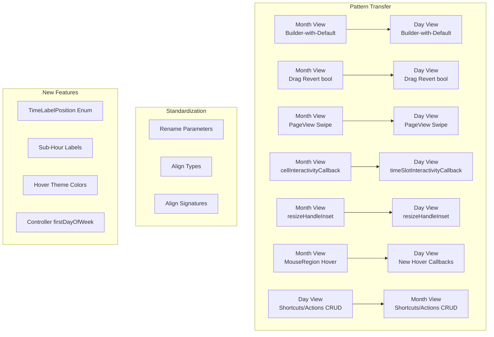

# Design Document: Month/Day View API Alignment

## Overview

This design aligns the public APIs of `MCalDayView` and `MCalMonthView` by applying existing implementation patterns from each view to the other. The Month View already has patterns for builder-with-default, hover callbacks, swipe navigation, drag revert, cell interactivity, and resize handle insets — these patterns are applied to the Day View. The Day View already has keyboard CRUD via Shortcuts/Actions — this pattern is applied to the Month View. Naming, types, and signatures are standardized across both.

## Steering Document Alignment

### Technical Standards (tech.md)
- **Widget-based Architecture**: All changes follow the existing controller + widget + builder pattern
- **Builder Pattern**: Day View adopts the Month View's builder-with-default pattern (third `Widget` parameter)
- **Delegation Pattern**: New callbacks (keyboard CRUD, swipe, interactivity) delegate to consuming apps
- **Accessibility**: Keyboard CRUD in Month View improves keyboard-only accessibility
- **Localization**: New semantic labels for hover targets and swipe use `MCalLocalizations.of(context)`

### Project Structure (structure.md)
- New context/details classes go in existing `mcal_callback_details.dart` and `mcal_day_view_contexts.dart`
- New enums go in `mcal_day_view_contexts.dart` (TimeLabelPosition) or `mcal_month_week_layout_contexts.dart` (reuse DateLabelPosition)
- New Intent classes go at the top of `mcal_month_view.dart` (following Day View's pattern in `mcal_day_view.dart`)
- Theme additions go in `mcal_day_theme_data.dart`
- Controller changes go in `mcal_event_controller.dart`

## Code Reuse Analysis

### Existing Components to Leverage

- **Month View `dayCellBuilder` pattern**: The exact builder-with-default implementation (build default → pass to builder as third arg) is replicated in Day View for all builders
- **Month View `onEventDropped` revert pattern**: The "update first, revert if false" pattern for non-recurring events and "apply only if true" for recurring events is replicated in Day View
- **Month View `PageView.builder` swipe**: The same PageView approach with RTL reversal and direction configuration is replicated in Day View
- **Month View `cellInteractivityCallback`**: The same check-before-tap and opacity pattern is replicated as `timeSlotInteractivityCallback` in Day View
- **Month View `resizeHandleInset`**: The same `Positioned` inset logic is replicated in Day View resize handles
- **Month View `MouseRegion` hover pattern**: The same onEnter/onExit with context creation is replicated for new Day View hover callbacks, updated to include `BuildContext`
- **Day View `Shortcuts`/`Actions` pattern**: The exact Intent class + shortcut map + action map pattern is replicated in Month View for keyboard CRUD
- **`MCalEventDroppedDetails` / `MCalEventResizedDetails`**: Reused directly — no changes needed to these classes
- **`MCalCellInteractivityDetails`**: Used as reference for new `MCalTimeSlotInteractivityDetails`

### Integration Points

- **`MCalEventController`**: Gains `firstDayOfWeek` property; both views read from controller
- **`mcal_callback_details.dart`**: New details classes added here
- **`mcal_day_view_contexts.dart`**: New context class for time slot interactivity
- **`mcal_day_theme_data.dart`**: New theme properties for hover colors and time label position
- **`multi_calendar.dart`**: New exports for Intent classes and enums

## Architecture

The changes follow a "pattern transfer" approach — mature patterns from one view are applied to the other with minimal adaptation.



### Modular Design Principles

- **Single File Responsibility**: Each context/details class serves one callback type
- **Component Isolation**: Changes to Day View don't require changes to Month View's internal implementation (except shared types)
- **Utility Modularity**: Shared enums and details classes are in shared files (`mcal_callback_details.dart`)

## Components and Interfaces

### Component 1: Month View Keyboard CRUD (REQ-1)

- **Purpose**: Add keyboard-based event CRUD to Month View matching Day View's pattern
- **Files Modified**: `lib/src/widgets/mcal_month_view.dart`, `lib/multi_calendar.dart`
- **Reuses**: Day View's Intent/Shortcuts/Actions architecture

**New Intent Classes** (top of `mcal_month_view.dart`):
```dart
class MCalMonthViewCreateEventIntent extends Intent {
  const MCalMonthViewCreateEventIntent();
}
class MCalMonthViewDeleteEventIntent extends Intent {
  const MCalMonthViewDeleteEventIntent();
}
class MCalMonthViewEditEventIntent extends Intent {
  const MCalMonthViewEditEventIntent();
}
```

**New Widget Parameters**:
```dart
// On MCalMonthView constructor:
final Map<ShortcutActivator, Intent>? keyboardShortcuts;
final VoidCallback? onCreateEventRequested;
final void Function(MCalCalendarEvent event)? onDeleteEventRequested;
final void Function(MCalCalendarEvent event)? onEditEventRequested;
```

**Implementation Pattern** (matching Day View lines 3807-3810):
```dart
// In _MCalMonthViewState.build():
final shortcutsContent = Shortcuts(
  shortcuts: _buildShortcutsMap(),
  child: Actions(actions: _buildActionsMap(), child: focusContent),
);

Map<ShortcutActivator, Intent> _buildShortcutsMap() {
  final defaults = <ShortcutActivator, Intent>{
    const SingleActivator(LogicalKeyboardKey.keyN, meta: true):
        const MCalMonthViewCreateEventIntent(),
    const SingleActivator(LogicalKeyboardKey.keyN, control: true):
        const MCalMonthViewCreateEventIntent(),
    const SingleActivator(LogicalKeyboardKey.keyD, meta: true):
        const MCalMonthViewDeleteEventIntent(),
    const SingleActivator(LogicalKeyboardKey.keyD, control: true):
        const MCalMonthViewDeleteEventIntent(),
    const SingleActivator(LogicalKeyboardKey.delete):
        const MCalMonthViewDeleteEventIntent(),
    const SingleActivator(LogicalKeyboardKey.backspace):
        const MCalMonthViewDeleteEventIntent(),
    const SingleActivator(LogicalKeyboardKey.keyE, meta: true):
        const MCalMonthViewEditEventIntent(),
    const SingleActivator(LogicalKeyboardKey.keyE, control: true):
        const MCalMonthViewEditEventIntent(),
  };
  if (widget.keyboardShortcuts != null) {
    defaults.addAll(widget.keyboardShortcuts!);
  }
  return defaults;
}

Map<Type, Action<Intent>> _buildActionsMap() {
  return {
    MCalMonthViewCreateEventIntent: CallbackAction<MCalMonthViewCreateEventIntent>(
      onInvoke: (_) { widget.onCreateEventRequested?.call(); return null; },
    ),
    MCalMonthViewDeleteEventIntent: CallbackAction<MCalMonthViewDeleteEventIntent>(
      onInvoke: (_) {
        final event = _focusedEvent; // existing Month View concept
        if (event != null) widget.onDeleteEventRequested?.call(event);
        return null;
      },
    ),
    MCalMonthViewEditEventIntent: CallbackAction<MCalMonthViewEditEventIntent>(
      onInvoke: (_) {
        final event = _focusedEvent;
        if (event != null) widget.onEditEventRequested?.call(event);
        return null;
      },
    ),
  };
}
```

**`_focusedEvent` access**: Month View already has `_keyboardSelectedEventIndex` and event selection mode. The focused event is derived from the events list for the focused cell at the selected index.

### Component 2: Drag/Resize Callback Alignment (REQ-2, REQ-9)

- **Purpose**: Change Day View `onEventDropped`/`onEventResized` to return `bool`; add `resizeHandleInset`
- **Files Modified**: `lib/src/widgets/mcal_day_view.dart`
- **Reuses**: Month View's revert pattern (lines 2446-2471, 4382-4401)

**Changed Signatures**:
```dart
// Before:
final void Function(MCalEventDroppedDetails details)? onEventDropped;
final void Function(MCalEventResizedDetails details)? onEventResized;

// After (matching Month View):
final bool Function(BuildContext, MCalEventDroppedDetails)? onEventDropped;
final bool Function(BuildContext, MCalEventResizedDetails)? onEventResized;
```

**Revert Implementation** (applied to Day View's existing drop handler ~line 2928):
```dart
// Non-recurring: update first, revert if false
widget.controller.addEvents([updatedEvent]);
if (widget.onEventDropped != null) {
  final shouldKeep = widget.onEventDropped!(context, dropDetails);
  if (!shouldKeep) {
    final reverted = event.copyWith(start: oldStart, end: oldEnd);
    widget.controller.addEvents([reverted]);
  }
}

// Recurring: only apply exception if true
if (widget.onEventDropped != null) {
  final shouldKeep = widget.onEventDropped!(context, dropDetails);
  if (shouldKeep) {
    widget.controller.addException(seriesId, exception);
  }
} else {
  widget.controller.addException(seriesId, exception);
}
```

**New Parameter for Resize Handle Inset**:
```dart
final double Function(MCalTimedEventTileContext, MCalResizeEdge)? resizeHandleInset;
```

Applied in `_ResizeHandle` positioning using the same `Positioned` pattern as Month View (lines 7259-7265).

### Component 3: Complete Handler Coverage (REQ-3, REQ-4, REQ-5)

- **Purpose**: Add missing tap/long-press/double-tap/hover handlers to both views; add `BuildContext` to all hover callbacks
- **Files Modified**: `lib/src/widgets/mcal_day_view.dart`, `lib/src/widgets/mcal_month_view.dart`

**New Day View Parameters**:
```dart
// Double-tap handlers (new):
final void Function(BuildContext, MCalDayHeaderContext)? onDayHeaderDoubleTap;
final void Function(BuildContext, MCalTimeLabelContext)? onTimeLabelLongPress;
final void Function(BuildContext, MCalTimeLabelContext)? onTimeLabelDoubleTap;
final void Function(BuildContext, DateTime)? onTimeSlotDoubleTap;
final void Function(BuildContext, MCalEventTapDetails)? onEventDoubleTap;
final void Function(BuildContext, MCalOverflowTapDetails)? onOverflowDoubleTap;

// Hover handlers (new, all with BuildContext):
final void Function(BuildContext, MCalDayHeaderContext?)? onHoverDayHeader;
final void Function(BuildContext, MCalTimeLabelContext?)? onHoverTimeLabel;
final void Function(BuildContext, MCalOverflowTapDetails?)? onHoverOverflow;
final void Function(BuildContext, MCalTimeSlotContext?)? onHoverEmptySpace;

// Existing hover handlers (signature change — add BuildContext):
final void Function(BuildContext, MCalCalendarEvent?)? onHoverEvent;       // was: void Function(MCalCalendarEvent)?
final void Function(BuildContext, MCalTimeSlotContext?)? onHoverTimeSlot;   // was: void Function(MCalTimeSlotContext)?
```

**New Month View Parameters**:
```dart
// Double-tap handlers (new):
final void Function(BuildContext, MCalDateLabelTapDetails)? onDateLabelDoubleTap;
final void Function(BuildContext, MCalOverflowTapDetails)? onOverflowDoubleTap;

// Hover handlers (new, with BuildContext):
final void Function(BuildContext, MCalDateLabelContext?)? onHoverDateLabel;
final void Function(BuildContext, MCalOverflowTapDetails?)? onHoverOverflow;

// Existing hover handlers (signature change — add BuildContext):
final void Function(BuildContext, MCalDayCellContext?)? onHoverCell;        // was: ValueChanged<MCalDayCellContext?>?
final void Function(BuildContext, MCalEventTileContext?)? onHoverEvent;     // was: ValueChanged<MCalEventTileContext?>?
```

**Hover Implementation Pattern** (updated from Month View ~line 6373):
```dart
// Before (Month View current):
if (widget.onHoverCell != null) {
  result = MouseRegion(
    onEnter: (_) { widget.onHoverCell!(contextObj); },
    onExit: (_) => widget.onHoverCell!(null),
    child: result,
  );
}

// After (add BuildContext — context is available from build method):
if (widget.onHoverCell != null) {
  result = MouseRegion(
    onEnter: (_) { widget.onHoverCell!(context, contextObj); },
    onExit: (_) => widget.onHoverCell!(context, null),
    child: result,
  );
}
```

**Double-Tap Implementation Pattern** (added alongside existing tap/long-press GestureDetector):
```dart
// For Day View day header — add to existing _DayHeader widget:
GestureDetector(
  onTap: () => widget.onDayHeaderTap?.call(context, headerContext),
  onLongPress: () => widget.onDayHeaderLongPress?.call(context, headerContext),
  onDoubleTap: () => widget.onDayHeaderDoubleTap?.call(context, headerContext),
  child: /* existing header content */,
);
```

**Note on `onTimeSlotDoubleTap` vs `onEmptySpaceDoubleTap`**: `onEmptySpaceDoubleTap` is renamed to `onTimeSlotDoubleTap` for consistency with `onTimeSlotTap`/`onTimeSlotLongPress`. The existing behavior (fires on empty time slot area, not on event tiles) is preserved.

### Component 4: Day View Swipe Navigation (REQ-6)

- **Purpose**: Add PageView-based swipe navigation to Day View matching Month View's pattern
- **Files Modified**: `lib/src/widgets/mcal_day_view.dart`
- **Reuses**: Month View's PageView.builder implementation (lines 1475-1495)

**New Parameters**:
```dart
final bool enableSwipeNavigation; // default: false
final MCalSwipeNavigationDirection? swipeNavigationDirection; // reuse existing enum
final void Function(BuildContext, MCalSwipeNavigationDetails)? onSwipeNavigation;
```

**Implementation**: When `enableSwipeNavigation` is true, the Day View wraps its content in a `PageView.builder` (matching Month View lines 1475-1495):
```dart
if (widget.enableSwipeNavigation) {
  body = PageView.builder(
    controller: _swipePageController,
    physics: const ClampingScrollPhysics(),
    onPageChanged: _onSwipePageChanged,
    scrollDirection: widget.swipeNavigationDirection == MCalSwipeNavigationDirection.vertical
        ? Axis.vertical : Axis.horizontal,
    reverse: isRTL && widget.swipeNavigationDirection == MCalSwipeNavigationDirection.horizontal,
    itemBuilder: (context, pageIndex) {
      final dayDate = _pageIndexToDay(pageIndex);
      return _buildDayContent(context, dayDate, hourHeight);
    },
  );
}
```

A page controller maps page indices to dates. When the page changes, `onDisplayDateChanged` fires (via `controller.setDisplayDate`), and `onSwipeNavigation` fires with direction details.

**Interaction with vertical scroll**: The Day View's existing vertical scroll (for hours) uses `SingleChildScrollView`. When swipe is horizontal, they don't conflict. When swipe is vertical, the swipe `PageView` is configured as `Axis.vertical` and must coexist with the hours scroll — this requires wrapping the hours scroll in the PageView page, so vertical swipe detects at the page level while internal scroll handles time navigation. The implementation uses a `NotificationListener<ScrollNotification>` to prevent swipe interference when the user is scrolling the time grid.

### Component 5: Day View Interactivity & Builders (REQ-7, REQ-8)

- **Purpose**: Add `timeSlotInteractivityCallback` and builder-with-default pattern
- **Files Modified**: `lib/src/widgets/mcal_day_view.dart`, `lib/src/widgets/mcal_day_view_contexts.dart`, `lib/src/widgets/mcal_callback_details.dart`

**New Details Class** (in `mcal_callback_details.dart`):
```dart
class MCalTimeSlotInteractivityDetails {
  final DateTime date;
  final int hour;
  final int minute;
  final DateTime startTime;
  final DateTime endTime;

  const MCalTimeSlotInteractivityDetails({
    required this.date,
    required this.hour,
    required this.minute,
    required this.startTime,
    required this.endTime,
  });
}
```

**New Parameter**:
```dart
final bool Function(BuildContext, MCalTimeSlotInteractivityDetails)? timeSlotInteractivityCallback;
```

**Interactivity Check** (matching Month View ~line 6191):
```dart
final isInteractive = widget.timeSlotInteractivityCallback != null
    ? widget.timeSlotInteractivityCallback!(context, MCalTimeSlotInteractivityDetails(
        date: _displayDate,
        hour: hour,
        minute: minute,
        startTime: slotStart,
        endTime: slotEnd,
      ))
    : true;
```

Non-interactive time slots: tap/long-press/double-tap handlers do not fire; drag-and-drop rejects drops (via `onDragWillAccept`); visual opacity reduced to 0.5.

**Builder-with-Default Refactor**: All Day View builders change signature to include the default widget. Example for `timedEventTileBuilder`:

```dart
// Before (current Day View):
final Widget Function(BuildContext, MCalCalendarEvent, MCalTimedEventTileContext)? timedEventTileBuilder;

// After (matching Month View pattern):
final Widget Function(BuildContext, MCalCalendarEvent, MCalTimedEventTileContext, Widget defaultWidget)? timedEventTileBuilder;
```

**Implementation change** (refactoring Day View ~lines 5767-5828):
```dart
// Build the default tile first (always)
final defaultTile = _buildDefaultTimedEventTile(context, event, tileContext);

// Use builder if provided, otherwise use default
final tile = timedEventTileBuilder != null
    ? timedEventTileBuilder!(context, event, tileContext, defaultTile)
    : defaultTile;
```

This is extracted from the current inline default tile construction into a private `_buildDefaultTimedEventTile` method. The same pattern applies to all builders:

| Builder | Default Method |
|---------|---------------|
| `dayHeaderBuilder` | `_buildDefaultDayHeader()` |
| `timeLabelBuilder` | `_buildDefaultTimeLabel()` |
| `gridlineBuilder` | `_buildDefaultGridline()` |
| `allDayEventTileBuilder` | `_buildDefaultAllDayEventTile()` |
| `timedEventTileBuilder` | `_buildDefaultTimedEventTile()` |
| `currentTimeIndicatorBuilder` | `_buildDefaultCurrentTimeIndicator()` |
| `navigatorBuilder` | `_buildDefaultNavigator()` |
| `timeRegionBuilder` | `_buildDefaultTimeRegion()` |
| `draggedTileBuilder` | `_buildDefaultDraggedTile()` |
| `dragSourceTileBuilder` | `_buildDefaultDragSourceTile()` |
| `dropTargetTileBuilder` | `_buildDefaultDropTargetTile()` |
| `dropTargetOverlayBuilder` | `_buildDefaultDropTargetOverlay()` |
| `timeResizeHandleBuilder` | `_buildDefaultResizeHandle()` |
| `loadingBuilder` | `_buildDefaultLoading()` |
| `errorBuilder` | `_buildDefaultError()` |

### Component 6: API Naming & Navigation Cleanup (REQ-10, REQ-11, REQ-12, REQ-13)

- **Purpose**: Rename parameters, remove per-button nav callbacks, move `firstDayOfWeek` to controller
- **Files Modified**: `lib/src/widgets/mcal_day_view.dart`, `lib/src/widgets/mcal_month_view.dart`, `lib/src/controllers/mcal_event_controller.dart`, `lib/multi_calendar.dart`

**Parameter Renames in Day View**:
| Old Name | New Name |
|----------|----------|
| `showWeekNumber` | `showWeekNumbers` |
| `showDropTargetPreview` | `showDropTargetTiles` |
| `onEmptySpaceDoubleTap` | `onTimeSlotDoubleTap` (Component 3) |

**Type Change in Month View**:
```dart
// Before:
final String? dateFormat;

// After:
final DateFormat? dateFormat;  // import 'package:intl/intl.dart';
```

The existing usage sites that format with `dateFormat` must be updated from `DateFormat(widget.dateFormat)` to directly using `widget.dateFormat`.

**Removed Parameters from Day View**:
```dart
// REMOVED:
final VoidCallback? onNavigatePrevious;
final VoidCallback? onNavigateNext;
final VoidCallback? onNavigateToday;
```

**Navigation Refactor**: `_handleNavigatePrevious`, `_handleNavigateNext`, `_handleNavigateToday` become simple methods that always auto-navigate (no callback check):
```dart
void _handleNavigatePrevious() {
  final previousDay = DateTime(_displayDate.year, _displayDate.month, _displayDate.day - 1);
  widget.controller.setDisplayDate(previousDay);
  // onDisplayDateChanged fires via _onControllerChanged
}
```

Drag edge navigation (lines 2631-2646) continues to call these methods — behavior unchanged.

**New Week Number Builder** for Day View:
```dart
final Widget Function(BuildContext, MCalWeekNumberContext, Widget)? weekNumberBuilder;
```

Uses the existing `MCalWeekNumberContext` from `mcal_month_view_contexts.dart` (reuse). The default widget is the existing week number badge. When builder is provided and `showWeekNumbers` is true, the builder result replaces the default.

**Controller firstDayOfWeek**:
```dart
// In MCalEventController:
MCalEventController({DateTime? initialDate, this.firstDayOfWeek});

final int? firstDayOfWeek; // 0=Sunday..6=Saturday, null=system default

// Add getter for resolved value:
int get resolvedFirstDayOfWeek => firstDayOfWeek ?? DateTime.monday; // platform default
```

Month View removes `firstDayOfWeek` from its constructor and reads `widget.controller.firstDayOfWeek` (or `widget.controller.resolvedFirstDayOfWeek`) wherever it currently uses `widget.firstDayOfWeek`.

Day View reads from the controller for week number calculations.

Note: This is separate from `MCalRecurrenceRule.weekStart` which is per-rule for RRULE expansion. The controller's `firstDayOfWeek` controls visual layout (which day starts the week in grid/header), while `weekStart` in recurrence rules controls RRULE expansion per RFC 5545.

### Component 7: Day View Theme & Time Labels (REQ-14, REQ-15, REQ-16)

- **Purpose**: Add time label positioning, sub-hour labels, and hover theme colors
- **Files Modified**: `lib/src/styles/mcal_day_theme_data.dart`, `lib/src/widgets/mcal_day_view.dart`, `lib/src/widgets/mcal_day_view_contexts.dart`

**New Enum** (in `mcal_day_view_contexts.dart`):
```dart
/// Position of time labels relative to the hour gridline.
///
/// "Leading" = left in LTR, right in RTL (automatically handled by Flutter).
/// "Trailing" = right in LTR, left in RTL.
/// "Top" = the gridline at the start of the hour.
/// "Bottom" = the gridline at the end of the hour.
enum MCalTimeLabelPosition {
  /// Leading-aligned, bottom of label aligns with top gridline.
  topLeadingAbove,
  /// Leading-aligned, vertically centered with top gridline.
  topLeadingCentered,
  /// Leading-aligned, top of label aligns with top gridline.
  topLeadingBelow,
  /// Trailing-aligned, bottom of label aligns with top gridline.
  topTrailingAbove,
  /// Trailing-aligned, vertically centered with top gridline.
  topTrailingCentered,
  /// Trailing-aligned, top of label aligns with top gridline.
  topTrailingBelow,
  /// Leading-aligned, bottom of label aligns with bottom gridline.
  bottomLeadingAbove,
  /// Trailing-aligned, bottom of label aligns with bottom gridline.
  bottomTrailingAbove,
}
```

**New Theme Properties** (in `MCalDayThemeData`):
```dart
final MCalTimeLabelPosition? timeLabelPosition;          // default: topTrailingBelow
final Color? hoverTimeSlotBackgroundColor;
final Color? hoverEventBackgroundColor;
```

**Time Label Positioning Implementation**: The time legend currently uses `Positioned` widgets for each label. The position enum controls:
- **Horizontal alignment**: `CrossAxisAlignment.start` (leading) or `CrossAxisAlignment.end` (trailing) — Flutter automatically handles RTL via `Directionality`
- **Vertical alignment relative to gridline**:
  - `Above`: `bottom` of label box = gridline Y position → `top: gridlineY - labelHeight`
  - `Centered`: center of label = gridline Y → `top: gridlineY - labelHeight / 2`
  - `Below`: `top` of label = gridline Y → `top: gridlineY`
- **Reference gridline**: `top*` uses the hour's start gridline, `bottom*` uses the hour's end gridline (= next hour's start)

**Sub-Hour Time Labels** — new widget parameters:
```dart
final bool showSubHourLabels;           // default: false
final Duration? subHourLabelInterval;   // e.g., Duration(minutes: 15)
final Widget Function(BuildContext, MCalTimeLabelContext, Widget)? subHourLabelBuilder;
```

When `showSubHourLabels` is true and `subHourLabelInterval` is set, the time legend generates additional labels between hour marks. Sub-hour labels reuse `MCalTimeLabelContext` (the `minute` field distinguishes them from hour labels). The default sub-hour label uses a smaller, lighter text style. The builder receives the default widget. Sub-hour labels follow the same `timeLabelPosition` as hour labels.

**Hover Color Implementation**: When hover colors are set in the theme, `MouseRegion` wrappers apply background color changes on enter/exit via local state. The `_TimeSlotWidget` checks `theme.hoverTimeSlotBackgroundColor` and wraps in `MouseRegion` only when non-null (no performance impact when unused). Same pattern for event tiles with `hoverEventBackgroundColor`.

### Component 8: Example App Updates (REQ-17)

- **Purpose**: Update example app to showcase all new features
- **Files Modified**: Multiple files in `example/lib/`

**Day View Features Tab** (`example/lib/views/day_view/tabs/day_features_tab.dart`):
- Add controls: `enableSwipeNavigation` toggle, `swipeNavigationDirection` dropdown, `showSubHourLabels` toggle, `subHourLabelInterval` dropdown, `timeSlotInteractivityCallback` toggle + time range config
- Wire all new handlers: `onEventDoubleTap`, `onDayHeaderDoubleTap`, `onTimeLabelLongPress`, `onTimeLabelDoubleTap`, `onTimeSlotDoubleTap`, `onOverflowDoubleTap`, `onHoverDayHeader`, `onHoverTimeLabel`, `onHoverOverflow`, `onHoverEmptySpace`
- Remove `onNavigatePrevious`, `onNavigateNext`, `onNavigateToday` usage
- Rename `showWeekNumber` → `showWeekNumbers`, `showDropTargetPreview` → `showDropTargetTiles`
- Update `onEventDropped`/`onEventResized` to return `bool`
- Rename `onEmptySpaceDoubleTap` → `onTimeSlotDoubleTap`

**Day View Theme Tab** (`example/lib/views/day_view/tabs/day_theme_tab.dart`):
- Add `timeLabelPosition` dropdown (8 options)
- Add `hoverTimeSlotBackgroundColor` color picker
- Add `hoverEventBackgroundColor` color picker

**Month View Features Tab** (`example/lib/views/month_view/tabs/month_features_tab.dart`):
- Wire new handlers: `onDateLabelDoubleTap`, `onOverflowDoubleTap`, `onHoverDateLabel`, `onHoverOverflow`
- Update hover callbacks to use new `BuildContext` signature
- Remove `firstDayOfWeek` from widget (now on controller)

**Month View Accessibility Tab** (`example/lib/views/month_view/tabs/month_accessibility_tab.dart`):
- Add keyboard CRUD showcase: `onCreateEventRequested`, `onDeleteEventRequested`, `onEditEventRequested`
- Update keyboard shortcuts documentation to include CRUD shortcuts

**All Style Widgets**: Update `onEventDropped`/`onEventResized` signatures in Day View styles to return `bool`.

**Main Screen / Controller Setup**: Set `firstDayOfWeek` on controller creation instead of on individual views.

**Localization**: Add ARB keys for new SnackBar messages (double-tap handlers, hover handlers, time slot interactivity). Add to all 5 language files.

## Data Models

### New Details/Context Classes

```dart
// In mcal_callback_details.dart:
class MCalTimeSlotInteractivityDetails {
  final DateTime date;
  final int hour;
  final int minute;
  final DateTime startTime;
  final DateTime endTime;
}
```

### Modified Classes

```dart
// MCalEventController — add firstDayOfWeek:
class MCalEventController extends ChangeNotifier {
  MCalEventController({DateTime? initialDate, this.firstDayOfWeek});
  final int? firstDayOfWeek;
  int get resolvedFirstDayOfWeek => firstDayOfWeek ?? DateTime.monday;
}
```

### New Enums

```dart
// In mcal_day_view_contexts.dart:
enum MCalTimeLabelPosition {
  topLeadingAbove, topLeadingCentered, topLeadingBelow,
  topTrailingAbove, topTrailingCentered, topTrailingBelow,
  bottomLeadingAbove, bottomTrailingAbove,
}
```

## Error Handling

### Error Scenarios

1. **`MCalLocalizations.of(context)` returns null in new hover/CRUD callbacks**
   - **Handling**: All new localized strings in announcements use `MCalLocalizations.of(context)` which is already validated by existing code
   - **User Impact**: None — existing error handling applies

2. **`timeSlotInteractivityCallback` returns false during active drag**
   - **Handling**: Matching Month View's approach — `onDragWillAccept` is the mechanism for rejecting drops, `timeSlotInteractivityCallback` controls tap/long-press only. This is documented in the parameter's dartdoc.
   - **User Impact**: Developers use `onDragWillAccept` for drag validation, `timeSlotInteractivityCallback` for tap interactivity

3. **Swipe navigation conflicts with vertical scroll**
   - **Handling**: When `swipeNavigationDirection` is horizontal, no conflict. When vertical, the PageView handles outer scroll while `SingleChildScrollView` handles inner time-grid scroll. `NotificationListener` prevents interference.
   - **User Impact**: Smooth swipe and scroll in both directions

4. **`onEventDropped` returns false after controller update (revert)**
   - **Handling**: Follows Month View's proven pattern — controller is updated first, then reverted if callback returns false. This ensures UI consistency.
   - **User Impact**: Event visually snaps back to original position

## Testing Strategy

### Unit Testing
- `MCalTimeLabelPosition` enum values cover all 8 positions
- `MCalTimeSlotInteractivityDetails` construction and field access
- Controller `firstDayOfWeek` getter returns correct resolved value

### Widget Testing
- **Keyboard CRUD** (Month View): Create test widget with `MCalMonthView`, enable keyboard nav, focus a cell with events, simulate Cmd+N/D/E, verify callbacks fire
- **Drag Revert** (Day View): Simulate drag-and-drop, return `false` from `onEventDropped`, verify event reverts to original position
- **Builder-with-Default**: Provide a builder that wraps default with `Container(color: Colors.red, child: defaultWidget)`, verify the default content is visible inside the red container
- **Hover + BuildContext**: Mount `MCalDayView` with `onHoverEvent`, simulate hover via `TestGesture`, verify callback receives non-null `BuildContext`
- **Swipe Navigation**: Mount `MCalDayView` with swipe enabled, simulate horizontal drag, verify `onDisplayDateChanged` fires with adjacent day
- **RTL Swipe**: Mount in `Directionality(textDirection: TextDirection.rtl)`, verify swipe directions reverse
- **Time Slot Interactivity**: Set callback to return `false` for hours 0-8, simulate tap at 7:00, verify no `onTimeSlotTap` fires
- **Time Label Position**: Mount with each of 8 positions, use `tester.getTopLeft()` to verify label alignment relative to gridline
- **Parameter Renames**: Verify `showWeekNumbers`, `showDropTargetTiles` work and old names don't compile
- **Month View dateFormat**: Pass `DateFormat('MMMM yyyy')`, verify it renders correctly
- **firstDayOfWeek on Controller**: Create controller with `firstDayOfWeek: DateTime.sunday`, mount Month View, verify Sunday is first column

### Integration Testing
- Full keyboard CRUD flow in Month View: navigate to cell → select event → edit → delete → create
- Full swipe navigation flow in Day View: swipe through multiple days, verify date changes and events update
- Cross-view consistency: Mount both views with same controller, verify `firstDayOfWeek` applies to both
