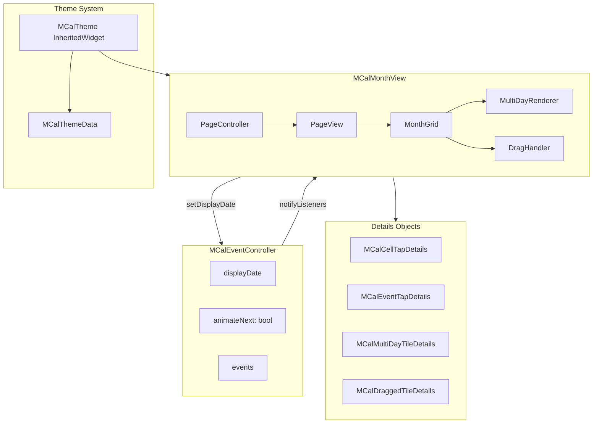

# Design Document

## Overview

This design document specifies the technical implementation for Month View Enhancements Part 2, including callback API standardization, PageView-style swipe navigation with simultaneous slide animations, contiguous multi-day event tiles, and drag-and-drop event moving.

The design focuses on maintainability, performance, and developer experience while building upon the existing MCalMonthView architecture.

## Steering Document Alignment

### Technical Standards (tech.md)

- **Widget Architecture**: Follows existing StatefulWidget pattern with controller integration
- **Performance**: Maintains 60fps with PageView-based animation and efficient drag handling
- **Dart Version**: Compatible with Dart 3.10.4+
- **Flutter Patterns**: Uses PageController, InheritedWidget for theme, LongPressDraggable/DragTarget for DnD
- **Mobile-First**: PageView swipe is the standard mobile calendar pattern

### Project Structure (structure.md)

- **File Organization**: New files follow existing naming conventions (`mcal_*.dart`)
- **Naming**: Classes use `MCal` prefix, details objects use `MCalXxxDetails` suffix
- **Code Size**: Complex features split into separate files (drag handler, multi-day renderer)
- **Testing**: Each component has corresponding unit and widget tests

## Code Reuse Analysis

### Existing Components to Leverage

- **MCalEventController**: Extend with `animate` parameter for `setDisplayDate()`
- **MCalMonthView**: Refactor internal structure to use PageView
- **MCalThemeData**: Keep as-is, add MCalTheme inherited widget wrapper
- **Context classes**: Migrate to details pattern (remove theme property)
- **date_utils.dart**: Reuse date calculation utilities
- **MCalLocalizations**: Reuse for accessibility announcements

### Integration Points

- **Controller-View Communication**: Views continue listening via `addListener()`
- **Theme System**: New `MCalTheme` InheritedWidget wraps existing ThemeExtension pattern
- **Event Rendering**: Multi-day tiles integrate with existing event sorting and layout

## Architecture

### High-Level Component Architecture



### Component Hierarchy

```
MCalTheme (InheritedWidget)
└── MCalMonthView (StatefulWidget)
    └── _MCalMonthViewState
        ├── PageController
        ├── _NavigatorWidget
        ├── _WeekdayHeaderRowWidget
        └── PageView
            └── _MonthPage (for each month)
                ├── _MultiDayEventRows (spanning tiles at top)
                │   └── _MultiDayEventTile[]
                └── _MonthGrid
                    └── _WeekRowWidget[]
                        └── _DayCellWidget[]
                            └── _SingleDayEventTile[]
                            
        └── DragOverlay (when dragging)
            ├── _DraggedTileWidget
            └── _DragTargetOverlay
```

## Components and Interfaces

### Component 1: MCalTheme InheritedWidget

**Location**: `lib/src/styles/mcal_theme.dart`

**Purpose**: Provide theme access via `MCalTheme.of(context)` without passing theme through every widget

```dart
/// InheritedWidget that provides MCalThemeData to descendants.
class MCalTheme extends InheritedWidget {
  final MCalThemeData data;

  const MCalTheme({
    super.key,
    required this.data,
    required super.child,
  });

  /// Returns the MCalThemeData from the closest MCalTheme ancestor.
  /// Falls back to ThemeExtension or fromTheme() if no MCalTheme found.
  static MCalThemeData of(BuildContext context) {
    final theme = context.dependOnInheritedWidgetOfExactType<MCalTheme>();
    if (theme != null) return theme.data;
    
    // Fallback to ThemeExtension
    final themeData = Theme.of(context);
    return themeData.extension<MCalThemeData>() ?? 
           MCalThemeData.fromTheme(themeData);
  }

  /// Returns null if no MCalTheme ancestor and no ThemeExtension.
  static MCalThemeData? maybeOf(BuildContext context) {
    final theme = context.dependOnInheritedWidgetOfExactType<MCalTheme>();
    if (theme != null) return theme.data;
    return Theme.of(context).extension<MCalThemeData>();
  }

  @override
  bool updateShouldNotify(MCalTheme oldWidget) => data != oldWidget.data;
}
```

**Dependencies**: Flutter's InheritedWidget

### Component 2: Callback Details Classes

**Location**: `lib/src/widgets/mcal_callback_details.dart`

**Purpose**: Standardized details objects for all callbacks

```dart
/// Details for cell tap and long-press callbacks.
class MCalCellTapDetails {
  final DateTime date;
  final List<MCalCalendarEvent> events;
  final bool isCurrentMonth;

  const MCalCellTapDetails({
    required this.date,
    required this.events,
    required this.isCurrentMonth,
  });
}

/// Details for event tap and long-press callbacks.
class MCalEventTapDetails {
  final MCalCalendarEvent event;
  final DateTime displayDate;

  const MCalEventTapDetails({
    required this.event,
    required this.displayDate,
  });
}

/// Details for swipe navigation callbacks.
class MCalSwipeNavigationDetails {
  final DateTime previousMonth;
  final DateTime newMonth;
  final MCalSwipeDirection direction;

  const MCalSwipeNavigationDetails({
    required this.previousMonth,
    required this.newMonth,
    required this.direction,
  });
}

/// Details for overflow tap and long-press callbacks.
class MCalOverflowTapDetails {
  final DateTime date;
  final List<MCalCalendarEvent> allEvents;
  final int hiddenCount;

  const MCalOverflowTapDetails({
    required this.date,
    required this.allEvents,
    required this.hiddenCount,
  });
}

/// Details for cell interactivity callback.
class MCalCellInteractivityDetails {
  final DateTime date;
  final bool isCurrentMonth;
  final bool isSelectable;

  const MCalCellInteractivityDetails({
    required this.date,
    required this.isCurrentMonth,
    required this.isSelectable,
  });
}

/// Details for error builder callback.
class MCalErrorDetails {
  final Object error;
  final VoidCallback onRetry;

  const MCalErrorDetails({
    required this.error,
    required this.onRetry,
  });
}

/// Details for multi-day event tile builder.
class MCalMultiDayTileDetails {
  final MCalCalendarEvent event;
  final DateTime displayDate;
  final bool isFirstDayOfEvent;
  final bool isLastDayOfEvent;
  final bool isFirstDayInRow;
  final bool isLastDayInRow;
  final int dayIndexInEvent;
  final int totalDaysInEvent;
  final int dayIndexInRow;
  final int totalDaysInRow;
  final int rowIndex;
  final int totalRows;

  const MCalMultiDayTileDetails({
    required this.event,
    required this.displayDate,
    required this.isFirstDayOfEvent,
    required this.isLastDayOfEvent,
    required this.isFirstDayInRow,
    required this.isLastDayInRow,
    required this.dayIndexInEvent,
    required this.totalDaysInEvent,
    required this.dayIndexInRow,
    required this.totalDaysInRow,
    required this.rowIndex,
    required this.totalRows,
  });
}

/// Details for the tile being dragged.
class MCalDraggedTileDetails {
  final MCalCalendarEvent event;
  final DateTime sourceDate;
  final Offset currentPosition;

  const MCalDraggedTileDetails({
    required this.event,
    required this.sourceDate,
    required this.currentPosition,
  });
}

/// Details for the drag source location.
class MCalDragSourceDetails {
  final MCalCalendarEvent event;
  final DateTime sourceDate;

  const MCalDragSourceDetails({
    required this.event,
    required this.sourceDate,
  });
}

/// Details for the drag target preview.
class MCalDragTargetDetails {
  final MCalCalendarEvent event;
  final DateTime targetDate;
  final bool isValid;

  const MCalDragTargetDetails({
    required this.event,
    required this.targetDate,
    required this.isValid,
  });
}

/// Details for drag validation callback.
class MCalDragWillAcceptDetails {
  final MCalCalendarEvent event;
  final DateTime proposedStartDate;
  final DateTime proposedEndDate;

  const MCalDragWillAcceptDetails({
    required this.event,
    required this.proposedStartDate,
    required this.proposedEndDate,
  });
}

/// Details for drop target cell builder.
class MCalDropTargetCellDetails {
  final DateTime date;
  final bool isValid;
  final MCalCalendarEvent draggedEvent;

  const MCalDropTargetCellDetails({
    required this.date,
    required this.isValid,
    required this.draggedEvent,
  });
}

/// Details for event dropped callback.
class MCalEventDroppedDetails {
  final MCalCalendarEvent event;
  final DateTime oldStartDate;
  final DateTime oldEndDate;
  final DateTime newStartDate;
  final DateTime newEndDate;

  const MCalEventDroppedDetails({
    required this.event,
    required this.oldStartDate,
    required this.oldEndDate,
    required this.newStartDate,
    required this.newEndDate,
  });
}
```

### Component 3: PageView-Based Month Navigation

**Location**: `lib/src/widgets/mcal_month_view.dart` (refactored)

**Purpose**: Replace current AnimatedSwitcher with PageView for natural swipe navigation

```dart
class _MCalMonthViewState extends State<MCalMonthView> {
  late PageController _pageController;
  
  /// Index offset for "infinite" scrolling (start at large number)
  static const int _initialPageIndex = 10000;
  
  /// Whether next navigation should be animated
  bool _shouldAnimateNextNavigation = true;
  
  @override
  void initState() {
    super.initState();
    _pageController = PageController(initialPage: _initialPageIndex);
    // ... existing init
  }

  /// Converts page index to month DateTime
  DateTime _pageIndexToMonth(int pageIndex) {
    final delta = pageIndex - _initialPageIndex;
    final baseMonth = _initialMonth;
    return DateTime(baseMonth.year, baseMonth.month + delta, 1);
  }

  /// Converts month DateTime to page index
  int _monthToPageIndex(DateTime month) {
    final baseMonth = _initialMonth;
    final yearDiff = month.year - baseMonth.year;
    final monthDiff = month.month - baseMonth.month;
    return _initialPageIndex + (yearDiff * 12) + monthDiff;
  }

  @override
  Widget build(BuildContext context) {
    // Wrap content in MCalTheme for descendant access
    return MCalTheme(
      data: _resolveTheme(context),
      child: Column(
        children: [
          if (widget.showNavigator) _NavigatorWidget(...),
          _WeekdayHeaderRowWidget(...),
          Expanded(
            child: PageView.builder(
              controller: _pageController,
              physics: widget.enableSwipeNavigation
                  ? const ClampingScrollPhysics()
                  : const NeverScrollableScrollPhysics(),
              onPageChanged: _onPageChanged,
              itemBuilder: (context, index) {
                final month = _pageIndexToMonth(index);
                return _MonthPage(
                  month: month,
                  events: _getEventsForMonth(month),
                  // ... other props
                );
              },
            ),
          ),
        ],
      ),
    );
  }

  void _onPageChanged(int index) {
    final newMonth = _pageIndexToMonth(index);
    final direction = index > _previousPageIndex 
        ? MCalSwipeDirection.next 
        : MCalSwipeDirection.previous;
    
    // Update controller (this triggers event reloading)
    widget.controller.setDisplayDate(newMonth, animate: false);
    
    // Fire callback
    widget.onSwipeNavigation?.call(
      context,
      MCalSwipeNavigationDetails(
        previousMonth: _currentMonth,
        newMonth: newMonth,
        direction: direction,
      ),
    );
    
    _previousPageIndex = index;
  }

  /// Navigate to specific month programmatically
  void _navigateToMonth(DateTime month, {bool animate = true}) {
    final targetIndex = _monthToPageIndex(month);
    
    if (animate && widget.enableAnimations && _shouldAnimateNextNavigation) {
      _pageController.animateToPage(
        targetIndex,
        duration: widget.animationDuration,
        curve: widget.animationCurve,
      );
    } else {
      _pageController.jumpToPage(targetIndex);
    }
  }
}
```

### Component 4: Controller Animation Support

**Location**: `lib/src/controllers/mcal_event_controller.dart`

**Purpose**: Add animation control to programmatic navigation

```dart
class MCalEventController extends ChangeNotifier {
  // ... existing fields
  
  /// Whether the next display date change should animate.
  /// Views read this to determine animation behavior.
  bool _animateNextChange = true;
  
  /// Gets whether the next change should animate.
  bool get shouldAnimateNextChange => _animateNextChange;
  
  /// Resets animation flag after it's consumed.
  void consumeAnimationFlag() {
    _animateNextChange = true;
  }
  
  /// Sets the display date with optional animation control.
  ///
  /// Parameters:
  /// - [date]: The new display date
  /// - [animate]: Whether to animate the transition (default: true)
  void setDisplayDate(DateTime date, {bool animate = true}) {
    if (_displayDate != date) {
      _animateNextChange = animate;
      _displayDate = date;
      notifyListeners();
    }
  }
  
  /// Navigates to date without animation, regardless of view settings.
  void navigateToDateWithoutAnimation(DateTime date) {
    setDisplayDate(date, animate: false);
  }
}
```

### Component 5: Multi-Day Event Renderer

**Location**: `lib/src/widgets/mcal_multi_day_renderer.dart`

**Purpose**: Render contiguous multi-day event tiles spanning across cells

```dart
/// Calculates and renders multi-day events as contiguous tiles.
class MCalMultiDayRenderer {
  /// Analyzes events and returns multi-day event layout info for a month.
  static List<MCalMultiDayEventLayout> calculateLayouts(
    List<MCalCalendarEvent> events,
    DateTime monthStart,
    int firstDayOfWeek,
  ) {
    // Filter to multi-day events only
    final multiDayEvents = events.where(_isMultiDay).toList();
    
    // Sort by: all-day first, then start date, then title
    multiDayEvents.sort(_multiDayEventComparator);
    
    // Calculate row segments for each event
    return multiDayEvents.map((event) {
      return _calculateEventLayout(event, monthStart, firstDayOfWeek);
    }).toList();
  }
  
  static bool _isMultiDay(MCalCalendarEvent event) {
    final startDate = DateTime(event.start.year, event.start.month, event.start.day);
    final endDate = DateTime(event.end.year, event.end.month, event.end.day);
    return endDate.isAfter(startDate);
  }
  
  static int _multiDayEventComparator(MCalCalendarEvent a, MCalCalendarEvent b) {
    // 1. All-day events first
    if (a.isAllDay && !b.isAllDay) return -1;
    if (!a.isAllDay && b.isAllDay) return 1;
    
    // 2. By start date
    final startCompare = a.start.compareTo(b.start);
    if (startCompare != 0) return startCompare;
    
    // 3. By title
    return a.title.compareTo(b.title);
  }
}

/// Layout information for a multi-day event.
class MCalMultiDayEventLayout {
  final MCalCalendarEvent event;
  final List<MCalMultiDayRowSegment> rowSegments;

  const MCalMultiDayEventLayout({
    required this.event,
    required this.rowSegments,
  });
}

/// A segment of a multi-day event within a single week row.
class MCalMultiDayRowSegment {
  final int weekRowIndex;
  final int startDayInRow; // 0-6
  final int endDayInRow;   // 0-6
  final int totalDaysInRow;
  final bool isFirstRowOfEvent;
  final bool isLastRowOfEvent;

  const MCalMultiDayRowSegment({
    required this.weekRowIndex,
    required this.startDayInRow,
    required this.endDayInRow,
    required this.totalDaysInRow,
    required this.isFirstRowOfEvent,
    required this.isLastRowOfEvent,
  });
}
```

### Component 6: Multi-Day Event Tile Widget

**Location**: `lib/src/widgets/mcal_multi_day_tile.dart`

**Purpose**: Render a single contiguous multi-day tile segment

```dart
/// Widget that renders a contiguous multi-day event tile spanning multiple cells.
class MCalMultiDayTile extends StatelessWidget {
  final MCalCalendarEvent event;
  final MCalMultiDayRowSegment segment;
  final int rowIndex;
  final int totalRows;
  final bool renderAsContiguous;
  final Widget Function(BuildContext, MCalMultiDayTileDetails, Widget)? builder;
  final void Function(BuildContext, MCalEventTapDetails)? onTap;
  final void Function(BuildContext, MCalEventTapDetails)? onLongPress;

  @override
  Widget build(BuildContext context) {
    final theme = MCalTheme.of(context);
    
    // Calculate border radius based on position
    BorderRadius borderRadius;
    if (renderAsContiguous) {
      borderRadius = _calculateContiguousBorderRadius(segment, rowIndex, totalRows);
    } else {
      borderRadius = BorderRadius.circular(4);
    }
    
    Widget tile = Container(
      decoration: BoxDecoration(
        color: event.color ?? theme.eventTileBackgroundColor,
        borderRadius: borderRadius,
      ),
      padding: const EdgeInsets.symmetric(horizontal: 4, vertical: 2),
      child: Text(
        event.title,
        style: theme.eventTileTextStyle,
        overflow: TextOverflow.ellipsis,
      ),
    );
    
    // Apply custom builder if provided
    if (builder != null) {
      final details = MCalMultiDayTileDetails(
        event: event,
        displayDate: _getDisplayDate(segment),
        isFirstDayOfEvent: segment.isFirstRowOfEvent && segment.startDayInRow == 0,
        isLastDayOfEvent: segment.isLastRowOfEvent && segment.endDayInRow == 6,
        isFirstDayInRow: true,
        isLastDayInRow: true,
        dayIndexInEvent: _calculateDayIndex(segment),
        totalDaysInEvent: _calculateTotalDays(event),
        dayIndexInRow: 0,
        totalDaysInRow: segment.totalDaysInRow,
        rowIndex: rowIndex,
        totalRows: totalRows,
      );
      tile = builder!(context, details, tile);
    }
    
    return GestureDetector(
      onTap: onTap != null ? () => onTap!(context, MCalEventTapDetails(
        event: event,
        displayDate: _getDisplayDate(segment),
      )) : null,
      onLongPress: onLongPress != null ? () => onLongPress!(context, MCalEventTapDetails(
        event: event,
        displayDate: _getDisplayDate(segment),
      )) : null,
      child: tile,
    );
  }
  
  /// Calculates border radius for contiguous rendering.
  BorderRadius _calculateContiguousBorderRadius(
    MCalMultiDayRowSegment segment,
    int rowIndex,
    int totalRows,
  ) {
    const radius = Radius.circular(4);
    const square = Radius.zero;
    
    // First row of event: rounded left on first day
    final topLeft = segment.isFirstRowOfEvent ? radius : square;
    final bottomLeft = segment.isFirstRowOfEvent ? radius : square;
    
    // Last row of event: rounded right on last day
    final topRight = segment.isLastRowOfEvent ? radius : square;
    final bottomRight = segment.isLastRowOfEvent ? radius : square;
    
    return BorderRadius.only(
      topLeft: topLeft,
      bottomLeft: bottomLeft,
      topRight: topRight,
      bottomRight: bottomRight,
    );
  }
}
```

### Component 7: Drag-and-Drop Handler

**Location**: `lib/src/widgets/mcal_drag_handler.dart`

**Purpose**: Manage drag-and-drop state and behavior

```dart
/// Manages drag-and-drop state for calendar events.
class MCalDragHandler extends ChangeNotifier {
  MCalCalendarEvent? _draggedEvent;
  DateTime? _sourceDate;
  DateTime? _targetDate;
  bool _isValidTarget = true;
  Offset? _currentPosition;
  Timer? _edgeNavigationTimer;
  
  /// The event currently being dragged, or null.
  MCalCalendarEvent? get draggedEvent => _draggedEvent;
  
  /// The source date where drag started.
  DateTime? get sourceDate => _sourceDate;
  
  /// The current target date, or null.
  DateTime? get targetDate => _targetDate;
  
  /// Whether the current target is valid for drop.
  bool get isValidTarget => _isValidTarget;
  
  /// Current drag position for rendering dragged tile.
  Offset? get currentPosition => _currentPosition;
  
  /// Whether a drag is in progress.
  bool get isDragging => _draggedEvent != null;
  
  /// Starts a drag operation.
  void startDrag(MCalCalendarEvent event, DateTime date, Offset position) {
    _draggedEvent = event;
    _sourceDate = date;
    _currentPosition = position;
    notifyListeners();
  }
  
  /// Updates drag position and target.
  void updateDrag(Offset position, DateTime? targetDate, bool isValid) {
    _currentPosition = position;
    _targetDate = targetDate;
    _isValidTarget = isValid;
    notifyListeners();
  }
  
  /// Handles drag near edge for auto-navigation.
  void handleEdgeProximity(
    bool isNearLeftEdge,
    bool isNearRightEdge,
    VoidCallback onNavigatePrevious,
    VoidCallback onNavigateNext,
    Duration delay,
  ) {
    _edgeNavigationTimer?.cancel();
    
    if (isNearLeftEdge) {
      _edgeNavigationTimer = Timer(delay, onNavigatePrevious);
    } else if (isNearRightEdge) {
      _edgeNavigationTimer = Timer(delay, onNavigateNext);
    }
  }
  
  /// Completes the drag operation.
  MCalEventDroppedDetails? completeDrag() {
    if (_draggedEvent == null || _targetDate == null || !_isValidTarget) {
      cancelDrag();
      return null;
    }
    
    final event = _draggedEvent!;
    final oldStart = event.start;
    final oldEnd = event.end;
    
    // Calculate new dates
    final dayDelta = _targetDate!.difference(
      DateTime(_sourceDate!.year, _sourceDate!.month, _sourceDate!.day)
    ).inDays;
    
    final newStart = oldStart.add(Duration(days: dayDelta));
    final newEnd = oldEnd.add(Duration(days: dayDelta));
    
    final details = MCalEventDroppedDetails(
      event: event,
      oldStartDate: oldStart,
      oldEndDate: oldEnd,
      newStartDate: newStart,
      newEndDate: newEnd,
    );
    
    _reset();
    return details;
  }
  
  /// Cancels the drag operation.
  void cancelDrag() {
    _reset();
    notifyListeners();
  }
  
  void _reset() {
    _draggedEvent = null;
    _sourceDate = null;
    _targetDate = null;
    _isValidTarget = true;
    _currentPosition = null;
    _edgeNavigationTimer?.cancel();
    _edgeNavigationTimer = null;
  }
  
  @override
  void dispose() {
    _edgeNavigationTimer?.cancel();
    super.dispose();
  }
}
```

### Component 8: Draggable Event Tile

**Location**: `lib/src/widgets/mcal_draggable_event_tile.dart`

**Purpose**: Wrap event tiles with drag functionality

```dart
/// Wraps an event tile with drag functionality when enabled.
class MCalDraggableEventTile extends StatelessWidget {
  final Widget child;
  final MCalCalendarEvent event;
  final DateTime displayDate;
  final bool enableDrag;
  final MCalDragHandler dragHandler;
  final Widget Function(BuildContext, MCalDraggedTileDetails)? draggedBuilder;
  final Widget Function(BuildContext, MCalDragSourceDetails)? sourceBuilder;

  @override
  Widget build(BuildContext context) {
    if (!enableDrag) return child;
    
    return LongPressDraggable<MCalCalendarEvent>(
      data: event,
      delay: const Duration(milliseconds: 200),
      feedback: _buildFeedback(context),
      childWhenDragging: _buildSource(context),
      onDragStarted: () {
        dragHandler.startDrag(
          event,
          displayDate,
          Offset.zero, // Updated by drag update
        );
      },
      onDragUpdate: (details) {
        dragHandler.updateDrag(
          details.globalPosition,
          null, // Target calculated by DragTarget
          true,
        );
      },
      onDragEnd: (details) {
        if (!details.wasAccepted) {
          dragHandler.cancelDrag();
        }
      },
      child: child,
    );
  }
  
  Widget _buildFeedback(BuildContext context) {
    if (draggedBuilder != null) {
      return draggedBuilder!(
        context,
        MCalDraggedTileDetails(
          event: event,
          sourceDate: displayDate,
          currentPosition: Offset.zero,
        ),
      );
    }
    
    // Default: same as normal tile
    return Material(
      elevation: 4,
      child: child,
    );
  }
  
  Widget _buildSource(BuildContext context) {
    if (sourceBuilder != null) {
      return sourceBuilder!(
        context,
        MCalDragSourceDetails(
          event: event,
          sourceDate: displayDate,
        ),
      );
    }
    
    // Default: semi-transparent ghost
    return Opacity(
      opacity: 0.5,
      child: child,
    );
  }
}
```

### Component 9: Drag Target Cell

**Location**: Integrated into `_DayCellWidget`

**Purpose**: Accept dropped events and provide visual feedback

```dart
// Inside _DayCellWidget build method
Widget _buildWithDragTarget(BuildContext context, Widget cell) {
  if (!widget.enableDragAndDrop) return cell;
  
  return DragTarget<MCalCalendarEvent>(
    onWillAcceptWithDetails: (details) {
      final event = details.data;
      final newStart = _calculateNewStart(event, date);
      final newEnd = _calculateNewEnd(event, date);
      
      // Check with validation callback
      if (widget.onDragWillAccept != null) {
        return widget.onDragWillAccept!(
          context,
          MCalDragWillAcceptDetails(
            event: event,
            proposedStartDate: newStart,
            proposedEndDate: newEnd,
          ),
        );
      }
      return true;
    },
    onAcceptWithDetails: (details) {
      widget.dragHandler.updateDrag(
        details.offset,
        date,
        true,
      );
    },
    onLeave: (data) {
      widget.dragHandler.updateDrag(
        widget.dragHandler.currentPosition ?? Offset.zero,
        null,
        true,
      );
    },
    builder: (context, candidateData, rejectedData) {
      final isHovering = candidateData.isNotEmpty;
      final isRejected = rejectedData.isNotEmpty;
      
      Widget result = cell;
      
      // Apply drop target styling
      if (isHovering || isRejected) {
        if (widget.dropTargetCellBuilder != null) {
          result = widget.dropTargetCellBuilder!(
            context,
            MCalDropTargetCellDetails(
              date: date,
              isValid: isHovering && !isRejected,
              draggedEvent: candidateData.first!,
            ),
          );
        } else {
          // Default: highlight cell
          result = Container(
            decoration: BoxDecoration(
              color: isRejected
                  ? Colors.red.withOpacity(0.2)
                  : Colors.green.withOpacity(0.2),
            ),
            child: cell,
          );
        }
      }
      
      return result;
    },
  );
}
```

## Data Models

### Updated Context Classes (Remove Theme)

```dart
// MCalDayCellContext - remove theme property
class MCalDayCellContext {
  final DateTime date;
  final bool isCurrentMonth;
  final bool isToday;
  final bool isSelectable;
  final bool isFocused;
  final List<MCalCalendarEvent> events;
  // REMOVED: final MCalThemeData theme;

  const MCalDayCellContext({
    required this.date,
    required this.isCurrentMonth,
    required this.isToday,
    required this.isSelectable,
    this.isFocused = false,
    required this.events,
  });
}

// Similar updates for:
// - MCalEventTileContext (remove theme)
// - MCalDayHeaderContext (remove theme)
// - MCalWeekNumberContext (remove theme)
```

### New Theme Properties

```dart
// Add to MCalThemeData
class MCalThemeData extends ThemeExtension<MCalThemeData> {
  // ... existing properties
  
  /// Background color for valid drag target cells.
  final Color? dragTargetValidColor;
  
  /// Background color for invalid drag target cells.
  final Color? dragTargetInvalidColor;
  
  /// Opacity for drag source ghost.
  final double? dragSourceOpacity;
  
  /// Elevation for dragged tile feedback.
  final double? draggedTileElevation;
  
  /// Background color for multi-day event tiles.
  final Color? multiDayEventBackgroundColor;
  
  /// Text style for multi-day event tiles.
  final TextStyle? multiDayEventTextStyle;
}
```

## Error Handling

### Error Scenarios

1. **Drag cancelled by escape key**
   - **Handling**: Cancel drag, animate tile back to source
   - **User Impact**: Event returns to original position smoothly

2. **Drop rejected by validation callback**
   - **Handling**: Show invalid feedback, cancel on release
   - **User Impact**: Sees red highlight, event snaps back

3. **Navigation during drag hits boundary**
   - **Handling**: Prevent navigation, cancel edge timer
   - **User Impact**: Cannot drag beyond min/max date

4. **Controller update fails during drop**
   - **Handling**: Revert event to original dates, notify via callback
   - **User Impact**: Event returns to original position

## Testing Strategy

### Unit Testing

- **Details classes**: Test immutability and equality
- **MCalTheme.of()**: Test inheritance chain and fallbacks
- **MCalMultiDayRenderer**: Test layout calculations for various event spans
- **MCalDragHandler**: Test state transitions and delta calculations
- **Controller animate flag**: Test flag consumption

### Widget Testing

- **PageView navigation**: Test swipe gestures and page changes
- **Multi-day tiles**: Test rendering across week boundaries
- **Drag and drop**: Test drag initiation, feedback, and drop
- **Edge navigation**: Test auto-scroll during drag near edges
- **Callback signatures**: Test new callback patterns receive correct details

### Integration Testing

- **Full drag-drop flow**: Start drag, navigate months, drop, verify update
- **Multi-view sync**: Test PageView sync with controller
- **Theme inheritance**: Test MCalTheme.of() in nested widgets

### Accessibility Testing

- **Keyboard drag alternative**: Test arrow key movement with selection
- **Screen reader**: Test drag state announcements
- **Reduced motion**: Test instant navigation when preferred

## Implementation Order

Recommended implementation order based on dependencies:

1. **MCalTheme InheritedWidget** (enables theme access pattern)
2. **Callback Details Classes** (new file, no dependencies)
3. **Update existing context classes** (remove theme property)
4. **Migrate existing callbacks** (update signatures throughout)
5. **Controller animation support** (add animate parameter)
6. **PageView navigation** (replace AnimatedSwitcher)
7. **Multi-day renderer** (layout calculations)
8. **Multi-day tile widget** (contiguous rendering)
9. **Drag handler** (state management)
10. **Draggable tile wrapper** (LongPressDraggable integration)
11. **Drag target cells** (DragTarget integration)
12. **Cross-month drag navigation** (edge detection and auto-scroll)
13. **Update example app** (demonstrate new features)
14. **Comprehensive testing** (all test types)
