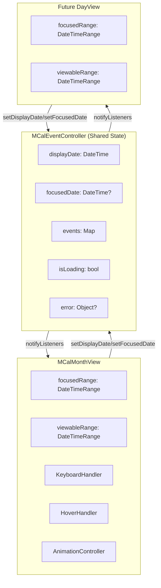

# Design Document

## Overview

This design document specifies the technical implementation for enhancing the MCalMonthView widget with additional features including hover support, keyboard navigation, programmatic navigation with displayDate/focusedDate, interactive overflow indicators, animations, enhanced styling, loading/error states, week numbers, performance optimizations, and accessibility enhancements.

The design builds upon the existing MCalMonthView implementation, extending it with new capabilities while maintaining backward compatibility.

## Steering Document Alignment

### Technical Standards (tech.md)

- **Widget Architecture**: Follows existing StatefulWidget pattern with controller integration
- **Performance**: Maintains 60fps rendering with `const` constructors and `RepaintBoundary` widgets
- **Dart Version**: Compatible with Dart 3.10.4+
- **Flutter Patterns**: Uses ChangeNotifier, ThemeExtension, and Semantics widgets
- **Mobile-First**: All enhancements work on mobile with optional desktop/web features (hover)

### Project Structure (structure.md)

- **File Organization**: New files follow existing naming conventions (`mcal_*.dart`)
- **Naming**: Classes use `MCal` prefix, files use `mcal_` prefix
- **Code Size**: Complex enhancements split into separate files (keyboard handler, animation controller)
- **Testing**: Each enhancement has corresponding unit and widget tests

## Code Reuse Analysis

### Existing Components to Leverage

- **MCalEventController**: Extend with `displayDate` and `focusedDate` properties
- **MCalMonthView**: Add new parameters without breaking existing API
- **MCalThemeData**: Extend with new styling properties
- **MCalDayCellContext**: Add `isFocused` property
- **MCalLocalizations**: Extend with new localized strings for accessibility
- **date_utils.dart**: Add ISO week number calculation

### Integration Points

- **Controller-View Communication**: Views listen via `addListener()`, react to displayDate/focusedDate changes
- **Theme System**: New properties integrate with existing ThemeExtension pattern
- **Accessibility**: Builds on existing Semantics widget usage

## Architecture

### Enhanced Controller-View Architecture



### Component Hierarchy

```
MCalMonthView (StatefulWidget)
├── _MCalMonthViewState
│   ├── FocusNode (for keyboard input)
│   ├── AnimationController (for transitions)
│   ├── _NavigatorWidget
│   ├── _WeekdayHeaderRowWidget
│   │   └── _WeekNumberCell (optional)
│   └── _MonthGridWithAnimations
│       ├── _WeekRowWidget[]
│       │   ├── _WeekNumberCell (optional)
│       │   └── _DayCellWidget[]
│       │       ├── MouseRegion (hover)
│       │       ├── Semantics (accessibility)
│       │       ├── Date label
│       │       ├── Event tiles (with isAllDay styling)
│       │       └── _OverflowIndicatorWidget (interactive)
│       └── LoadingOverlay / ErrorOverlay
└── MCalEventController (provided)
```

## Components and Interfaces

### Component 1: Enhanced MCalEventController

**Location**: `lib/src/controllers/mcal_event_controller.dart`

**Purpose**: Manage shared state across all attached calendar views

**New Properties and Methods**:

```dart
class MCalEventController extends ChangeNotifier {
  // Existing
  final Map<String, MCalCalendarEvent> _eventsById = {};
  
  // New: Shared navigation state
  DateTime _displayDate = DateTime.now();
  DateTime? _focusedDate;
  
  // New: Loading/Error state
  bool _isLoading = false;
  Object? _error;
  
  // Getters
  DateTime get displayDate => _displayDate;
  DateTime? get focusedDate => _focusedDate;
  bool get isLoading => _isLoading;
  Object? get error => _error;
  bool get hasError => _error != null;
  
  // Setters with notification
  void setDisplayDate(DateTime date) {
    if (_displayDate != date) {
      _displayDate = date;
      notifyListeners();
    }
  }
  
  void setFocusedDate(DateTime? date) {
    if (_focusedDate != date) {
      _focusedDate = date;
      notifyListeners();
    }
  }
  
  // Convenience method
  void navigateToDate(DateTime date, {bool focus = true}) {
    final changed = _displayDate != date || (focus && _focusedDate != date);
    _displayDate = date;
    if (focus) {
      _focusedDate = date;
    }
    if (changed) {
      notifyListeners();
    }
  }
  
  // Loading state management
  void setLoading(bool loading) {
    if (_isLoading != loading) {
      _isLoading = loading;
      notifyListeners();
    }
  }
  
  void setError(Object? error) {
    _error = error;
    _isLoading = false;
    notifyListeners();
  }
  
  void clearError() {
    if (_error != null) {
      _error = null;
      notifyListeners();
    }
  }
  
  // Retry mechanism
  Future<void> retryLoad() async {
    clearError();
    final range = DateTimeRange(
      start: DateTime(_displayDate.year, _displayDate.month - 1, 1),
      end: DateTime(_displayDate.year, _displayDate.month + 2, 0),
    );
    await loadEvents(range.start, range.end);
  }
}
```

**Dependencies**: None (extends ChangeNotifier)

### Component 2: Keyboard Navigation Handler

**Location**: `lib/src/widgets/mcal_keyboard_handler.dart`

**Purpose**: Handle keyboard input for calendar navigation

**Interface**:

```dart
/// Mixin for keyboard navigation in calendar views
mixin MCalKeyboardNavigationMixin<T extends StatefulWidget> on State<T> {
  MCalEventController get controller;
  DateTime? get minDate;
  DateTime? get maxDate;
  bool get enableKeyboardNavigation;
  
  /// Handle keyboard events
  KeyEventResult handleKeyEvent(FocusNode node, KeyEvent event) {
    if (!enableKeyboardNavigation) return KeyEventResult.ignored;
    if (event is! KeyDownEvent) return KeyEventResult.ignored;
    
    final focusedDate = controller.focusedDate ?? controller.displayDate;
    
    switch (event.logicalKey) {
      case LogicalKeyboardKey.arrowLeft:
        _moveFocus(focusedDate.subtract(const Duration(days: 1)));
        return KeyEventResult.handled;
      case LogicalKeyboardKey.arrowRight:
        _moveFocus(focusedDate.add(const Duration(days: 1)));
        return KeyEventResult.handled;
      case LogicalKeyboardKey.arrowUp:
        _moveFocus(focusedDate.subtract(const Duration(days: 7)));
        return KeyEventResult.handled;
      case LogicalKeyboardKey.arrowDown:
        _moveFocus(focusedDate.add(const Duration(days: 7)));
        return KeyEventResult.handled;
      case LogicalKeyboardKey.home:
        _moveFocus(DateTime(focusedDate.year, focusedDate.month, 1));
        return KeyEventResult.handled;
      case LogicalKeyboardKey.end:
        _moveFocus(DateTime(focusedDate.year, focusedDate.month + 1, 0));
        return KeyEventResult.handled;
      case LogicalKeyboardKey.pageUp:
        _navigateMonth(-1);
        return KeyEventResult.handled;
      case LogicalKeyboardKey.pageDown:
        _navigateMonth(1);
        return KeyEventResult.handled;
      case LogicalKeyboardKey.enter:
      case LogicalKeyboardKey.space:
        _activateFocusedCell();
        return KeyEventResult.handled;
      default:
        return KeyEventResult.ignored;
    }
  }
  
  void _moveFocus(DateTime newDate) {
    // Clamp to min/max
    if (minDate != null && newDate.isBefore(minDate!)) return;
    if (maxDate != null && newDate.isAfter(maxDate!)) return;
    
    // Update focused date
    controller.setFocusedDate(newDate);
    
    // If focus moves outside current month, update display
    final displayMonth = DateTime(controller.displayDate.year, controller.displayDate.month);
    final focusMonth = DateTime(newDate.year, newDate.month);
    if (displayMonth != focusMonth) {
      controller.setDisplayDate(newDate);
    }
  }
  
  void _navigateMonth(int delta) {
    final current = controller.displayDate;
    final newDate = DateTime(current.year, current.month + delta, 1);
    controller.setDisplayDate(newDate);
    // focusedDate unchanged - may go off-screen
  }
  
  void _activateFocusedCell();
}
```

**Dependencies**: Flutter's Focus system

### Component 3: Hover Support Handler

**Location**: Inline within `_DayCellWidget` and `_EventTileWidget`

**Purpose**: Handle mouse hover events on desktop/web platforms

**Implementation**:

```dart
class _DayCellWidget extends StatelessWidget {
  // ... existing fields ...
  final void Function(DateTime, List<MCalCalendarEvent>, bool, bool)? onHoverCell;
  
  @override
  Widget build(BuildContext context) {
    Widget cell = _buildCellContent();
    
    // Wrap with MouseRegion for hover support
    if (onHoverCell != null) {
      cell = MouseRegion(
        onEnter: (_) => onHoverCell!(date, events, isCurrentMonth, true),
        onExit: (_) => onHoverCell!(date, events, isCurrentMonth, false),
        child: cell,
      );
    }
    
    return cell;
  }
}
```

### Component 4: Month Transition Animator

**Location**: `lib/src/widgets/mcal_month_animator.dart`

**Purpose**: Animate transitions between months

**Interface**:

```dart
class MCalMonthAnimator extends StatefulWidget {
  final Widget child;
  final DateTime displayMonth;
  final bool enableAnimations;
  final Duration animationDuration;
  final Curve animationCurve;
  final MCalSwipeDirection? lastSwipeDirection;
  
  const MCalMonthAnimator({
    required this.child,
    required this.displayMonth,
    this.enableAnimations = true,
    this.animationDuration = const Duration(milliseconds: 300),
    this.animationCurve = Curves.easeInOut,
    this.lastSwipeDirection,
    super.key,
  });
  
  @override
  State<MCalMonthAnimator> createState() => _MCalMonthAnimatorState();
}

class _MCalMonthAnimatorState extends State<MCalMonthAnimator>
    with SingleTickerProviderStateMixin {
  late AnimationController _controller;
  late Animation<Offset> _slideAnimation;
  late Animation<double> _fadeAnimation;
  
  @override
  Widget build(BuildContext context) {
    if (!widget.enableAnimations) {
      return widget.child;
    }
    
    return AnimatedSwitcher(
      duration: widget.animationDuration,
      switchInCurve: widget.animationCurve,
      switchOutCurve: widget.animationCurve,
      transitionBuilder: (child, animation) {
        // Slide animation based on navigation direction
        final slideOffset = widget.lastSwipeDirection == MCalSwipeDirection.next
            ? const Offset(1.0, 0.0)
            : const Offset(-1.0, 0.0);
        
        return SlideTransition(
          position: Tween<Offset>(
            begin: slideOffset,
            end: Offset.zero,
          ).animate(animation),
          child: FadeTransition(
            opacity: animation,
            child: child,
          ),
        );
      },
      child: KeyedSubtree(
        key: ValueKey(widget.displayMonth),
        child: widget.child,
      ),
    );
  }
}
```

### Component 5: Interactive Overflow Indicator

**Location**: Enhanced `_OverflowIndicatorWidget` in `mcal_month_view.dart`

**Purpose**: Display overflow indicator with tap/keyboard interaction

**Interface**:

```dart
class _OverflowIndicatorWidget extends StatelessWidget {
  final int count;
  final DateTime date;
  final List<MCalCalendarEvent> allEvents;
  final MCalThemeData theme;
  final Locale locale;
  final void Function(DateTime, List<MCalCalendarEvent>, int)? onOverflowTap;
  final void Function(DateTime, List<MCalCalendarEvent>, int)? onOverflowLongPress;
  final bool isFocusable; // For keyboard navigation
  
  @override
  Widget build(BuildContext context) {
    final indicator = Container(
      padding: const EdgeInsets.symmetric(horizontal: 4, vertical: 2),
      child: Text(
        '+$count more',
        style: theme.eventTileTextStyle?.copyWith(
          fontStyle: FontStyle.italic,
        ),
      ),
    );
    
    return Semantics(
      label: '$count more events, tap to view all',
      button: true,
      child: GestureDetector(
        onTap: () {
          if (onOverflowTap != null) {
            onOverflowTap!(date, allEvents, count);
          } else {
            _showDefaultOverflowSheet(context);
          }
        },
        onLongPress: () {
          if (onOverflowLongPress != null) {
            onOverflowLongPress!(date, allEvents, count);
          } else {
            _showDefaultOverflowSheet(context);
          }
        },
        child: indicator,
      ),
    );
  }
  
  void _showDefaultOverflowSheet(BuildContext context) {
    showModalBottomSheet(
      context: context,
      builder: (context) => _OverflowEventsList(
        date: date,
        events: allEvents,
        theme: theme,
        locale: locale,
      ),
    );
  }
}
```

### Component 6: Week Number Display

**Location**: New widget `_WeekNumberCell` in `mcal_month_view.dart`

**Purpose**: Display ISO 8601 week numbers

**Implementation**:

```dart
class _WeekNumberCell extends StatelessWidget {
  final int weekNumber;
  final DateTime firstDayOfWeek;
  final MCalThemeData theme;
  final Widget Function(BuildContext, MCalWeekNumberContext, Widget)? builder;
  
  @override
  Widget build(BuildContext context) {
    final defaultFormatted = '$weekNumber';
    
    Widget cell = Container(
      padding: const EdgeInsets.symmetric(horizontal: 4, vertical: 8),
      decoration: BoxDecoration(
        color: theme.weekNumberBackgroundColor,
      ),
      child: Center(
        child: Text(
          defaultFormatted,
          style: theme.weekNumberTextStyle,
        ),
      ),
    );
    
    if (builder != null) {
      final context = MCalWeekNumberContext(
        weekNumber: weekNumber,
        firstDayOfWeek: firstDayOfWeek,
        defaultFormattedString: defaultFormatted,
        theme: theme,
      );
      cell = builder!(context, context, cell);
    }
    
    return cell;
  }
}

// Utility function for ISO week number calculation
int getISOWeekNumber(DateTime date) {
  // ISO 8601: Week 1 is the week containing the first Thursday of the year
  final jan4 = DateTime(date.year, 1, 4);
  final dayOfYear = date.difference(DateTime(date.year, 1, 1)).inDays;
  final weekday = date.weekday; // 1=Mon, 7=Sun
  
  // Calculate week number
  int weekNumber = ((dayOfYear - weekday + 10) / 7).floor();
  
  // Handle edge cases (week 0 or week 53)
  if (weekNumber == 0) {
    // Last week of previous year
    return getISOWeekNumber(DateTime(date.year - 1, 12, 31));
  } else if (weekNumber == 53) {
    // Check if it's actually week 1 of next year
    final dec31 = DateTime(date.year, 12, 31);
    if (dec31.weekday < 4) {
      return 1;
    }
  }
  
  return weekNumber;
}
```

### Component 7: Loading/Error Overlay

**Location**: New widgets in `mcal_month_view.dart`

**Purpose**: Display loading and error states

**Implementation**:

```dart
class _LoadingOverlay extends StatelessWidget {
  final Widget Function(BuildContext, bool)? loadingBuilder;
  
  @override
  Widget build(BuildContext context) {
    if (loadingBuilder != null) {
      return loadingBuilder!(context, true);
    }
    
    return Container(
      color: Colors.white.withOpacity(0.7),
      child: const Center(
        child: CircularProgressIndicator(),
      ),
    );
  }
}

class _ErrorOverlay extends StatelessWidget {
  final Object error;
  final VoidCallback onRetry;
  final Widget Function(BuildContext, Object, VoidCallback)? errorBuilder;
  
  @override
  Widget build(BuildContext context) {
    if (errorBuilder != null) {
      return errorBuilder!(context, error, onRetry);
    }
    
    return Container(
      color: Colors.white.withOpacity(0.9),
      child: Center(
        child: Column(
          mainAxisSize: MainAxisSize.min,
          children: [
            const Icon(Icons.error_outline, size: 48, color: Colors.red),
            const SizedBox(height: 16),
            Text('Failed to load events'),
            const SizedBox(height: 8),
            ElevatedButton(
              onPressed: onRetry,
              child: const Text('Retry'),
            ),
          ],
        ),
      ),
    );
  }
}
```

## Data Models

### New Context Classes

```dart
/// Context for week number builder
class MCalWeekNumberContext {
  final int weekNumber;
  final DateTime firstDayOfWeek;
  final String defaultFormattedString;
  final MCalThemeData theme;
  
  const MCalWeekNumberContext({
    required this.weekNumber,
    required this.firstDayOfWeek,
    required this.defaultFormattedString,
    required this.theme,
  });
}

/// Extended MCalDayCellContext with focus state
class MCalDayCellContext {
  // Existing fields...
  final DateTime date;
  final bool isCurrentMonth;
  final bool isToday;
  final bool isSelectable;
  final List<MCalCalendarEvent> events;
  final MCalThemeData theme;
  
  // New field
  final bool isFocused;
  
  const MCalDayCellContext({
    required this.date,
    required this.isCurrentMonth,
    required this.isToday,
    required this.isSelectable,
    required this.events,
    required this.theme,
    this.isFocused = false,
  });
}
```

### Extended MCalThemeData

```dart
class MCalThemeData extends ThemeExtension<MCalThemeData> {
  // Existing properties...
  
  // New: Focused date styling
  final Color? focusedDateBackgroundColor;
  final TextStyle? focusedDateTextStyle;
  
  // New: All-day event styling
  final Color? allDayEventBackgroundColor;
  final TextStyle? allDayEventTextStyle;
  final Color? allDayEventBorderColor;
  final double? allDayEventBorderWidth;
  
  // New: Week number styling
  final TextStyle? weekNumberTextStyle;
  final Color? weekNumberBackgroundColor;
  
  // New: Hover state styling
  final Color? hoverCellBackgroundColor;
  final Color? hoverEventBackgroundColor;
}
```

## New MCalMonthView Parameters

```dart
class MCalMonthView extends StatefulWidget {
  // Existing parameters...
  
  // New: Hover callbacks (Requirement 1)
  final void Function(DateTime, List<MCalCalendarEvent>, bool, bool)? onHoverCell;
  final void Function(MCalCalendarEvent, DateTime, bool)? onHoverEvent;
  
  // New: Keyboard navigation (Requirement 2)
  final bool enableKeyboardNavigation; // Default: true
  
  // New: Navigation callbacks (Requirement 3)
  final void Function(DateTime)? onDisplayDateChanged;
  final void Function(DateTimeRange)? onViewableRangeChanged;
  final void Function(DateTime?)? onFocusedDateChanged;
  final void Function(DateTimeRange)? onFocusedRangeChanged;
  final bool autoFocusOnCellTap; // Default: true
  
  // New: Overflow callbacks (Requirement 4)
  final void Function(DateTime, List<MCalCalendarEvent>, int)? onOverflowTap;
  final void Function(DateTime, List<MCalCalendarEvent>, int)? onOverflowLongPress;
  
  // New: Animation parameters (Requirement 5)
  final bool enableAnimations; // Default: true
  final Duration animationDuration; // Default: 300ms
  final Curve animationCurve; // Default: Curves.easeInOut
  
  // New: Overflow threshold (Requirement 7)
  final int maxVisibleEvents; // Default: 3, 0 = show all
  
  // New: Loading/Error builders (Requirement 8)
  final Widget Function(BuildContext, bool)? loadingBuilder;
  final Widget Function(BuildContext, Object, VoidCallback)? errorBuilder;
  
  // New: Week numbers (Requirement 9)
  final bool showWeekNumbers; // Default: false
  final Widget Function(BuildContext, MCalWeekNumberContext, Widget)? weekNumberBuilder;
  
  // New: Accessibility (Requirement 11)
  final String? semanticsLabel;
}
```

## Error Handling

### Error Scenarios

1. **Event Loading Failure**
   - **Handling**: Controller sets error state, view shows error overlay
   - **User Impact**: Sees error message with retry button, calendar grid still visible

2. **Invalid Date Navigation**
   - **Handling**: Clamp dates to minDate/maxDate range
   - **User Impact**: Navigation disabled beyond boundaries

3. **Keyboard Navigation Edge Cases**
   - **Handling**: Prevent navigation beyond minDate/maxDate
   - **User Impact**: Focus stays at boundary date

4. **Animation Interruption**
   - **Handling**: Cancel in-progress animations on new navigation
   - **User Impact**: Smooth transition to new state

## Testing Strategy

### Unit Testing

- **Controller State**: Test displayDate/focusedDate changes and notifications
- **Week Number Calculation**: Test ISO 8601 algorithm with edge cases
- **Date Range Calculations**: Test focusedRange/viewableRange for various months
- **Keyboard Navigation Logic**: Test date movement with boundary conditions

### Widget Testing

- **Hover Events**: Test MouseRegion callbacks on desktop
- **Keyboard Navigation**: Test Focus and key event handling
- **Animation Transitions**: Test AnimatedSwitcher behavior
- **Overflow Indicator**: Test tap/long-press and default bottom sheet
- **Week Numbers**: Test display and RTL positioning
- **Loading/Error States**: Test overlay display and retry

### Integration Testing

- **Multi-View Synchronization**: Test two views sharing controller
- **Full Navigation Flow**: Keyboard + swipe + programmatic navigation
- **Accessibility**: Test with screen reader simulation

### Accessibility Testing

- **Screen Reader Announcements**: Verify semantic labels are read correctly
- **Keyboard-Only Navigation**: Full workflow without mouse/touch
- **Focus Indicators**: Verify WCAG-compliant contrast

## Performance Considerations

### Rendering Optimizations

1. **const Constructors**: Use throughout for static widgets
2. **RepaintBoundary**: Wrap each day cell to isolate repaints
3. **Cached Theme Resolution**: Resolve theme once per build, pass to children
4. **Lazy Event Filtering**: Only filter events when month changes
5. **Animation Efficiency**: Use AnimatedSwitcher with keys for efficient rebuilds

### Memory Optimizations

1. **Widget Reuse**: AnimatedSwitcher reuses widgets where possible
2. **Event Caching**: Controller caches events, views don't duplicate
3. **DateTime Caching**: Calculate grid dates once per month change

### Gesture Performance

1. **Swipe Velocity Threshold**: Prevent accidental swipes
2. **Pre-loaded Events**: Enable instant month transitions
3. **Animation Cancellation**: Stop animations when new navigation starts

## Implementation Order

Recommended implementation order based on dependencies:

1. **Controller Enhancements** (displayDate, focusedDate, loading/error state)
2. **Theme Extensions** (new styling properties)
3. **Focus/Keyboard Navigation** (depends on controller)
4. **Hover Support** (independent)
5. **Animation System** (independent)
6. **Overflow Interactions** (depends on existing overflow)
7. **Week Numbers** (independent)
8. **All-Day Styling** (extends existing)
9. **Loading/Error States** (depends on controller)
10. **Enhanced Accessibility** (depends on focus system)
11. **Performance Optimizations** (can be done incrementally)
