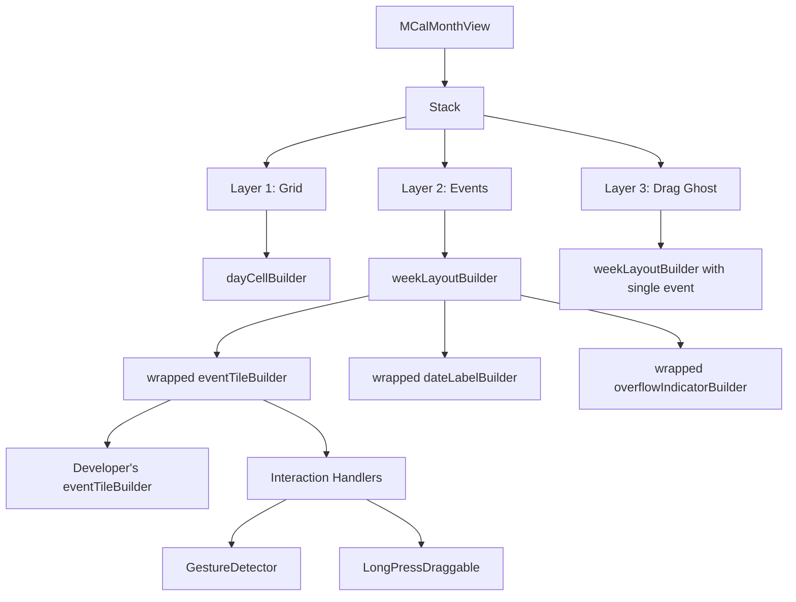
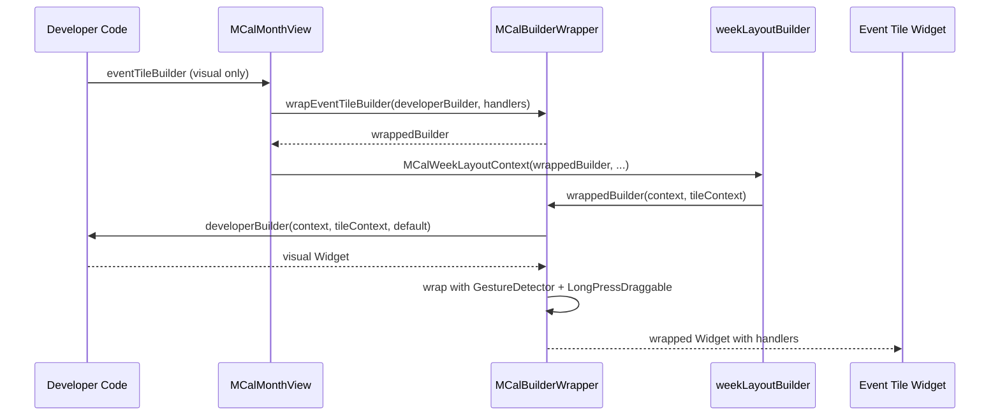
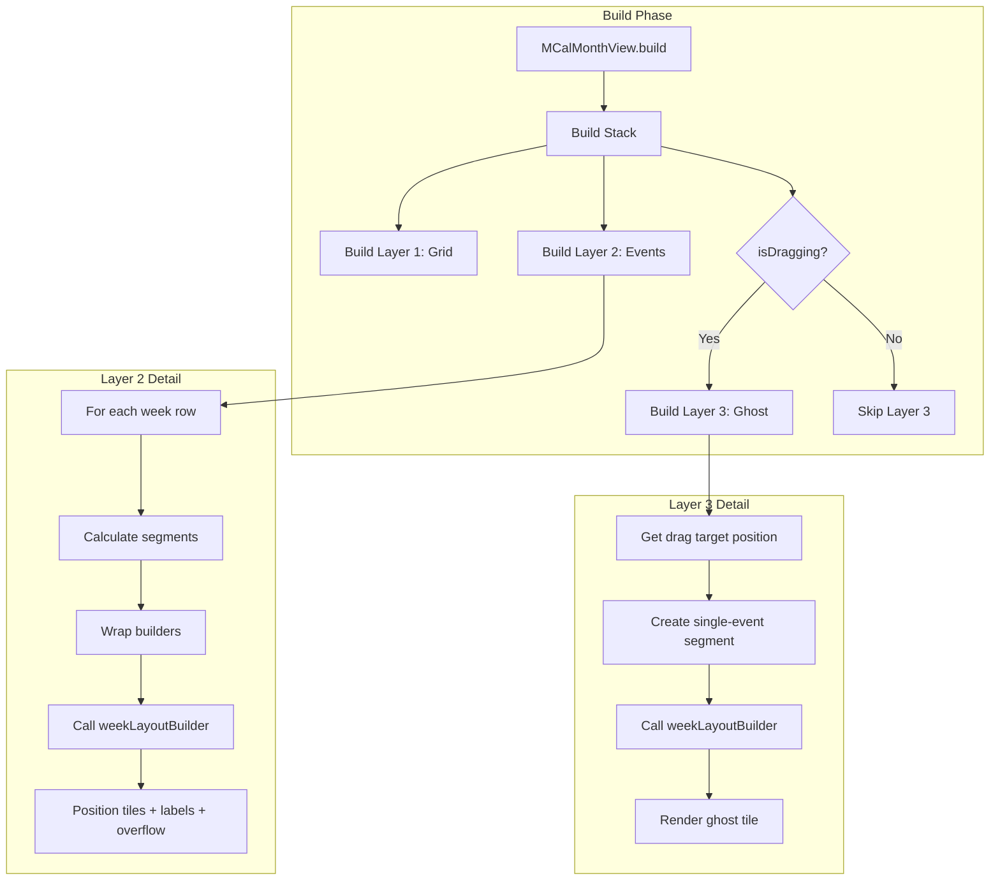

# Design Document

## Overview

This design refactors MCalMonthView to use a 3-layer Stack architecture that separates grid rendering (Layer 1), event/label rendering (Layer 2), and drag-and-drop feedback (Layer 3). The core innovation is the `weekLayoutBuilder` pattern, which gives developers complete control over how events are positioned within each week row while the package handles interaction logic through builder wrapping.

The existing `MCalMultiDayRenderer` already implements the greedy first-fit algorithm for event positioning. This design extends that foundation by:
1. Making it the basis for the default week layout builder
2. Unifying single-day and multi-day event handling
3. Adding overflow indicator support
4. Introducing builder wrapping for separation of visual customization from interaction handling

## Steering Document Alignment

### Technical Standards (tech.md)

- **Widget-based Architecture**: Maintains the existing widget tree with controller pattern
- **Builder Pattern**: Extends the existing builder callback pattern (dayCellBuilder, eventTileBuilder, etc.) with new builders (weekLayoutBuilder, overflowIndicatorBuilder)
- **Performance Requirements**: Segment calculations performed once per layout pass; Layer 3 only rendered during drag operations
- **Flutter Conventions**: Context objects follow established pattern (MCalDayCellContext, MCalEventTileContext); new contexts follow same structure

### Project Structure (structure.md)

- **File Organization**: New files in appropriate directories (`lib/src/widgets/`, `lib/src/models/`)
- **Naming Conventions**: All public classes prefixed with `MCal`; context objects named `MCal*Context`
- **Single Responsibility**: Each layer has distinct purpose; builder wrapping logic isolated
- **Code Size**: Large `mcal_month_view.dart` will be refactored with layout logic moved to new files

## Code Reuse Analysis

### Existing Components to Leverage

- **MCalMultiDayRenderer**: Already implements greedy first-fit algorithm via `calculateWeekLayout()`. Will be extended to handle all events (not just multi-day) and to support overflow calculations.
- **MCalMultiDayRowSegment**: Existing segment model with `isFirstSegment`, `isLastSegment` flags. Will be renamed/adapted to `MCalEventSegment` for unified use.
- **MCalWeekEventLayoutFrame**: Existing layout frame structure. Will be extended to include overflow information.
- **MCalEventLayoutAssignment**: Existing assignment model. Will be reused as-is.
- **MCalThemeData**: Existing theme extension. Will add new layout-related properties (dateLabelHeight, dateLabelPosition, overflowIndicatorHeight, tileCornerRadius).
- **MCalDragHandler**: Existing drag state management. Will integrate with Layer 3 rendering.
- **MCalDraggableEventTile**: Existing draggable wrapper. Will be part of the builder wrapping system.

### Integration Points

- **MCalEventController**: No changes needed; continues to provide events
- **MCalTheme**: Extended with new layout properties
- **Existing Callbacks**: onEventTap, onEventLongPress, onCellTap, etc. continue to work through builder wrapping

## Architecture

The refactored MCalMonthView uses a Stack with three conceptual layers:

```
┌─────────────────────────────────────────────────────────────┐
│                    MCalMonthView                             │
│  ┌─────────────────────────────────────────────────────────┐│
│  │  Optional Navigator (showNavigator: true)               ││
│  └─────────────────────────────────────────────────────────┘│
│  ┌─────────────────────────────────────────────────────────┐│
│  │  Weekday Headers                                        ││
│  └─────────────────────────────────────────────────────────┘│
│  ┌─────────────────────────────────────────────────────────┐│
│  │  Week Numbers (if showWeekNumbers)                      ││
│  │  (positioned left/right based on RTL)                   ││
│  │  ┌─────────────────────────────────────────────────────┐││
│  │  │               Calendar Stack                        │││
│  │  │  ┌───────────────────────────────────────────────┐  │││
│  │  │  │ Layer 3: Drag Ghost (only during drag)        │  │││
│  │  │  ├───────────────────────────────────────────────┤  │││
│  │  │  │ Layer 2: Events, Labels, Overflow Indicators  │  │││
│  │  │  ├───────────────────────────────────────────────┤  │││
│  │  │  │ Layer 1: Calendar Grid (day cells)            │  │││
│  │  │  └───────────────────────────────────────────────┘  │││
│  │  └─────────────────────────────────────────────────────┘││
│  └─────────────────────────────────────────────────────────┘│
└─────────────────────────────────────────────────────────────┘
```

### Layer Details



### Modular Design Principles

- **Single File Responsibility**: 
  - `mcal_week_layout_builder.dart` - Default layout implementation
  - `mcal_week_layout_contexts.dart` - Context objects for week layout
  - `mcal_builder_wrapper.dart` - Builder wrapping logic

- **Component Isolation**: Each layer is built by isolated methods; builder wrapping is separate from layout logic

- **Service Layer Separation**: Layout calculation (MCalMultiDayRenderer) separate from rendering (week layout builder)

## Components and Interfaces

### Component 1: MCalWeekLayoutContext

- **Purpose:** Provides all data needed by a weekLayoutBuilder to render one week row
- **Interfaces:**
  ```dart
  class MCalWeekLayoutContext {
    final List<MCalEventSegment> segments;
    final List<DateTime> dates;  // 7 dates for this week
    final List<double> columnWidths;  // Width of each day column
    final double rowHeight;  // Total height available
    final int weekRowIndex;  // Index in month grid (0-based)
    final DateTime currentMonth;  // For current month styling
    
    // Pre-wrapped builders (include interaction handlers)
    final Widget Function(BuildContext, MCalEventTileContext) eventTileBuilder;
    final Widget Function(BuildContext, MCalDateLabelContext) dateLabelBuilder;
    final Widget Function(BuildContext, MCalOverflowIndicatorContext) overflowIndicatorBuilder;
    
    // Configuration
    final MCalWeekLayoutConfig config;
  }
  ```
- **Dependencies:** MCalEventSegment, MCalWeekLayoutConfig, context objects
- **Reuses:** Existing MCalDateLabelContext pattern

### Component 2: MCalEventSegment

- **Purpose:** Represents a portion of an event within a single week row (unified for single-day and multi-day)
- **Interfaces:**
  ```dart
  class MCalEventSegment {
    final MCalCalendarEvent event;
    final int weekRowIndex;
    final int startDayInWeek;  // 0-6
    final int endDayInWeek;    // 0-6
    final bool isFirstSegment;  // First segment of multi-week event
    final bool isLastSegment;   // Last segment of multi-week event
    
    int get spanDays => endDayInWeek - startDayInWeek + 1;
    bool get isSingleDay => spanDays == 1 && isFirstSegment && isLastSegment;
  }
  ```
- **Dependencies:** MCalCalendarEvent
- **Reuses:** Extends concept from MCalMultiDayRowSegment

### Component 3: MCalWeekLayoutConfig

- **Purpose:** Configuration values for week layout rendering, inheriting from theme
- **Interfaces:**
  ```dart
  class MCalWeekLayoutConfig {
    final double tileHeight;
    final double tileVerticalSpacing;
    final double tileHorizontalSpacing;
    final double tileCornerRadius;
    final double tileBorderWidth;
    final double dateLabelHeight;
    final DateLabelPosition dateLabelPosition;
    final double overflowIndicatorHeight;
    
    factory MCalWeekLayoutConfig.fromTheme(MCalThemeData theme);
  }
  
  enum DateLabelPosition {
    topLeft, topCenter, topRight,
    bottomLeft, bottomCenter, bottomRight,
  }
  ```
- **Dependencies:** MCalThemeData
- **Reuses:** Values from existing MCalThemeData

### Component 4: MCalOverflowIndicatorContext

- **Purpose:** Context for overflow indicator builder
- **Interfaces:**
  ```dart
  class MCalOverflowIndicatorContext {
    final DateTime date;
    final int hiddenEventCount;
    final List<MCalCalendarEvent> hiddenEvents;
    final List<MCalCalendarEvent> visibleEvents;
    final double width;
    final double height;
  }
  ```
- **Dependencies:** MCalCalendarEvent
- **Reuses:** Pattern from MCalDateLabelContext

### Component 5: MCalBuilderWrapper

- **Purpose:** Wraps developer-provided builders with interaction handlers
- **Interfaces:**
  ```dart
  class MCalBuilderWrapper {
    /// Wraps eventTileBuilder with tap, long-press, and drag handlers
    static Widget Function(BuildContext, MCalEventTileContext) wrapEventTileBuilder({
      required Widget Function(BuildContext, MCalEventTileContext, Widget)? developerBuilder,
      required Widget Function(BuildContext, MCalEventTileContext) defaultBuilder,
      required void Function(BuildContext, MCalEventTapDetails)? onEventTap,
      required void Function(BuildContext, MCalEventLongPressDetails)? onEventLongPress,
      required bool enableDragAndDrop,
      required MCalDragHandler? dragHandler,
    });
    
    /// Wraps dateLabelBuilder (currently no interactions, but extensible)
    static Widget Function(BuildContext, MCalDateLabelContext) wrapDateLabelBuilder({
      required Widget Function(BuildContext, MCalDateLabelContext, String)? developerBuilder,
      required Widget Function(BuildContext, MCalDateLabelContext) defaultBuilder,
    });
    
    /// Wraps overflowIndicatorBuilder with tap handler
    static Widget Function(BuildContext, MCalOverflowIndicatorContext) wrapOverflowIndicatorBuilder({
      required Widget Function(BuildContext, MCalOverflowIndicatorContext, Widget)? developerBuilder,
      required Widget Function(BuildContext, MCalOverflowIndicatorContext) defaultBuilder,
      required void Function(BuildContext, MCalOverflowTapDetails)? onOverflowTap,
    });
  }
  ```
- **Dependencies:** MCalDragHandler, callback details classes
- **Reuses:** Existing MCalDraggableEventTile wrapping pattern

### Component 6: Default Week Layout Builder

- **Purpose:** Provides the default greedy first-fit layout algorithm for event positioning
- **Interfaces:**
  ```dart
  class MCalDefaultWeekLayoutBuilder {
    /// Builds the default week layout widget
    static Widget build(BuildContext context, MCalWeekLayoutContext layoutContext);
    
    /// Calculates row assignments using greedy first-fit
    static List<MCalSegmentRowAssignment> assignRows(List<MCalEventSegment> segments);
    
    /// Calculates overflow counts per day column
    static Map<int, MCalOverflowInfo> calculateOverflow({
      required List<MCalSegmentRowAssignment> assignments,
      required int maxVisibleRows,
    });
  }
  
  class MCalSegmentRowAssignment {
    final MCalEventSegment segment;
    final int row;  // 0-based row index
  }
  
  class MCalOverflowInfo {
    final int hiddenCount;
    final List<MCalCalendarEvent> hiddenEvents;
    final List<MCalCalendarEvent> visibleEvents;
  }
  ```
- **Dependencies:** MCalWeekLayoutContext, MCalEventSegment
- **Reuses:** Algorithm from MCalMultiDayRenderer.calculateWeekLayout()

## Data Models

### MCalEventSegment
```dart
class MCalEventSegment {
  final MCalCalendarEvent event;
  final int weekRowIndex;
  final int startDayInWeek;    // 0-6
  final int endDayInWeek;      // 0-6
  final bool isFirstSegment;
  final bool isLastSegment;
  
  // Computed properties
  int get spanDays;
  bool get isSingleDay;
}
```

### MCalWeekLayoutConfig
```dart
class MCalWeekLayoutConfig {
  final double tileHeight;           // default: 18.0
  final double tileVerticalSpacing;  // default: 2.0
  final double tileHorizontalSpacing; // default: 2.0
  final double tileCornerRadius;     // default: 3.0
  final double tileBorderWidth;      // default: 0.0
  final double dateLabelHeight;      // default: 18.0
  final DateLabelPosition dateLabelPosition; // default: topLeft
  final double overflowIndicatorHeight; // default: 14.0
}
```

### Updated MCalEventTileContext
```dart
class MCalEventTileContext {
  final MCalCalendarEvent event;
  final DateTime displayDate;
  final bool isAllDay;
  
  // New segment info (unified for single-day and multi-day)
  final MCalEventSegment segment;
  final double width;   // Computed tile width
  final double height;  // Configured tile height
}
```

### MCalOverflowTapDetails
```dart
class MCalOverflowTapDetails {
  final DateTime date;
  final List<MCalCalendarEvent> hiddenEvents;
  final List<MCalCalendarEvent> visibleEvents;
}
```

## Theme Extensions

Add to MCalThemeData:

```dart
// New properties
final double? dateLabelHeight;           // default: 18.0
final DateLabelPosition? dateLabelPosition; // default: topLeft
final double? overflowIndicatorHeight;   // default: 14.0
final double? tileCornerRadius;          // default: 3.0

// Existing properties to retain
final double? eventTileHeight;           // already exists (default: 20.0, changing to 18.0)
final double? eventTileHorizontalSpacing; // already exists
final double? eventTileVerticalSpacing;  // already exists
```

## Builder Wrapping Flow



## Layer Rendering Flow



## File Changes Summary

### New Files

| File | Purpose |
|------|---------|
| `lib/src/widgets/mcal_week_layout_contexts.dart` | MCalWeekLayoutContext, MCalEventSegment, MCalWeekLayoutConfig, MCalOverflowIndicatorContext |
| `lib/src/widgets/mcal_default_week_layout.dart` | MCalDefaultWeekLayoutBuilder implementation |
| `lib/src/widgets/mcal_builder_wrapper.dart` | Builder wrapping logic |

### Modified Files

| File | Changes |
|------|---------|
| `lib/src/widgets/mcal_month_view.dart` | Refactor to 3-layer Stack; remove renderMultiDayEventsAsContiguous; add weekLayoutBuilder, overflowIndicatorBuilder parameters; integrate builder wrapping |
| `lib/src/widgets/mcal_month_view_contexts.dart` | Update MCalEventTileContext with segment info; add MCalOverflowTapDetails |
| `lib/src/widgets/mcal_callback_details.dart` | Add MCalOverflowTapDetails |
| `lib/src/styles/mcal_theme.dart` | Add dateLabelHeight, dateLabelPosition, overflowIndicatorHeight, tileCornerRadius |
| `lib/src/widgets/mcal_multi_day_renderer.dart` | Extend to generate segments for ALL events (not just multi-day); add overflow calculation |
| `lib/multi_calendar.dart` | Export new public classes |

### Removed/Deprecated

| Item | Reason |
|------|--------|
| `renderMultiDayEventsAsContiguous` parameter | Replaced by weekLayoutBuilder pattern |
| `multiDayEventTileBuilder` parameter | Replaced by unified eventTileBuilder with segment info |

## Error Handling

### Error Scenarios

1. **Invalid weekLayoutBuilder return**
   - **Handling:** If weekLayoutBuilder returns null or throws, fall back to default layout with error logging
   - **User Impact:** Calendar still renders with default layout; error logged for debugging

2. **Event segment calculation fails**
   - **Handling:** Return empty segment list; log warning
   - **User Impact:** Events may not display for that week; other weeks unaffected

3. **Overflow calculation overflow**
   - **Handling:** Clamp maxVisibleRows to positive integer; handle edge cases
   - **User Impact:** Overflow indicator shows correct count

## Testing Strategy

### Unit Testing

- **MCalEventSegment**: Test segment creation, span calculation, edge cases
- **MCalWeekLayoutConfig**: Test theme inheritance, override behavior
- **MCalDefaultWeekLayoutBuilder.assignRows()**: Test greedy first-fit algorithm with various event combinations
- **MCalDefaultWeekLayoutBuilder.calculateOverflow()**: Test hidden/visible event counting
- **MCalBuilderWrapper**: Test that handlers are correctly attached

### Widget Testing

- **Layer rendering**: Verify correct Stack structure with 3 layers
- **Builder wrapping**: Verify developer builders receive correct context and handlers work
- **Default layout**: Visual regression tests for greedy first-fit layout behavior
- **Overflow indicators**: Test display and tap handling
- **Multi-week events**: Verify visual continuity (no corners/borders on continuation edges)
- **RTL support**: Verify week numbers position correctly

### Integration Testing

- **Drag-and-drop**: Verify Layer 3 renders ghost correctly during drag
- **Theme changes**: Verify layout responds to theme updates
- **Event updates**: Verify layout recalculates when events change
- **Example app**: Verify all tabs (default, dots, pills, custom) work correctly
