# Design Document: Month View Polish

## Overview

This design covers the Month View Polish spec’s eight requirements:

1. **Event edge-drag resizing** — drag the leading/trailing edge of an event tile to change its start/end date, including cross-month resize with auto-navigation and persistent gesture tracking.
2. **System reduced-motion integration** — `enableAnimations` becomes nullable; `null` means "follow OS preference."
3. **Keyboard-based event moving** — an accessibility alternative to drag-and-drop using arrow keys; recurring moves use `modified` exceptions to preserve prior modifications.
4. **Keyboard-based event resizing** — an accessibility alternative to edge-drag resizing using keyboard shortcuts.
5. **Multi-day event semantic span labels** — enriched screen-reader labels that include "N-day event, day M of N."
6. **Recurring event move preserves modifications** — drag and keyboard move use `modified` (not `rescheduled`) exceptions so resized durations and other changes are preserved.
7. **Modified recurring event visibility across months** — the controller includes `modified` exceptions in query results when the modified event’s dates overlap the range, even if the original occurrence date is outside the range.
8. **Color utilities and drop target tile styling** — `MCalColorUtils` (lighten, darken, soften) and default drop target tile with border and softened opaque fill.

9. **API renames and custom resize handle builders** — rename `enableDragAndDrop` → `enableDragToMove` and `enableEventResize` → `enableDragToResize` for consistency; expose `resizeHandleBuilder` and `resizeHandleInset` for custom handle visuals and positioning; add `MCalResizeHandleContext`.

These build on existing infrastructure (the drag handler, callback details, localization, event tile widget, and event controller).

## Steering Document Alignment

### Technical Standards (tech.md)

* **DST-safe arithmetic**: All new date mutations use `DateTime(y, m, d + delta)`, never `Duration(days:)`. Follows the established pattern in `_handleKeyEvent`, `_handleDrop`, and `daysBetween`.
* **ChangeNotifier reactivity**: Resize state lives in `MCalDragHandler` (already a `ChangeNotifier`), so view rebuilds follow the established drag-and-drop reactive update path.
* **`intl` localization**: New semantic strings are added to `_enStrings` and `_esMxStrings` in `MCalLocalizations`, following the existing key/value pattern.
* **flutter_lints**: All new public APIs get full dartdoc.

### Project Structure (structure.md)

* New callback details classes go in `lib/src/widgets/mcal_callback_details.dart` (append to existing file).
* Resize interaction logic is added to `MCalDragHandler` in `lib/src/widgets/mcal_drag_handler.dart`.
* Month view parameters and state go in `lib/src/widgets/mcal_month_view.dart`.
* Localization additions go in `lib/src/utils/mcal_localization.dart`.
* Tests go in the existing test directories.

## Code Reuse Analysis

### Existing Components to Leverage

* **`MCalDragHandler`**: Already manages drag state, debounce, edge navigation, proposed drop range, highlighted cells, and change detection. The resize state machine (resizing event, active edge, proposed dates) extends this class with a parallel set of fields gated by an `isResizing` flag — the drag and resize states are mutually exclusive.
* **Drop target tiles (Layer 3) and overlay (Layer 4)**: The resize preview reuses the exact same `_buildDropTargetTilesLayer` and `_buildDropTargetOverlayLayer` paths. The drag handler's `highlightedCells` and `proposedStartDate`/`proposedEndDate` are set during resize the same way as during drag, so both layers Just Work.
* **`_handleDrop` flow**: The resize completion flow mirrors `_handleDrop` — calculate new dates, call validation callback, call completion callback, create exception for recurring events, or update event in controller.
* **`MCalEventTileContext` drag-only fields**: `isDropTargetPreview`, `dropValid`, `proposedStartDate`, `proposedEndDate` are already available for Layer 3 tiles. Resize reuses these.
* **`_buildDropTargetSemanticLabel`**: Existing semantic label construction for drop targets includes date range. Multi-day event labels will follow the same formatting.
* **`MCalLocalizations`**: Existing string map infrastructure for `en` and `es_MX`.
* **`daysBetween` utility**: DST-safe day delta calculation in `lib/src/utils/date_utils.dart`.

### Integration Points

* **`MCalMonthView` parameters**: New parameters (`enableEventResize`, `onResizeWillAccept`, `onEventResized`) follow the exact same pattern as the drag-and-drop parameters.
* **`MCalEventController`**: For recurring resize, calls `modifyOccurrence` (existing API) which creates a `modified` exception.
* **`MCalDraggableEventTile`**: Resize handles are added as children of the tile widget, rendered conditionally when resize is enabled.

## Architecture

```mermaid
graph TD
    subgraph "Requirement 1: Event Resize"
        A1[MCalMonthView params<br/>enableEventResize, callbacks] --> A2[MCalDragHandler<br/>resize state machine]
        A2 --> A3[_EventTileWidget<br/>resize handle affordance]
        A2 --> A4[Layer 3/4 preview<br/>reuse existing]
        A2 --> A5[_handleResizeEnd<br/>create exception or update]
    end

    subgraph "Requirement 2: Reduced Motion"
        B1[enableAnimations: bool?] --> B2[_resolveAnimationsEnabled<br/>MediaQuery check]
        B2 --> B3[_pageController.animateToPage<br/>or jumpToPage]
    end

    subgraph "Requirement 3: Keyboard Move"
        C1[_handleKeyEvent] --> C2[Event selection mode]
        C2 --> C3[Arrow keys: update<br/>drag handler state]
        C3 --> C4[Enter: confirm via<br/>_handleDrop flow]
        C3 --> C5[Escape: cancel]
    end

    subgraph "Requirement 4: Keyboard Resize"
        CR1[R key in selection mode] --> CR2[Keyboard resize mode]
        CR2 --> CR3[S/E: switch edge]
        CR2 --> CR4[Arrow keys: adjust<br/>edge date via<br/>resize handler state]
        CR4 --> CR5[Enter: confirm via<br/>_handleResizeEnd flow]
        CR4 --> CR6[Escape: cancel]
    end

    subgraph "Requirement 5: Multi-day Semantics"
        D1[_EventTileWidget._getSemanticLabel] --> D2[Check spanLength > 1]
        D2 --> D3[Append localized span info]
    end
```



## Components and Interfaces

### Component 1: Resize State in MCalDragHandler

**Purpose:** Manages the resize interaction lifecycle — tracking which edge is being resized, the original and proposed dates, and the resize validity.

**New fields:**
```dart
// Resize state (mutually exclusive with drag state)
bool _isResizing = false;
MCalCalendarEvent? _resizingEvent;
MCalResizeEdge? _resizeEdge;        // start or end
DateTime? _resizeOriginalStart;
DateTime? _resizeOriginalEnd;

bool get isResizing => _isResizing;
MCalCalendarEvent? get resizingEvent => _resizingEvent;
MCalResizeEdge? get resizeEdge => _resizeEdge;
```

**New methods:**
```dart
/// Begins a resize operation.
void startResize(MCalCalendarEvent event, MCalResizeEdge edge) {
  _isResizing = true;
  _resizingEvent = event;
  _resizeEdge = edge;
  _resizeOriginalStart = event.start;
  _resizeOriginalEnd = event.end;
  notifyListeners();
}

/// Updates the proposed range during resize.
/// Uses calendar-day arithmetic: DateTime(y, m, d + delta).
void updateResize({
  required DateTime proposedStart,
  required DateTime proposedEnd,
  required bool isValid,
  required List<MCalHighlightCellInfo> cells,
}) {
  _proposedStartDate = proposedStart;
  _proposedEndDate = proposedEnd;
  _isProposedDropValid = isValid;
  _highlightedCells = cells;
  notifyListeners();
}

/// Completes the resize, returning the proposed dates or null if invalid.
(DateTime start, DateTime end)? completeResize() {
  if (!_isResizing || !_isProposedDropValid) {
    cancelResize();
    return null;
  }
  final result = (_proposedStartDate!, _proposedEndDate!);
  _clearResizeState();
  return result;
}

/// Cancels the resize and clears all state.
void cancelResize() {
  _clearResizeState();
  notifyListeners();
}

void _clearResizeState() {
  _isResizing = false;
  _resizingEvent = null;
  _resizeEdge = null;
  _resizeOriginalStart = null;
  _resizeOriginalEnd = null;
  _clearProposedDropRange(); // clears highlighted cells, proposed dates
}
```

**Dependencies:** None new — extends the existing `MCalDragHandler`.
**Reuses:** `_highlightedCells`, `_proposedStartDate`, `_proposedEndDate`, `_isProposedDropValid` fields are shared with drag state. Since drag and resize are mutually exclusive, this is safe.

### Component 2: Resize Handle Affordance

**Purpose:** Renders draggable edge handles on event tiles when resizing is enabled.

**Location:** Within the existing tile rendering in `_EventTileWidget` and the Layer 2 week layout builder event tiles in `_MCalMonthViewBody`.

**Design:**
- Each multi-day event tile segment that is the start-of-span gets a leading-edge handle.
- Each segment that is the end-of-span gets a trailing-edge handle.
- Single-day events do NOT get resize handles (already at minimum 1-day duration).
- The handle is a `GestureDetector` with `onHorizontalDragStart`, `onHorizontalDragUpdate`, `onHorizontalDragEnd` wrapped in a `Positioned` widget on the leading/trailing edge of the tile.
- The handle width is ~8dp (a narrow strip for pointer interaction). On hover-capable platforms, a subtle visual indicator (vertical line or grip dots) appears on hover.
- The handle uses `SystemMouseCursors.resizeColumn` on desktop/web to signal resizability.

```dart
/// A thin draggable zone on the leading or trailing edge of an event tile.
class _ResizeHandle extends StatelessWidget {
  final MCalResizeEdge edge;
  final MCalCalendarEvent event;
  final double handleWidth; // 8.0 default
  final VoidCallback onResizeStart;
  final ValueChanged<double> onResizeUpdate; // dx delta
  final VoidCallback onResizeEnd;
  final VoidCallback onResizeCancel;
  
  // builds a Positioned child aligned to start or end edge
}
```

**Dependencies:** `MCalDragHandler` for state management.
**Reuses:** The existing event tile widget tree. Handles are injected as part of a `Stack` wrapping the tile content.

### Component 3: Resize Callback Details

**Purpose:** New detail classes for resize validation and completion callbacks.

**Location:** `lib/src/widgets/mcal_callback_details.dart`

```dart
/// Which edge of an event is being resized.
enum MCalResizeEdge { start, end }

/// Details for resize validation (onResizeWillAccept).
class MCalResizeWillAcceptDetails {
  final MCalCalendarEvent event;
  final DateTime proposedStartDate;
  final DateTime proposedEndDate;
  final MCalResizeEdge resizeEdge;
  
  const MCalResizeWillAcceptDetails({
    required this.event,
    required this.proposedStartDate,
    required this.proposedEndDate,
    required this.resizeEdge,
  });
}

/// Details for resize completion (onEventResized).
class MCalEventResizedDetails {
  final MCalCalendarEvent event;
  final DateTime oldStartDate;
  final DateTime oldEndDate;
  final DateTime newStartDate;
  final DateTime newEndDate;
  final MCalResizeEdge resizeEdge;
  final bool isRecurring;
  final String? seriesId;
  
  const MCalEventResizedDetails({
    required this.event,
    required this.oldStartDate,
    required this.oldEndDate,
    required this.newStartDate,
    required this.newEndDate,
    required this.resizeEdge,
    this.isRecurring = false,
    this.seriesId,
  });
}
```

### Component 4: Resize Interaction in Month View

**Purpose:** Handles the resize gesture lifecycle, preview rendering, and completion.

**Location:** `_MCalMonthViewBody` in `lib/src/widgets/mcal_month_view.dart`

**Design:**
- When `_ResizeHandle.onResizeStart` fires, the body calls `dragHandler.startResize(event, edge)`.
- On each `onResizeUpdate`, the body calculates the new proposed date using:
  ```dart
  // DST-safe calendar-day arithmetic
  final dayDelta = (dxAccumulated / dayWidth).round();
  final DateTime newDate;
  if (edge == MCalResizeEdge.start) {
    newDate = DateTime(
      originalStart.year,
      originalStart.month,
      originalStart.day + dayDelta,
    );
    // Enforce minimum: newDate must be before end date
    proposedStart = newDate.isBefore(originalEnd) ? newDate : DateTime(
      originalEnd.year, originalEnd.month, originalEnd.day,
    );
    proposedEnd = originalEnd;
  } else {
    newDate = DateTime(
      originalEnd.year,
      originalEnd.month,
      originalEnd.day + dayDelta,
    );
    // Enforce minimum: newDate must be after start date
    proposedEnd = newDate.isAfter(originalStart) ? newDate : DateTime(
      originalStart.year, originalStart.month, originalStart.day,
    );
    proposedStart = originalStart;
  }
  ```
- Calls `onResizeWillAccept` to validate the proposed range.
- Updates `dragHandler.updateResize(...)` which sets `highlightedCells`, causing Layer 3/4 to render the preview.
- On `onResizeEnd`, calls `_handleResizeEnd()` which mirrors `_handleDrop()`:
  - Gets the final proposed dates from `dragHandler.completeResize()`.
  - Calls `onEventResized` callback.
  - For recurring occurrences: creates a `modified` exception via `controller.modifyOccurrence(seriesId, originalDate, updatedEvent)`.
  - For non-recurring events: calls `controller.addEvents([updatedEvent])`.
- Cross-month edge navigation is supported — see Component 10 for the persistent gesture architecture.

### Component 5: Platform-Aware Auto-Enable

**Purpose:** Determines whether resize should be auto-enabled based on platform.

**Location:** `_MCalMonthViewBody` (computed once in `didChangeDependencies`).

```dart
bool _resolveEnableResize() {
  // Explicit override takes precedence
  if (widget.enableEventResize != null) return widget.enableEventResize!;
  
  // Auto-detect: enabled on web, desktop, and tablets; disabled on phones
  if (kIsWeb) return true;
  
  final platform = Theme.of(context).platform;
  if (platform == TargetPlatform.macOS ||
      platform == TargetPlatform.windows ||
      platform == TargetPlatform.linux) {
    return true;
  }
  
  // Mobile: enabled on tablets (shortest side >= 600dp)
  final size = MediaQuery.sizeOf(context);
  final shortestSide = size.shortestSide;
  return shortestSide >= 600;
}
```

### Component 6: Refactored Animation Control

**Purpose:** `enableAnimations` becomes `bool?` with OS-aware defaulting.

**Location:** `MCalMonthView` parameter and `_MCalMonthViewState`/`_MCalMonthViewBody`.

**Current code:**
```dart
final bool enableAnimations; // defaults to true
// ...
this.enableAnimations = true,
```

**New code:**
```dart
final bool? enableAnimations; // defaults to null (OS-aware)
// ...
this.enableAnimations,
```

**Resolution logic (computed in build):**
```dart
bool _resolveAnimationsEnabled(BuildContext context) {
  // Explicit true/false overrides everything
  if (widget.enableAnimations != null) return widget.enableAnimations!;
  
  // null = follow OS reduced motion preference
  final features = MediaQuery.accessibilityFeaturesOf(context);
  return !features.reduceMotion;
}
```

**Usage sites that reference `widget.enableAnimations` (currently ~line 1059):**
```dart
// Before:
if (shouldAnimate && widget.enableAnimations) {
// After:
if (shouldAnimate && _animationsEnabled) {
```

`_animationsEnabled` is computed at the top of `build` (or in `didChangeDependencies`) and cached for the frame. The `setDisplayDate(animate: false)` path continues to bypass this via `shouldAnimateNextChange`, unchanged.

### Component 7: Keyboard Event Moving

**Purpose:** Provides an accessible alternative to drag-and-drop for moving events.

**Location:** `_handleKeyEvent` in `_MCalMonthViewBody`.

**State:**
```dart
// Keyboard-move mode state
bool _isKeyboardMoveMode = false;
MCalCalendarEvent? _keyboardMoveEvent;
DateTime? _keyboardMoveOriginalStart;
DateTime? _keyboardMoveOriginalEnd;
```

**Flow:**
1. **Enter event selection**: When Enter/Space is pressed on a focused cell, if `enableDragAndDrop` is true and the cell has events, enter selection mode.
   - If only one event: select it immediately.
   - If multiple: show a highlighted event and allow Tab/Shift+Tab to cycle. Enter confirms selection.
2. **Moving**: Arrow keys compute the new position. The system:
   - Calculates the delta (+1/-1 day for Left/Right, +/-7 for Up/Down).
   - Sets `dragHandler.startDrag(event, originalDate)` on first move (reusing drag state).
   - Updates `dragHandler` proposed range and highlighted cells.
   - Calls `onDragWillAccept` for validation.
   - Announces "Moving {title} to {date}" via `SemanticsService.announce`.
3. **Confirm**: Enter calls the same `_handleDrop` flow. Announce "Moved {title} to {date}".
4. **Cancel**: Escape clears the keyboard-move state. Announce "Move cancelled".
5. **Month boundary**: When the proposed date moves outside the visible month, navigate to that month (reusing `controller.setDisplayDate`).

This reuses the existing `MCalDragHandler` state machine entirely — `startDrag`, `updateDrag`, `completeDrag`, `cancelDrag` — with the drag handler not knowing whether the interaction is pointer-based or keyboard-based.

### Component 8: Keyboard Event Resizing

**Purpose:** Provides an accessible keyboard alternative to edge-drag resizing.

**Location:** `_handleKeyEvent` in `_MCalMonthViewBody` — extends the keyboard-move mode (Component 7).

**State (additional to keyboard-move state):**
```dart
bool _isKeyboardResizeMode = false;
MCalResizeEdge _keyboardResizeEdge = MCalResizeEdge.end;
```

**Flow (extends the event selection mode from Component 7):**

1. **Enter resize mode**: When an event is selected (via the keyboard-move flow in Component 7), pressing `R` switches from move mode to resize mode.
   - The system calls `dragHandler.startResize(event, MCalResizeEdge.end)` to enter resize state.
   - Screen reader announces "Resize mode. Adjusting end edge. Use arrow keys to resize, S for start edge, E for end edge, Enter to confirm, Escape to cancel."

2. **Switch edge**: Pressing `S` switches to start edge (sets `_keyboardResizeEdge` to `MCalResizeEdge.start`), pressing `E` switches to end edge. The drag handler is updated via `dragHandler.startResize(event, newEdge)` with the current proposed dates preserved.
   - Screen reader announces "Resizing start edge" or "Resizing end edge".

3. **Adjust edge**: Arrow keys compute the new edge date:
   ```dart
   final delta = switch (key) {
     LogicalKeyboardKey.arrowRight => 1,
     LogicalKeyboardKey.arrowLeft => -1,
     LogicalKeyboardKey.arrowDown => 7,
     LogicalKeyboardKey.arrowUp => -7,
     _ => 0,
   };
   
   if (_keyboardResizeEdge == MCalResizeEdge.end) {
     final newEnd = DateTime(
       currentEnd.year, currentEnd.month, currentEnd.day + delta,
     );
     // Clamp: end cannot be before start (minimum 1 day)
     proposedEnd = newEnd.isBefore(proposedStart)
         ? DateTime(proposedStart.year, proposedStart.month, proposedStart.day)
         : newEnd;
   } else {
     final newStart = DateTime(
       currentStart.year, currentStart.month, currentStart.day + delta,
     );
     // Clamp: start cannot be after end (minimum 1 day)
     proposedStart = newStart.isAfter(proposedEnd)
         ? DateTime(proposedEnd.year, proposedEnd.month, proposedEnd.day)
         : newStart;
   }
   ```
   - Updates `dragHandler.updateResize(...)` to show Layer 3/4 preview.
   - Calls `onResizeWillAccept` for validation.
   - Screen reader announces "Resizing {title} end to {date}, {N} days".

4. **Confirm**: Enter calls `_handleResizeEnd()` — the same completion flow as edge-drag resize (Component 4). Announces "Resized {title} to {start} through {end}".

5. **Cancel**: Escape calls `dragHandler.cancelResize()` and exits resize mode. Announces "Resize cancelled".

6. **Switching back to move mode**: Pressing `M` while in resize mode cancels the resize and returns to move mode for the same event.

**Key design principle:** Keyboard resize reuses the exact same `MCalDragHandler` resize state machine as edge-drag resize (Component 1). The handler doesn't know whether the interaction is pointer-based or keyboard-based.

### Component 9: Multi-Day Semantic Span Labels

**Purpose:** Enriches `_EventTileWidget._getSemanticLabel` to include span information.

**Current code (line 4773):**
```dart
String _getSemanticLabel() {
  final localizations = MCalLocalizations();
  final timeStr = _formatEventTime(localizations);
  return '${event.title}, $timeStr';
}
```

**New code:**
```dart
String _getSemanticLabel() {
  final localizations = MCalLocalizations();
  final timeStr = _formatEventTime(localizations);
  
  if (spanLength > 1) {
    // Calculate day position within the event span
    final dayPosition = _calculateDayPosition();
    final spanStr = localizations.getLocalizedString(
      'multiDayEventSpan', locale,
    );
    // e.g., "Team Offsite, All day, 3-day event, day 2 of 3"
    return '${event.title}, $timeStr, '
        '$spanLength-${localizations.getLocalizedString('dayUnit', locale)} '
        '${localizations.getLocalizedString('event', locale)}, '
        '${localizations.getLocalizedString('day', locale)} '
        '$dayPosition '
        '${localizations.getLocalizedString('of', locale)} '
        '$spanLength';
  }
  
  return '${event.title}, $timeStr';
}

int _calculateDayPosition() {
  // Use daysBetween for DST safety
  final eventStartDate = DateTime(
    event.start.year, event.start.month, event.start.day,
  );
  final cellDate = DateTime(
    displayDate.year, displayDate.month, displayDate.day,
  );
  return daysBetween(eventStartDate, cellDate) + 1;
}
```

**New localization keys:**
```dart
// English
'dayUnit': 'day',
'event': 'event',
'day': 'day',
'of': 'of',

// Spanish
'dayUnit': 'día',
'event': 'evento',
'day': 'día',
'of': 'de',
```

Alternatively, a simpler approach using a single template string:
```dart
// English
'multiDaySpanLabel': '{days}-day event, day {position} of {days}',

// Spanish
'multiDaySpanLabel': 'evento de {days} días, día {position} de {days}',
```

The simpler template approach is preferred. The implementation will use a `formatMultiDaySpanLabel(int spanLength, int dayPosition, Locale locale)` method on `MCalLocalizations` that does string replacement.

## Data Models

### MCalResizeEdge (enum)

```dart
/// Which edge of an event tile is being resized.
enum MCalResizeEdge {
  /// The start (leading) edge — changing the event's start date.
  start,
  /// The end (trailing) edge — changing the event's end date.
  end,
}
```

### MCalResizeWillAcceptDetails

```dart
class MCalResizeWillAcceptDetails {
  final MCalCalendarEvent event;
  final DateTime proposedStartDate;
  final DateTime proposedEndDate;
  final MCalResizeEdge resizeEdge;
}
```

### MCalEventResizedDetails

```dart
class MCalEventResizedDetails {
  final MCalCalendarEvent event;
  final DateTime oldStartDate;
  final DateTime oldEndDate;
  final DateTime newStartDate;
  final DateTime newEndDate;
  final MCalResizeEdge resizeEdge;
  final bool isRecurring;
  final String? seriesId;
}
```

### Component 10: Cross-Month Resize with Persistent Gesture Tracking

**Purpose:** Allow event edge-drag resizing to continue across month boundaries via auto-navigation, with the resize gesture surviving page transitions.

**Problem:** The original design (Component 4) bounded resize to the visible month. User testing revealed that cross-month resize is essential for multi-day events near month boundaries. However, the `_MonthPageWidgetState` is ephemeral — when the PageView transitions to a new page, the child widget is rebuilt, losing all resize gesture state.

**Architecture:**
- All resize pointer tracking is moved from the ephemeral child state (`_MonthPageWidgetState`) to the persistent parent state (`_MCalMonthViewState`).
- A parent-level `Listener` widget captures raw pointer events (`onPointerMove`, `onPointerUp`, `onPointerCancel`) for the resize gesture, ensuring the gesture survives page transitions.
- The child widget's `_ResizeHandle.onPointerDown` delegates to the parent via a callback (`onResizePointerDownCallback`).

**Key State Fields (parent `_MCalMonthViewState`):**
```dart
GlobalKey _gridAreaKey;           // RenderBox of the calendar grid
int? _resizeActivePointer;       // Active pointer ID
bool _resizeGestureStarted;      // Whether drag threshold was crossed
double _resizeDxAccumulated;     // Accumulated horizontal delta
MCalCalendarEvent? _pendingResizeEvent;
MCalResizeEdge? _pendingResizeEdge;
bool _isResizeInProgress;        // Controls PageView physics
Offset? _lastResizePointerPosition; // For post-navigation recomputation
```

**PageView Physics:**
- When `_isResizeInProgress` is `true`, the PageView uses `NeverScrollableScrollPhysics()` to completely prevent user-initiated swipes.
- Programmatic navigation via `jumpToPage` still works for auto-navigation.
- When the resize ends, physics revert to normal.

**Edge Proximity Detection (`_checkResizeEdgeProximityFromParent`):**
- Uses a 10% inset threshold from the grid edges (matching drag-to-move behavior).
- Directional constraints: end edge → next month only; start edge → previous month only.
- On navigation, a `postFrameCallback` recomputes the resize highlight using `_lastResizePointerPosition`.

**Post-Navigation Flow:**
1. Edge detected → `_navigateToMonth(targetMonth)` called.
2. `WidgetsBinding.instance.addPostFrameCallback` fires after the new page renders.
3. The callback calls `_processResizeUpdateFromParent(_lastResizePointerPosition!)` to recompute the proposed date and update highlights on the new month's grid.

### Component 11: Modified Exception Visibility Across Months

**Purpose:** Ensure that `modified` recurrence exceptions are visible in query results even when the original occurrence date falls outside the queried range.

**Location:** `MCalEventController._getExpandedOccurrences` in `lib/src/controllers/mcal_event_controller.dart`

**Problem:** When a recurring event on Feb 1 is resized to span Jan 22 – Feb 1, querying January's events would not find it because the original occurrence date (Feb 1) is outside January's grid range. The existing logic only checked `rescheduled` exceptions for this cross-range scenario.

**Fix:**
```dart
// In the loop processing exceptions whose original date is outside the query range:
} else if (exception.type == MCalExceptionType.modified) {
  final modEvent = exception.modifiedEvent!.copyWith(
    occurrenceId: entry.key.toIso8601String(),
  );
  if (!modEvent.start.isAfter(range.end) &&
      !modEvent.end.isBefore(range.start)) {
    expanded.add(modEvent);
  }
}
```

This mirrors the existing logic for `rescheduled` exceptions, applying the same range-overlap check to `modified` exceptions.

### Component 12: Drag-to-Move with Modified Exceptions

**Purpose:** Preserve prior event modifications (e.g., resized duration) when moving recurring event occurrences via drag-and-drop or keyboard.

**Problem:** The original `_handleDrop` and `_handleKeyboardDrop` methods created `MCalRecurrenceException.rescheduled` when moving recurring events. A `rescheduled` exception only stores a `newDate` — the controller applies the master event's original duration during expansion. If the occurrence was previously modified (e.g., resized from 1 hour to multi-day), the `rescheduled` exception replaced the `modified` exception, losing all modifications.

**Fix (both `_handleKeyboardDrop` and `_handleDrop`):**
```dart
// Before (loses modifications):
MCalRecurrenceException.rescheduled(
  originalDate: DateTime.parse(event.occurrenceId!),
  newDate: newStartDate,
);

// After (preserves all modifications):
MCalRecurrenceException.modified(
  originalDate: DateTime.parse(event.occurrenceId!),
  modifiedEvent: updatedEvent,  // carries full event state with new dates
);
```

The `updatedEvent` is computed from the dragged event (which already has modified dates from prior resizes) with the day delta applied. Using `modified` instead of `rescheduled` ensures the complete event state is preserved.

### Component 13: Color Utilities

**Purpose:** Provide opaque color manipulation (lighten/darken/soften) for drop target tile styling and general consumer use.

**Location:** `lib/src/utils/color_utils.dart` (new file, exported from barrel)

```dart
extension MCalColorUtils on Color {
  /// Blend toward white. Equivalent to painting at (1-factor) opacity over white.
  /// channel = original + (1.0 - original) * factor
  Color lighten([double factor = 0.3]);

  /// Blend toward black. Equivalent to painting at (1-factor) opacity over black.
  /// channel = original * (1.0 - factor)
  Color darken([double factor = 0.3]);

  /// Theme-adaptive softening. Lightens in light mode, darkens in dark mode.
  Color soften(Brightness brightness, [double factor = 0.75]);
}
```

### Component 14: Drop Target Tile Default Styling

**Purpose:** Make the default drop target tile visually distinct from the original event tile without using transparency.

**Location:** `_buildDefaultDropTargetTile` in `lib/src/widgets/mcal_month_view.dart`

**Design:**
- When no explicit theme border is configured: 1px solid border in the tile color, with `tileColor.soften(brightness)` as the fill.
- When explicit theme border settings exist: honour them with the tile color as-is for fill (backward compatible).
- Uses `Theme.of(context).brightness` to adapt to light/dark mode.
- All colors are fully opaque — no alpha transparency.

### Component 15: API Renames and Custom Resize Handle Builders

**Purpose:** Provide consistent naming for drag-related parameters and allow developers to fully customize the visual appearance and positioning of resize handles for custom calendar styles.

**Location:** `lib/src/widgets/mcal_month_view.dart`, `lib/src/widgets/mcal_month_view_contexts.dart`, `lib/src/widgets/mcal_builder_wrapper.dart`

#### API Renames

The following renames apply across all public API surfaces, internal code, tests, examples, and documentation:

| Old Name | New Name | Scope |
|----------|----------|-------|
| `enableDragAndDrop` | `enableDragToMove` | `MCalMonthView` parameter, `MCalBuilderWrapper`, internal fields, tests, examples |
| `enableEventResize` | `enableDragToResize` | `MCalMonthView` parameter, internal fields, tests, examples |
| `_resolveEnableResize` | `_resolveDragToResize` | Internal method in `_MCalMonthViewBody` |
| `_enableResize` | `_enableDragToResize` | Internal computed field |
| `_enableDragAndDrop` | `_enableDragToMove` | Internal computed field |

Types and behavior are unchanged. The rename is purely cosmetic for API consistency: both parameters now use the `enableDragTo*` pattern which clearly communicates that these control drag-based interactions.

#### New Context Class: MCalResizeHandleContext

**Location:** `lib/src/widgets/mcal_month_view_contexts.dart`

```dart
/// Context passed to the [MCalMonthView.resizeHandleBuilder] callback.
///
/// Provides information about the resize handle being built so the
/// developer can customize its visual appearance.
class MCalResizeHandleContext {
  /// The resize edge this handle represents.
  final MCalResizeEdge edge;

  /// The event this handle belongs to.
  final MCalCalendarEvent event;

  /// Whether this handle is on a drop-target preview tile.
  ///
  /// During resize, the library shows a "preview" tile tracking
  /// the proposed new range. Handles on preview tiles have this
  /// set to `true` so the builder can render them differently.
  final bool isDropTargetPreview;

  const MCalResizeHandleContext({
    required this.edge,
    required this.event,
    this.isDropTargetPreview = false,
  });
}
```

Exported from `lib/multi_calendar.dart`.

#### New MCalMonthView Parameters

**`resizeHandleBuilder`** (`Widget Function(BuildContext, MCalResizeHandleContext)?`):
- When provided, replaces the default 2×16px semi-transparent white bar visual indicator on both Layer 2 event tile handles and Layer 3 drop-target preview tile handles.
- The framework continues to handle hit testing, `SystemMouseCursors.resizeColumn` cursor feedback, and `Positioned` layout.
- The builder only controls the visual indicator widget.

**`resizeHandleInset`** (`double Function(MCalEventTileContext, MCalResizeEdge)?`):
- Returns horizontal inset (in logical pixels) to shift the handle (both visual and interactive hit area) inward from the tile edge.
- Receives the full `MCalEventTileContext` so it can differentiate all-day from timed events, single-day from multi-day, etc.
- Also receives `MCalResizeEdge` indicating which edge is being positioned.
- `null` (default) means zero inset (handles at tile edge).
- Applied to both Layer 2 event tile handles and Layer 3 drop-target preview handles.
- Use case: Custom styles like Colorful where timed events render as centered pills narrower than the full tile slot.

#### _ResizeHandle Widget Updates

The existing `_ResizeHandle` widget gains two optional parameters:

```dart
class _ResizeHandle extends StatelessWidget {
  // ... existing fields ...
  
  /// Optional custom builder for the visual indicator.
  /// When provided, replaces the default 2x16px white bar.
  final Widget Function(BuildContext, MCalResizeHandleContext)? visualBuilder;

  /// Horizontal inset from the tile edge in logical pixels.
  /// Shifts the handle (visual + hit area) inward. Defaults to 0.0.
  final double inset;
}
```

The `inset` is applied by adjusting the `Positioned` widget's `start`/`end` offset. The `visualBuilder` replaces the default `Container(width: 2, height: 16, ...)` in the handle's build method.

#### Integration in Layer 2 (Event Tile Handles)

When building resize handles on actual event tiles in `_DayCellWidget`:
- `resizeHandleInset` callback is invoked with the tile's `MCalEventTileContext` and the edge.
- The returned inset value is passed to `_ResizeHandle(inset: ...)`.
- `resizeHandleBuilder` is passed as `_ResizeHandle(visualBuilder: ...)`.

#### Integration in Layer 3 (Drop Target Preview Handles)

When building resize handles on drop-target preview tiles in `_buildDefaultDropTargetTile`:
- `resizeHandleInset` is invoked with the drop-target's `MCalEventTileContext` and the edge.
- `resizeHandleBuilder` is passed with `MCalResizeHandleContext(isDropTargetPreview: true)`.
- This ensures custom handle visuals are consistent between the actual event and its resize preview.

## Error Handling

### Error Scenarios

1. **Resize below minimum duration**
   - **Handling:** `updateResize` enforces that `proposedStart` does not exceed `proposedEnd` using clamping. The highlight shows 1-day minimum.
   - **User Impact:** The resize handle "sticks" at 1 day; no error shown.

2. **Resize callback returns false**
   - **Handling:** `onEventResized` returns false → event reverts to original dates, controller state is unchanged.
   - **User Impact:** Event snaps back to original position.

3. **Resize on disposed widget**
   - **Handling:** All resize timer callbacks check `mounted` before calling `setState`.
   - **User Impact:** None — gesture is silently dropped.

4. **enableAnimations backward compatibility**
   - **Handling:** `true` and `false` retain exact previous meaning. Only `null` is new behavior.
   - **User Impact:** Existing code works identically.

## Testing Strategy

### Unit Testing

- **MCalDragHandler resize state**: `startResize`, `updateResize`, `completeResize`, `cancelResize` — state transitions, mutual exclusivity with drag state.
- **`_resolveAnimationsEnabled` logic**: `null` with reduceMotion true/false, explicit `true`/`false` overrides.
- **`_resolveEnableResize` logic**: `null` auto-detect (web, desktop, tablet, phone), explicit overrides.
- **Multi-day semantic label**: `spanLength` of 1 produces no span info; `spanLength` of 3 with various positions produces correct label.
- **Localization keys**: New keys present in both `en` and `es_MX` maps.

### Widget Testing

- **Resize interaction**: Simulate horizontal drag on event tile edge → verify handler state updates → verify Layer 3/4 preview → verify callback invoked with correct details.
- **Resize on recurring event**: Verify `modifyOccurrence` is called with updated event.
- **Resize minimum enforcement**: Drag past opposite edge → verify clamped to 1 day.
- **RTL resize**: Leading edge is right side in RTL context, verify start date changes.
- **Keyboard event move**: Focus cell → Enter → Arrow keys → verify handler state → Enter → verify callback.
- **Keyboard event resize**: Select event → R → Arrow keys → verify resize handler state → Enter → verify `onEventResized` callback. Test S/E edge switching. Test minimum duration enforcement. Test M to switch back to move mode.
- **Reduced motion**: Set `reduceMotion` to `true` in test MediaQuery, verify `jumpToPage` used instead of `animateToPage`.
- **enableAnimations override**: Set `enableAnimations` to `true` with `reduceMotion` set to `true`, verify animation still plays.

### API Rename and Custom Resize Handle Testing

- **API rename verification**: Verify `enableDragToMove` and `enableDragToResize` work identically to the old names. Verify old names no longer compile.
- **Custom resize handle builder**: Provide a `resizeHandleBuilder` → verify custom widget renders on both event tile handles and drop-target preview handles.
- **Custom resize handle inset**: Provide a `resizeHandleInset` callback → verify handles are shifted inward by the returned value. Test different insets for all-day vs timed events.
- **MCalResizeHandleContext**: Verify `edge`, `event`, and `isDropTargetPreview` are passed correctly to the builder in both Layer 2 and Layer 3 contexts.
- **Null defaults**: When `resizeHandleBuilder` and `resizeHandleInset` are null, verify default behavior (white bar at tile edge).

### Accessibility Testing

- **Multi-day semantic labels**: Verify screen reader output includes span info.
- **Keyboard move announcements**: Verify `SemanticsService.announce` calls at each step.
- **Keyboard resize announcements**: Verify `SemanticsService.announce` for edge switching, each adjustment step, confirmation, and cancellation.
- **Resize handle semantics**: Verify resize handles have appropriate labels ("Resize start edge" / "Resize end edge").
