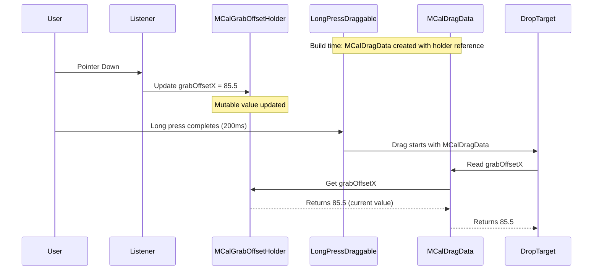

# Design Document: Multi-Day Drag Offset Fix

## Overview

This design addresses a timing issue in Flutter's `LongPressDraggable` widget that causes multi-day event drag-and-drop to use stale grab offset values. The solution introduces a mutable holder pattern that allows the grab offset to be updated after the drag data has been captured, ensuring accurate drop position calculations.

The fix is localized to two files: `mcal_callback_details.dart` (data model) and `mcal_draggable_event_tile.dart` (drag handling).

## Steering Document Alignment

### Technical Standards (tech.md)
- **Flutter Best Practices**: The solution works within Flutter's widget lifecycle constraints rather than fighting against them
- **Minimal API Surface Changes**: The fix uses internal implementation changes without modifying public APIs
- **Pattern Consistency**: The holder pattern is a recognized approach for handling mutable state in immutable data structures

### Project Structure (structure.md)
- Changes are contained within the existing widget layer (`lib/src/widgets/`)
- Data models remain in `mcal_callback_details.dart` following existing patterns
- No new files required; modifications to existing architecture

## Code Reuse Analysis

### Existing Components to Leverage
- **MCalDraggableEventTile**: Existing draggable wrapper - will be modified to use holder pattern
- **MCalDragData**: Existing drag data class - will be modified to use holder reference
- **LongPressDraggable**: Flutter's built-in drag widget - understanding its behavior is key

### Integration Points
- **MCalBuilderWrapper**: Wraps event tiles with draggable; no changes needed
- **_WeekRowWidgetState**: Drop target handling reads `grabOffsetX` from drag data; no changes needed (reads via getter)

## Architecture

The core insight is that Flutter's `LongPressDraggable` captures its `data` parameter at widget build time. When `onPointerDown` fires (after build), updating state and triggering a rebuild doesn't guarantee the draggable will use the new data before the drag starts.

The solution uses a mutable holder object that the `MCalDragData` references. When `onPointerDown` fires, we update the holder directly. Since `MCalDragData` reads from the holder via a getter, it always returns the current value.



## Components and Interfaces

### MCalGrabOffsetHolder
- **Purpose:** Mutable container for grab offset value that can be updated after MCalDragData is created
- **Interfaces:**
  - `double grabOffsetX` - mutable property for the X offset from tile's left edge
- **Dependencies:** None
- **Location:** `lib/src/widgets/mcal_callback_details.dart`

```dart
class MCalGrabOffsetHolder {
  double grabOffsetX = 0.0;
}
```

### MCalDragData (Modified)
- **Purpose:** Data transferred during drag operations; now reads grab offset from holder
- **Interfaces:**
  - `MCalCalendarEvent event` - the event being dragged (unchanged)
  - `DateTime sourceDate` - the segment start date (unchanged)
  - `double get grabOffsetX` - getter that reads from holder (changed from final field)
- **Dependencies:** MCalGrabOffsetHolder
- **Changes:**
  - Remove `final double grabOffsetX` field
  - Add `final MCalGrabOffsetHolder _grabOffsetHolder` private field
  - Add `double get grabOffsetX => _grabOffsetHolder.grabOffsetX` getter
  - Constructor takes `grabOffsetHolder` parameter instead of `grabOffsetX`

### _MCalDraggableEventTileState (Modified)
- **Purpose:** Manages drag state for event tiles
- **Changes:**
  - Replace `double _grabOffsetX` with `final MCalGrabOffsetHolder _grabOffsetHolder`
  - In `onPointerDown`: Update `_grabOffsetHolder.grabOffsetX` directly (no setState needed for this)
  - In `LongPressDraggable.data`: Pass holder reference to MCalDragData

## Data Models

### MCalGrabOffsetHolder (New)
```dart
class MCalGrabOffsetHolder {
  /// The X offset in pixels from the tile's left edge where the user tapped.
  double grabOffsetX = 0.0;
}
```

### MCalDragData (Modified)
```dart
class MCalDragData {
  final MCalCalendarEvent event;
  final DateTime sourceDate;
  final MCalGrabOffsetHolder _grabOffsetHolder;
  
  double get grabOffsetX => _grabOffsetHolder.grabOffsetX;
  
  MCalDragData({
    required this.event,
    required this.sourceDate,
    required MCalGrabOffsetHolder grabOffsetHolder,
  }) : _grabOffsetHolder = grabOffsetHolder;
}
```

## Error Handling

### Error Scenarios
1. **Holder not initialized before drag**
   - **Handling:** Holder initializes with `grabOffsetX = 0.0` by default
   - **User Impact:** Event would land at leftmost position if touched before pointer down fires (edge case)

2. **Multiple rapid drags on same tile**
   - **Handling:** Each pointer down updates the same holder; each drag reads current value
   - **User Impact:** Correct behavior - each drag uses its own grab position

## Testing Strategy

### Unit Testing
- Verify `MCalGrabOffsetHolder` value can be updated and read correctly
- Verify `MCalDragData.grabOffsetX` getter returns holder's current value
- Verify updating holder after MCalDragData creation reflects in getter

### Integration Testing
- Test multi-day event drag with grab at left edge (grabOffsetX ≈ 0)
- Test multi-day event drag with grab at center (grabOffsetX ≈ dayWidth * days/2)
- Test multi-day event drag with grab at right edge (grabOffsetX ≈ dayWidth * days)
- Test dragging same event twice with different grab positions
- Verify all existing drag-and-drop tests continue to pass

### End-to-End Testing
- Drag a 5-day event by grabbing its center; verify it lands with correct alignment
- Drag a multi-week event from one week to another; verify grab position is maintained
- Drag events from different positions and verify drop targets highlight correctly
