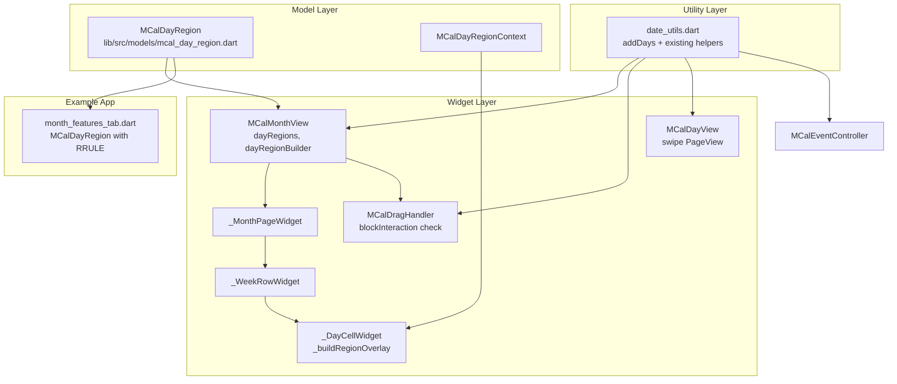

# Design Document

## Overview

This design covers three fully-implemented enhancements delivered after the `month-day-view-api-alignment` spec:

1. **Day View Page Swiping Improvements** — refinement of the PageView-based swipe navigation introduced in the alignment spec, fixing page/date synchronisation, drag coexistence, and RTL.
2. **`MCalDayRegion`** — a new public model class for annotating and optionally blocking entire calendar days in Month View, the day-level counterpart of `MCalTimeRegion`.
3. **DST-Safe `addDays()` Utility** — a centralised `addDays(DateTime, int)` function in `date_utils.dart` that replaces all inline `DateTime(y, m, d + N)` arithmetic throughout the core library.

All code is already merged into the working tree; this design document captures the technical decisions made during implementation for the spec record.

## Steering Document Alignment

### Technical Standards (tech.md)

- **DST-safe arithmetic**: `addDays()` uses the `DateTime` constructor form (`DateTime(y, m, d + N, h, min, s, ms, us)`) rather than `Duration` addition, consistent with the comment pattern already established in `mcal_event_controller.dart`.
- **Builder-with-default pattern**: `dayRegionBuilder` receives a pre-built default widget as its third argument, matching the pattern established for all Day View and Month View builders in the alignment spec.
- **RFC 5545 RRULE**: `MCalDayRegion.recurrenceRule` uses the same string format as `MCalTimeRegion.recurrenceRule` and `MCalRecurrenceRule`, maintaining format consistency.
- **MCal prefix**: New public class `MCalDayRegion` and context class `MCalDayRegionContext` follow the established `MCal` prefix convention.
- **Dart 3 / Flutter SDK**: All code uses null-safety, `const` constructors, and `withValues(alpha:)` instead of the deprecated `withOpacity`.

### Project Structure (structure.md)

- `MCalDayRegion` lives in `lib/src/models/mcal_day_region.dart`, consistent with other models (`mcal_time_region.dart`, `mcal_calendar_event.dart`).
- Exported via `lib/multi_calendar.dart` alongside other model exports.
- `addDays()` is added to `lib/src/utils/date_utils.dart` alongside the existing date utility functions (`getMonthRange`, `daysBetween`, `dateOnly`, etc.).
- Unit tests for `addDays()` are added to `test/utils/date_utils_test.dart`, alongside the existing tests for the same file.
- Widget integration (`dayRegions`, `dayRegionBuilder`, rendering, blocking) is contained entirely within `lib/src/widgets/mcal_month_view.dart` with no new widget files.

## Code Reuse Analysis

### Existing Components Leveraged

- **`MCalTimeRegion`** (`lib/src/models/mcal_time_region.dart`): Structural template for `MCalDayRegion` — same field pattern (`id`, `color`, `text`, `blockInteraction`, `recurrenceRule`), same RRULE string format.
- **`date_utils.dart` — `dateOnly()`, `daysBetween()`**: Used within `MCalMonthView` for date normalisation and delta computation alongside the new `addDays()`.
- **`MCalMonthView` widget tree**: `dayRegions` and `dayRegionBuilder` are threaded through the existing four-layer widget hierarchy (`MCalMonthView` → `_MonthPageWidget` → `_WeekRowWidget` → `_DayCellWidget`) using the same propagation pattern as all other per-cell parameters.
- **`_DayCellWidgetState.build()`**: The region overlay stack is injected into the existing `cellContent` build without restructuring — the `Stack` is only introduced when `applicableRegions` is non-empty.
- **`MCalDragHandler` / `_processDragMove` / `validationCallback`**: The blocking check reuses the existing `onDragWillAccept` short-circuit path; blocking regions simply produce an early `isValid = false` before the consumer callback is reached.
- **`addDays()` everywhere**: Replaces the identical `DateTime(d.year, d.month, d.day + N)` pattern already documented in comments as "DST-safe arithmetic" in four files.
- **Day View `PageView.builder`** (`mcal_day_view.dart`): The swipe improvements refine code introduced in task 8 of the alignment spec; no new architectural components are added.

### Integration Points

- **`lib/multi_calendar.dart`**: `MCalDayRegion` and `MCalDayRegionContext` added to the `export 'src/models/mcal_day_region.dart'` line.
- **`month_features_tab.dart` (example app)**: The blackout-days feature is refactored from manual `Set<DateTime>` computation to `List<MCalDayRegion>` with recurrence rules, demonstrating the API with real recurring patterns.

## Architecture



### Modular Design Principles

- **Single File Responsibility**: `MCalDayRegion` is a pure model/logic class with no widget imports beyond `Color` and `IconData`. All rendering is in `mcal_month_view.dart`.
- **No New Widget Files**: Region overlays are rendered by a private `_buildRegionOverlay()` helper on `_DayCellWidgetState`, keeping file count stable.
- **Utility Centralisation**: `addDays()` is a single 10-line function that replaces ~25 scattered constructs across 4 files, becoming the single source of truth for calendar-day arithmetic.

## Components and Interfaces

### Component 1: `MCalDayRegion` (Model)

- **Purpose:** Represents a day-level region with optional styling (`color`, `text`, `icon`), interaction control (`blockInteraction`), and RFC 5545 recurrence (`recurrenceRule`). Exposes `appliesTo(DateTime)` for O(1) membership testing.
- **Interfaces:**
  ```dart
  class MCalDayRegion {
    const MCalDayRegion({
      required String id,
      required DateTime date,
      Color? color,
      String? text,
      IconData? icon,
      bool blockInteraction = false,
      String? recurrenceRule,
      Map<String, dynamic>? customData,
    });
    bool appliesTo(DateTime queryDate);
  }
  ```
- **Dependencies:** `dart:core`, `package:flutter/material.dart` (Color, IconData only — no widgets).
- **Reuses:** Field shape and RRULE string contract from `MCalTimeRegion`.

### Component 2: `MCalDayRegionContext` (Context Model)

- **Purpose:** Passed to `dayRegionBuilder` so the builder has full cell context alongside the region.
- **Interfaces:**
  ```dart
  class MCalDayRegionContext {
    final MCalDayRegion region;
    final DateTime date;
    final bool isCurrentMonth;
    final bool isToday;
  }
  ```
- **Dependencies:** `MCalDayRegion`.
- **Reuses:** Same context-object pattern as `MCalDayCellContext`, `MCalTimeLabelContext`, etc.

### Component 3: `MCalMonthView` — `dayRegions` and `dayRegionBuilder` parameters

- **Purpose:** Accepts the list of regions and optional custom builder. Threads both down the widget tree and renders overlays in each cell.
- **Interfaces (new parameters):**
  ```dart
  MCalMonthView({
    List<MCalDayRegion> dayRegions = const [],
    Widget Function(BuildContext, MCalDayRegionContext, Widget)? dayRegionBuilder,
    // ... all existing parameters unchanged
  })
  ```
- **Rendering (in `_DayCellWidgetState.build`):**
  1. Collect `applicableRegions = widget.dayRegions.where((r) => r.appliesTo(widget.date))`.
  2. If non-empty, wrap `cellContent` in a `Stack(fit: StackFit.expand)` with region overlays as the bottom layer.
  3. Each overlay is built by `_buildRegionOverlay()`: renders a `Container(color: region.color)` with optional `Row(icon + text)` at bottom-center; passes result to `dayRegionBuilder` if set.
- **Drop blocking (in `_processDragMove` and `validationCallback`):**
  1. Before calling `onDragWillAccept`, iterate `DateTime d = start; !d.isAfter(end); d = addDays(d, 1)`.
  2. If any `d` matches a region where `blockInteraction == true`, set `isValid = false` and break.
  3. Only reach `onDragWillAccept` when the library-level check passes.
- **Dependencies:** `MCalDayRegion`, `addDays`, existing cell/drag infrastructure.
- **Reuses:** `_MonthPageWidget → _WeekRowWidget → _DayCellWidget` propagation chain, `StackFit.expand` overlay pattern from the layered architecture spec.

### Component 4: `addDays()` (Utility)

- **Purpose:** DST-safe calendar-day arithmetic preserving all time-of-day components.
- **Interface:**
  ```dart
  /// Located in lib/src/utils/date_utils.dart (public, exported).
  DateTime addDays(DateTime date, int days) {
    return DateTime(
      date.year, date.month, date.day + days,
      date.hour, date.minute, date.second,
      date.millisecond, date.microsecond,
    );
  }
  ```
- **Why not `Duration`:** `Duration(days: 1)` adds 86 400 seconds. On a DST "spring forward" day the wall clock jumps from 01:59 to 03:00, so midnight + 86 400 s lands at 01:00 the next day, not midnight. The constructor form lets Dart resolve the correct local midnight directly.
- **Call-site replacements:** 25 locations across `mcal_day_view.dart`, `mcal_month_view.dart`, `mcal_drag_handler.dart`, `mcal_event_controller.dart`. Not replaced in test files or when time components come from a *different* source datetime (e.g., `DateTime(newStart.day + span, master.end.hour, ...)` — those are intentional mixed-source constructs).
- **Dependencies:** None beyond `dart:core`.
- **Reuses:** Already-established DST-safe comment pattern in `mcal_event_controller.dart`.

### Component 5: Day View Swipe Navigation Improvements

- **Purpose:** Ensure the swipe PageView stays in sync with the controller's display date and does not interfere with drag-and-drop.
- **Key refinements over the alignment-spec implementation:**
  - `_pageIndexToDate()` uses `addDays(_swipeReferenceDate!, dayOffset)` (DST-safe) instead of `DateTime(y, m, d + offset)`.
  - Navigation helpers (`_handleNavigatePrevious`, `_handleNavigateNext`, `_handleResizeNavigatePrevious`, `_handleResizeNavigateNext`) and boundary guards (`_canGoPrevious`, `_canGoNext`) all use `addDays(_displayDate, ±1)`.
  - Keyboard-move delta also uses `addDays(start/end, deltaDays)`, preserving all time components.
- **Dependencies:** `addDays`, existing `PageView.builder` infrastructure, `MCalEventController`.

## Data Models

### MCalDayRegion

```
MCalDayRegion (immutable, const-constructible)
  id:               String          — unique identifier; used as widget key
  date:             DateTime        — anchor date; only date part (y/m/d) is significant
  color:            Color?          — semi-transparent background fill; null = no fill
  text:             String?         — short label rendered at cell bottom
  icon:             IconData?       — icon rendered alongside text
  blockInteraction: bool            — if true, library rejects drag-and-drop onto this day
  recurrenceRule:   String?         — RFC 5545 RRULE string; null = single occurrence
  customData:       Map<String,dynamic>? — arbitrary consumer data passed through to builder
```

### MCalDayRegionContext

```
MCalDayRegionContext (immutable, const-constructible)
  region:           MCalDayRegion   — the region being rendered
  date:             DateTime        — the cell's calendar date
  isCurrentMonth:   bool            — true when date is in the displayed month
  isToday:          bool            — true when date is today
```

### RRULE Interpreter (internal to MCalDayRegion)

The simplified interpreter inside `_expandedOccurrences()` supports:

| Pattern | Fields consumed |
|---|---|
| `FREQ=DAILY` | `INTERVAL`, `UNTIL`, `COUNT` |
| `FREQ=WEEKLY` | `BYDAY` (MO/TU/WE/TH/FR/SA/SU), `INTERVAL`, `UNTIL`, `COUNT` |
| `FREQ=MONTHLY` | `BYMONTHDAY`, `INTERVAL`, `UNTIL`, `COUNT` |
| `FREQ=YEARLY` | `BYMONTH`, `BYMONTHDAY`, `INTERVAL`, `UNTIL`, `COUNT` |

For unsupported patterns the method silently returns `[]` (no match). Consumers needing full RFC 5545 expansion should pre-compute dates and pass one `MCalDayRegion` per date.

## Error Handling

### Error Scenarios

1. **Unsupported RRULE pattern** (e.g., `FREQ=HOURLY`, `BYSETPOS`, positional `BYDAY` modifiers like `1MO`):
   - **Handling:** `_expandedOccurrences()` returns `[]`; `appliesTo()` returns `false`. Region silently does not match any date.
   - **Consumer impact:** Region is not rendered and does not block. Documented in dartdoc — consumers should pre-expand complex rules.

2. **Malformed UNTIL date in RRULE** (e.g., `UNTIL=NOTADATE`):
   - **Handling:** `_parseUntil()` catches the parse exception and returns `null`, treating it as no UNTIL limit.
   - **Consumer impact:** Region behaves as if no UNTIL was specified.

3. **`addDays()` with very large delta** (e.g., ±10 000 days):
   - **Handling:** Dart's `DateTime` constructor handles integer day overflow natively via calendar arithmetic; no overflow risk.
   - **Consumer impact:** None.

4. **Empty `dayRegions` list** (the default):
   - **Handling:** The per-cell `where` filter short-circuits immediately; no `Stack` is injected; cell renders identically to the no-regions case.
   - **Consumer impact:** Zero performance overhead when the feature is not used.

5. **Swipe PageView and drag gesture conflict**:
   - **Handling:** Flutter's gesture arena resolves this naturally — vertical drag gestures (time-grid scroll) and the long-press that initiates event drag both take priority over the horizontal PageView swipe. The swipe PageView only responds when no other gesture has claimed the pointer.
   - **Consumer impact:** Drag-and-drop is unaffected when swipe navigation is enabled.

## Testing Strategy

### Unit Testing

- **`addDays()`** — `test/utils/date_utils_test.dart`: 20 tests covering zero/positive/negative delta, month/year rollover, leap-year Feb 28/29, ±365/366 large deltas, full time-component preservation (including microseconds), DST-invariant calendar-day progression over 400 consecutive days (verified via `daysBetween()` which is UTC-based).
- **`MCalDayRegion.appliesTo()`** — covered via the existing `MCalDayRegion` test plan; the RRULE interpreter is exercised with `FREQ=WEEKLY;BYDAY=SA,SU`, `FREQ=YEARLY`, `FREQ=DAILY;COUNT=`, and anchor-date boundary cases.

### Widget Testing

- **`MCalMonthView` with `dayRegions`** — verify region overlay renders (`find.byType(Container)` with correct color) for applicable dates; verify no overlay for non-applicable dates.
- **Drop blocking** — simulate drag hover over a blocking-region cell; assert `isValid = false` is set and `onDragWillAccept` is NOT called.
- **`dayRegionBuilder`** — supply a builder that returns a sentinel widget; verify it appears in the cell.
- **Day View swipe** — existing swipe tests from the alignment spec continue to pass; `_canGoPrevious` and `_canGoNext` boundary tests verify correct behavior with `minDate`/`maxDate`.

### Integration Testing

- **Example app compilation** — `month_features_tab.dart` with `MCalDayRegion` recurrence patterns compiles and renders without error.
- **Regression** — full `flutter test` suite passes; the 14 pre-existing test failures (unrelated to these changes, confirmed by `git stash` verification) remain unchanged.
