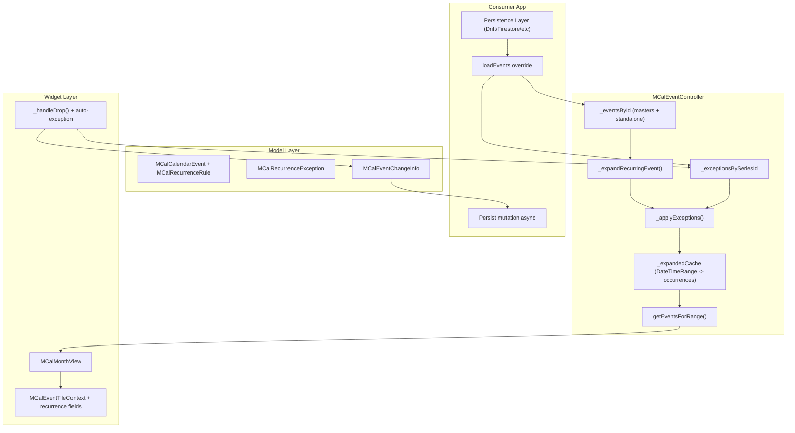
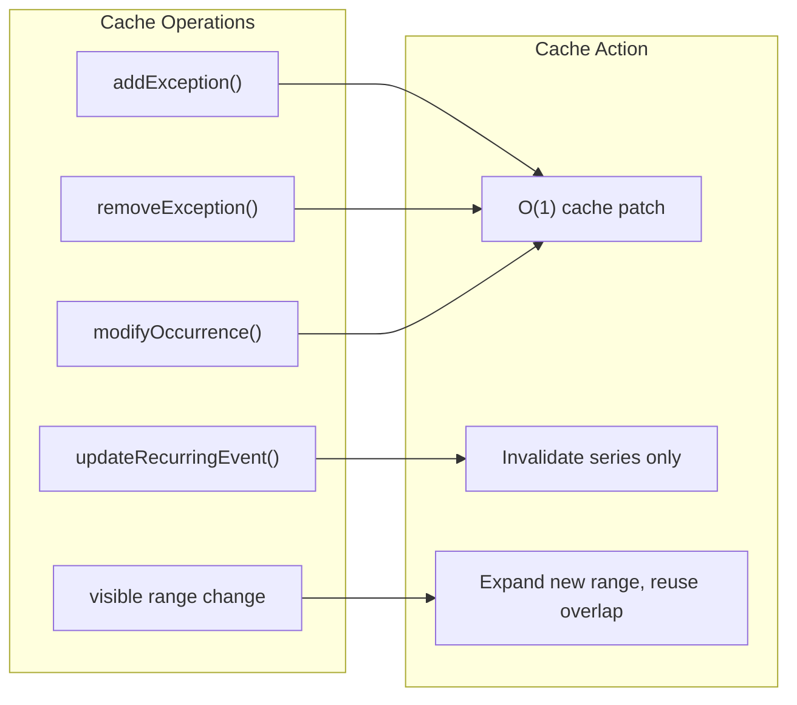

# Design Document: Recurring Events

## Overview

This design adds recurring event support across three layers of the multi_calendar package:
1. **Model layer** — New wrapper types (`MCalRecurrenceRule`, `MCalWeekDay`, `MCalRecurrenceException`, `MCalEventChangeInfo`) and an updated `MCalCalendarEvent` model.
2. **Controller layer** — `MCalEventController` gains a recurrence expansion engine, exception store, granular caching, change notification metadata, and series management methods.
3. **Widget layer** — `MCalEventTileContext` is enriched with recurrence metadata; drag-and-drop auto-creates exceptions; `MCalEventDroppedDetails` gains recurrence fields.
4. **Example app** — A full-featured recurrence editor dialog (not part of the package).

Internally, the `teno_rrule` package handles RFC 5545 expansion. It is imported only in `mcal_recurrence_rule.dart` and never appears in the public API.

## Steering Document Alignment

### Technical Standards (tech.md)
- **Widget-based Architecture / Controller Pattern**: All recurring event logic lives in `MCalEventController`, consistent with the controller pattern. Views receive expanded occurrences through the existing `getEventsForRange()` path.
- **Builder Pattern**: Recurrence metadata flows to builder callbacks via `MCalEventTileContext`, enabling custom rendering without package changes.
- **Delegation for Storage**: The controller manages recurrence state in memory. Persistence is the consumer's responsibility — mutation methods return enough info for async persistence.

### Project Structure (structure.md)
- New model files in `lib/src/models/`.
- Controller changes in `lib/src/controllers/mcal_event_controller.dart`.
- Context enrichment in `lib/src/widgets/mcal_month_view_contexts.dart`.
- Drag-drop detail changes in `lib/src/widgets/mcal_callback_details.dart`.
- Example editor in `example/lib/widgets/` and integrated into the Features demo.

## Code Reuse Analysis

### Existing Components to Leverage
- **`MCalCalendarEvent`** (`lib/src/models/mcal_calendar_event.dart`): Extended with `recurrenceRule` field. `copyWith`, `==`, `hashCode` patterns already established.
- **`MCalEventController`** (`lib/src/controllers/mcal_event_controller.dart`): `_eventsById` map, `getEventsForRange()`, `addEvents()`, `removeEvents()`, `notifyListeners()` — all reused and extended.
- **`MCalEventTileContext`** (`lib/src/widgets/mcal_month_view_contexts.dart`): Extended with recurrence fields following existing optional-field pattern (like `isDropTargetPreview`, `dropValid`).
- **`MCalEventDroppedDetails`** (`lib/src/widgets/mcal_callback_details.dart`): Extended with `isRecurring` and `seriesId` fields.
- **`_handleDrop()`** (`lib/src/widgets/mcal_month_view.dart`): Modified to detect recurring occurrences and create reschedule exceptions.

### Integration Points
- **`getEventsForRange()`** — Enhanced to transparently expand recurring events and apply exceptions before returning.
- **`_handleDrop()`** — Enhanced to check if the dropped event is a recurring occurrence and auto-create a reschedule exception.
- **Month view event construction** — Where `MCalEventTileContext` is built (in `_WeekRowWidget` and `_buildDropTargetTileEventBuilder`), recurrence metadata is now populated.

## Architecture

### Data Flow



### Cache Strategy



## Components and Interfaces

### MCalFrequency (NEW — `lib/src/models/mcal_recurrence_rule.dart`)

```dart
enum MCalFrequency { daily, weekly, monthly, yearly }
```

### MCalWeekDay (NEW — `lib/src/models/mcal_recurrence_rule.dart`)

```dart
class MCalWeekDay {
  final int dayOfWeek; // DateTime.monday..DateTime.sunday
  final int? occurrence; // e.g., 1 = first, -1 = last, null = every

  const MCalWeekDay(this.dayOfWeek, [this.occurrence]);

  // Convenience constructors
  const MCalWeekDay.every(this.dayOfWeek) : occurrence = null;
  const MCalWeekDay.nth(this.dayOfWeek, int n) : occurrence = n;

  // == , hashCode, toString, copyWith
}
```

### MCalRecurrenceRule (NEW — `lib/src/models/mcal_recurrence_rule.dart`)

```dart
class MCalRecurrenceRule {
  final MCalFrequency frequency;
  final int interval; // default 1
  final int? count;
  final DateTime? until;
  final Set<MCalWeekDay>? byWeekDays;
  final Set<int>? byMonthDays;
  final Set<int>? byMonths;
  final Set<int>? bySetPositions;
  final int? weekStart; // DateTime.monday..DateTime.sunday

  const MCalRecurrenceRule({
    required this.frequency,
    this.interval = 1,
    this.count,
    this.until,
    this.byWeekDays,
    this.byMonthDays,
    this.byMonths,
    this.bySetPositions,
    this.weekStart,
  });

  factory MCalRecurrenceRule.fromRruleString(String rrule);
  String toRruleString();

  /// Expand occurrences within range. Internally converts to teno_rrule,
  /// calls between(), and converts back. Handles UTC conversion transparently.
  List<DateTime> getOccurrences({
    required DateTime start, // series start (DTSTART)
    required DateTime after,
    required DateTime before,
  });

  // copyWith, ==, hashCode, toString
}
```

**Internal conversion** (private, same file):
```dart
// Private: converts MCalRecurrenceRule to teno_rrule RecurrenceRule
RecurrenceRule _toTenoRrule(DateTime dtStart) { ... }

// Private: converts teno_rrule RecurrenceRule to MCalRecurrenceRule
MCalRecurrenceRule _fromTenoRrule(RecurrenceRule rule) { ... }
```

### MCalRecurrenceException (NEW — `lib/src/models/mcal_recurrence_exception.dart`)

```dart
enum MCalExceptionType { deleted, rescheduled, modified }

class MCalRecurrenceException {
  final MCalExceptionType type;
  final DateTime originalDate;
  final DateTime? newDate; // only for rescheduled
  final MCalCalendarEvent? modifiedEvent; // only for modified

  const MCalRecurrenceException.deleted({required this.originalDate})
      : type = MCalExceptionType.deleted,
        newDate = null,
        modifiedEvent = null;

  const MCalRecurrenceException.rescheduled({
    required this.originalDate,
    required DateTime this.newDate,
  }) : type = MCalExceptionType.rescheduled,
       modifiedEvent = null;

  const MCalRecurrenceException.modified({
    required this.originalDate,
    required MCalCalendarEvent this.modifiedEvent,
  }) : type = MCalExceptionType.modified,
       newDate = null;

  // copyWith, ==, hashCode, toString
}
```

### MCalEventChangeInfo (NEW — `lib/src/models/mcal_event_change_info.dart`)

```dart
enum MCalChangeType {
  eventAdded,
  eventUpdated,
  eventRemoved,
  exceptionAdded,
  exceptionRemoved,
  seriesSplit,
  bulkChange,
}

class MCalEventChangeInfo {
  final MCalChangeType type;
  final Set<String> affectedEventIds;
  final DateTimeRange? affectedDateRange;

  const MCalEventChangeInfo({
    required this.type,
    required this.affectedEventIds,
    this.affectedDateRange,
  });
}
```

### MCalCalendarEvent (MODIFIED — `lib/src/models/mcal_calendar_event.dart`)

- **New field**: `final MCalRecurrenceRule? recurrenceRule;`
- **Constructor**: Add `this.recurrenceRule` optional parameter.
- **copyWith**: Add `recurrenceRule` parameter. To allow clearing (setting to null), use a sentinel pattern or a nullable wrapper.
- **==, hashCode**: Include `recurrenceRule`.

### MCalEventController (MODIFIED — `lib/src/controllers/mcal_event_controller.dart`)

#### New Internal State

```dart
// Exception store: seriesId -> {originalDate -> exception}
final Map<String, Map<DateTime, MCalRecurrenceException>> _exceptionsBySeriesId = {};

// Expansion cache: seriesId -> List<MCalCalendarEvent> (expanded for current range)
final Map<String, List<MCalCalendarEvent>> _expandedBySeriesId = {};

// The date range for which _expandedBySeriesId is valid
DateTimeRange? _expandedRange;

// Last change info for targeted view rebuilds
MCalEventChangeInfo? _lastChange;
```

#### Enhanced `getEventsForRange()`

```dart
List<MCalCalendarEvent> getEventsForRange(DateTimeRange range) {
  final results = <MCalCalendarEvent>[];

  for (final event in _eventsById.values) {
    if (event.recurrenceRule != null) {
      // Get expanded occurrences (from cache or expand fresh)
      final occurrences = _getExpandedOccurrences(event, range);
      results.addAll(occurrences);
    } else {
      // Existing logic for standalone events
      if (!event.start.isAfter(range.end) && !event.end.isBefore(range.start)) {
        results.add(event);
      }
    }
  }

  return results;
}
```

#### Private Expansion Method

```dart
List<MCalCalendarEvent> _getExpandedOccurrences(
  MCalCalendarEvent master,
  DateTimeRange range,
) {
  // Check cache
  if (_expandedRange != null &&
      _expandedBySeriesId.containsKey(master.id) &&
      _rangeContains(_expandedRange!, range)) {
    return _expandedBySeriesId[master.id]!
        .where((e) => !e.start.isAfter(range.end) && !e.end.isBefore(range.start))
        .toList();
  }

  // Expand using MCalRecurrenceRule.getOccurrences()
  final duration = master.end.difference(master.start);
  final occurrenceDates = master.recurrenceRule!.getOccurrences(
    start: master.start,
    after: range.start,
    before: range.end,
  );

  final exceptions = _exceptionsBySeriesId[master.id] ?? {};
  final expanded = <MCalCalendarEvent>[];

  for (final date in occurrenceDates) {
    final dateKey = _normalizeDate(date);
    final exception = exceptions[dateKey];

    if (exception != null) {
      switch (exception.type) {
        case MCalExceptionType.deleted:
          continue; // Skip this occurrence
        case MCalExceptionType.rescheduled:
          expanded.add(master.copyWith(
            id: '${master.id}_${dateKey.toIso8601String()}',
            start: exception.newDate,
            end: exception.newDate!.add(duration),
            occurrenceId: dateKey.toIso8601String(),
          ));
        case MCalExceptionType.modified:
          expanded.add(exception.modifiedEvent!.copyWith(
            occurrenceId: dateKey.toIso8601String(),
          ));
      }
    } else {
      expanded.add(master.copyWith(
        id: '${master.id}_${dateKey.toIso8601String()}',
        start: date,
        end: date.add(duration),
        occurrenceId: dateKey.toIso8601String(),
      ));
    }
  }

  // Cache
  _expandedBySeriesId[master.id] = expanded;
  return expanded;
}
```

#### Exception Methods

```dart
MCalRecurrenceException addException(String seriesId, MCalRecurrenceException exception) {
  _exceptionsBySeriesId.putIfAbsent(seriesId, () => {});
  final dateKey = _normalizeDate(exception.originalDate);
  _exceptionsBySeriesId[seriesId]![dateKey] = exception;

  // Patch cache in O(1) instead of re-expanding
  _patchCacheForException(seriesId, exception);

  _lastChange = MCalEventChangeInfo(
    type: MCalChangeType.exceptionAdded,
    affectedEventIds: {seriesId},
    affectedDateRange: _computeAffectedRange(exception),
  );
  notifyListeners();
  return exception;
}

void addExceptions(String seriesId, List<MCalRecurrenceException> exceptions) {
  _exceptionsBySeriesId.putIfAbsent(seriesId, () => {});
  for (final ex in exceptions) {
    _exceptionsBySeriesId[seriesId]![_normalizeDate(ex.originalDate)] = ex;
  }
  // Invalidate series cache (batch = re-expand is more efficient than N patches)
  _expandedBySeriesId.remove(seriesId);
  _lastChange = MCalEventChangeInfo(
    type: MCalChangeType.bulkChange,
    affectedEventIds: {seriesId},
  );
  notifyListeners();
}

MCalRecurrenceException removeException(String seriesId, DateTime originalDate) {
  final dateKey = _normalizeDate(originalDate);
  final removed = _exceptionsBySeriesId[seriesId]?.remove(dateKey);
  if (removed != null) {
    _patchCacheForExceptionRemoval(seriesId, removed);
    _lastChange = MCalEventChangeInfo(
      type: MCalChangeType.exceptionRemoved,
      affectedEventIds: {seriesId},
      affectedDateRange: _computeAffectedRange(removed),
    );
    notifyListeners();
  }
  return removed!;
}

List<MCalRecurrenceException> getExceptions(String seriesId) {
  return _exceptionsBySeriesId[seriesId]?.values.toList() ?? [];
}

MCalRecurrenceException modifyOccurrence(
  String seriesId,
  DateTime originalDate,
  MCalCalendarEvent modifiedEvent,
) {
  final exception = MCalRecurrenceException.modified(
    originalDate: originalDate,
    modifiedEvent: modifiedEvent,
  );
  return addException(seriesId, exception);
}
```

#### Series Management Methods

```dart
void updateRecurringEvent(MCalCalendarEvent event) {
  assert(event.recurrenceRule != null);
  _eventsById[event.id] = event;
  _expandedBySeriesId.remove(event.id); // Invalidate this series only
  _lastChange = MCalEventChangeInfo(
    type: MCalChangeType.eventUpdated,
    affectedEventIds: {event.id},
  );
  notifyListeners();
}

void deleteRecurringEvent(String eventId) {
  _eventsById.remove(eventId);
  _exceptionsBySeriesId.remove(eventId);
  _expandedBySeriesId.remove(eventId);
  _lastChange = MCalEventChangeInfo(
    type: MCalChangeType.eventRemoved,
    affectedEventIds: {eventId},
  );
  notifyListeners();
}

String splitSeries(String seriesId, DateTime fromDate) {
  final master = _eventsById[seriesId]!;
  assert(master.recurrenceRule != null);

  // 1. Truncate original series to end before fromDate
  final dayBefore = fromDate.subtract(const Duration(days: 1));
  final truncatedRule = master.recurrenceRule!.copyWith(
    until: dayBefore,
    count: null, // clear count, use until instead
  );
  _eventsById[seriesId] = master.copyWith(recurrenceRule: truncatedRule);

  // 2. Create new master starting at fromDate
  final newId = '${seriesId}_split_${fromDate.toIso8601String()}';
  final duration = master.end.difference(master.start);
  final newMaster = master.copyWith(
    id: newId,
    start: fromDate,
    end: fromDate.add(duration),
    recurrenceRule: master.recurrenceRule, // same pattern
  );
  _eventsById[newId] = newMaster;

  // 3. Move exceptions on or after fromDate to new series
  final originalExceptions = _exceptionsBySeriesId[seriesId];
  if (originalExceptions != null) {
    final toMove = <DateTime, MCalRecurrenceException>{};
    originalExceptions.removeWhere((date, ex) {
      if (!date.isBefore(fromDate)) {
        toMove[date] = ex;
        return true;
      }
      return false;
    });
    if (toMove.isNotEmpty) {
      _exceptionsBySeriesId[newId] = toMove;
    }
  }

  // 4. Invalidate caches for both series
  _expandedBySeriesId.remove(seriesId);
  _expandedBySeriesId.remove(newId);

  _lastChange = MCalEventChangeInfo(
    type: MCalChangeType.seriesSplit,
    affectedEventIds: {seriesId, newId},
  );
  notifyListeners();
  return newId;
}
```

#### Cache Patch Methods (O(1) per exception)

```dart
void _patchCacheForException(String seriesId, MCalRecurrenceException exception) {
  final cached = _expandedBySeriesId[seriesId];
  if (cached == null) return;

  final dateKey = _normalizeDate(exception.originalDate);

  switch (exception.type) {
    case MCalExceptionType.deleted:
      cached.removeWhere((e) => e.occurrenceId == dateKey.toIso8601String());
    case MCalExceptionType.rescheduled:
      final idx = cached.indexWhere((e) => e.occurrenceId == dateKey.toIso8601String());
      if (idx >= 0) {
        final master = _eventsById[seriesId]!;
        final duration = master.end.difference(master.start);
        cached[idx] = master.copyWith(
          id: '${seriesId}_${dateKey.toIso8601String()}',
          start: exception.newDate,
          end: exception.newDate!.add(duration),
          occurrenceId: dateKey.toIso8601String(),
        );
      }
    case MCalExceptionType.modified:
      final idx = cached.indexWhere((e) => e.occurrenceId == dateKey.toIso8601String());
      if (idx >= 0) {
        cached[idx] = exception.modifiedEvent!.copyWith(
          occurrenceId: dateKey.toIso8601String(),
        );
      }
  }
}
```

### MCalEventTileContext (MODIFIED — `lib/src/widgets/mcal_month_view_contexts.dart`)

New fields added to the constructor and class:

```dart
class MCalEventTileContext {
  // ... existing fields ...

  /// True for occurrences of recurring events.
  final bool isRecurring;

  /// The master event's ID, if this is a recurring occurrence.
  final String? seriesId;

  /// The recurrence rule from the master event.
  final MCalRecurrenceRule? recurrenceRule;

  /// The full master event (for accessing original fields).
  final MCalCalendarEvent? masterEvent;

  /// True if this occurrence has been modified or rescheduled.
  final bool isException;
}
```

Population happens in the month view where `MCalEventTileContext` is constructed (in `_WeekRowWidget.build` and related methods). The controller is consulted to determine if an event is a recurring occurrence (by checking `occurrenceId` and looking up the master).

### MCalEventDroppedDetails (MODIFIED — `lib/src/widgets/mcal_callback_details.dart`)

```dart
class MCalEventDroppedDetails {
  // ... existing fields ...

  /// Whether the dropped event is a recurring occurrence.
  final bool isRecurring;

  /// The master event's ID, if recurring.
  final String? seriesId;
}
```

### Drag-Drop Integration (`_handleDrop` in `mcal_month_view.dart`)

After the existing drop logic, before notifying:

```dart
void _handleDrop(DragTargetDetails<MCalDragData> details) {
  // ... existing drag calculation logic ...

  // Detect if this is a recurring occurrence
  final isRecurring = event.occurrenceId != null;
  String? seriesId;
  if (isRecurring) {
    seriesId = _extractSeriesId(event.id); // e.g., strip the occurrence suffix
  }

  // Call onEventDropped with recurrence info
  if (widget.onEventDropped != null) {
    final shouldKeep = widget.onEventDropped!(
      context,
      MCalEventDroppedDetails(
        event: event,
        oldStartDate: event.start,
        oldEndDate: event.end,
        newStartDate: newStart,
        newEndDate: newEnd,
        isRecurring: isRecurring,
        seriesId: seriesId,
      ),
    );

    if (shouldKeep && isRecurring && seriesId != null) {
      // Auto-create reschedule exception
      widget.controller.addException(
        seriesId,
        MCalRecurrenceException.rescheduled(
          originalDate: event.start,
          newDate: newStart,
        ),
      );
    } else if (shouldKeep && !isRecurring) {
      // Existing behavior: update event in controller
      widget.controller.addEvents([updatedEvent]);
    }
  }
}
```

### Example App Editor

#### File: `example/lib/widgets/recurrence_editor_dialog.dart` (NEW)

A `StatefulWidget` dialog that edits `MCalRecurrenceRule`:

- **Frequency picker**: `SegmentedButton<MCalFrequency>` or `DropdownButton`
- **Interval input**: `TextFormField` with number keyboard
- **Day-of-week selector**: `FilterChip` row for Mon-Sun (shown when frequency = weekly)
- **Day-of-month selector**: `Wrap` of number chips 1-31 (shown when frequency = monthly)
- **End condition**: Radio group (Never / After N occurrences / Until date) with appropriate inputs
- **Week start**: `DropdownButton` (Mon-Sun)
- Returns `MCalRecurrenceRule?` via `Navigator.pop`

#### File: `example/lib/widgets/recurrence_edit_scope_dialog.dart` (NEW)

Simple dialog presented when editing a recurring occurrence:
- Three `ListTile` options: "This event", "This and following events", "All events"
- Returns an enum value via `Navigator.pop`

#### Integration into Features Demo

The existing Features demo's event tap handler is enhanced:
- On event tap → show an edit dialog that includes the recurrence editor
- On event long-press → show delete confirmation, with "This event" / "All events" options for recurring events
- New "Create Recurring Event" button in the control panel

## Data Models

### Occurrence ID Scheme

Each expanded occurrence gets a deterministic ID and occurrenceId:
- `id`: `"{masterEventId}_{normalizedDateIso8601}"` — e.g., `"event-1_2024-06-15T00:00:00.000"`
- `occurrenceId`: `normalizedDateIso8601` — e.g., `"2024-06-15T00:00:00.000"`

The `_normalizeDate()` helper strips time components for all-day events and normalizes to midnight for consistent keying.

### Exception Keying

Exceptions are keyed by `_normalizeDate(originalDate)` within each series. This ensures that looking up whether an occurrence has an exception is O(1).

## Error Handling

### Error Scenarios

1. **`count` and `until` both provided**
   - **Handling**: `MCalRecurrenceRule` constructor throws `ArgumentError`
   - **User Impact**: Developer gets immediate, clear error at construction time

2. **Unsupported frequency in RRULE string**
   - **Handling**: `fromRruleString` throws `ArgumentError` with message listing supported frequencies
   - **User Impact**: Developer gets clear error at parse time

3. **Exception for non-existent series**
   - **Handling**: `addException` with unknown `seriesId` stores the exception silently (the master may be loaded later via `loadEvents`)
   - **User Impact**: None — exception is applied when the master is loaded

4. **Exception date doesn't match any occurrence**
   - **Handling**: Silently ignored during expansion (no matching occurrence to patch)
   - **User Impact**: None

5. **`splitSeries` with non-recurring event**
   - **Handling**: Throws `ArgumentError`
   - **User Impact**: Developer gets immediate error

## Testing Strategy

### Unit Testing

- **`MCalRecurrenceRule`**: Construction, validation, `fromRruleString`/`toRruleString` round-trip, `getOccurrences` for each frequency, `byWeekDays`/`byMonthDays`/`byMonths` filtering, `weekStart` behavior, `copyWith`/`==`/`hashCode`.
- **`MCalRecurrenceException`**: Construction, named constructors, `copyWith`/`==`/`hashCode`.
- **`MCalEventController` expansion**: Expand daily/weekly/monthly/yearly, apply delete/reschedule/modified exceptions, cache hit/miss, granular cache patch, `splitSeries`, `getExceptions`, `lastChange` metadata.
- **`MCalCalendarEvent`**: New `recurrenceRule` field in `copyWith`/`==`/`hashCode`.

### Integration Testing

- **Month view with recurring events**: Add recurring events to controller, verify they appear on correct dates in the month grid.
- **Drag-and-drop recurring occurrence**: Drag occurrence to new date, verify exception created and occurrence moves.
- **Context enrichment**: Verify `MCalEventTileContext` has correct recurrence metadata for recurring occurrences and null/false for standalone events.

### End-to-End Testing

- **Example app**: Create recurring event via editor, verify occurrences display, edit single occurrence, delete occurrence, split series, verify all changes reflect correctly.
