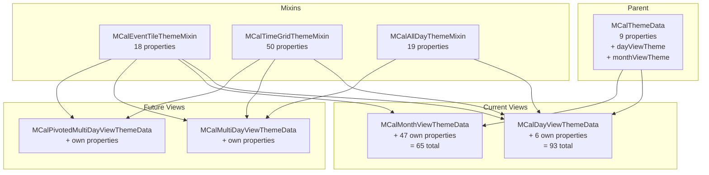

# Design Document: Theme Layout Properties and Future View Preparation

## Overview

This design restructures the Multi Calendar theming system by introducing three mixins (`MCalEventTileThemeMixin`, `MCalTimeGridThemeMixin`, `MCalAllDayThemeMixin`), renaming the Day View theme class and cascade flag, slimming `MCalThemeData` to 9 global properties, and replacing every hardcoded visual layout value in widget code with a theme property. The mixin-based architecture enables future views to compose only the property groups they need.

The key structural changes are:

1. **Three mixins** define property contracts. View-level theme classes implement them as `final` fields — consumers see a flat constructor, not the mixins.
2. **`MCalDayThemeData` → `MCalDayViewThemeData`** (file rename: `mcal_day_view_theme_data.dart`), accessor `dayTheme` → `dayViewTheme`.
3. **`ignoreEventColors` → `enableEventColorOverrides`** with identical runtime semantics (no behavioral change).
4. **13 properties move off `MCalThemeData`** into per-view themes via mixins. 9 properties move from `MCalMonthViewThemeData` into `MCalEventTileThemeMixin`.
5. **~50 hardcoded numeric literals** in widget code are replaced by new theme properties with master defaults that preserve the current appearance.

## Steering Document Alignment

### Technical Standards (tech.md)

- **Material 3 defaults**: All new layout properties derive master defaults from current hardcoded values. No new M3 role mapping is needed — these are spacing/sizing constants, not semantic colors.
- **Builder Pattern**: Builder callbacks are unaffected. New layout properties are internal to default widget implementations.
- **Performance**: Property resolution remains the same number of null checks. Mixin getters are compiled as direct field access — no virtual dispatch overhead.
- **DST-safe arithmetic**: Not applicable — this spec does not touch date logic.

### Project Structure (structure.md)

- **Naming**: New files follow `mcal_*_theme_mixin.dart` in `lib/src/styles/`. Classes use `MCal` prefix. Properties use established patterns (`eventTile*`, `allDay*`, `dropTarget*`).
- **Code Size**: `MCalDayViewThemeData` will exceed 500 lines due to 89 properties × 4 methods (constructor, copyWith, lerp, ==). This is acceptable because the file is entirely mechanical property storage with no logic. Each method is a property list, not complex code. The mixins themselves will be well under 500 lines (abstract getter declarations only).
- **Module Boundaries**: Mixin files are exported from `lib/multi_calendar.dart` (public API). `theme_cascade_utils.dart` remains internal.

## Code Reuse Analysis

### Existing Components to Leverage

- **`MCalThemeData.fromTheme(ThemeData)`**: Master defaults factory. Modified to populate only 9 global properties plus sub-themes via their `.defaults()` factories.
- **`MCalDayThemeData.defaults(ThemeData)`** → **`MCalDayViewThemeData.defaults(ThemeData)`**: Extended with all new layout properties. Now also populates mixin properties (event tile, time grid, all-day).
- **`MCalMonthViewThemeData.defaults(ThemeData)`**: Extended with new layout properties and mixin properties.
- **`theme_cascade_utils.dart`**: `resolveEventTileColor`, `resolveDropTargetTileColor`, `resolveContrastColor` — parameter rename from `ignoreEventColors` to `enableEventColorOverrides`. Resolution logic reads from per-view theme instead of parent.
- **`MCalTheme.of(context)`**: No structural change. Returns consumer theme as-is (nulls preserved). Widgets obtain master defaults separately.
- **Existing `copyWith`/`lerp`/`==`/`hashCode` patterns**: All theme classes follow identical mechanical patterns. New properties are added following the same structure.

### Components to Create

| File | Purpose |
|------|---------|
| `lib/src/styles/mcal_event_tile_theme_mixin.dart` | Mixin with 18 abstract getters for event tile properties |
| `lib/src/styles/mcal_time_grid_theme_mixin.dart` | Mixin with 48 abstract getters for time-grid properties |
| `lib/src/styles/mcal_all_day_theme_mixin.dart` | Mixin with 17 abstract getters for all-day section properties |
| `lib/src/styles/mcal_day_view_theme_data.dart` | Renamed from `mcal_day_theme_data.dart`; mixes in all three mixins |

### Components to Modify

| File | Change |
|------|--------|
| `lib/src/styles/mcal_theme.dart` | Remove 13 properties; rename `dayTheme` → `dayViewTheme`, `ignoreEventColors` → `enableEventColorOverrides`; add `navigatorPadding`; update `fromTheme`, `copyWith`, `lerp`, `==`, `hashCode` |
| `lib/src/styles/mcal_month_view_theme_data.dart` | Mix in `MCalEventTileThemeMixin`; remove 9 directly-declared properties (now from mixin); add 19 new layout properties (16 + 3 Month-specific resize handle dimensions); update all methods |
| `lib/src/utils/theme_cascade_utils.dart` | Rename `ignoreEventColors` parameter to `enableEventColorOverrides` in `resolveEventTileColor` and `resolveDropTargetTileColor` (`resolveContrastColor` does not have this parameter) |
| `lib/multi_calendar.dart` | Add exports for 3 mixin files; update `mcal_day_theme_data.dart` → `mcal_day_view_theme_data.dart` |
| ~20 widget files | Replace hardcoded values with theme property reads; update `dayTheme` → `dayViewTheme` access paths; update property source from parent to per-view theme |
| `example/lib/views/day_view/tabs/day_theme_tab.dart` | Reorganize control panel sections; add new layout controls; add `enableEventColorOverrides` disable behavior |
| `example/lib/views/month_view/tabs/month_theme_tab.dart` | Reorganize control panel sections; add new layout controls; add `enableEventColorOverrides` disable behavior |

## Architecture

### Mixin Composition



### Property Resolution Flow

Resolution is unchanged from `theme-cascade-refactor` — only the source object changes from parent to per-view theme for moved properties.

```
Widget.build(context)
  │
  ├─ theme = MCalTheme.of(context)                    // consumer theme (may have nulls)
  ├─ defaults = MCalThemeData.fromTheme(               // master defaults (fully populated)
  │     Theme.of(context))
  │
  ├─ // Global property (stays on parent):
  │   cellBgColor = theme.cellBackgroundColor ?? defaults.cellBackgroundColor!
  │
  ├─ // Per-view property (moved to mixin via sub-theme):
  │   tileColor = resolveEventTileColor(
  │     themeColor: theme.dayViewTheme?.eventTileBackgroundColor,
  │     eventColor: event.color,
  │     enableEventColorOverrides: theme.enableEventColorOverrides,
  │     defaultColor: defaults.dayViewTheme!.eventTileBackgroundColor!,
  │   )
  │
  ├─ // Layout property (new, on sub-theme):
  │   headerPadding = theme.dayViewTheme?.dayHeaderPadding
  │       ?? defaults.dayViewTheme!.dayHeaderPadding!
  │
  └─ build widget
```

### File Organization

```
lib/src/styles/
├── mcal_theme.dart                      # MCalThemeData (9 props), MCalTheme InheritedWidget
├── mcal_day_view_theme_data.dart        # MCalDayViewThemeData (93 props) — renamed
├── mcal_month_view_theme_data.dart           # MCalMonthViewThemeData (62 props)
├── mcal_event_tile_theme_mixin.dart     # NEW: MCalEventTileThemeMixin (18 abstract getters)
├── mcal_time_grid_theme_mixin.dart      # NEW: MCalTimeGridThemeMixin (50 abstract getters)
└── mcal_all_day_theme_mixin.dart        # NEW: MCalAllDayThemeMixin (19 abstract getters)
```

## Components and Interfaces

### Component 1: MCalEventTileThemeMixin (new)

- **Purpose**: Abstract property contract for event tile appearance, hover, contrast, drop target tiles, resize handle, week number, and multi-day event theming. Shared by Day View and Month View.
- **File**: `lib/src/styles/mcal_event_tile_theme_mixin.dart`
- **Pattern**: Dart `mixin` with abstract getters. Implementing classes declare matching `final` fields.

```dart
mixin MCalEventTileThemeMixin {
  // Event tile appearance
  Color? get eventTileBackgroundColor;
  TextStyle? get eventTileTextStyle;
  double? get eventTileCornerRadius;
  double? get eventTileHorizontalSpacing;
  double? get eventTileBorderWidth;
  Color? get eventTileBorderColor;

  // Hover
  Color? get hoverEventBackgroundColor;

  // Contrast
  Color? get eventTileLightContrastColor;
  Color? get eventTileDarkContrastColor;

  // Week number
  TextStyle? get weekNumberTextStyle;
  Color? get weekNumberBackgroundColor;

  // Drop target tile
  Color? get dropTargetTileBackgroundColor;
  Color? get dropTargetTileInvalidBackgroundColor;
  double? get dropTargetTileCornerRadius;
  Color? get dropTargetTileBorderColor;
  double? get dropTargetTileBorderWidth;

  // Resize handle
  Color? get resizeHandleColor;

  // Multi-day events
  Color? get multiDayEventBackgroundColor;
}
```

### Component 2: MCalTimeGridThemeMixin (new)

- **Purpose**: Abstract property contract for time legend, gridlines, current time indicator, time regions, timed events, hover/focus slots, drop target overlays, and related layout values.
- **File**: `lib/src/styles/mcal_time_grid_theme_mixin.dart`
- **Pattern**: Same as above. 37 existing properties moved from `MCalDayThemeData` + 13 new layout properties = 50 total.

Properties are listed in full in the Data Models section below.

### Component 3: MCalAllDayThemeMixin (new)

- **Purpose**: Abstract property contract for all-day event section colors, sizing, layout, and overflow handle styling.
- **File**: `lib/src/styles/mcal_all_day_theme_mixin.dart`
- **Pattern**: Same as above. 4 properties moved from `MCalThemeData` + 4 from `MCalDayThemeData` + 11 new layout properties = 19 total.

Properties are listed in full in the Data Models section below.

### Component 4: MCalThemeData (modified)

- **Purpose**: Root theme data class and `ThemeExtension`. Slimmed to global-only properties.
- **File**: `lib/src/styles/mcal_theme.dart`
- **Changes**:
  - Remove 13 properties (moved to mixins)
  - Rename `dayTheme` → `dayViewTheme` (type: `MCalDayViewThemeData?`)
  - Rename `ignoreEventColors` → `enableEventColorOverrides`
  - Add `navigatorPadding` (EdgeInsets?)
  - Add `cellBorderWidth` (double?, default: 1.0)
  - Update `fromTheme`, `copyWith`, `lerp`, `==`, `hashCode`

```dart
class MCalThemeData extends ThemeExtension<MCalThemeData> {
  const MCalThemeData({
    this.cellBackgroundColor,
    this.cellBorderColor,
    this.cellBorderWidth,
    this.navigatorBackgroundColor,
    this.navigatorTextStyle,
    this.navigatorPadding,
    this.enableEventColorOverrides = false,
    this.dayViewTheme,
    this.monthViewTheme,
  });

  final Color? cellBackgroundColor;
  final Color? cellBorderColor;
  final double? cellBorderWidth;
  final Color? navigatorBackgroundColor;
  final TextStyle? navigatorTextStyle;
  final EdgeInsets? navigatorPadding;
  final bool enableEventColorOverrides;
  final MCalDayViewThemeData? dayViewTheme;
  final MCalMonthViewThemeData? monthViewTheme;

  static MCalThemeData fromTheme(ThemeData theme) {
    final colorScheme = theme.colorScheme;
    return MCalThemeData(
      cellBackgroundColor: colorScheme.surface,
      cellBorderColor: colorScheme.outlineVariant,
      cellBorderWidth: 1.0,
      navigatorBackgroundColor: colorScheme.surfaceContainerHighest,
      navigatorTextStyle: theme.textTheme.titleMedium?.copyWith(
        color: colorScheme.onSurface,
      ),
      navigatorPadding: const EdgeInsets.symmetric(horizontal: 8.0, vertical: 8.0),
      enableEventColorOverrides: false,
      dayViewTheme: MCalDayViewThemeData.defaults(theme),
      monthViewTheme: MCalMonthViewThemeData.defaults(theme),
    );
  }
  // copyWith, lerp, ==, hashCode follow existing patterns with 9 properties
}
```

### Component 5: MCalDayViewThemeData (renamed, modified)

- **Purpose**: Day View theme data. Mixes in all three mixins plus 6 own properties.
- **File**: `lib/src/styles/mcal_day_view_theme_data.dart` (renamed from `mcal_day_theme_data.dart`)
- **Composition**: `MCalEventTileThemeMixin` (18) + `MCalTimeGridThemeMixin` (50) + `MCalAllDayThemeMixin` (19) + 6 own = **93 properties**
- **Constructor**: All 93 properties as named optional parameters
- **`defaults(ThemeData)`**: Populates all 93 properties. New layout property defaults match current hardcoded values.
- **`copyWith`, `lerp`, `==`, `hashCode`**: Include all 93 properties following existing patterns.

```dart
class MCalDayViewThemeData with
    MCalEventTileThemeMixin,
    MCalTimeGridThemeMixin,
    MCalAllDayThemeMixin {

  const MCalDayViewThemeData({
    // EventTileThemeMixin (18)
    this.eventTileBackgroundColor,
    this.eventTileTextStyle,
    // ... all 18 ...

    // TimeGridThemeMixin (50)
    this.timeLegendWidth,
    this.timeLegendTextStyle,
    // ... all 50 ...

    // AllDayThemeMixin (19)
    this.allDayEventBackgroundColor,
    this.allDayEventTextStyle,
    // ... all 19 ...

    // Day-View-specific (6)
    this.dayHeaderDayOfWeekStyle,
    this.dayHeaderDateStyle,
    this.dayHeaderPadding,
    this.dayHeaderWeekNumberPadding,
    this.dayHeaderWeekNumberBorderRadius,
    this.dayHeaderSpacing,
  });

  // All properties as final fields implementing mixin getters
  @override
  final Color? eventTileBackgroundColor;
  // ... etc ...
}
```

### Component 6: MCalMonthViewThemeData (modified)

- **Purpose**: Month View theme data. Mixes in `MCalEventTileThemeMixin` plus own properties.
- **Composition**: `MCalEventTileThemeMixin` (18) + 47 own = **65 properties**
- **Changes**:
  - Mix in `MCalEventTileThemeMixin`
  - Remove 9 directly-declared properties (now satisfied by the mixin): `dropTargetTileBackgroundColor`, `dropTargetTileInvalidBackgroundColor`, `dropTargetTileCornerRadius`, `dropTargetTileBorderColor`, `dropTargetTileBorderWidth`, `resizeHandleColor`, `eventTileBorderColor`, `eventTileBorderWidth`, `multiDayEventBackgroundColor`
  - Add 19 new layout properties (16 + 3 Month-specific resize handle dimensions)
  - Update `defaults`, `copyWith`, `lerp`, `==`, `hashCode`

```dart
class MCalMonthViewThemeData with MCalEventTileThemeMixin {
  const MCalMonthViewThemeData({
    // EventTileThemeMixin (18)
    this.eventTileBackgroundColor,
    // ... all 18 ...

    // Month-specific retained (28)
    this.cellTextStyle,
    this.todayBackgroundColor,
    // ... all 28 ...

    // Month-specific new layout (19)
    this.dateLabelPadding,
    this.cellBorderWidth,
    // ... all 19 ...
  });

  // Mixin properties as final fields
  @override
  final Color? eventTileBackgroundColor;
  // ... etc ...
}
```

### Component 7: theme_cascade_utils.dart (modified)

- **Purpose**: Shared cascade resolution functions.
- **Change**: Rename `ignoreEventColors` parameter to `enableEventColorOverrides` in all three functions. No logic change.

```dart
Color resolveEventTileColor({
  required Color? themeColor,
  Color? allDayThemeColor,
  required Color? eventColor,
  required bool enableEventColorOverrides,  // renamed
  required Color defaultColor,
}) {
  if (enableEventColorOverrides) {
    return allDayThemeColor ?? themeColor ?? eventColor ?? defaultColor;
  } else {
    return eventColor ?? allDayThemeColor ?? themeColor ?? defaultColor;
  }
}
```

## Data Models

### MCalThemeData — Final Property List (9 properties)

| Property | Type | Default (`fromTheme`) | Source |
|----------|------|----------------------|--------|
| `cellBackgroundColor` | `Color?` | `colorScheme.surface` | Retained |
| `cellBorderColor` | `Color?` | `colorScheme.outlineVariant` | Retained |
| `cellBorderWidth` | `double?` | `1.0` | **New** (Req 8) |
| `navigatorBackgroundColor` | `Color?` | `colorScheme.surfaceContainerHighest` | Retained |
| `navigatorTextStyle` | `TextStyle?` | `textTheme.titleMedium` + `colorScheme.onSurface` | Retained |
| `navigatorPadding` | `EdgeInsets?` | `EdgeInsets.symmetric(horizontal: 8.0, vertical: 8.0)` | **New** (Req 8) |
| `enableEventColorOverrides` | `bool` | `false` | Renamed from `ignoreEventColors` |
| `dayViewTheme` | `MCalDayViewThemeData?` | `MCalDayViewThemeData.defaults(theme)` | Renamed from `dayTheme` |
| `monthViewTheme` | `MCalMonthViewThemeData?` | `MCalMonthViewThemeData.defaults(theme)` | Retained |

### MCalThemeData — Removed Properties (13)

| Property | Moved To |
|----------|----------|
| `eventTileBackgroundColor` | `MCalEventTileThemeMixin` |
| `eventTileTextStyle` | `MCalEventTileThemeMixin` |
| `eventTileCornerRadius` | `MCalEventTileThemeMixin` |
| `eventTileHorizontalSpacing` | `MCalEventTileThemeMixin` |
| `hoverEventBackgroundColor` | `MCalEventTileThemeMixin` |
| `eventTileLightContrastColor` | `MCalEventTileThemeMixin` |
| `eventTileDarkContrastColor` | `MCalEventTileThemeMixin` |
| `weekNumberTextStyle` | `MCalEventTileThemeMixin` |
| `weekNumberBackgroundColor` | `MCalEventTileThemeMixin` |
| `allDayEventBackgroundColor` | `MCalAllDayThemeMixin` |
| `allDayEventTextStyle` | `MCalAllDayThemeMixin` |
| `allDayEventBorderColor` | `MCalAllDayThemeMixin` |
| `allDayEventBorderWidth` | `MCalAllDayThemeMixin` |

### MCalEventTileThemeMixin — Property List (18 properties)

| Property | Type | Day Default | Month Default | Source |
|----------|------|-------------|---------------|--------|
| `eventTileBackgroundColor` | `Color?` | `colorScheme.primaryContainer` | `colorScheme.primaryContainer` | From `MCalThemeData` |
| `eventTileTextStyle` | `TextStyle?` | `textTheme.bodySmall` + `colorScheme.onPrimaryContainer` | `textTheme.bodySmall` + `colorScheme.onPrimaryContainer` | From `MCalThemeData` |
| `eventTileCornerRadius` | `double?` | `3.0` | `3.0` | From `MCalThemeData` |
| `eventTileHorizontalSpacing` | `double?` | `1.0` | `1.0` | From `MCalThemeData` |
| `eventTileBorderWidth` | `double?` | `0.0` (no border by default) | `0.0` (no border by default) | From `MCalMonthViewThemeData` |
| `eventTileBorderColor` | `Color?` | `null` | `null` | From `MCalMonthViewThemeData` |
| `hoverEventBackgroundColor` | `Color?` | `colorScheme.primaryContainer` at 80% alpha | `colorScheme.primaryContainer` at 80% alpha | From `MCalThemeData` |
| `eventTileLightContrastColor` | `Color?` | `Colors.white` | `Colors.white` | From `MCalThemeData` |
| `eventTileDarkContrastColor` | `Color?` | `colorScheme.onSurface` | `colorScheme.onSurface` | From `MCalThemeData` |
| `weekNumberTextStyle` | `TextStyle?` | `textTheme.bodySmall` + `colorScheme.onSurfaceVariant` | `textTheme.bodySmall` + `colorScheme.onSurfaceVariant` | From `MCalThemeData` |
| `weekNumberBackgroundColor` | `Color?` | `colorScheme.surfaceContainerHighest` | `colorScheme.surfaceContainerHighest` | From `MCalThemeData` |
| `dropTargetTileBackgroundColor` | `Color?` | `colorScheme.primaryContainer` | `colorScheme.primaryContainer` | Consolidated from both sub-themes |
| `dropTargetTileInvalidBackgroundColor` | `Color?` | `colorScheme.errorContainer` | `colorScheme.errorContainer` | Consolidated from both sub-themes |
| `dropTargetTileCornerRadius` | `double?` | `3.0` | `3.0` | Consolidated from both sub-themes |
| `dropTargetTileBorderColor` | `Color?` | `colorScheme.primary` | `colorScheme.primary` | Consolidated from both sub-themes |
| `dropTargetTileBorderWidth` | `double?` | `2.0` | `1.5` | Consolidated; **note: different defaults per view** |
| `resizeHandleColor` | `Color?` | `Colors.white` at 70% alpha | `Colors.white` at 50% alpha | Consolidated; **note: different defaults per view** |
| `multiDayEventBackgroundColor` | `Color?` | `colorScheme.primary` at 80% alpha | `colorScheme.primary` at 80% alpha | From `MCalMonthViewThemeData` |

**Note on per-view defaults**: `dropTargetTileBorderWidth` and `resizeHandleColor` have different defaults for Day View vs Month View. This is correct — the mixin defines the contract, but each view's `defaults()` factory sets values appropriate for that view's visual design. Day View uses thicker drop target borders (2.0) and brighter resize handles (70% alpha) because tiles are larger. Month View uses thinner borders (1.5) and subtler handles (50% alpha) because tiles are compact bars.

### MCalTimeGridThemeMixin — Property List (50 properties)

#### Existing properties (37, moved from MCalDayThemeData)

| Property | Type | Default |
|----------|------|---------|
| `timeLegendWidth` | `double?` | `60.0` |
| `timeLegendTextStyle` | `TextStyle?` | `textTheme.bodySmall` + `colorScheme.onSurfaceVariant` |
| `timeLegendBackgroundColor` | `Color?` | `colorScheme.surface` |
| `timeLegendTickColor` | `Color?` | `colorScheme.outlineVariant` |
| `timeLegendTickWidth` | `double?` | `1.0` |
| `timeLegendTickLength` | `double?` | `8.0` |
| `showTimeLegendTicks` | `bool?` | `true` |
| `timeLabelPosition` | `MCalTimeLabelPosition?` | `null` (widget fallback) |
| `hourGridlineColor` | `Color?` | `colorScheme.outlineVariant` |
| `hourGridlineWidth` | `double?` | `1.0` |
| `majorGridlineColor` | `Color?` | `colorScheme.outlineVariant` at 70% alpha |
| `majorGridlineWidth` | `double?` | `1.0` |
| `minorGridlineColor` | `Color?` | `colorScheme.outlineVariant` at 40% alpha |
| `minorGridlineWidth` | `double?` | `0.5` |
| `currentTimeIndicatorColor` | `Color?` | `colorScheme.error` |
| `currentTimeIndicatorWidth` | `double?` | `2.0` |
| `currentTimeIndicatorDotRadius` | `double?` | `6.0` |
| `specialTimeRegionColor` | `Color?` | `colorScheme.outlineVariant` at low alpha |
| `blockedTimeRegionColor` | `Color?` | `colorScheme.outlineVariant` at low alpha |
| `timeRegionBorderColor` | `Color?` | `colorScheme.outlineVariant` |
| `timeRegionTextColor` | `Color?` | `colorScheme.onSurfaceVariant` |
| `timeRegionTextStyle` | `TextStyle?` | `TextStyle(fontSize: 12)` + `timeRegionTextColor` |
| `timedEventMinHeight` | `double?` | `20.0` |
| `timedEventPadding` | `EdgeInsets?` | `EdgeInsets.symmetric(horizontal: 6.0, vertical: 4.0)` |
| `hoverTimeSlotBackgroundColor` | `Color?` | `null` (widget fallback) |
| `focusedSlotBackgroundColor` | `Color?` | `colorScheme.primary` at 8% alpha |
| `focusedSlotBorderColor` | `Color?` | `colorScheme.primary` |
| `focusedSlotBorderWidth` | `double?` | `3.0` |
| `focusedSlotDecoration` | `BoxDecoration?` | `null` (widget fallback) |
| `dropTargetOverlayValidColor` | `Color?` | `colorScheme.primary` at 20% alpha |
| `dropTargetOverlayInvalidColor` | `Color?` | `colorScheme.error` at 20% alpha |
| `dropTargetOverlayBorderWidth` | `double?` | `3.0` |
| `dropTargetOverlayBorderColor` | `Color?` | `colorScheme.primary` |
| `disabledTimeSlotColor` | `Color?` | `colorScheme.onSurface` at 12% alpha |
| `keyboardFocusBorderColor` | `Color?` | `colorScheme.primary` |
| `resizeHandleSize` | `double?` | `8.0` |
| `minResizeDurationMinutes` | `int?` | `15` |

#### New layout properties (11)

| Property | Type | Default | Replaces | Widget |
|----------|------|---------|----------|--------|
| `timeLegendLabelHeight` | `double?` | `20.0` | hardcoded `20.0` | `time_legend_column.dart` |
| `timedEventMargin` | `EdgeInsets?` | `EdgeInsets.symmetric(horizontal: 2.0, vertical: 1.0)` | hardcoded margin | `time_grid_events_layer.dart` |
| `timedEventKeyboardFocusBorderWidth` | `double?` | `2.0` | hardcoded `2` | `time_grid_events_layer.dart` |
| `timedEventCompactFontSize` | `double?` | `10.0` | hardcoded `10` | `time_grid_events_layer.dart` |
| `timedEventNormalFontSize` | `double?` | `12.0` | hardcoded `12` | `time_grid_events_layer.dart` |
| `timedEventTitleTimeGap` | `double?` | `2.0` | hardcoded `2.0` (`EdgeInsets.only(top: 2.0)`) title-to-time gap | `time_grid_events_layer.dart` |
| `timeRegionBorderWidth` | `double?` | `1.0` | hardcoded `1` | `time_regions_layer.dart` |
| `timeRegionIconSize` | `double?` | `16.0` | hardcoded `16` | `time_regions_layer.dart` |
| `timeRegionIconGap` | `double?` | `4.0` | hardcoded `4` | `time_regions_layer.dart` |
| `resizeHandleVisualHeight` | `double?` | `2.0` | hardcoded `2` (bar height) | `time_resize_handle.dart` |
| `resizeHandleHorizontalMargin` | `double?` | `4.0` | hardcoded `4` (bar inset per side) | `time_resize_handle.dart` |
| `resizeHandleBorderRadius` | `double?` | `1.0` | hardcoded `1` | `time_resize_handle.dart` |
| `keyboardFocusBorderRadius` | `double?` | `4.0` | hardcoded `4` (`BorderRadius.circular(4)`) keyboard focus ring radius | `time_grid_events_layer.dart`, `all_day_events_section.dart` |

### MCalAllDayThemeMixin — Property List (19 properties)

#### Moved from MCalThemeData (4)

| Property | Type | Default |
|----------|------|---------|
| `allDayEventBackgroundColor` | `Color?` | `colorScheme.primaryContainer` |
| `allDayEventTextStyle` | `TextStyle?` | `textTheme.bodySmall` + `colorScheme.onPrimaryContainer` |
| `allDayEventBorderColor` | `Color?` | `colorScheme.outlineVariant` |
| `allDayEventBorderWidth` | `double?` | `1.0` |

#### Moved from MCalDayThemeData (4)

| Property | Type | Default |
|----------|------|---------|
| `allDayTileWidth` | `double?` | `120.0` (matches current `_defaultTileWidth` in `all_day_events_section.dart`) |
| `allDayTileHeight` | `double?` | `28.0` (matches current `_defaultTileHeight` in `all_day_events_section.dart`) |
| `allDayEventPadding` | `EdgeInsets?` | `EdgeInsets.symmetric(horizontal: 4.0, vertical: 2.0)` |
| `allDayOverflowIndicatorWidth` | `double?` | `80.0` (matches current `_defaultOverflowWidth` in `all_day_events_section.dart`) |

#### New layout properties (9)

| Property | Type | Default | Replaces | Widget |
|----------|------|---------|----------|--------|
| `allDayWrapSpacing` | `double?` | `4.0` | hardcoded `4.0` | `all_day_events_section.dart` |
| `allDayWrapRunSpacing` | `double?` | `4.0` | hardcoded `4.0` | `all_day_events_section.dart` |
| `allDaySectionPadding` | `EdgeInsets?` | `EdgeInsets.symmetric(horizontal: 8.0, vertical: 4.0)` | hardcoded padding | `all_day_events_section.dart` |
| `allDayKeyboardFocusBorderWidth` | `double?` | `2.0` | hardcoded `2` | `all_day_events_section.dart` |
| `allDayOverflowHandleWidth` | `double?` | `3.0` | hardcoded `3` | `all_day_events_section.dart` |
| `allDayOverflowHandleHeight` | `double?` | `16.0` | hardcoded `16` | `all_day_events_section.dart` |
| `allDayOverflowHandleBorderRadius` | `double?` | `1.5` | hardcoded `1.5` | `all_day_events_section.dart` |
| `allDayOverflowHandleGap` | `double?` | `4.0` | hardcoded `4` | `all_day_events_section.dart` |
| `allDayOverflowIndicatorFontSize` | `double?` | `11.0` | hardcoded `11` (overflow `'+$count more'` text) | `all_day_events_section.dart` |
| `allDayOverflowIndicatorBorderWidth` | `double?` | `1.0` | hardcoded `1.0` (overflow indicator container border width) | `all_day_events_section.dart` |
| `allDaySectionLabelBottomPadding` | `double?` | `4.0` | hardcoded `4.0` (`EdgeInsets.only(bottom: 4.0)`) padding below "All-day" label | `all_day_events_section.dart` |

### MCalDayViewThemeData — Own Properties (6)

| Property | Type | Default | Source |
|----------|------|---------|--------|
| `dayHeaderDayOfWeekStyle` | `TextStyle?` | `textTheme.bodySmall` + `colorScheme.onSurface` | Retained |
| `dayHeaderDateStyle` | `TextStyle?` | `textTheme.headlineSmall` + `colorScheme.onSurface` | Retained |
| `dayHeaderPadding` | `EdgeInsets?` | `EdgeInsets.all(8.0)` | **New** (Req 6) |
| `dayHeaderWeekNumberPadding` | `EdgeInsets?` | `EdgeInsets.symmetric(horizontal: 6.0, vertical: 2.0)` | **New** (Req 6) |
| `dayHeaderWeekNumberBorderRadius` | `double?` | `4.0` | **New** (Req 6) |
| `dayHeaderSpacing` | `double?` | `8.0` | **New** (Req 6) |

### MCalMonthViewThemeData — Own Properties (28 retained + 19 new = 47)

#### Retained properties (28)

| Property | Type | Default |
|----------|------|---------|
| `cellTextStyle` | `TextStyle?` | `textTheme.bodyMedium` |
| `todayBackgroundColor` | `Color?` | `colorScheme.primary` |
| `todayTextStyle` | `TextStyle?` | `textTheme.bodyMedium` + `colorScheme.onPrimary` |
| `leadingDatesTextStyle` | `TextStyle?` | `textTheme.bodyMedium` at reduced alpha |
| `trailingDatesTextStyle` | `TextStyle?` | `textTheme.bodyMedium` at reduced alpha |
| `leadingDatesBackgroundColor` | `Color?` | `colorScheme.surfaceContainerLow` |
| `trailingDatesBackgroundColor` | `Color?` | `colorScheme.surfaceContainerLow` |
| `weekdayHeaderTextStyle` | `TextStyle?` | `textTheme.bodySmall` + `colorScheme.onSurfaceVariant` |
| `weekdayHeaderBackgroundColor` | `Color?` | `colorScheme.surfaceContainerHighest` |
| `focusedDateBackgroundColor` | `Color?` | `colorScheme.primaryContainer` |
| `focusedDateTextStyle` | `TextStyle?` | `textTheme.bodyMedium` + `colorScheme.onPrimaryContainer` |
| `hoverCellBackgroundColor` | `Color?` | `colorScheme.surfaceContainerHighest` at alpha |
| `dropTargetCellValidColor` | `Color?` | `colorScheme.tertiary` at 30% alpha |
| `dropTargetCellInvalidColor` | `Color?` | `colorScheme.error` at 30% alpha |
| `dropTargetCellBorderRadius` | `double?` | `4.0` |
| `dragSourceOpacity` | `double?` | `0.5` |
| `draggedTileElevation` | `double?` | `6.0` |
| `multiDayEventTextStyle` | `TextStyle?` | `textTheme.bodySmall` + `colorScheme.onPrimaryContainer` |
| `eventTileHeight` | `double?` | `20.0` |
| `eventTileVerticalSpacing` | `double?` | `1.0` |
| `dateLabelHeight` | `double?` | `18.0` |
| `dateLabelPosition` | `DateLabelPosition?` | `DateLabelPosition.topLeft` |
| `overflowIndicatorHeight` | `double?` | `14.0` |
| `eventTilePadding` | `EdgeInsets?` | `EdgeInsets.symmetric(horizontal: 2.0)` |
| `defaultRegionColor` | `Color?` | `colorScheme.outlineVariant` |
| `overlayScrimColor` | `Color?` | `colorScheme.scrim` at 30% alpha |
| `errorIconColor` | `Color?` | `colorScheme.error` |
| `overflowIndicatorTextStyle` | `TextStyle?` | `textTheme.labelSmall` + `colorScheme.onSurfaceVariant` |

#### New own layout properties (19)

| Property | Type | Default | Replaces | Widget |
|----------|------|---------|----------|--------|
| `dateLabelPadding` | `EdgeInsets?` | `EdgeInsets.only(left: 4.0, top: 4.0, right: 4.0)` | hardcoded padding | `day_cell_widget.dart` |
| `cellBorderWidth` | `double?` | `1.0` | hardcoded `1.0` | `day_cell_widget.dart` |
| `regionContentPadding` | `EdgeInsets?` | `EdgeInsets.only(bottom: 2.0)` | hardcoded padding | `day_cell_widget.dart` |
| `regionIconSize` | `double?` | `9.0` | hardcoded `9.0` | `day_cell_widget.dart` |
| `regionIconGap` | `double?` | `2.0` | hardcoded `2.0` | `day_cell_widget.dart` |
| `regionFontSize` | `double?` | `8.0` | hardcoded `8.0` | `day_cell_widget.dart` |
| `keyboardSelectionBorderWidth` | `double?` | `2.0` | hardcoded `2.0` (selected state) | `week_row_widget.dart` |
| `keyboardHighlightBorderWidth` | `double?` | `1.5` | hardcoded `1.5` (highlighted state) | `week_row_widget.dart` |
| `dateLabelCircleSize` | `double?` | `24.0` | hardcoded `24.0` | `week_row_widget.dart` |
| `weekNumberColumnWidth` | `double?` | `36.0` | hardcoded `36.0` | `week_number_cell.dart` |
| `weekNumberBorderWidth` | `double?` | `0.5` | hardcoded `0.5` | `week_number_cell.dart` |
| `weekdayHeaderPadding` | `EdgeInsets?` | `EdgeInsets.symmetric(vertical: 8.0, horizontal: 2.0)` | hardcoded padding | `weekday_header_row_widget.dart` |
| `multiDayTilePadding` | `EdgeInsets?` | `EdgeInsets.symmetric(horizontal: 4.0, vertical: 2.0)` | hardcoded padding | `mcal_month_multi_day_tile.dart` |
| `multiDayTileBorderRadius` | `double?` | `4.0` | hardcoded `4.0` | `mcal_month_multi_day_tile.dart` |
| `weekLayoutDateLabelPadding` | `double?` | `2.0` | hardcoded `2.0` | `mcal_month_default_week_layout.dart` |
| `weekLayoutBaseMargin` | `double?` | `2.0` | hardcoded `2.0` | `mcal_month_default_week_layout.dart` |
| `resizeHandleVisualWidth` | `double?` | `2.0` | hardcoded `width: 2` | `month_page_widget.dart` |
| `resizeHandleVerticalMargin` | `double?` | `1.0` | hardcoded `height: 16` (handle height = tileHeight − 2 × margin; with default tileHeight 18.0 → 16.0) | `month_page_widget.dart` |
| `resizeHandleBorderRadius` | `double?` | `1.0` | hardcoded `BorderRadius.circular(1)` | `month_page_widget.dart` |

> **Note:** These 3 Month-specific resize handle dimension properties are separate from the Day View's `MCalTimeGridThemeMixin` resize handle properties (`resizeHandleVisualHeight`, `resizeHandleHorizontalMargin`, `resizeHandleBorderRadius`) because the two views have different handle orientations: the Day View uses a horizontal bar spanning the tile width, while the Month View uses a vertical bar spanning the tile height. Both share `resizeHandleColor` via `MCalEventTileThemeMixin`.

### MCalMonthViewThemeData — Removed Direct Declarations (9, now from mixin)

| Property | Previously On | Now From |
|----------|--------------|----------|
| `dropTargetTileBackgroundColor` | `MCalMonthViewThemeData` | `MCalEventTileThemeMixin` |
| `dropTargetTileInvalidBackgroundColor` | `MCalMonthViewThemeData` | `MCalEventTileThemeMixin` |
| `dropTargetTileCornerRadius` | `MCalMonthViewThemeData` | `MCalEventTileThemeMixin` |
| `dropTargetTileBorderColor` | `MCalMonthViewThemeData` | `MCalEventTileThemeMixin` |
| `dropTargetTileBorderWidth` | `MCalMonthViewThemeData` | `MCalEventTileThemeMixin` |
| `resizeHandleColor` | `MCalMonthViewThemeData` | `MCalEventTileThemeMixin` |
| `eventTileBorderColor` | `MCalMonthViewThemeData` | `MCalEventTileThemeMixin` |
| `eventTileBorderWidth` | `MCalMonthViewThemeData` | `MCalEventTileThemeMixin` |
| `multiDayEventBackgroundColor` | `MCalMonthViewThemeData` | `MCalEventTileThemeMixin` |

## Widget Migration

### Access Path Changes

Every widget that reads theme properties from `MCalThemeData` (parent) for properties that moved to mixins must update its access path:

```dart
// Before (property on parent):
final bgColor = theme.eventTileBackgroundColor ?? defaults.eventTileBackgroundColor!;

// After (property on per-view theme via mixin):
final bgColor = theme.dayViewTheme?.eventTileBackgroundColor
    ?? defaults.dayViewTheme!.eventTileBackgroundColor!;
```

```dart
// Before (dayTheme accessor):
final legendWidth = theme.dayTheme?.timeLegendWidth ?? defaults.dayTheme!.timeLegendWidth!;

// After (renamed accessor):
final legendWidth = theme.dayViewTheme?.timeLegendWidth ?? defaults.dayViewTheme!.timeLegendWidth!;
```

### Cascade Utility Call Sites

All call sites of `resolveEventTileColor`, `resolveDropTargetTileColor`, and `resolveContrastColor` must:
1. Rename `ignoreEventColors:` → `enableEventColorOverrides:`
2. Update `themeColor:` source from `theme.eventTileBackgroundColor` to `theme.dayViewTheme?.eventTileBackgroundColor` (or `theme.monthViewTheme?.eventTileBackgroundColor`)

```dart
// Before:
final tileColor = resolveEventTileColor(
  themeColor: theme.eventTileBackgroundColor,
  eventColor: event.color,
  ignoreEventColors: theme.ignoreEventColors,
  defaultColor: defaults.eventTileBackgroundColor!,
);

// After:
final tileColor = resolveEventTileColor(
  themeColor: theme.dayViewTheme?.eventTileBackgroundColor,
  eventColor: event.color,
  enableEventColorOverrides: theme.enableEventColorOverrides,
  defaultColor: defaults.dayViewTheme!.eventTileBackgroundColor!,
);
```

### Multi-Day Event Cascade Call Sites

For multi-day event tiles, callers pass `multiDayEventBackgroundColor` as `themeColor` to `resolveEventTileColor`. This applies to both Month View (horizontal bar segments) and Day View (multi-day all-day or timed tiles):

```dart
// Month View — multi-day bar tile:
final tileColor = resolveEventTileColor(
  themeColor: theme.monthViewTheme?.multiDayEventBackgroundColor,
  eventColor: event.color,
  enableEventColorOverrides: theme.enableEventColorOverrides,
  defaultColor: defaults.monthViewTheme!.multiDayEventBackgroundColor!,
);

// Day View — multi-day event in all-day section:
final tileColor = resolveEventTileColor(
  themeColor: theme.dayViewTheme?.multiDayEventBackgroundColor,
  eventColor: event.color,
  enableEventColorOverrides: theme.enableEventColorOverrides,
  defaultColor: defaults.dayViewTheme!.multiDayEventBackgroundColor!,
);
```

For **drop target previews** when the dragged event is multi-day, pass `multiDayEventBackgroundColor` as `themeColor` to `resolveDropTargetTileColor`:

```dart
// Drop target for a multi-day event:
final previewColor = resolveDropTargetTileColor(
  dropTargetThemeColor: theme.monthViewTheme?.dropTargetTileBackgroundColor,
  themeColor: theme.monthViewTheme?.multiDayEventBackgroundColor,
  eventColor: event.color,
  enableEventColorOverrides: theme.enableEventColorOverrides,
  defaultColor: defaults.monthViewTheme!.multiDayEventBackgroundColor!,
);
```

The key rule: the `themeColor` parameter always reflects the **event type's** background color property (single-day → `eventTileBackgroundColor`, multi-day → `multiDayEventBackgroundColor`, all-day single-day → `allDayEventBackgroundColor` via `allDayThemeColor`).

### Hardcoded Value Replacement Pattern

```dart
// Before (hardcoded value):
final padding = EdgeInsets.all(8.0);

// After (theme property with master default fallback):
final padding = theme.dayViewTheme?.dayHeaderPadding
    ?? defaults.dayViewTheme!.dayHeaderPadding!;
```

### Widget-by-Widget Migration Summary

| Widget | Changes |
|--------|---------|
| `day_navigator.dart` | Replace hardcoded `EdgeInsets.symmetric(horizontal: 8.0, vertical: 8.0)` with `theme.navigatorPadding ?? defaults.navigatorPadding!` |
| `month_navigator_widget.dart` | Same as above |
| `day_header.dart` | Replace 4 hardcoded values with `dayHeaderPadding`, `dayHeaderSpacing`, `dayHeaderWeekNumberPadding`, `dayHeaderWeekNumberBorderRadius` from `dayViewTheme` |
| `time_legend_column.dart` | Replace hardcoded `20.0` with `timeLegendLabelHeight` from `dayViewTheme` |
| `time_grid_events_layer.dart` | Replace hardcoded margin, font sizes, border width, title-time gap, keyboard focus radius with `timedEventMargin`, `timedEventCompactFontSize`, `timedEventNormalFontSize`, `timedEventKeyboardFocusBorderWidth`, `timedEventTitleTimeGap`, `keyboardFocusBorderRadius`, `eventTileBorderWidth`, `eventTileBorderColor` from `dayViewTheme`; update cascade calls |
| `time_regions_layer.dart` | Replace hardcoded border width, icon size, gap with `timeRegionBorderWidth`, `timeRegionIconSize`, `timeRegionIconGap` from `dayViewTheme` |
| `time_resize_handle.dart` | Replace hardcoded `height: 2`, `margin: 4`, `borderRadius: 1` with `resizeHandleVisualHeight`, `resizeHandleHorizontalMargin`, `resizeHandleBorderRadius` from `dayViewTheme` |
| `all_day_events_section.dart` | Replace 12 hardcoded values with allDay* properties, `keyboardFocusBorderRadius`, `cellBorderWidth`, `allDayOverflowIndicatorBorderWidth`, `allDaySectionLabelBottomPadding` from `dayViewTheme`/`MCalThemeData`; update cascade calls |
| `day_cell_widget.dart` | Replace 6 hardcoded values with `dateLabelPadding`, `cellBorderWidth`, `regionContentPadding`, `regionIconSize`, `regionIconGap`, `regionFontSize` from `monthViewTheme` |
| `week_row_widget.dart` | Replace hardcoded `2.0`/`1.5`/`24` with `keyboardSelectionBorderWidth`, `keyboardHighlightBorderWidth`, `dateLabelCircleSize` from `monthViewTheme`; update cascade calls |
| `week_number_cell.dart` | Replace hardcoded `36.0`/`0.5` with `weekNumberColumnWidth`, `weekNumberBorderWidth` from `monthViewTheme` |
| `weekday_header_row_widget.dart` | Replace hardcoded padding with `weekdayHeaderPadding` from `monthViewTheme` |
| `mcal_month_multi_day_tile.dart` | Replace hardcoded padding/radius with `multiDayTilePadding`, `multiDayTileBorderRadius` from `monthViewTheme`; update cascade calls |
| `month_page_widget.dart` | Update cascade calls; `dropTargetTileBorderWidth` default is `1.5` (from mixin via `monthViewTheme`). **Fix:** change `resizeHandleColor` read from `theme.dayTheme` to `theme.monthViewTheme` (current code incorrectly reads Day View theme in a Month View widget). Replace hardcoded resize handle dimensions (`width: 2`, `height: 16`, `BorderRadius.circular(1)`) with `resizeHandleVisualWidth`, `resizeHandleVerticalMargin` (height = tileHeight − 2 × margin), `resizeHandleBorderRadius` from `monthViewTheme` |
| `mcal_month_default_week_layout.dart` | Replace hardcoded `2.0`/`2.0` with `weekLayoutDateLabelPadding`, `weekLayoutBaseMargin` accessed via `MCalTheme.of(context).monthViewTheme` |
| `mcal_builder_wrapper.dart` | **No migration needed.** The `horizontalSpacing = 2.0` function parameter default is a fallback that is always overridden by the call site (`week_row_widget.dart` line 412 passes the resolved theme value). The call site migration is covered above. |

## Example App Control Panel Reorganization

### Day Theme Tab (`day_theme_tab.dart`)

Sections reorganized by class/mixin structure. Each section is a `ControlPanelSection` (ExpansionTile).

| Section | Properties |
|---------|------------|
| **Global (MCalThemeData)** | `enableEventColorOverrides` toggle, `cellBackgroundColor`, `cellBorderColor`, `cellBorderWidth`, `navigatorBackgroundColor`, `navigatorPadding` |
| **Event Tiles (MCalEventTileThemeMixin)** | `eventTileBackgroundColor`\*, `eventTileTextStyle`, `eventTileCornerRadius`, `eventTileHorizontalSpacing`, `eventTileBorderWidth`, `eventTileBorderColor`, `hoverEventBackgroundColor`, `eventTileLightContrastColor`, `eventTileDarkContrastColor`, `weekNumberTextStyle`, `weekNumberBackgroundColor`, `dropTargetTileBackgroundColor`, `dropTargetTileInvalidBackgroundColor`, `dropTargetTileCornerRadius`, `dropTargetTileBorderColor`, `dropTargetTileBorderWidth`, `resizeHandleColor`, `multiDayEventBackgroundColor`\* |
| **Time Grid (MCalTimeGridThemeMixin)** | `timeLegendWidth`, `timeLegendLabelHeight`, `timeLegendTextStyle`, `timeLegendBackgroundColor`, `showTimeLegendTicks`, `timeLegendTickColor`, `timeLegendTickWidth`, `timeLegendTickLength`, `hourGridlineColor`, `hourGridlineWidth`, `majorGridlineColor`, `majorGridlineWidth`, `minorGridlineColor`, `minorGridlineWidth`, `currentTimeIndicatorColor`, `currentTimeIndicatorWidth`, `currentTimeIndicatorDotRadius`, `timedEventMinHeight`, `timedEventPadding`, `timedEventMargin`, `timedEventCompactFontSize`, `timedEventNormalFontSize`, `timedEventTitleTimeGap`, `timedEventKeyboardFocusBorderWidth`, `keyboardFocusBorderRadius`, `timeRegionBorderWidth`, `timeRegionIconSize`, `timeRegionIconGap`, `hoverTimeSlotBackgroundColor`, `focusedSlotBackgroundColor`, `focusedSlotBorderColor`, `focusedSlotBorderWidth`, `dropTargetOverlayValidColor`, `dropTargetOverlayInvalidColor`, `dropTargetOverlayBorderWidth`, `dropTargetOverlayBorderColor`, `disabledTimeSlotColor`, `keyboardFocusBorderColor`, `resizeHandleSize`, `resizeHandleVisualHeight`, `resizeHandleHorizontalMargin`, `resizeHandleBorderRadius` |
| **All-Day Events (MCalAllDayThemeMixin)** | `allDayEventBackgroundColor`\*, `allDayEventTextStyle`, `allDayEventBorderColor`, `allDayEventBorderWidth`, `allDayTileWidth`, `allDayTileHeight`, `allDayEventPadding`, `allDayOverflowIndicatorWidth`, `allDayWrapSpacing`, `allDayWrapRunSpacing`, `allDaySectionPadding`, `allDayKeyboardFocusBorderWidth`, `allDayOverflowHandleWidth`, `allDayOverflowHandleHeight`, `allDayOverflowHandleBorderRadius`, `allDayOverflowHandleGap`, `allDayOverflowIndicatorFontSize`, `allDayOverflowIndicatorBorderWidth`, `allDaySectionLabelBottomPadding` |
| **Day Header (MCalDayViewThemeData)** | `dayHeaderDayOfWeekStyle`, `dayHeaderDateStyle`, `dayHeaderPadding`, `dayHeaderWeekNumberPadding`, `dayHeaderWeekNumberBorderRadius`, `dayHeaderSpacing` |

\* Disabled (greyed out) when `enableEventColorOverrides` is `false`

### Month Theme Tab (`month_theme_tab.dart`)

| Section | Properties |
|---------|------------|
| **Global (MCalThemeData)** | `enableEventColorOverrides` toggle, `cellBackgroundColor`, `cellBorderColor`, `cellBorderWidth`, `navigatorBackgroundColor`, `navigatorPadding` |
| **Event Tiles (MCalEventTileThemeMixin)** | `eventTileBackgroundColor`\*, `eventTileTextStyle`, `eventTileCornerRadius`, `eventTileHorizontalSpacing`, `eventTileBorderWidth`, `eventTileBorderColor`, `hoverEventBackgroundColor`, `eventTileLightContrastColor`, `eventTileDarkContrastColor`, `weekNumberTextStyle`, `weekNumberBackgroundColor`, `dropTargetTileBackgroundColor`, `dropTargetTileInvalidBackgroundColor`, `dropTargetTileCornerRadius`, `dropTargetTileBorderColor`, `dropTargetTileBorderWidth`, `resizeHandleColor`, `multiDayEventBackgroundColor`\* |
| **Month View (MCalMonthViewThemeData)** | `cellTextStyle`, `todayBackgroundColor`, `todayTextStyle`, `leadingDatesTextStyle`, `trailingDatesTextStyle`, `leadingDatesBackgroundColor`, `trailingDatesBackgroundColor`, `weekdayHeaderTextStyle`, `weekdayHeaderBackgroundColor`, `weekdayHeaderPadding`, `focusedDateBackgroundColor`, `focusedDateTextStyle`, `hoverCellBackgroundColor`, `dropTargetCellValidColor`, `dropTargetCellInvalidColor`, `dropTargetCellBorderRadius`, `dragSourceOpacity`, `draggedTileElevation`, `multiDayEventTextStyle`, `eventTileHeight`, `eventTileVerticalSpacing`, `eventTilePadding`, `dateLabelHeight`, `dateLabelPosition`, `dateLabelPadding`, `dateLabelCircleSize`, `cellBorderWidth`, `regionContentPadding`, `regionIconSize`, `regionIconGap`, `regionFontSize`, `overflowIndicatorHeight`, `overflowIndicatorTextStyle`, `keyboardSelectionBorderWidth`, `keyboardHighlightBorderWidth`, `weekNumberColumnWidth`, `weekNumberBorderWidth`, `multiDayTilePadding`, `multiDayTileBorderRadius`, `weekLayoutDateLabelPadding`, `weekLayoutBaseMargin`, `resizeHandleVisualWidth`, `resizeHandleVerticalMargin`, `resizeHandleBorderRadius`, `defaultRegionColor`, `overlayScrimColor`, `errorIconColor` |

\* Disabled (greyed out) when `enableEventColorOverrides` is `false`

### enableEventColorOverrides Disable Behavior

When `enableEventColorOverrides` is `false` (default), the following controls are visually disabled using `Opacity(opacity: 0.4)` wrapping and `ignoring: true` on the control's `GestureDetector`/`InkWell`:

- `eventTileBackgroundColor` (both tabs)
- `allDayEventBackgroundColor` (Day Theme Tab)
- `multiDayEventBackgroundColor` (both tabs)

When toggled to `true`, these controls become interactive.

## Future View Composition Conventions

When adding future views, create a new theme data class that mixes in the relevant subset of mixins:

| Future View | Mixins | Rationale |
|-------------|--------|-----------|
| `MCalMultiDayViewThemeData` | `MCalEventTileThemeMixin` + `MCalTimeGridThemeMixin` + `MCalAllDayThemeMixin` | Multi-day view has a time grid, an all-day section, and event tiles |
| `MCalPivotedMultiDayViewThemeData` | `MCalEventTileThemeMixin` + `MCalTimeGridThemeMixin` | Pivoted view has a time grid and event tiles but no all-day section |

Each future view theme class:
1. Declares its own view-specific properties (e.g., column headers)
2. Implements all mixin abstract getters as `final` fields
3. Provides a `defaults(ThemeData)` factory with values appropriate for that view's visual design
4. Is self-contained — does not fall back to another view's theme
5. Is added as a property on `MCalThemeData` (e.g., `multiDayViewTheme`)
6. Is exported from `lib/multi_calendar.dart`

**Note on "at most 2 sub-themes" NFR**: The requirements NFR stating consumers interact with at most 2 sub-themes (`dayViewTheme`, `monthViewTheme`) applies to the **current spec scope**. When future views are added, `MCalThemeData` will gain additional sub-theme properties (e.g., `multiDayViewTheme`), and the NFR will be updated accordingly in the future view spec.

## Error Handling

### Error Scenarios

1. **Consumer provides no theme**
   - **Handling**: `MCalTheme.of(context)` returns `MCalThemeData()` (all nulls). Every widget resolves via master defaults. Layout is identical to current hardcoded appearance.
   - **User Impact**: None.

2. **Consumer provides partial theme with some mixin properties**
   - **Handling**: Non-null properties take precedence. Null properties fall through to `defaults.dayViewTheme!.property!` or `defaults.monthViewTheme!.property!`. The `!` is safe because `fromTheme()` always creates sub-themes via `.defaults()`.
   - **User Impact**: Consumer sees their explicit overrides; everything else adapts to Material theme.

3. **Consumer uses old property names (compile-time failure)**
   - **Handling**: `dayTheme`, `ignoreEventColors`, `MCalDayThemeData`, and removed parent properties (`eventTileBackgroundColor` on `MCalThemeData`, etc.) will produce compile errors.
   - **User Impact**: Clear error messages guide the rename/relocation.

## Testing Strategy

### Unit Testing

**Mixin property coverage** (per mixin):
- Verify each `defaults()` factory populates every mixin property with a non-null value.
- Verify `copyWith` includes every mixin property (set a value, copy without it, verify preserved; copy with a new value, verify replaced).
- Verify `lerp` interpolates every mixin property (Color.lerp, double lerp, TextStyle.lerp, EdgeInsets.lerp as appropriate).
- Verify `==` and `hashCode` include every mixin property (two instances with one property differing must not be equal).

**New layout property defaults**:
- For each new layout property, verify the master default matches the current hardcoded value (e.g., `MCalDayViewThemeData.defaults(theme).dayHeaderPadding == EdgeInsets.all(8.0)`).

**Cascade utility rename**:
- Existing cascade tests pass with `enableEventColorOverrides` parameter name.
- No behavioral change — same test cases, same expected results.

**MCalThemeData slim-down**:
- Verify constructor no longer accepts removed properties (compile-time).
- Verify `fromTheme` returns an instance with only 8 non-null properties plus sub-themes.
- Verify `copyWith` works with remaining 9 properties.

### Widget Testing

**Hardcoded value elimination**:
- For each widget with replaced hardcoded values: set the corresponding theme property to a distinct test value, render the widget, verify the test value is used (not the old hardcoded value).
- For each widget with replaced hardcoded values: provide no theme, render, verify visual output matches the master default (which equals the old hardcoded value).

**Access path migration**:
- Verify widgets read event tile properties from `theme.dayViewTheme?.eventTileBackgroundColor` (not `theme.eventTileBackgroundColor`).
- Verify Day View widgets use `dayViewTheme` (not `dayTheme`).

**Event tile border in Day View**:
- Verify timed event tiles in Day View respect `eventTileBorderWidth`/`eventTileBorderColor` from `dayViewTheme`.
- Verify all-day event tiles in Day View respect `allDayEventBorderWidth`/`allDayEventBorderColor` from `dayViewTheme` (via AllDayThemeMixin).
- Verify Month View event tiles continue to use `eventTileBorderWidth`/`eventTileBorderColor` from `monthViewTheme`.

**enableEventColorOverrides**:
- Existing cascade tests pass with the renamed parameter.
- Day View and Month View both respect the flag from `theme.enableEventColorOverrides`.

### Integration Testing

- **Theme animation**: Verify `lerp` between two fully-populated `MCalThemeData` instances (including all mixin properties) interpolates smoothly.
- **Light/dark mode**: Verify master defaults adapt when the app switches between light and dark `ThemeData`.
- **Zero visual change**: With no consumer theme, compare rendered output before and after the refactor — layout and colors must be identical.
