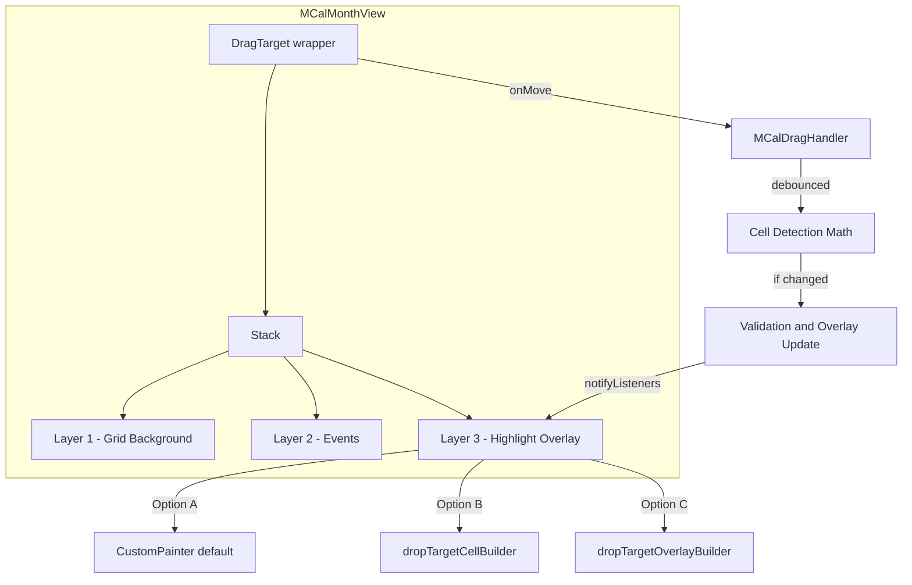

# Design Document: Unified Drag Target Architecture

## Overview

This design refactors the drag-and-drop implementation in `MCalMonthView` from a per-cell `DragTarget` architecture to a single unified `DragTarget` that wraps all calendar layers. The unified approach uses the `onMove` callback for continuous position tracking, enabling mathematical cell detection, debounced updates with change detection, and flexible highlight overlay rendering.

**Portability**: This architecture is designed with portability in mind. Core utilities (debouncing, cell detection, overlay rendering) will be structured for future extraction into shared modules that can be reused by `MCalDayView` and `MCalMultiDayView`.

## Steering Document Alignment

### Technical Standards (tech.md)

- **Widget-based Architecture**: Follows Flutter widget patterns with controller pattern for state management
- **Builder Pattern**: Provides `dropTargetOverlayBuilder` and `dropTargetCellBuilder` for full customization
- **Delegation Pattern**: Event drop validation delegated to developer via `onDragWillAccept` callback
- **Performance**: 60fps rendering via debounced updates, O(1) cell detection, efficient CustomPainter default
- **Touch Responsiveness**: Under 50ms feedback via 16ms debounce targeting 60fps

### Project Structure (structure.md)

- **Single Responsibility**: Drag logic in `MCalDragHandler`, overlay rendering separate
- **Modular Design**: New utilities in `lib/src/utils/` for potential reuse
- **Clear Interfaces**: Well-documented type signatures for all new callbacks
- **File Size**: All new components under 500 lines

## Code Reuse Analysis

### Existing Components to Leverage

- **`MCalDragHandler`**: Extended to handle unified drag state, debouncing, and position tracking
- **`MCalDragData`**: Reused as-is for drag payload
- **`MCalDragWillAcceptDetails`**: Reused for validation callback
- **`MCalGrabOffsetHolder`**: Reused for capturing grab offset
- **`daysBetween()`**: Reused for DST-safe date calculations

### Components to Modify

- **`_WeekRowWidget`**: Remove per-cell DragTargets, simplify to event/grid rendering only
- **`_MonthPageWidget`**: Add unified DragTarget wrapper and highlight overlay layer

### New Components

- **`MCalDropOverlayDetails`**: Details object for `dropTargetOverlayBuilder`
- **`MCalDropTargetCellDetails`**: Details object for `dropTargetCellBuilder`
- **`MCalHighlightCellInfo`**: Data class for individual highlighted cell info
- **`_DropTargetHighlightPainter`**: CustomPainter for default highlight rendering

## Architecture

The new architecture wraps the entire month calendar in a single `DragTarget` and uses mathematical position tracking instead of per-cell hit detection.



### Processing Flow

```text
User drags event
       ↓
DragTarget.onMove fires
       ↓
Store latest position (no debounce timer running)
       ↓
Start 16ms debounce timer
       ↓
Timer fires → Process latest position
       ↓
Calculate target cells: floor((localX - grabOffsetX + dayWidth/2) / dayWidth)  [center-weighted; see Revision]
       ↓
Compare with previous target cells
       ↓
[If same] → No action (skip repaint)
       ↓
[If different] → Call onDragWillAccept (if provided)
       ↓
Update MCalDragHandler state (proposedStart, proposedEnd, isValid)
       ↓
MCalDragHandler.notifyListeners()
       ↓
Highlight overlay rebuilds with new state
```

## Components and Interfaces

### Extended MCalDragHandler

**Purpose:** Central state manager for drag operations with debouncing and position tracking

**New Fields:**
```dart
// Debounce state
Timer? _debounceTimer;
Offset? _latestPosition;
static const Duration _debounceDuration = Duration(milliseconds: 16);

// Previous target state (for change detection)
int? _previousStartCellIndex;
int? _previousEndCellIndex;
int? _previousWeekRowIndex;

// Full highlighted cells list (for overlay rendering)
List<MCalHighlightCellInfo> _highlightedCells = [];
```

**New Methods:**
```dart
/// Called by DragTarget.onMove with raw position data
void handleDragMove({
  required Offset globalPosition,
  required double dayWidth,
  required double horizontalSpacing,
  required double grabOffsetX,
  required int eventDurationDays,
  required List<DateTime> weekDates,
  required int weekRowIndex,
  required Size calendarSize,
  required Rect weekRowBounds,
});

/// Internal: Process debounced position update
void _processPositionUpdate();

/// Internal: Calculate target cells from position
(int startCell, int endCell, int weekRow) _calculateTargetCells();
```

**Dependencies:** None (pure Dart)

**Reuses:** Existing `MCalDragHandler` fields and methods

### MCalDropOverlayDetails

**Purpose:** Details object passed to `dropTargetOverlayBuilder` for full overlay control

**Location:** `lib/src/widgets/mcal_callback_details.dart`

```dart
/// Details for building a custom drop target overlay.
///
/// Passed to [MCalMonthView.dropTargetOverlayBuilder] when a drag is active.
class MCalDropOverlayDetails {
  /// List of cells that should be highlighted.
  final List<MCalHighlightCellInfo> highlightedCells;
  
  /// Whether the current drop position is valid.
  final bool isValid;
  
  /// Width of each day cell in pixels.
  final double dayWidth;
  
  /// Total size of the calendar area.
  final Size calendarSize;
  
  /// The drag data being dragged.
  final MCalDragData dragData;
  
  const MCalDropOverlayDetails({
    required this.highlightedCells,
    required this.isValid,
    required this.dayWidth,
    required this.calendarSize,
    required this.dragData,
  });
}
```

### MCalDropTargetCellDetails

**Purpose:** Details object passed to `dropTargetCellBuilder` for per-cell styling

**Location:** `lib/src/widgets/mcal_callback_details.dart`

```dart
/// Details for building a custom drop target cell.
///
/// Passed to [MCalMonthView.dropTargetCellBuilder] for each highlighted cell.
class MCalDropTargetCellDetails {
  /// The date of this cell.
  final DateTime date;
  
  /// The bounds of this cell in local coordinates.
  final Rect bounds;
  
  /// Whether this cell represents a valid drop target.
  final bool isValid;
  
  /// Whether this is the first cell in the highlighted range.
  final bool isFirst;
  
  /// Whether this is the last cell in the highlighted range.
  final bool isLast;
  
  /// The cell's index within the week (0 = Sunday/Monday based on firstDayOfWeek).
  final int cellIndex;
  
  /// The week row index within the month grid.
  final int weekRowIndex;
  
  const MCalDropTargetCellDetails({
    required this.date,
    required this.bounds,
    required this.isValid,
    required this.isFirst,
    required this.isLast,
    required this.cellIndex,
    required this.weekRowIndex,
  });
}
```

### MCalHighlightCellInfo

**Purpose:** Data class representing a single cell to highlight

**Location:** `lib/src/widgets/mcal_callback_details.dart`

```dart
/// Information about a single cell to highlight during drag-and-drop.
class MCalHighlightCellInfo {
  /// The date of this cell.
  final DateTime date;
  
  /// Cell index within its week row (zero to six).
  final int cellIndex;
  
  /// Week row index within the month grid.
  final int weekRowIndex;
  
  /// Bounds of this cell in calendar-local coordinates.
  final Rect bounds;
  
  /// Whether this is the first cell in the event's span.
  final bool isFirst;
  
  /// Whether this is the last cell in the event's span.
  final bool isLast;
  
  const MCalHighlightCellInfo({
    required this.date,
    required this.cellIndex,
    required this.weekRowIndex,
    required this.bounds,
    required this.isFirst,
    required this.isLast,
  });
}
```

### DropTargetHighlightPainter (Private)

**Purpose:** Default CustomPainter for efficient highlight rendering

**Location:** `lib/src/widgets/mcal_month_view.dart` (private)

```dart
/// CustomPainter for rendering drop target highlights efficiently.
class _DropTargetHighlightPainter extends CustomPainter {
  final List<MCalHighlightCellInfo> highlightedCells;
  final bool isValid;
  final Color validColor;
  final Color invalidColor;
  final double borderRadius;
  
  _DropTargetHighlightPainter({
    required this.highlightedCells,
    required this.isValid,
    this.validColor = const Color(0x4000FF00),
    this.invalidColor = const Color(0x40FF0000),
    this.borderRadius = 4.0,
  });
  
  @override
  void paint(Canvas canvas, Size size) {
    if (highlightedCells.isEmpty) return;
    
    final paint = Paint()
      ..color = isValid ? validColor : invalidColor
      ..style = PaintingStyle.fill;
    
    for (final cell in highlightedCells) {
      final rrect = RRect.fromRectAndRadius(
        cell.bounds,
        Radius.circular(borderRadius),
      );
      canvas.drawRRect(rrect, paint);
    }
  }
  
  @override
  bool shouldRepaint(_DropTargetHighlightPainter oldDelegate) {
    return oldDelegate.highlightedCells != highlightedCells ||
           oldDelegate.isValid != isValid;
  }
}
```

### Updated MonthPageWidget

**Purpose:** Month page with unified DragTarget wrapper

**Key Changes:**
```dart
Widget build(BuildContext context) {
  return DragTarget<MCalDragData>(
    onMove: _handleDragMove,
    onLeave: _handleDragLeave,
    onAcceptWithDetails: _handleDrop,
    builder: (context, candidateData, rejectedData) {
      return Stack(
        children: [
          // Layer 1: Grid background with date labels
          _buildLayer1Grid(context),
          
          // Layer 2: Event tiles
          _buildLayer2Events(context),
          
          // Layer 3: Highlight overlay (IgnorePointer for pass-through)
          if (widget.enableDragAndDrop && _isDragActive)
            IgnorePointer(
              child: _buildLayer3HighlightOverlay(context),
            ),
        ],
      );
    },
  );
}

void _handleDragMove(DragTargetDetails<MCalDragData> details) {
  widget.dragHandler?.handleDragMove(
    globalPosition: details.offset + Offset(details.data.grabOffsetX, 0),
    dayWidth: _dayWidth,
    horizontalSpacing: details.data.horizontalSpacing,
    grabOffsetX: details.data.grabOffsetX,
    eventDurationDays: _calculateEventDuration(details.data.event),
    weekDates: _allWeekDates,
    weekRowBounds: _weekRowBounds,
    calendarSize: _calendarSize,
    validationCallback: widget.onDragWillAccept,
  );
}

Widget _buildLayer3HighlightOverlay(BuildContext context) {
  final dragHandler = widget.dragHandler;
  if (dragHandler == null) return const SizedBox.shrink();
  
  final highlightedCells = dragHandler.highlightedCells;
  final isValid = dragHandler.isProposedDropValid;
  
  // Precedence: dropTargetOverlayBuilder > dropTargetCellBuilder > default
  if (widget.dropTargetOverlayBuilder != null) {
    return widget.dropTargetOverlayBuilder!(
      context,
      MCalDropOverlayDetails(
        highlightedCells: highlightedCells,
        isValid: isValid,
        dayWidth: _dayWidth,
        calendarSize: _calendarSize,
        dragData: dragHandler.draggedEventData!,
      ),
    );
  }
  
  if (widget.dropTargetCellBuilder != null) {
    return Stack(
      children: [
        for (int i = 0; i < highlightedCells.length; i++)
          Positioned.fromRect(
            rect: highlightedCells[i].bounds,
            child: widget.dropTargetCellBuilder!(
              context,
              MCalDropTargetCellDetails(
                date: highlightedCells[i].date,
                bounds: highlightedCells[i].bounds,
                isValid: isValid,
                isFirst: highlightedCells[i].isFirst,
                isLast: highlightedCells[i].isLast,
                cellIndex: highlightedCells[i].cellIndex,
                weekRowIndex: highlightedCells[i].weekRowIndex,
              ),
            ),
          ),
      ],
    );
  }
  
  // Default: CustomPainter
  return CustomPaint(
    size: _calendarSize,
    painter: _DropTargetHighlightPainter(
      highlightedCells: highlightedCells,
      isValid: isValid,
    ),
  );
}
```

## Data Models

### MCalHighlightCellInfo
```dart
class MCalHighlightCellInfo {
  final DateTime date;
  final int cellIndex;      // zero to six within week
  final int weekRowIndex;   // zero to five within month
  final Rect bounds;        // Position in calendar coordinates
  final bool isFirst;
  final bool isLast;
}
```

### MCalDropOverlayDetails
```dart
class MCalDropOverlayDetails {
  final List<MCalHighlightCellInfo> highlightedCells;
  final bool isValid;
  final double dayWidth;
  final Size calendarSize;
  final MCalDragData dragData;
}
```

### MCalDropTargetCellDetails
```dart
class MCalDropTargetCellDetails {
  final DateTime date;
  final Rect bounds;
  final bool isValid;
  final bool isFirst;
  final bool isLast;
  final int cellIndex;
  final int weekRowIndex;
}
```

## Error Handling

### Error Scenarios

1. **Drag leaves calendar area**
   - **Handling:** `onLeave` clears highlight state, cancels debounce timer
   - **User Impact:** Highlights disappear, drag can continue outside

2. **Widget disposed during drag**
   - **Handling:** `dispose()` cancels all timers, clears state
   - **User Impact:** No visual artifacts, no memory leaks

3. **RenderBox not available for position calculation**
   - **Handling:** Fallback to last known good state, log warning in debug mode
   - **User Impact:** Highlights may freeze momentarily, recovers on next valid position

4. **Invalid drop over blocked cells**
   - **Handling:** `onAcceptWithDetails` checks `isProposedDropValid`, returns early if false
   - **User Impact:** Event returns to original position, no data corruption

5. **Edge navigation during drag**
   - **Handling:** Timer-based navigation continues to work via existing `handleEdgeProximity`
   - **User Impact:** Smooth month transitions while maintaining drag state

## Testing Strategy

### Unit Testing

- **MCalDragHandler debouncing**: Verify timer behavior, latest-position-wins
- **Cell detection math**: Verify center-weighted formula `floor((localX - grabOffsetX + dayWidth/2) / dayWidth)` calculations
- **Change detection**: Verify no updates when target cells unchanged
- **MCalHighlightCellInfo equality**: Verify proper comparison for shouldRepaint

### Widget Testing

- **DragTarget wrapper**: Verify onMove receives correct data
- **Highlight overlay rendering**: Verify correct cells highlighted
- **Builder precedence**: Verify overlay > cell > default precedence
- **CustomPainter shouldRepaint**: Verify efficient repainting

### Integration Testing

- **Multi-day event drag**: Verify N-day event highlights N cells
- **Cross-week highlighting**: Verify cells highlighted across week boundaries
- **Invalid drop visualization**: Verify red highlighting when onDragWillAccept returns false
- **Drop accuracy**: Verify dropped position matches highlighted position
- **Edge navigation**: Verify month navigation during drag

### Performance Testing

- **Frame rate during drag**: Measure FPS during continuous drag motion
- **Debounce effectiveness**: Verify onMove processing capped at approximately 60 per second
- **Change detection savings**: Measure skipped repaints when hovering same cell

## Migration Notes

### Breaking Changes

- `dropTargetCellBuilder` signature updated to receive `MCalDropTargetCellDetails`
- Per-cell DragTargets removed (internal change, no API impact)

### Deprecations

- None (existing `dropTargetCellBuilder` enhanced, not deprecated)

### Backward Compatibility

- Existing `onDragWillAccept` callback continues to work
- Existing `onEventDropped` callback continues to work
- `dragHandler` parameter continues to work
- `dragEdgeNavigationEnabled` and `dragEdgeNavigationDelay` continue to work

---

## Revision (Post-Implementation)

*Appended after implementation review. The implementation uses a center-weighted cell formula for drop target detection.*

### Cell Detection Formula — Revised

**Original design:** `(pointerLocalX - grabOffsetX - horizontalSpacing) / dayWidth` (left-edge based)

**Current implementation:** Center-weighted formula:

```
dropStartCellIndex = floor((localX - grabOffsetX + dayWidth/2) / dayWidth)
```

**Rationale:** The drop target is the cell that contains more than half of the first day of the dragged tile. Adding `dayWidth/2` shifts from left-edge to center-of-first-day logic, improving UX because the highlight aligns with where the user perceives the tile center. The highlighted cells and the actual drop result use the same formula.

**Drop logic:** On release, the event is moved to the calculated date range (dropStartCell through dropStartCell + duration − 1). The drop result exactly matches the highlighted position.
