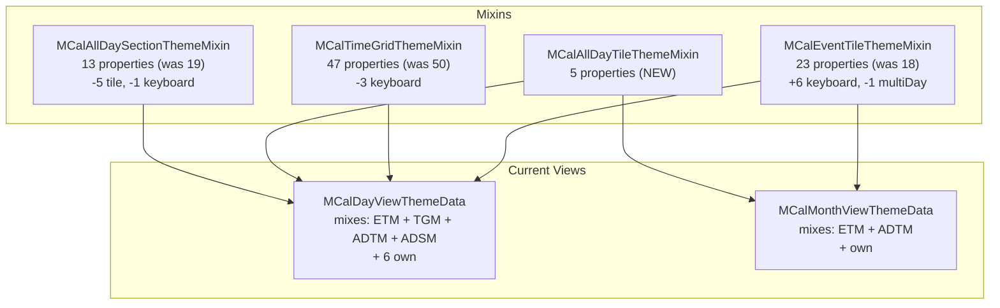

# Design Document: Unified Keyboard Theme and All-Day Mixin Split

## Overview

This design documents the retroactive changes made to the Multi Calendar theming and keyboard navigation systems since the **Theme Layout Future Views** spec (commit `1e1f9b9`) was completed. The changes span four areas:

1. **All-day mixin split** — The monolithic `MCalAllDayThemeMixin` was divided into `MCalAllDayTileThemeMixin` (tile appearance, shared by Day and Month Views) and `MCalAllDaySectionThemeMixin` (section layout, Day View only). This enables Month View to theme all-day event tiles independently using `isAllDay` branching without inheriting section layout properties.

2. **Unified keyboard theme properties** — Six new keyboard-related properties (`keyboardSelectionBorderWidth`, `keyboardSelectionBorderColor`, `keyboardSelectionBorderRadius`, `keyboardHighlightBorderWidth`, `keyboardHighlightBorderColor`, `keyboardHighlightBorderRadius`) were added to `MCalEventTileThemeMixin`. Old, scattered keyboard focus properties were removed from `MCalTimeGridThemeMixin`, `MCalAllDaySectionThemeMixin`, and `MCalMonthViewThemeData`. Day View was updated to distinguish between **highlighted** (Tab cycle) and **selected** (move/resize) states, matching Month View's existing dual-state model.

3. **Bug fixes** — Two keyboard resize bugs in Day View were fixed: stale `_focusedEvent` after keyboard move, and proposed time reversion when switching between start/end resize edges.

4. **Contrast color improvement** — `resolveContrastColor` now alpha-composites the background against white before luminance calculation, improving accuracy for semi-transparent tile colors.

## Steering Document Alignment

### Technical Standards (tech.md)

- **Material 3 defaults**: The six new keyboard theme properties derive master defaults from M3 color roles — `colorScheme.primary` for the selection state (strong, action-oriented) and `colorScheme.outline` for the highlight state (subtle, browse-oriented) — plus fixed pixel values for widths/radii.
- **Performance**: No performance impact. The keyboard state getters (`_keyboardHighlightedEventIdForDayView`, `_keyboardSelectedEventIdForDayView`) are O(1) computed getters with simple boolean checks.
- **Accessibility**: The highlight/selected distinction improves screen reader feedback — users can now distinguish between browsing events (highlight) and actively manipulating them (selected).

### Project Structure (structure.md)

- **Naming**: New mixin files follow `mcal_*_theme_mixin.dart` convention. Properties use established patterns (`keyboard*BorderWidth`, `keyboard*BorderColor`, `keyboard*BorderRadius`).
- **MCal prefix**: Public classes retain `MCal` prefix. `MCalAllDayTileThemeMixin` and `MCalAllDaySectionThemeMixin` follow the same pattern as the original `MCalAllDayThemeMixin`.
- **Module boundaries**: Both new mixins are exported from `lib/multi_calendar.dart`.
- **Code size**: No file exceeds 500 lines as a result of these changes (the mixin files are well under 100 lines each).

## Code Reuse Analysis

### Existing Components Leveraged

- **`MCalEventTileThemeMixin`**: Extended with 6 new keyboard properties. The existing mixin pattern (abstract getters implemented as `@override final` fields) was reused.
- **`MCalDayViewThemeData.defaults(ThemeData)`**: Extended to populate the 6 new keyboard properties and the 5 new `MCalAllDayTileThemeMixin` properties.
- **`MCalMonthViewThemeData.defaults(ThemeData)`**: Extended to populate the 6 new keyboard properties and the 5 `MCalAllDayTileThemeMixin` properties. Removed old `keyboardSelectionBorderWidth` and `keyboardHighlightBorderWidth` (Month-view-specific) since these are now unified in the mixin.
- **`MCalDayView` keyboard state machine**: The existing `_isKeyboardEventMode`, `_isKeyboardMoveMode`, `_isKeyboardResizeMode` flags were used to derive the new `_keyboardHighlightedEventIdForDayView` and `_keyboardSelectedEventIdForDayView` getters.
- **`MCalDragHandler`**: The existing `startResize`, `updateResize`, `proposedStartDate`, `proposedEndDate` API was leveraged for the resize bug fix. No changes to the drag handler itself.

### Components Created

| File | Purpose |
|------|---------|
| `lib/src/styles/mcal_all_day_tile_theme_mixin.dart` | **New mixin** — 5 abstract getters for all-day event tile appearance (background, text, border, padding). Mixed into both `MCalDayViewThemeData` and `MCalMonthViewThemeData`. |
| `lib/src/styles/mcal_all_day_section_theme_mixin.dart` | **Refactored mixin** — 13 abstract getters for all-day section layout (tile sizing, wrap spacing, overflow handles). Mixed into `MCalDayViewThemeData` only. |

### Components Modified

| File | Change |
|------|--------|
| `lib/src/styles/mcal_event_tile_theme_mixin.dart` | Added 6 keyboard properties; removed `multiDayEventBackgroundColor` |
| `lib/src/styles/mcal_all_day_section_theme_mixin.dart` | Removed tile appearance properties (now in `MCalAllDayTileThemeMixin`); removed `allDayKeyboardFocusBorderWidth` |
| `lib/src/styles/mcal_time_grid_theme_mixin.dart` | Removed `timedEventKeyboardFocusBorderWidth`, `keyboardFocusBorderColor`, `keyboardFocusBorderRadius` |
| `lib/src/styles/mcal_day_view_theme_data.dart` | Updated mixin list (`MCalAllDayTileThemeMixin` + `MCalAllDaySectionThemeMixin` replacing `MCalAllDayThemeMixin`); implemented 6 new keyboard fields; removed old keyboard fields; updated `defaults()`, `copyWith`, `lerp`, `==`, `hashCode` |
| `lib/src/styles/mcal_month_view_theme_data.dart` | Mixed in `MCalAllDayTileThemeMixin`; implemented 6 new keyboard + 5 all-day tile fields; removed old `keyboardSelectionBorderWidth`, `keyboardHighlightBorderWidth`; updated all methods |
| `lib/src/utils/theme_cascade_utils.dart` | `resolveContrastColor` alpha-composites against white before luminance calculation |
| `lib/src/widgets/mcal_day_view.dart` | Added `_keyboardHighlightedEventIdForDayView` and `_keyboardSelectedEventIdForDayView` getters; added `_syncFocusedEventFromController()` for stale event fix; added `_keyboardResizeProposedStart`/`_keyboardResizeProposedEnd` for resize edge-switching fix |
| `lib/src/widgets/day_subwidgets/all_day_events_section.dart` | Updated to accept `keyboardHighlightedEventId` and `keyboardSelectedEventId`; rendering distinguishes highlight vs selected using unified keyboard theme |
| `lib/src/widgets/day_subwidgets/time_grid_events_layer.dart` | Updated to accept `keyboardHighlightedEventId` and `keyboardSelectedEventId`; rendering distinguishes highlight vs selected using unified keyboard theme |
| `lib/src/widgets/mcal_month_multi_day_tile.dart` | Updated rendering logic to branch on `event.isAllDay` for `allDayEvent*` vs `eventTile*` properties |
| `lib/src/widgets/month_subwidgets/week_row_widget.dart` | Updated rendering logic to branch on `event.isAllDay` for `allDayEvent*` vs `eventTile*` properties |
| `lib/multi_calendar.dart` | Updated exports: added `mcal_all_day_tile_theme_mixin.dart`, renamed `mcal_all_day_theme_mixin.dart` → `mcal_all_day_section_theme_mixin.dart` |
| `example/lib/views/day_view/tabs/day_theme_tab.dart` | Added "Keyboard" section with 6 controls; removed old `keyboardFocusBorderRadius` from "All Events" |
| `example/lib/views/month_view/tabs/month_theme_tab.dart` | Added "Keyboard" section with 6 controls |
| `example/lib/shared/utils/theme_presets.dart` | Updated presets: `keyboardFocusBorderRadius` → `keyboardSelectionBorderRadius` + `keyboardHighlightBorderRadius` |
| `example/lib/l10n/app_*.arb` + generated `.dart` | Added `sectionKeyboard` and 6 `settingKeyboard*` localization keys; removed `settingKeyboardFocusBorderRadius` |

## Architecture

### Mixin Composition (Updated)



**Key change from Theme Layout Future Views**: The original `MCalAllDayThemeMixin` (19 properties) was split into:
- `MCalAllDayTileThemeMixin` (5 properties) — tile appearance, shared by both Day and Month Views
- `MCalAllDaySectionThemeMixin` (13 properties) — section layout, Day View only

This split was necessary because Month View needs to style all-day event tiles differently from timed events (using `isAllDay` branching) but does not have a dedicated all-day Wrap section.

### Keyboard State Model (Day View)

```
                     Tab/Shift+Tab cycle
                    ┌──────────────────────┐
                    │                      │
                    ▼                      │
  ┌─────────────────────────────────────┐  │
  │ Event Mode (highlighted)            │──┘
  │ _keyboardHighlightedEventIdForDayView │
  │ → border: keyboardHighlight*         │
  └──────────────┬──────────────────────┘
                 │ M (move) or R (resize)
                 ▼
  ┌─────────────────────────────────────┐
  │ Move/Resize Mode (selected)         │
  │ _keyboardSelectedEventIdForDayView   │
  │ → border: keyboardSelection*         │
  └─────────────────────────────────────┘
```

This matches Month View's existing dual-state model where `keyboardSelectionBorderWidth` is used for events being moved/resized and `keyboardHighlightBorderWidth` is used for events being cycled through with Tab.

### Property Resolution (Keyboard)

```dart
// In all_day_events_section.dart and time_grid_events_layer.dart:
final isKbSelected = keyboardSelectedEventId == event.id;
final isKbHighlighted = keyboardHighlightedEventId == event.id;

if (isKbSelected || isKbHighlighted) {
  final Color kbBorderColor;
  final double kbBorderWidth;
  final double kbBorderRadius;
  if (isKbSelected) {
    kbBorderColor = dayTheme?.keyboardSelectionBorderColor
        ?? dayDefaults.keyboardSelectionBorderColor!;
    kbBorderWidth = dayTheme?.keyboardSelectionBorderWidth
        ?? dayDefaults.keyboardSelectionBorderWidth!;
    kbBorderRadius = dayTheme?.keyboardSelectionBorderRadius
        ?? dayDefaults.keyboardSelectionBorderRadius!;
  } else {
    kbBorderColor = dayTheme?.keyboardHighlightBorderColor
        ?? dayDefaults.keyboardHighlightBorderColor!;
    kbBorderWidth = dayTheme?.keyboardHighlightBorderWidth
        ?? dayDefaults.keyboardHighlightBorderWidth!;
    kbBorderRadius = dayTheme?.keyboardHighlightBorderRadius
        ?? dayDefaults.keyboardHighlightBorderRadius!;
  }
  // Wrap tile with Container(decoration: BoxDecoration(border: ..., borderRadius: ...))
}
```

### isAllDay Branching (Month View Tiles)

When rendering event tiles in Month View, the background color, text style, border, and padding now branch on `event.isAllDay` to select `allDayEvent*` properties (from `MCalAllDayTileThemeMixin`) over `eventTile*` properties (from `MCalEventTileThemeMixin`):

```dart
final Color? themeBg = event.isAllDay
    ? (monthTheme?.allDayEventBackgroundColor ?? monthTheme?.eventTileBackgroundColor)
    : monthTheme?.eventTileBackgroundColor;
final Color fallbackBg = event.isAllDay
    ? (monthDefaults.allDayEventBackgroundColor ?? monthDefaults.eventTileBackgroundColor!)
    : monthDefaults.eventTileBackgroundColor!;
```

This allows consumers to style all-day events differently from timed events in Month View.

## Components and Interfaces

### Component 1: MCalAllDayTileThemeMixin (new)

- **Purpose**: Abstract property contract for all-day event tile appearance, shared across views.
- **File**: `lib/src/styles/mcal_all_day_tile_theme_mixin.dart`
- **Properties**: `allDayEventBackgroundColor` (Color?), `allDayEventTextStyle` (TextStyle?), `allDayEventBorderColor` (Color?), `allDayEventBorderWidth` (double?), `allDayEventPadding` (EdgeInsets?)
- **Mixed into**: `MCalDayViewThemeData`, `MCalMonthViewThemeData`

### Component 2: MCalAllDaySectionThemeMixin (refactored)

- **Purpose**: Abstract property contract for all-day section layout. Split from the original `MCalAllDayThemeMixin`; tile appearance properties moved to `MCalAllDayTileThemeMixin`.
- **File**: `lib/src/styles/mcal_all_day_section_theme_mixin.dart`
- **Removed properties**: `allDayEventBackgroundColor`, `allDayEventTextStyle`, `allDayEventBorderColor`, `allDayEventBorderWidth`, `allDayEventPadding` (→ `MCalAllDayTileThemeMixin`), `allDayKeyboardFocusBorderWidth` (→ unified keyboard properties on `MCalEventTileThemeMixin`)
- **Retained properties**: 13 section layout properties (tile sizing, wrap spacing, overflow handles)
- **Mixed into**: `MCalDayViewThemeData` only

### Component 3: MCalEventTileThemeMixin (extended)

- **Purpose**: Extended with unified keyboard focus properties for all views and event types.
- **File**: `lib/src/styles/mcal_event_tile_theme_mixin.dart`
- **Added properties** (6):
  - `keyboardSelectionBorderWidth` (double?) — border width for move/resize confirmed state
  - `keyboardSelectionBorderColor` (Color?) — border color for move/resize confirmed state
  - `keyboardSelectionBorderRadius` (double?) — corner radius for move/resize confirmed state
  - `keyboardHighlightBorderWidth` (double?) — border width for Tab cycle browsing state
  - `keyboardHighlightBorderColor` (Color?) — border color for Tab cycle browsing state
  - `keyboardHighlightBorderRadius` (double?) — corner radius for Tab cycle browsing state
- **Removed properties** (1): `multiDayEventBackgroundColor` (removed as a separate change)

### Component 4: MCalTimeGridThemeMixin (trimmed)

- **Removed properties** (3):
  - `timedEventKeyboardFocusBorderWidth` → replaced by `keyboardSelectionBorderWidth` on `MCalEventTileThemeMixin`
  - `keyboardFocusBorderColor` → replaced by `keyboardSelectionBorderColor` and `keyboardHighlightBorderColor` on `MCalEventTileThemeMixin`
  - `keyboardFocusBorderRadius` → replaced by `keyboardSelectionBorderRadius` and `keyboardHighlightBorderRadius` on `MCalEventTileThemeMixin`

### Component 5: resolveContrastColor (improved)

- **File**: `lib/src/utils/theme_cascade_utils.dart`
- **Change**: Alpha-composites the background color against white before calculating luminance. This fixes incorrect contrast color selection for semi-transparent tile backgrounds.

```dart
Color resolveContrastColor({
  required Color backgroundColor,
  required Color lightContrastColor,
  required Color darkContrastColor,
}) {
  final a = backgroundColor.a;
  final effectiveR = backgroundColor.r * a + (1.0 - a);
  final effectiveG = backgroundColor.g * a + (1.0 - a);
  final effectiveB = backgroundColor.b * a + (1.0 - a);
  final luminance = 0.299 * effectiveR + 0.587 * effectiveG + 0.114 * effectiveB;
  return luminance > 0.5 ? darkContrastColor : lightContrastColor;
}
```

### Component 6: multiDayEventBackgroundColor Removal

- **Change**: `multiDayEventBackgroundColor` was removed from `MCalEventTileThemeMixin` (and consequently from both `MCalDayViewThemeData` and `MCalMonthViewThemeData`).
- **Rationale**: With the introduction of `MCalAllDayTileThemeMixin` and `isAllDay` branching (Req 4/9), multi-day events that are all-day (`event.isAllDay == true`) now use `allDayEventBackgroundColor` through the same branching logic as other all-day events. Multi-day events that are timed (`event.isAllDay == false`) use `eventTileBackgroundColor`. A separate `multiDayEventBackgroundColor` is no longer needed.
- **Property count impact**: `MCalEventTileThemeMixin` went from 18 → 23 properties (+6 keyboard, -1 multiDay = net +5).

## Data Models

### MCalEventTileThemeMixin — Updated Property List (23 properties)

| Property | Type | Day Default | Month Default | Change |
|----------|------|-------------|---------------|--------|
| `eventTileBackgroundColor` | `Color?` | `colorScheme.primaryContainer` | `colorScheme.primaryContainer` | Unchanged |
| `eventTileTextStyle` | `TextStyle?` | M3 bodySmall | M3 bodySmall | Unchanged |
| `eventTileCornerRadius` | `double?` | `3.0` | `3.0` | Unchanged |
| `eventTileHorizontalSpacing` | `double?` | `1.0` | `1.0` | Unchanged |
| `eventTileBorderWidth` | `double?` | `0.0` | `0.0` | Unchanged |
| `eventTileBorderColor` | `Color?` | `null` | `null` | Unchanged |
| `hoverEventBackgroundColor` | `Color?` | primaryContainer 80% | primaryContainer 80% | Unchanged |
| `eventTileLightContrastColor` | `Color?` | `Colors.white` | `Colors.white` | Unchanged |
| `eventTileDarkContrastColor` | `Color?` | `colorScheme.onSurface` | `colorScheme.onSurface` | Unchanged |
| `weekNumberTextStyle` | `TextStyle?` | M3 bodySmall | M3 bodySmall | Unchanged |
| `weekNumberBackgroundColor` | `Color?` | surfaceContainerHighest | surfaceContainerHighest | Unchanged |
| `dropTargetTileBackgroundColor` | `Color?` | primaryContainer | primaryContainer | Unchanged |
| `dropTargetTileInvalidBackgroundColor` | `Color?` | errorContainer | errorContainer | Unchanged |
| `dropTargetTileCornerRadius` | `double?` | `3.0` | `3.0` | Unchanged |
| `dropTargetTileBorderColor` | `Color?` | primary | primary | Unchanged |
| `dropTargetTileBorderWidth` | `double?` | `2.0` | `1.5` | Unchanged |
| `resizeHandleColor` | `Color?` | white 70% | white 50% | Unchanged |
| `keyboardSelectionBorderWidth` | `double?` | `2.0` | `2.0` | **New** |
| `keyboardSelectionBorderColor` | `Color?` | `colorScheme.primary` | `colorScheme.primary` | **New** |
| `keyboardSelectionBorderRadius` | `double?` | `4.0` | `4.0` | **New** |
| `keyboardHighlightBorderWidth` | `double?` | `1.5` | `1.5` | **New** |
| `keyboardHighlightBorderColor` | `Color?` | `colorScheme.outline` | `colorScheme.outline` | **New** |
| `keyboardHighlightBorderRadius` | `double?` | `4.0` | `4.0` | **New** |

### MCalAllDayTileThemeMixin — Property List (5 properties, NEW)

| Property | Type | Day Default | Month Default | Source |
|----------|------|-------------|---------------|--------|
| `allDayEventBackgroundColor` | `Color?` | `colorScheme.secondaryContainer` | `colorScheme.secondaryContainer` | From `MCalAllDayThemeMixin` |
| `allDayEventTextStyle` | `TextStyle?` | M3 bodySmall | M3 bodySmall | From `MCalAllDayThemeMixin` |
| `allDayEventBorderColor` | `Color?` | `colorScheme.outlineVariant` | `colorScheme.outlineVariant` | From `MCalAllDayThemeMixin` |
| `allDayEventBorderWidth` | `double?` | `1.0` | `1.0` | From `MCalAllDayThemeMixin` |
| `allDayEventPadding` | `EdgeInsets?` | `EdgeInsets.symmetric(horizontal: 4.0, vertical: 2.0)` | `EdgeInsets.symmetric(horizontal: 4.0, vertical: 2.0)` | From `MCalAllDayThemeMixin` |

### MCalTimeGridThemeMixin — Removed Properties (3)

| Property | Replaced By |
|----------|-------------|
| `timedEventKeyboardFocusBorderWidth` | `MCalEventTileThemeMixin.keyboardSelectionBorderWidth` |
| `keyboardFocusBorderColor` | `MCalEventTileThemeMixin.keyboardSelectionBorderColor` / `keyboardHighlightBorderColor` |
| `keyboardFocusBorderRadius` | `MCalEventTileThemeMixin.keyboardSelectionBorderRadius` / `keyboardHighlightBorderRadius` |

### MCalAllDaySectionThemeMixin — Removed Properties (6)

| Property | Moved To / Replaced By |
|----------|----------------------|
| `allDayEventBackgroundColor` | `MCalAllDayTileThemeMixin` |
| `allDayEventTextStyle` | `MCalAllDayTileThemeMixin` |
| `allDayEventBorderColor` | `MCalAllDayTileThemeMixin` |
| `allDayEventBorderWidth` | `MCalAllDayTileThemeMixin` |
| `allDayEventPadding` | `MCalAllDayTileThemeMixin` |
| `allDayKeyboardFocusBorderWidth` | `MCalEventTileThemeMixin.keyboardSelectionBorderWidth` |

### MCalMonthViewThemeData — Removed Properties (2)

| Property | Replaced By |
|----------|-------------|
| `keyboardSelectionBorderWidth` (month-specific) | `MCalEventTileThemeMixin.keyboardSelectionBorderWidth` (unified) |
| `keyboardHighlightBorderWidth` (month-specific) | `MCalEventTileThemeMixin.keyboardHighlightBorderWidth` (unified) |

## Bug Fixes

### Bug Fix 1: Stale Focused Event After Keyboard Move

**Problem**: After confirming a keyboard move (Enter key), `_focusedEvent` retained the pre-move `MCalCalendarEvent` instance with old `start`/`end` times. The `onEventDropped` callback creates a new event instance with updated times in the controller, but `_focusedEvent` was never refreshed. When subsequently entering keyboard resize mode, `_enterKeyboardResizeMode` and `_updateKeyboardResizePreview` used the stale times, causing the drop target overlay to render at the old location.

**Solution**: Introduced `_syncFocusedEventFromController()` method that scans `_allDayEvents` and `_timedEvents` (the current controller-provided lists) for an event matching `_focusedEvent.id` and replaces the reference. Called at:
- Start of `_enterKeyboardMoveMode()`
- Start of `_enterKeyboardResizeMode()`
- After `_handleDrop()` if the dropped event's ID matches `_focusedEvent`
- After `_completePendingDrop()` if the dropped event's ID matches `_focusedEvent`

### Bug Fix 2: Keyboard Resize S/E Edge Switching (Day View)

**Problem**: When resizing with the keyboard and pressing 'S' to switch to the start edge (or 'E' to switch back), proposed adjustments made to the inactive edge were lost. The `_updateKeyboardResizePreview` method used the original `event.start`/`event.end` for the inactive edge, discarding user adjustments.

**Solution**: Introduced `_keyboardResizeProposedStart` and `_keyboardResizeProposedEnd` state fields that cache the full proposed range throughout a keyboard resize session:
1. Initialized to `event.start`/`event.end` in `_enterKeyboardResizeMode`
2. Updated after each `updateResize` call in `_updateKeyboardResizePreview` with the post-clamping values
3. Read for the inactive edge in `_updateKeyboardResizePreview` instead of `event.start`/`event.end`
4. Explicitly set from `dragHandler.proposedStartDate`/`proposedEndDate` when switching edges ('S'/'E' keys)

**Note**: Month View (`mcal_month_view.dart`) has its own `_keyboardResizeProposedStart`/`_keyboardResizeProposedEnd` fields, but those are part of the pre-existing month-keyboard-navigation spec, not this spec.

## Error Handling

### Error Scenarios

1. **`_syncFocusedEventFromController` finds no match**
   - **Handling**: The method returns without updating `_focusedEvent`. The existing null checks in `_enterKeyboardMoveMode` and `_enterKeyboardResizeMode` gracefully return early if the event is no longer in the controller's event lists.
   - **User Impact**: None — the operation is simply a no-op.

2. **`_keyboardResizeProposedStart`/`_keyboardResizeProposedEnd` are null during resize**
   - **Handling**: `_updateKeyboardResizePreview` falls back to `event.start`/`event.end` using `??` operators. This maintains the pre-fix behavior as a safety net.
   - **User Impact**: None — the fallback preserves existing behavior.

## Testing Strategy

### Unit Testing

- **Keyboard theme defaults**: Verify `MCalDayViewThemeData.defaults()` and `MCalMonthViewThemeData.defaults()` populate all 6 new keyboard properties with expected values (`keyboardSelectionBorderWidth: 2.0`, `keyboardSelectionBorderColor: colorScheme.primary`, `keyboardSelectionBorderRadius: 4.0`, `keyboardHighlightBorderWidth: 1.5`, `keyboardHighlightBorderColor: colorScheme.outline`, `keyboardHighlightBorderRadius: 4.0`).
- **Old properties removed**: Verify `MCalTimeGridThemeMixin` no longer has `timedEventKeyboardFocusBorderWidth`, `keyboardFocusBorderColor`, `keyboardFocusBorderRadius`. Verify `MCalAllDaySectionThemeMixin` no longer has `allDayKeyboardFocusBorderWidth`.
- **Month view keyboard ring defaults**: Verify `MCalMonthViewThemeData.defaults()` produces correct keyboard ring values from the unified mixin.
- **AllDayTileThemeMixin on both views**: Verify `allDayEventBackgroundColor`, `allDayEventTextStyle`, `allDayEventBorderColor`, `allDayEventBorderWidth`, `allDayEventPadding` are present on both `MCalDayViewThemeData` and `MCalMonthViewThemeData`.
- **copyWith/lerp/==/hashCode**: Verify all 6 new keyboard properties and 5 all-day tile properties are included in these methods on both theme data classes.

### Widget Testing (Keyboard Bug Fixes)

- **Stale focused event**: After keyboard move confirmation, verify keyboard resize uses the post-move event instance (correct start/end times) — no ghost overlay at old position.
- **S key re-basing**: Verify 'S' key re-bases keyboard resize offset to the start edge correctly.
- **End nudge then S**: After nudging end time, verify switching to 'S' key preserves the extended end time.
- **Start nudge then E**: After nudging start time, verify switching to 'E' key preserves the adjusted start time.

### Integration Testing

- **isAllDay branching**: Verify Month View renders all-day events with `allDayEvent*` theme properties and timed events with `eventTile*` theme properties.
- **Contrast color**: Verify `resolveContrastColor` correctly handles semi-transparent backgrounds (e.g., `Colors.blue.withValues(alpha: 0.2)` on white → dark contrast).
